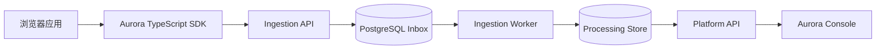

<!--
title: Aurora 仓库入口
status: approved
owner: documentation
last-reviewed: 2026-08-15
applies-to: Aurora 用户、部署者与贡献者
related: CHANGELOG.md, docs/README.md, docs/architecture/system-overview.md
supersedes: none
-->

# Aurora

> See what broke. Understand why. Fix with evidence.

Aurora 是面向前端应用的可自托管可观测平台。它通过 TypeScript SDK 捕获错误、请求与 Web 性能事实，并在管理控制台中把分散信号组织成可调查、可协作、可追溯的证据。

[在线体验](https://aurora.ah.cn/) · [项目文档](docs/README.md) · [更新日志](CHANGELOG.md)

## 为什么选择 Aurora

前端故障往往散落在浏览器错误、失败请求、性能指标和发布记录之间。Aurora 将采集、可靠接收、异步处理、问题聚合与团队处置连接为一条完整链路，让团队从“哪里坏了”继续追到“为什么发生”和“下一步做什么”。

## 核心能力

| 能力       | 说明                                                                                      |
| ---------- | ----------------------------------------------------------------------------------------- |
| 错误追踪   | 捕获 JavaScript 运行时错误、未处理 Promise 拒绝与资源加载错误，聚合为可处理的 Issue。     |
| 请求监控   | 观测 `fetch` 与 `XMLHttpRequest` 的安全请求事实，识别失败和慢请求，不采集请求体或响应体。 |
| Web 性能   | 采集 LCP、INP、CLS 与页面加载耗时，提供可查询的聚合指标和有界诊断样本。                   |
| 调查与响应 | 关联发布与 Source Map，支持 Issue 生命周期、告警、站内通知和审计轨迹。                    |
| 团队治理   | 提供账号、组织、项目、成员权限、客户端密钥、资源策略与数据状态管理。                      |
| 自托管部署 | 通过 provider-neutral Docker Compose 运行 Console、API、Worker、PostgreSQL 与 Redis。     |

## 从源码开始

环境要求：Node.js `24.18.x`、pnpm `11.17.0`。

```bash
corepack enable pnpm
pnpm install --frozen-lockfile
pnpm build
```

Aurora 当前提供单主机 Docker Compose 部署路径。部署拓扑、TLS、备份和回滚说明见[单主机部署文档](docs/operations/public-preview-single-host-deployment.md)。公开 API 契约位于 [`docs/api`](docs/api/)。

> SDK 公共包的发布工程已经就绪，但正式 npm 发布凭据尚未配置；在可验证的包版本发布前，README 不提供 npm 安装命令。

## 工作原理



接入 API 在事务提交后才确认可靠接收；Worker 通过租约、fencing、重试预算和死信机制异步处理事件。Console 只通过公开 Platform API 读取和修改业务状态，不直连存储。

## 当前 Preview

- 全面采用 `Calm Observability` 控制台界面，围绕“状态 → 证据 → 行动”组织调查流程；
- 接入阿里云 DirectMail 邮箱验证投递，并为历史未验证账号提供受限重发；
- 修复部署后的首次引导、邮箱重发冷却与额度状态保持问题。

完整增量与 Bug 修复记录见 [CHANGELOG.md](CHANGELOG.md)。正式版本发布后，本节只保留最新版本摘要。

## 隐私与部署边界

Aurora 默认不采集请求体、响应体、Cookie、Authorization、表单内容、密码或验证码、完整 DOM、完整页面文本、完整 IP 或设备指纹。隐私过滤发生在事件进入发送链之前，服务端存储继续使用受协议约束的安全投影。

当前公开实例运行在 provider-neutral 单主机架构上，定位为 MVP / early-production：可部署、可回滚、可备份，但不宣称 Multi-AZ、自动故障转移或跨区域灾备。

## 文档

- [正式文档索引](docs/README.md)
- [系统架构与模块边界](docs/architecture/system-overview.md)
- [SDK 可靠发送链](docs/sdk/sdk-reliable-delivery-chain.md)
- [数据接入 OpenAPI](docs/api/ingestion.openapi.yaml)
- [管理平台 OpenAPI](docs/api/platform-openapi-v1.yaml)
- [部署、Migration 与回滚](docs/releases/release-migration-and-rollback.md)
- [架构决策记录](docs/adr/README.md)

## 开发

```bash
pnpm format:check
pnpm typecheck
pnpm test
pnpm check
```

包级任务使用 `pnpm --filter <package-name> <script>`。仓库规则与 Agent 入口见 [AGENTS.md](AGENTS.md) 和 [AURORA_RULES.md](AURORA_RULES.md)。
