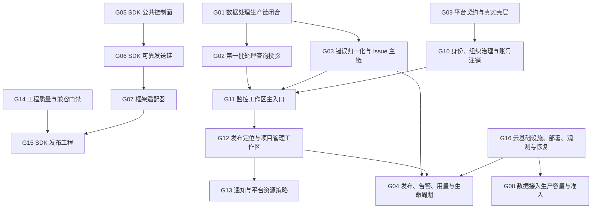

# Aurora 第一版剩余模块分批基线

## 1. 文档定位

本文把 2026-08-03《Aurora 第一版剩余模块盘点与实现状态审计》确认的 46 个剩余叶子实施模块，整理为可供后续规格化和 `writing-plans` 使用的实施分组。DAT-07（请求处理规则/配置 adapter）已于 2026-08-03 关闭，DAT-08（性能指标聚合与有界诊断样本存储）已于 2026-08-05 关闭，DAT-09（性能事件处理器）、DAT-10（事件处理器 Router）与 DAT-11（生产 Worker composition）已于 2026-08-07 关闭，**G01 数据处理生产链闭合全部 5 个叶子已关闭**；**OPS-01（G14 CI quality workflows）已于 2026-08-08 关闭**；**PLT-01（Platform Contract foundation）已于 2026-08-08 关闭（独立验收通过）**；**PLT-02（前端壳层）已于 2026-08-08 关闭（独立验收通过）**；**PLT-03（A1—A4 身份、认证、密码和邀请）已于 2026-08-09 关闭（独立验收通过）**；**PLT-04（B1—B8 组织、项目、成员和治理）已于 2026-08-09 关闭**；**SEC-01（A5 账号注销状态机与编排）已于 2026-08-09 关闭（独立验收通过）**，当前剩余 35 个（OPS-02 remote-pending 不占用 completed）。

本文是**计划编制输入**，不是 PRD、ADR、approved 正式规格或可直接执行的实施计划。本文不会：

- 改变核心 PRD、长期规范、accepted ADR 或 approved 正式规格；
- 把尚未批准的设计选择写成实施事实；
- 授权创建代码、Migration、公共 API、基础设施或云资源；
- 用一个大计划绕过单模块规格、ADR、测试和验收门禁；
- 将同批实施误写为同一个叶子模块。

任何分组进入正式实施前，仍须按 `AGENTS.md` 和 `AURORA_RULES.md` 回读相关权威文档，并补齐该组内每个叶子模块直接需要的 approved 规格、accepted ADR 和独立实施计划。

## 2. 固定计数基线

本次基线固定为：

```text
fixed_v1_leaf_modules = 78
completed_v1_leaf_modules = 40
partial_v1_leaf_modules = 0
not_started_v1_leaf_modules = 9
blocked_v1_leaf_modules = 29
remaining_v1_leaf_modules = 38

78 = 40 + 0 + 9 + 29
38 = 0 + 9 + 29
```

> 更新（2026-08-08）：OPS-01 completed（completed 37→38），OPS-02 blocked（blocked 30→29），remaining 41→40。
> 更新（2026-08-08）：PLT-01 closed（completed 38→39），not_started 11→10，remaining 40→39（独立验收通过）。
> 更新（2026-08-08）：PLT-02 closed（completed 39→40），not_started 10→9，remaining 39→38（独立验收通过）。
> 更新（2026-08-09）：PLT-03 closed（completed 40→41），not_started 9→8，remaining 38→37（独立验收通过）。
> 更新（2026-08-09）：PLT-04 closed（completed 41→42），not_started 8→7，remaining 37→36。
> 更新（2026-08-09）：SEC-01 closed（completed 42→43），not_started 7→6，remaining 36→35（独立验收通过）。

分组只改变后续工作的组织方式，不改变计数方式：

- 一个实施组可以包含多个叶子模块；
- 一个 writing-plans 文件可以在边界足够紧密时包含多个叶子模块；
- 每个叶子模块仍须独立验收和关闭；
- 一个实施组完成时，剩余数按实际完成的叶子数量递减，而不是固定只减一；
- 新增第一版叶子必须有新的 approved PRD、accepted ADR、approved 正式规格，或不可归入现有模块的独立部署、数据模型或测试边界证据。

## 3. 分组方案选择

### 3.1 方案 A：只按五大系统边界分组

优点是归属清楚，适合维护长期文档索引。缺点是 SDK、处理链、平台、云基础设施之间的真实前置依赖被隐藏，容易出现“平台页面先做、底层 Query 和权限仍不存在”的空接线。

### 3.2 方案 B：按依赖波次分组，并保留叶子验收边界

这是本文采用的方案。它同时记录：

- 哪些模块适合进入同一交付批次；
- 哪些模块适合共用一份实施计划；
- 哪些模块只能同批协调但必须分开计划；
- 每个批次的进入门禁和内部顺序；
- 46 个叶子的唯一归属。

### 3.3 方案 C：建立 SDK、处理、平台、运维四个大计划

该方案文件数量少，但会把协议、数据库、运行时、公共 API、UI、权限和基础设施混入同一个完成状态。单项失败会导致整个计划无法准确验收，也会重新引入父子模块重复计数，因此不采用。

## 4. 分组术语

| 术语     | 含义                                                                                 |
| -------- | ------------------------------------------------------------------------------------ |
| 实施组   | 为协调依赖和交付节奏建立的容器，不是新的实施模块                                     |
| 同一批次 | 可以在同一里程碑或连续开发窗口中推进，但可以有多份规格和计划                         |
| 同一计划 | 代码边界、测试环境和失败恢复高度一致，可在一份 writing-plans 中设置多个独立验收 Task |
| 分开计划 | 即使处于同一批次，也必须因 ADR、数据模型、公共 API、部署或权限边界分别规划           |
| 内部停点 | 前一个叶子未通过验收时，禁止开始同组的后一个叶子                                     |

## 5. 模块级业务分类与固定回读路由

### 5.1 回读规则

本节把每个剩余叶子模块的业务逻辑和权威来源绑定起来。后续会话不得只读取模块名称、本文摘要或 writing-plans 后直接实施。

固定规则如下：

1. 每次开始规格、计划、实现、测试或评审前，先完整回读 `AGENTS.md` 和 `AURORA_RULES.md`，再按任务类型完整回读相应长期规范。
2. 下表中的“重点章节”用于定位业务逻辑，不代表只读这些段落；标记为“完整回读”的文件必须从头到尾读取。
3. 管理平台 A1—D2 的逐页设计必须完整回读前端 UX/UI 设计。`platform-product-domains.md` 只提供稳定业务域，不替代页面状态、字段、交互、Query/Command、`NAV-A`、`AUDIT-A` 和 GAP-01—GAP-20。
4. `docs/superpowers/specs/` 中已批准的专题设计只在现有正式文档索引明确保留其详细权威性的范围内作为实施输入，不得被本文摘要替代。
5. 当模块当前没有独立 approved 规格时，表中会明确写为“独立规格缺失”。此状态要求先完成规格化，不允许根据相邻模块自行推导代码。
6. accepted ADR 只批准决策，不替代源码、Migration、测试或生产接线；proposed ADR 只用于讨论。
7. 下表未列 writing-plans，因为除已关闭的 DAT-07、DAT-08、DAT-09、DAT-10、DAT-11 外，其余剩余叶子当前都没有可执行实施计划。后续计划必须引用本节对应模块的全部固定回读集合。

### 5.2 固定文档代号

| 代号              | 必须回读的具体文件                                                                                                                                                                                                                                                                                                                                                                                                                                                                                     | 用途                                                                                                     |
| ----------------- | ------------------------------------------------------------------------------------------------------------------------------------------------------------------------------------------------------------------------------------------------------------------------------------------------------------------------------------------------------------------------------------------------------------------------------------------------------------------------------------------------------ | -------------------------------------------------------------------------------------------------------- |
| `BASE-PRD`        | [核心业务 PRD](../../Auroa-PRD-业务逻辑汇总-v2.1-核心业务定稿版.md)                                                                                                                                                                                                                                                                                                                                                                                                                                    | 第一版范围、业务规则、权限、隐私、生命周期和验收口径                                                     |
| `BASE-ARCH`       | [架构规范](<../../Aurora 架构规范.md>)；[系统边界](./system-overview.md)                                                                                                                                                                                                                                                                                                                                                                                                                               | 五大系统职责、依赖方向、公共边界和 ADR 门禁                                                              |
| `BASE-IMPL`       | [代码规范](<../../Aurora 代码规范.md>)；[测试规范](<../../Aurora 测试规范.md>)；[ADR 规范](<../../Aurora ADR 规范.md>)；[文档规范](<../../Aurora 文档规范.md>)                                                                                                                                                                                                                                                                                                                                         | 实现、测试、长期决策和文档同步的共同门禁                                                                 |
| `FORM`            | [正式化与实施就绪追踪](./formalization-readiness.md)；[ADR 索引](../adr/README.md)                                                                                                                                                                                                                                                                                                                                                                                                                     | 当前缺口、阻塞、accepted ADR 状态和下一依赖                                                              |
| `SDK-ARCH`        | [SDK 正式架构](./sdk-architecture.md)；[ADR-003](../adr/ADR-003-sdk-plugin-architecture.md)；[ADR-004](../adr/ADR-004-asynchronous-event-processing.md)；[ADR-005](../adr/ADR-005-event-schema-source-of-truth.md)；[ADR-006](../adr/ADR-006-one-way-dependencies.md)                                                                                                                                                                                                                                  | SDK 生命周期、插件、可靠上报、协议来源和依赖边界                                                         |
| `SDK-CORE`        | [Core 基础规格](../sdk/sdk-core-foundation.md)；[Core 事件创建](../sdk/core-event-creation.md)；[Browser 环境](../sdk/browser-environment-foundation.md)                                                                                                                                                                                                                                                                                                                                               | 已实施的公共 Core、事件入口和 Browser 生命周期边界                                                       |
| `SDK-SOURCES`     | [Error Source](../sdk/browser-error-source.md)；[Request Source](../sdk/browser-request-source.md)；[Performance Source](../sdk/browser-performance-source.md)                                                                                                                                                                                                                                                                                                                                         | 已实施浏览器事实源、宿主安全和多实例约束                                                                 |
| `SDK-PLUGINS`     | [Error Plugin](../sdk/error-capture-plugin.md)；[Request Plugin](../sdk/request-capture-plugin.md)；[Performance Plugin](../sdk/performance-capture-plugin.md)                                                                                                                                                                                                                                                                                                                                         | 已实施插件生命周期、协议映射、隔离和后续衔接                                                             |
| `PROTO-BASE`      | [event-schema 基础](../protocol/event-schema-foundation.md)；[信封 v1](../protocol/event-envelope-v1.md)；[ADR-005](../adr/ADR-005-event-schema-source-of-truth.md)                                                                                                                                                                                                                                                                                                                                    | 协议版本、运行时校验、公共导出和兼容原则                                                                 |
| `PROTO-EVENTS`    | [Error Contract](../protocol/error-event-contract.md)；[Request Contract](../protocol/request-event-contract.md)；[Performance Contract](../protocol/performance-event-contract.md)；[Batch/Receipt Contract](../protocol/ingestion-batch-and-receipt-contract.md)                                                                                                                                                                                                                                     | 四类已存在机器契约、隐私字段和稳定失败语义                                                               |
| `ING-HTTP`        | [Ingestion OpenAPI](../api/ingestion-openapi.md)；[HTTP Service](./ingestion-http-service.md)；[传输与凭证安全决策](../security/ingestion-transport-and-client-credential.md)；[ADR-009](../adr/ADR-009-ingestion-transport-and-client-credential.md)；[ADR-011](../adr/ADR-011-ingestion-http-service-runtime.md)                                                                                                                                                                                     | 接入传输、状态映射、授权、准入、CORS 和服务端隐私                                                        |
| `ING-INBOX`       | [Inbox 数据模型](./ingestion-inbox-data-model.md)；[Inbox 处理 Repository](./ingestion-inbox-processing-repository.md)；[ADR-008](../adr/ADR-008-ingestion-durable-buffering.md)；[ADR-010](../adr/ADR-010-postgresql-access-and-migration-tooling.md)                                                                                                                                                                                                                                                 | ACK 事务、幂等、状态机、租约和 PostgreSQL 工具边界                                                       |
| `ING-WORKER`      | [Worker Runtime](./ingestion-worker-runtime.md)；[Retry Budget](./ingestion-worker-retry-budget-policy.md)；[Retry Backoff](./ingestion-worker-retry-backoff-schedule.md)；[Manual Replay](./ingestion-dead-letter-manual-replay.md)；[ADR-012](../adr/ADR-012-ingestion-worker-runtime.md)；[ADR-015](../adr/ADR-015-ingestion-worker-retry-budget-policy.md)；[ADR-016](../adr/ADR-016-ingestion-worker-retry-backoff-schedule.md)；[ADR-017](../adr/ADR-017-ingestion-dead-letter-manual-replay.md) | Worker 生命周期、processor port、retry、lease、dead-letter 和 replay                                     |
| `ING-CREDENTIALS` | [凭证存储验证](../security/ingestion-client-credential-storage-and-verification.md)；[凭证生命周期](../security/ingestion-client-credential-lifecycle.md)；[ADR-013](../adr/ADR-013-ingestion-client-credential-storage-and-verification.md)；[ADR-014](../adr/ADR-014-ingestion-client-credential-lifecycle.md)                                                                                                                                                                                       | 接入凭证安全、状态、一次性交付和 API 衔接                                                                |
| `ING-BENCH`       | [容量与韧性基准规格](../testing/ingestion-capacity-and-resilience-benchmark.md)；[本地基准证据](../testing/evidence/2026-08-02-ingestion-local-baseline.md)                                                                                                                                                                                                                                                                                                                                            | 本地测量方法、正确性门禁和生产/RDS 证据缺口                                                              |
| `PROC-ERROR`      | [Error Occurrence Store](./error-event-occurrence-processing-store.md)；[Error Processor](./error-event-processor.md)；[ADR-018](../adr/ADR-018-error-event-occurrence-processing-storage.md)                                                                                                                                                                                                                                                                                                          | 已实施错误 occurrence 与 processor core 边界                                                             |
| `PROC-REQUEST`    | [Request Sample Store](./request-event-sample-processing-store.md)；[Request Metric Store](./request-metric-aggregate-store.md)；[Sample Selection Policy](./request-sample-selection-policy.md)；[Request Processor](./request-event-processor.md)；[ADR-019](../adr/ADR-019-request-event-aggregation-and-bounded-diagnostic-sample-storage.md)；[ADR-020](../adr/ADR-020-idempotent-request-metric-bucket-aggregation.md)                                                                           | 已批准的请求聚合主路径、有限样本、幂等聚合和 processor core                                              |
| `PLAT-DOMAINS`    | [管理平台产品业务域](../prd/platform-product-domains.md)；[平台前端架构](./platform-frontend.md)；[平台后端架构](./platform-backend.md)                                                                                                                                                                                                                                                                                                                                                                | 九个稳定业务域、公开 API、数据所有权和前后端边界                                                         |
| `PLAT-UX`         | [完整前端 UX/UI 设计](../superpowers/specs/2026-07-27-aurora-frontend-ux-ui-design.md)                                                                                                                                                                                                                                                                                                                                                                                                                 | A1—D2、`NAV-A`、`AUDIT-A`、逐页流程、状态、字段、数据口径和 GAP 的详细权威来源；所有平台模块必须完整回读 |
| `PLAT-STACK`      | [前端技术栈设计](../superpowers/specs/2026-07-28-aurora-frontend-technology-stack-design.md)；[控制台视觉语言](../superpowers/specs/2026-07-30-aurora-console-visual-language-design.md)                                                                                                                                                                                                                                                                                                               | Vue SPA、状态、表单、组件、测试工具、颜色、密度、可访问性和禁止渐变                                      |
| `PLAT-OAPI`       | [Platform OpenAPI 与实施约束](../superpowers/specs/2026-07-30-aurora-platform-openapi-and-implementation-design.md)；[平台后端设计](../superpowers/specs/2026-07-28-aurora-platform-backend-design.md)                                                                                                                                                                                                                                                                                                 | 单一公开契约、RouteTarget、Query/Command、Session、权限、事务和领域 API                                  |
| `SEC-A5`          | [账号注销与数据生命周期](../security/account-deletion-and-data-lifecycle.md)；[A5 批准设计](../superpowers/specs/2026-07-29-aurora-account-deletion-data-lifecycle-design.md)                                                                                                                                                                                                                                                                                                                          | A5 状态机、身份复核、Session 终止、数据分类、清理和备份淘汰                                              |
| `OPS-QUALITY`     | [第一版测试策略](../testing/test-strategy.md)；[测试/部署/发布设计](../superpowers/specs/2026-07-28-aurora-testing-deployment-release-design.md)                                                                                                                                                                                                                                                                                                                                                       | CI 分层、兼容、性能预算、SLO、容量和发布阻断                                                             |
| `OPS-DELIVERY`    | [部署架构](./deployment.md)；[发布、Migration 与回滚](../releases/release-migration-and-rollback.md)；[备份与恢复](../operations/backup-and-recovery.md)                                                                                                                                                                                                                                                                                                                                               | 环境、网络、制品、部署、回滚、备份、恢复和灾备                                                           |

### 5.3 G01—G04：数据处理与存储回读路由

| Module | 业务逻辑分类                       | 固定回读集合                                                                                                | 重点章节与实施前置                                                                                                                                                                                                                                                                                                                                                                                                                                                                                                                                                                                                                                                                                                           |
| ------ | ---------------------------------- | ----------------------------------------------------------------------------------------------------------- | ---------------------------------------------------------------------------------------------------------------------------------------------------------------------------------------------------------------------------------------------------------------------------------------------------------------------------------------------------------------------------------------------------------------------------------------------------------------------------------------------------------------------------------------------------------------------------------------------------------------------------------------------------------------------------------------------------------------------------- |
| DAT-07 | 请求分类、慢请求和安全配置         | `BASE-PRD`、`BASE-ARCH`、`BASE-IMPL`、`PROTO-EVENTS`、`PROC-REQUEST`、`FORM`                                | PRD §5.1.2—5.1.8、§5.1.14—5.1.15、§15；Request Processor §9、§30。**已关闭（2026-08-03）**：正式规格 [request-processing-rules-configuration-adapter.md](./request-processing-rules-configuration-adapter.md) approved + implemented，`@aurora/ingestion-worker` `createRequestProcessingRulesAdapter` 已实施（默认慢阈值 3000ms/失败 429+500—599/额外状态码默认空、确定性分类、不可变冻结快照、非法配置抛稳定错误），通过单元测试与真实 PostgreSQL 17.10 集成测试；真实配置存储/Repository、配置管理 API、生产接线仍 not-started / blocked。                                                                                                                                                                                |
| DAT-08 | 性能聚合与有限样本数据模型         | `BASE-PRD`、`BASE-ARCH`、`BASE-IMPL`、`PROTO-EVENTS`、`ING-INBOX`、`PROC-ERROR`、`PROC-REQUEST`、`FORM`     | PRD §5.1.9、§12、§14—16；Performance Contract §4—10、§17—18；ADR-010。**已关闭（2026-08-05）**：正式规格 [performance-metric-aggregate-and-bounded-sample-store.md](./performance-metric-aggregate-and-bounded-sample-store.md) approved + implemented，`@aurora/processing-store` `performance_metric_buckets`/`performance_metric_event_applications`/`performance_event_samples` Migration + `persistPerformanceMetricContribution`/`persistPerformanceEventSample` Repository 已实施（UTC 一分钟桶、`(project_id, bucket_start, metric_name, unit)` 聚合键、count/sum/max、样本白名单投影、`(project_id, event_id)` 幂等、percentile/直方图 deferred，accepted ADR-021），通过单元测试与真实 PostgreSQL 17.10 集成测试。 |
| DAT-09 | 性能事件处理器                     | `BASE-PRD`、`BASE-ARCH`、`BASE-IMPL`、`PROTO-EVENTS`、`ING-WORKER`、`PROC-ERROR`、`PROC-REQUEST`、`FORM`    | PRD §5.1.9、§7；Performance Contract；Error/Request Processor 的输入输出、retry、lease lost 和隐私边界。**已关闭（2026-08-07）**：正式规格 [performance-event-processor.md](./performance-event-processor.md) approved + implemented，`@aurora/ingestion-worker` `createPerformanceEventProcessor` 已实施（只处理 `EventType.Performance`、聚合主路径 `persistPerformanceMetricContribution`、V1 不调用 `persistPerformanceEventSample`（不保存性能诊断样本，样本选择策略 deferred）、无服务器侧二次采样），通过单元测试与真实 PostgreSQL 17.10 集成测试；Event Processor Router（DAT-10）、production composition（DAT-11）仍 not-started / blocked。                                                                       |
| DAT-10 | EventType 路由和处理结果编排       | `BASE-ARCH`、`BASE-IMPL`、`PROTO-BASE`、`PROTO-EVENTS`、`ING-WORKER`、`PROC-ERROR`、`PROC-REQUEST`、`FORM`  | 架构规范 §2.3.3、§2.5—2.7；Worker Runtime §9—16、§22—23；三个 processor 的公共/私有边界。**已关闭（2026-08-07）**：正式规格 [event-processor-router.md](./event-processor-router.md) approved + implemented，`@aurora/ingestion-worker` `createEventProcessorRouter` 已实施（按 eventType 分发到 Error/Request/Performance 处理器并原样传播结果、resource/未知类型稳定 dead-letter、纯分发器），通过单元测试与全仓质量门禁；production composition（DAT-11）仍 not-started / blocked。                                                                                                                                                                                                                                       |
| DAT-11 | 生产 Worker composition root       | `BASE-ARCH`、`BASE-IMPL`、`ING-INBOX`、`ING-WORKER`、`PROC-ERROR`、`PROC-REQUEST`、`FORM`                   | Worker Runtime §7—16；Error Processor §10；Request Processor §21、§30；启动配置；Pool 所有权；graceful shutdown。**已关闭（2026-08-07）**：正式规格 [production-worker-composition-root.md](./production-worker-composition-root.md) approved + implemented，`@aurora/ingestion-worker` `createProductionIngestionWorker` 已实施（接线三个真实 processor + DAT-07 真实 adapter + Router、不创建/关闭 Pool、close 幂等、无 fake/noop processor），通过单元测试与真实 PostgreSQL 17.10 端到端集成测试；G01 三个处理器 + Router + production composition 完整接线。                                                                                                                                                             |
| DAT-16 | 请求指标 Query 与安全投影          | `BASE-PRD`、`BASE-ARCH`、`BASE-IMPL`、`PROC-REQUEST`、`PLAT-DOMAINS`、`PLAT-UX`、`PLAT-OAPI`、`FORM`        | PRD §5.1.2—5.1.5、§12；UX/UI §7.20、§8.18、§9.18、§10.12；Platform OpenAPI §7—10。Query 独立规格缺失。                                                                                                                                                                                                                                                                                                                                                                                                                                                                                                                                                                                                                       |
| DAT-17 | 性能 Query 与安全投影              | `BASE-PRD`、`BASE-ARCH`、`BASE-IMPL`、`PROTO-EVENTS`、`PLAT-DOMAINS`、`PLAT-UX`、`PLAT-OAPI`、`FORM`        | PRD §5.1.9、§12；UX/UI §7.21、§8.19、§9.19、§10.13；Platform OpenAPI §7—10。必须先回读未来 DAT-08/09 approved 规格；Query 独立规格缺失。                                                                                                                                                                                                                                                                                                                                                                                                                                                                                                                                                                                     |
| DAT-20 | 接入状态与诊断 Query               | `BASE-PRD`、`BASE-ARCH`、`BASE-IMPL`、`ING-HTTP`、`ING-INBOX`、`ING-WORKER`、`PLAT-UX`、`PLAT-OAPI`、`FORM` | PRD §4.4.6—4.4.11、§7.3；UX/UI §7.16、§7.22、§8.14、§8.20、§10.8、§10.14；不得把“已接收”与“已处理”混同。独立 Query 规格缺失。                                                                                                                                                                                                                                                                                                                                                                                                                                                                                                                                                                                                |
| DAT-12 | 错误归一化、fingerprint 和分组版本 | `BASE-PRD`、`BASE-ARCH`、`BASE-IMPL`、`PROTO-EVENTS`、`PROC-ERROR`、`FORM`                                  | PRD §9.1—9.2、§9.4—9.7、§14；Error Contract §5—10；自定义 fingerprint、敏感信息和算法版本兼容。独立 ADR/规格缺失。                                                                                                                                                                                                                                                                                                                                                                                                                                                                                                                                                                                                           |
| DAT-13 | Issue 聚合、代表样本和数据模型     | `BASE-PRD`、`BASE-ARCH`、`BASE-IMPL`、`PROC-ERROR`、`PLAT-DOMAINS`、`PLAT-OAPI`、`FORM`                     | PRD §9.1—9.3、§9.6—9.7、§16、§18；ADR-018；平台后端设计 §4、§8、§10—13。必须先回读 DAT-12 的 accepted 决策；独立数据模型 ADR/规格缺失。                                                                                                                                                                                                                                                                                                                                                                                                                                                                                                                                                                                      |
| DAT-14 | Issue 生命周期 Command、活动和审计 | `BASE-PRD`、`BASE-ARCH`、`BASE-IMPL`、`PLAT-DOMAINS`、`PLAT-UX`、`PLAT-OAPI`、`FORM`                        | PRD §10、§13；UX/UI §7.19、§8.17、§9.17、§10.11、§11.2—11.4；Platform OpenAPI §9、§12。必须等待身份、组织和权限基础。                                                                                                                                                                                                                                                                                                                                                                                                                                                                                                                                                                                                        |
| DAT-15 | Issue 列表/详情 Query              | `BASE-PRD`、`BASE-ARCH`、`BASE-IMPL`、`PLAT-DOMAINS`、`PLAT-UX`、`PLAT-OAPI`、`FORM`                        | PRD §9—10、§12；UX/UI §7.18—7.19、§8.16—8.17、§9.16—9.17、§10.10—10.11；URL 查询、保存视图、分页和安全样本投影。                                                                                                                                                                                                                                                                                                                                                                                                                                                                                                                                                                                                             |
| DAT-18 | 发布关联、Source Map、匹配与重解析 | `BASE-PRD`、`BASE-ARCH`、`BASE-IMPL`、`PLAT-DOMAINS`、`PLAT-UX`、`PLAT-OAPI`、`OPS-DELIVERY`、`FORM`        | PRD §8、§9.3、§13—14；UX/UI §7.23—7.24、§8.21—8.22、§9.21—9.22、§10.15—10.16；平台后端设计 §9.3。**已关闭（2026-08-12，G04）**：正式规格 [release-source-map-matching-and-reparse.md](./release-source-map-matching-and-reparse.md) approved + implemented；`@aurora/platform-releases`（releases/source_map_files/reparse_tasks + 摘要幂等/replace_conflict + SourceMapObjectStoragePort + normalizeBuildPath + source-map v3 VLQ 符号化）、`@aurora/processing-store` error_occurrence_symbolizations、worker `runSourceMapReparseRound`、platform-api 5 handler 已实施；不修改 wire protocol、无第二套 Release 模型；PRODUCTION_OBJECT_STORAGE_EVIDENCE_PENDING。                                                                                                                                                                                                                                                                                                                                                                                                                                                                                                         |
| DAT-19 | 告警规则求值、实例和证据           | `BASE-PRD`、`BASE-ARCH`、`BASE-IMPL`、`PLAT-DOMAINS`、`PLAT-UX`、`PLAT-OAPI`、`OPS-QUALITY`、`FORM`         | PRD §11；UX/UI §7.25—7.27、§8.23—8.25、§9.23—9.25、§10.17—10.19；平台后端设计 §9—12。**已关闭（2026-08-12，G04）**：正式规格 [alert-evaluation-and-instance-evidence.md](./alert-evaluation-and-instance-evidence.md) approved + implemented；`@aurora/processing-store` alert_rules/instances/evidence/transitions + 确定性 evaluateAlertRule（缺失→evaluation_paused 绝不恢复）+ computeAlertObservation + runAlertEvaluationRound、`@aurora/platform-contract` alerts 5 操作、platform-api 5 handler、worker 评估轮询已实施；Product Alert 与 OPS-06 分离、不实现通知（G13）。规则、窗口、恢复、冷却和数据缺失语义已按 PRD 冻结。                                                                                                                                                                                                                                                                                                                                                                                                                                                                                                            |
| DAT-21 | 用量、额度、降级和展示可信度       | `BASE-PRD`、`BASE-ARCH`、`BASE-IMPL`、`PLAT-DOMAINS`、`PLAT-UX`、`PLAT-OAPI`、`ING-BENCH`、`FORM`           | PRD §15；UX/UI §7.12、§8.10、§10.4、§10.25；不得实施采样外推或收费逻辑；聚合/投影规格缺失。                                                                                                                                                                                                                                                                                                                                                                                                                                                                                                                                                                                                                                  |
| SEC-02 | 数据保留、跨存储清理和备份淘汰     | `BASE-PRD`、`BASE-ARCH`、`BASE-IMPL`、`SEC-A5`、`OPS-DELIVERY`、`PROC-ERROR`、`PROC-REQUEST`、`FORM`        | PRD §14、§16—18；账号注销规格 §6—11；Backup §2—7。必须覆盖 PostgreSQL、Redis/BullMQ、对象存储、审计和备份，不得只删除在线主表。                                                                                                                                                                                                                                                                                                                                                                                                                                                                                                                                                                                              |

### 5.4 G05—G07：SDK 与公共协议回读路由

| Module | 业务逻辑分类                           | 固定回读集合                                                                                                       | 重点章节与实施前置                                                                                                                                                                                                                                                                                                                                                                                                                                                                                                                                                                                                      |
| ------ | -------------------------------------- | ------------------------------------------------------------------------------------------------------------------ | ----------------------------------------------------------------------------------------------------------------------------------------------------------------------------------------------------------------------------------------------------------------------------------------------------------------------------------------------------------------------------------------------------------------------------------------------------------------------------------------------------------------------------------------------------------------------------------------------------------------------- |
| PRO-06 | 协议兼容转换和版本协商                 | `BASE-PRD`、`BASE-ARCH`、`BASE-IMPL`、`PROTO-BASE`、`PROTO-EVENTS`、`FORM`                                         | 架构规范 §2.6.3；event-schema §7—8；信封 v1 §6—7；各事件 Contract 的兼容规则。必须先形成独立 approved 兼容规格；不得用 SDK 私有转换改变公共协议。                                                                                                                                                                                                                                                                                                                                                                                                                                                                       |
| SDK-10 | SDK 公共配置、上下文和完整 composition | `BASE-PRD`、`BASE-ARCH`、`BASE-IMPL`、`SDK-ARCH`、`SDK-CORE`、`SDK-SOURCES`、`SDK-PLUGINS`、`FORM`                 | PRD §5.1.11—5.1.15、§5.2；SDK Architecture §2—6；Core 配置、生命周期和插件上下文。公共 API 规格缺失。                                                                                                                                                                                                                                                                                                                                                                                                                                                                                                                   |
| SDK-11 | 请求 allowlist、路径归一化和分类       | `BASE-PRD`、`BASE-ARCH`、`BASE-IMPL`、`SDK-ARCH`、`SDK-SOURCES`、`SDK-PLUGINS`、`PROTO-EVENTS`、`FORM`             | PRD §5.1.2—5.1.8、§5.1.14—5.1.15；Request Source §6—9；Request Plugin §9、§15；不得采集 body、凭据和未批准查询参数。                                                                                                                                                                                                                                                                                                                                                                                                                                                                                                    |
| SDK-12 | 统一隐私过滤与 `beforeSend`            | `BASE-PRD`、`BASE-ARCH`、`BASE-IMPL`、`SDK-ARCH`、`SDK-CORE`、`SDK-SOURCES`、`SDK-PLUGINS`、`PROTO-EVENTS`、`FORM` | PRD §5.1.12—5.1.14、§14；SDK Architecture §5—6；三个 Source/Plugin 的隐私、宿主安全、异常隔离。独立规格缺失。                                                                                                                                                                                                                                                                                                                                                                                                                                                                                                           |
| SDK-13 | 客户端采样策略                         | `BASE-PRD`、`BASE-ARCH`、`BASE-IMPL`、`SDK-ARCH`、`SDK-CORE`、`PROTO-EVENTS`、`FORM`                               | PRD §5.1.14、§15.1—15.2、§15.7；不得自行加入采样外推；算法、配置、稳定性和多实例语义的 approved 规格缺失。                                                                                                                                                                                                                                                                                                                                                                                                                                                                                                              |
| SDK-14 | 安全操作轨迹与有界缓冲                 | `BASE-PRD`、`BASE-ARCH`、`BASE-IMPL`、`SDK-ARCH`、`SDK-CORE`、`SDK-SOURCES`、`PROTO-BASE`、`FORM`                  | PRD §5.1.10、§5.1.13—5.1.14、§14；禁止完整行为轨迹、表单值、DOM 文本和 Session Replay。操作轨迹契约、Source/Buffer 规格缺失。                                                                                                                                                                                                                                                                                                                                                                                                                                                                                           |
| SDK-15 | 内存队列、批次和去重                   | `BASE-PRD`、`BASE-ARCH`、`BASE-IMPL`、`SDK-ARCH`、`SDK-CORE`、`PROTO-EVENTS`、`FORM`                               | PRD §6；ADR-004；Batch/Receipt Contract §4—11；SDK Architecture §3—6。**已关闭（2026-08-11，独立验收通过）**：正式规格 [sdk-reliable-delivery-chain.md](../sdk/sdk-reliable-delivery-chain.md) approved + implemented，`@aurora/sdk` `createSdkDeliveryQueue`（有界 256/error-first/去重/溢出丢低优先级/clear/destroy/多实例）+ `buildDeliveryBatch`（`maxEventsPerBatch=50`）已实施并通过 sdk 单测与全仓质量门禁；上限、溢出、生命周期和多实例隔离已冻结。                                                                                                                                                             |
| SDK-16 | Transport、重试、flush 和部分回执      | `BASE-PRD`、`BASE-ARCH`、`BASE-IMPL`、`SDK-ARCH`、`SDK-CORE`、`PROTO-EVENTS`、`ING-HTTP`、`FORM`                   | PRD §5.3、§6—7；传输安全决策 §3—5；OpenAPI §5—25；Browser Environment 页面生命周期。**已关闭（2026-08-11，独立验收通过）**：`@aurora/sdk` `SdkBatchTransport` 端口/`classifySdkHttpStatus`/`classifySdkReceiptState`/`calculateSdkRetryDelay`（capped exponential + jitter）/`createSdkDeliveryChain`（enqueue→batch→transport→receipt 逐事件处理/flush/best-effort/宿主安全/有界诊断）+ `@aurora/core` `CoreEventAccepted.event` 信封捕获 + `@aurora/browser` `createBrowserBatchTransport` 与 composition 接线（pagehide → best-effort flush）已实施；无插件独立上报通道；浏览器持久化离线队列 deferred（PRD §6.2）。 |
| SDK-17 | Vue 框架生命周期适配                   | `BASE-PRD`、`BASE-ARCH`、`BASE-IMPL`、`SDK-ARCH`、`SDK-CORE`、`SDK-SOURCES`、`SDK-PLUGINS`、`OPS-QUALITY`、`FORM`  | PRD §4.4.5、§5—6；架构规范 §2.4.4；SDK Architecture §3、§7—8；必须先批准 Vue 版本、公共接口、安装/卸载和真实浏览器矩阵。                                                                                                                                                                                                                                                                                                                                                                                                                                                                                                |
| SDK-18 | React 框架生命周期适配                 | `BASE-PRD`、`BASE-ARCH`、`BASE-IMPL`、`SDK-ARCH`、`SDK-CORE`、`SDK-SOURCES`、`SDK-PLUGINS`、`OPS-QUALITY`、`FORM`  | PRD §4.4.5、§5—6；架构规范 §2.4.4；SDK Architecture §3、§7—8；必须先批准 React 版本、Strict Mode/重复初始化边界和真实浏览器矩阵。                                                                                                                                                                                                                                                                                                                                                                                                                                                                                       |

### 5.5 G08：数据接入生产化回读路由

| Module | 业务逻辑分类                         | 固定回读集合                                                                                                                                       | 重点章节与实施前置                                                                                                                  |
| ------ | ------------------------------------ | -------------------------------------------------------------------------------------------------------------------------------------------------- | ----------------------------------------------------------------------------------------------------------------------------------- |
| ING-13 | 生产容量、韧性和参数证据（目标 PostgreSQL 环境） | `BASE-PRD`、`BASE-ARCH`、`BASE-IMPL`、`ING-HTTP`、`ING-INBOX`、`ING-WORKER`、`ING-CREDENTIALS`、`ING-BENCH`、`OPS-QUALITY`、`OPS-DELIVERY`、`FORM` | PRD §6—7、§15.3；Benchmark §5—26；测试/部署设计 §9；必须先有目标部署主机与目标 PostgreSQL 环境（`TARGET_POSTGRESQL_ENVIRONMENT`：记录 CPU/RAM/PostgreSQL 版本/容器资源/基准参数并真实测量），可观测性和成本记录，且不得用开发机 PostgreSQL 冒充目标服务器。 |
| ING-12 | 生产准入、限流、大小和服务端隐私策略 | `BASE-PRD`、`BASE-ARCH`、`BASE-IMPL`、`ING-HTTP`、`ING-CREDENTIALS`、`ING-BENCH`、`OPS-QUALITY`、`FORM`                                            | PRD §7.1—7.2、§14、§15.3—15.8；HTTP Service §6、§8—10、§18；OpenAPI §13—24。必须使用 ING-13 批准参数，不得硬编码未验证阈值。        |

### 5.6 G09—G13：管理平台回读路由

以下十个管理平台模块都必须完整回读 `PLAT-UX`、`PLAT-STACK`、`PLAT-OAPI` 和 `PLAT-DOMAINS`。表中的章节只用于定位本模块页面，不允许只读章节摘要后实施。

| Module | 业务逻辑分类                               | 固定回读集合                                                                                                                              | 重点章节与实施前置                                                                                                                                                                                                                                                                                                                                                                                                                                                                                                                                                                                                                                                                                                                                                                                                                                                                                                                                                                                                                                                                     |
| ------ | ------------------------------------------ | ----------------------------------------------------------------------------------------------------------------------------------------- | -------------------------------------------------------------------------------------------------------------------------------------------------------------------------------------------------------------------------------------------------------------------------------------------------------------------------------------------------------------------------------------------------------------------------------------------------------------------------------------------------------------------------------------------------------------------------------------------------------------------------------------------------------------------------------------------------------------------------------------------------------------------------------------------------------------------------------------------------------------------------------------------------------------------------------------------------------------------------------------------------------------------------------------------------------------------------------------- |
| PLT-01 | 单一 Platform Contract、Schema 和生成适配  | `BASE-PRD`、`BASE-ARCH`、`BASE-IMPL`、`PLAT-DOMAINS`、`PLAT-UX`、`PLAT-STACK`、`PLAT-OAPI`、`FORM`                                        | OpenAPI 设计 §4—14、§16—20；UX/UI §9、§11—13；D2、Session 和下游 Query/Command 未正式化部分不得用空 Schema 占位。**已关闭（2026-08-08，独立验收通过）**：`@aurora/platform-contract`（根 + `/client` + `/server` + `/contract-testkit`）、`docs/api/platform-openapi-v1.yaml` + 覆盖清单、生成适配与 `tooling/platform-contract-drift` 漂移门禁（含 schema 兼容差异门禁）已存在。                                                                                                                                                                                                                                                                                                                                                                                                                                                                                                                                                                                                                                                                                                      |
| PLT-02 | Session、导航、RouteTarget 和 Vue SPA 壳层 | `BASE-PRD`、`BASE-ARCH`、`BASE-IMPL`、`PLAT-DOMAINS`、`PLAT-UX`、`PLAT-STACK`、`PLAT-OAPI`、`FORM`                                        | UX/UI §5、§7.1、§12.1—12.9；OpenAPI 设计 §11—15、§17；Frontend Architecture §2—7；视觉语言 §2—10。必须实现真实可达性，不允许仅手输 URL。**已关闭（2026-08-08，独立验收通过）**：`apps/console` Vue 3 SPA 壳层（36 个 RouteTarget 真实可达、Session/Navigation Context、Aurora UI shell、状态页、Playwright 可达性与 axe 门禁、`test:package` 生产构建门禁、Preview 切换文件）已 implemented-in-feature-branch、未部署。                                                                                                                                                                                                                                                                                                                                                                                                                                                                                                                                                                                                                                                                |
| PLT-03 | A1—A4 身份、认证、密码和邀请               | `BASE-PRD`、`BASE-ARCH`、`BASE-IMPL`、`PLAT-DOMAINS`、`PLAT-UX`、`PLAT-STACK`、`PLAT-OAPI`、`FORM`                                        | PRD §4.1—4.3、§13；UX/UI §7.2—7.6、§8.1—8.4、§9.1—9.4、§10.2.1、§11；Backend Design §6—8。Session、CSRF、邮件和审计是实施门禁。**已关闭（2026-08-09，独立验收通过）**：`@aurora/platform-identity`（账号/密码/意图/邀请/审计/幂等/Outbox 11 表 Migration + Repository）、`@aurora/platform-session`（Redis 权威 Session + CSRF + Cookie）、`@aurora/platform-email`（EmailDeliveryPort + Outbox consumer）、`apps/platform-api`（8 操作 handler + intent 流程 + Session/CSRF/Origin 插件）、`apps/platform-worker`（Outbox 邮件消费）、`apps/console`（注册/验证/登录/重置/邀请/修改密码真实视图）；accepted ADR-029—032；42 个契约测试、143 个数据层/服务集成测试、96 个 console 测试、12 个浏览器测试通过；40→41 / 38→37。                                                                                                                                                                                                                                                                                                                                                           |
| PLT-04 | B1—B8 组织、项目、成员和治理               | `BASE-PRD`、`BASE-ARCH`、`BASE-IMPL`、`PLAT-DOMAINS`、`PLAT-UX`、`PLAT-STACK`、`PLAT-OAPI`、`SEC-A5`、`FORM`                              | PRD §4、§12—13、§15、§17；UX/UI §7.8—7.15、§8.6—8.13、§9.6—9.13、§10.3—10.7；组织时区、一次性秘密、审计和回收站语义不得弱化。**已关闭（2026-08-09）**：`@aurora/platform-organization`（组织成员/邀请/时区）、`@aurora/platform-project-governance`（项目/客户端密钥/onboarding/回收站）、`@aurora/platform-credentials`（私有令牌 SHA-256 摘要 + 一次性明文、Plaintext 永不落库）、`@aurora/platform-audit`（安全审计读取）、`apps/platform-api`（B1—B8 16 个操作 handler + 共享授权/错误映射/幂等/CSRF）、`apps/console`（B1—B8 真实视图，B5 用量保持 blocked/unavailable、不伪造数据）；168 个数据层集成测试、103 个 platform-api 测试、119 个 console 测试、8 个 org-flow 浏览器测试（含 axe）通过；41→42 / 37→36。                                                                                                                                                                                                                                                                                                                                                                |
| PLT-05 | C1/C2/C7 接入、概览和诊断                  | `BASE-PRD`、`BASE-ARCH`、`BASE-IMPL`、`PLAT-DOMAINS`、`PLAT-UX`、`PLAT-STACK`、`PLAT-OAPI`、`ING-HTTP`、`ING-INBOX`、`ING-WORKER`、`FORM` | PRD §4.4、§7.3、§12.4；UX/UI §7.16—7.17、§7.22、§8.14—8.15、§8.20、§9.14—9.15、§9.20、§10.8—10.9、§10.14。接收状态与处理状态必须分开。                                                                                                                                                                                                                                                                                                                                                                                                                                                                                                                                                                                                                                                                                                                                                                                                                                                                                                                                                 |
| PLT-06 | C3—C6 Issue、请求和性能工作区              | `BASE-PRD`、`BASE-ARCH`、`BASE-IMPL`、`PLAT-DOMAINS`、`PLAT-UX`、`PLAT-STACK`、`PLAT-OAPI`、`PROC-ERROR`、`PROC-REQUEST`、`FORM`          | PRD §5、§9—10、§12；UX/UI §7.18—7.21、§8.16—8.19、§9.16—9.19、§10.10—10.13。必须等待 DAT-15—17 真实 Query，不得使用伪造数据。                                                                                                                                                                                                                                                                                                                                                                                                                                                                                                                                                                                                                                                                                                                                                                                                                                                                                                                                                          |
| PLT-07 | C8—C12 发布、Source Map 和告警             | `BASE-PRD`、`BASE-ARCH`、`BASE-IMPL`、`PLAT-DOMAINS`、`PLAT-UX`、`PLAT-STACK`、`PLAT-OAPI`、`OPS-DELIVERY`、`FORM`                        | PRD §8、§11；UX/UI §7.23—7.27、§8.21—8.25、§9.21—9.25、§10.15—10.19；对象存储、DAT-18/19 和权限必须先存在。                                                                                                                                                                                                                                                                                                                                                                                                                                                                                                                                                                                                                                                                                                                                                                                                                                                                                                                                                                            |
| PLT-08 | C13—C16 权限、凭证、设置和项目生命周期     | `BASE-PRD`、`BASE-ARCH`、`BASE-IMPL`、`PLAT-DOMAINS`、`PLAT-UX`、`PLAT-STACK`、`PLAT-OAPI`、`ING-CREDENTIALS`、`SEC-A5`、`FORM`           | PRD §4—5、§13、§17；UX/UI §7.28—7.30、§8.26—8.29、§9.26—9.29、§10.20—10.23、§11.3；凭证一次性交付、项目归档/删除和审计不得合并成普通表单。                                                                                                                                                                                                                                                                                                                                                                                                                                                                                                                                                                                                                                                                                                                                                                                                                                                                                                                                             |
| PLT-09 | D1 站内通知                                | `BASE-PRD`、`BASE-ARCH`、`BASE-IMPL`、`PLAT-DOMAINS`、`PLAT-UX`、`PLAT-STACK`、`PLAT-OAPI`、`FORM`                                        | PRD §11.4；UX/UI §8.30、§9.30、§10.24；通知触发源、未读状态、权限和 Alert 实例证据必须形成机器契约。独立规格缺失。                                                                                                                                                                                                                                                                                                                                                                                                                                                                                                                                                                                                                                                                                                                                                                                                                                                                                                                                                                     |
| PLT-10 | D2 平台资源策略管理                        | `BASE-PRD`、`BASE-ARCH`、`BASE-IMPL`、`PLAT-DOMAINS`、`PLAT-UX`、`PLAT-STACK`、`PLAT-OAPI`、`FORM`                                        | PRD §15.8；UX/UI §8.31、§9.31、§10.25；OpenAPI 设计 §14.1、§19。D2 仍是直接阻塞项，必须先完成产品、权限和机器契约正式化。                                                                                                                                                                                                                                                                                                                                                                                                                                                                                                                                                                                                                                                                                                                                                                                                                                                                                                                                                              |
| SEC-01 | A5 注销状态机、身份复核和 Session 终止     | `BASE-PRD`、`BASE-ARCH`、`BASE-IMPL`、`PLAT-DOMAINS`、`PLAT-UX`、`PLAT-OAPI`、`SEC-A5`、`OPS-DELIVERY`、`FORM`                            | UX/UI §7.7、§8.5、§9.5；账号注销规格 §2—11；7 天冷静期、双重复核、唯一 Owner 阻塞、全部 Session 终止和备份淘汰必须同时满足。**已关闭（2026-08-09，独立验收通过）**：`identityDeleteAccountPreflight`/`identityDeleteAccount` 解锁 + `identityRequestAccountDeletion`/`identityCancelAccountDeletion`/2×IntentLink 新增（6 个稳定操作）；`@aurora/platform-identity` `account_deletion_intents`/`accounts` 扩展/`account_cleanup_handoffs` Migration + 状态机/意图/交接 Repository + `decideDeletionFinalization`；`@aurora/platform-organization` 唯一 Owner 只读查询；`apps/platform-api` 6 个 handler + 登录/会话状态门禁 + Session 终止 + 清理交接 + 审计；`apps/console` A5 危险区（预检/阻塞清单/双重确认/受理/撤销/确认页）；规范 [account-deletion-state-machine-and-orchestration.md](../superpowers/specs/2026-08-09-account-deletion-state-machine-and-orchestration.md) approved + implemented，计划 [2026-08-09-account-deletion-state-machine-and-orchestration.md](../superpowers/plans/2026-08-09-account-deletion-state-machine-and-orchestration.md)；42→43 / 36→35。 |

### 5.7 G14—G16：测试、发布与基础设施回读路由

| Module | 业务逻辑分类                            | 固定回读集合                                                                                          | 重点章节与实施前置                                                                                                                                                                                                                                                                                                                                                                                                            |
| ------ | --------------------------------------- | ----------------------------------------------------------------------------------------------------- | ----------------------------------------------------------------------------------------------------------------------------------------------------------------------------------------------------------------------------------------------------------------------------------------------------------------------------------------------------------------------------------------------------------------------------- |
| OPS-01 | PR/main/nightly/release CI 质量门禁     | `BASE-ARCH`、`BASE-IMPL`、`FORM`、`OPS-QUALITY`                                                       | 测试规范 §4.1—4.13；Test Strategy §2—8；测试/部署设计 §6—7、§14。必须先修复/隔离 PostgreSQL 测试库状态问题，并明确根命令实际覆盖范围。                                                                                                                                                                                                                                                                                        |
| OPS-02 | 浏览器、设备、可访问性和性能参考矩阵    | `BASE-PRD`、`BASE-ARCH`、`BASE-IMPL`、`SDK-ARCH`、`PLAT-STACK`、`OPS-QUALITY`、`FORM`                 | 测试规范 §4.4—4.8；Test Strategy §4—6；测试/部署设计 §8；视觉语言 §8—9。**implemented-in-feature-branch（2026-08-11，remote-pending）**：`examples/sdk-reference` reference fixture、Vue/React/Console 参考集成矩阵（chromium/firefox/webkit + Pixel5/iPhone14）、performance reference harness、PR 核心 Chromium smoke + nightly/release 完整矩阵 wiring 已实现；真实 Safari/设备证据仍 `requires-benchmark`（TDR-GAP-06）。 |
| OPS-03 | 包版本、SDK 制品和发布兼容              | `BASE-PRD`、`BASE-ARCH`、`BASE-IMPL`、`PROTO-BASE`、`SDK-ARCH`、`OPS-QUALITY`、`OPS-DELIVERY`、`FORM` | Release 文档 §1—6；测试/部署设计 §10.4、§14；ADR-001/005/007。版本、协议兼容、制品签名、发布和回滚分别留证。                                                                                                                                                                                                                                                                                                                  |
| OPS-04 | AWS 区域、账号、网络和 IaC              | `BASE-ARCH`、`BASE-IMPL`、`PLAT-OAPI`、`OPS-QUALITY`、`OPS-DELIVERY`、`FORM`                          | Deployment §2—6；测试/部署设计 §3.1、§4—5；Backend Design §3、§9、§14。区域、账号、VPC、RDS、Redis、对象存储和秘密管理的 required ADR 尚未形成。                                                                                                                                                                                                                                                                              |
| OPS-05 | 不可变制品、Migration、部署和回滚流水线 | `BASE-ARCH`、`BASE-IMPL`、`OPS-QUALITY`、`OPS-DELIVERY`、`FORM`                                       | Deployment §5—6；Release §1—4、§6；测试/部署设计 §5、§7、§10、§14。Migration 必须前向兼容，SPA/API/Worker 回滚边界分开验证。                                                                                                                                                                                                                                                                                                  |
| OPS-06 | 可观测性、SLO、运行告警和 Runbook       | `BASE-PRD`、`BASE-ARCH`、`BASE-IMPL`、`ING-BENCH`、`PLAT-OAPI`、`OPS-QUALITY`、`OPS-DELIVERY`、`FORM` | Deployment §6；Test Strategy §5—7；测试/部署设计 §9、§12；Backend Design §14。产品告警与平台自身运行告警必须分离。                                                                                                                                                                                                                                                                                                            |
| OPS-07 | 备份、恢复、灾备和删除重放验证          | `BASE-PRD`、`BASE-ARCH`、`BASE-IMPL`、`SEC-A5`、`OPS-QUALITY`、`OPS-DELIVERY`、`FORM`                 | Backup 全文；Release §2—4；测试/部署设计 §10—11；账号注销规格 §8—9。必须验证 RPO/RTO、恢复顺序、备份淘汰和删除请求在恢复后的重放。                                                                                                                                                                                                                                                                                            |

### 5.8 writing-plans 的回读落地格式

后续每份计划必须在开头加入以下表格，并从本节复制对应模块的完整回读集合，不得只链接本文：

```markdown
## 固定回读与权威边界

| Module ID | 完整回读文件 | 重点章节 | 本计划不得改变的业务逻辑 | 缺失门禁                                    |
| --------- | ------------ | -------- | ------------------------ | ------------------------------------------- |
| DAT-xx    | ...          | ...      | ...                      | approved spec / accepted ADR / upstream API |
```

如果一份计划包含多个叶子，必须为每个 Module ID 单独建立一行；共享文档可以重复引用，但不得合并完成状态。

## 6. 推荐实施分组

### G01：数据处理生产链闭合

| 属性         | 内容                                                                                                                                                            |
| ------------ | --------------------------------------------------------------------------------------------------------------------------------------------------------------- |
| 叶子模块     | （G01 全部叶子 DAT-07/DAT-08/DAT-09/DAT-10/DAT-11 均已关闭）                                                                                                    |
| 数量         | 0（G01 已全部关闭）                                                                                                                                             |
| 推荐计划包装 | 不适用（G01 已关闭）                                                                                                                                            |
| 内部顺序     | 不适用（G01 已关闭）                                                                                                                                            |
| 进入门禁     | 事件路由职责形成 approved 规格；不得在缺少 Performance 路由时只把 Error/Request 接入生产 composition root                                                       |
| 退出条件     | Error、Request、Performance 三类现有第一版事件均经同一 router 进入真实 Worker；分类配置来自真实 adapter；每个 processor 的失败语义和 retry/backoff 保持既有契约 |

DAT-10 和 DAT-11 可以共用计划，因为两者位于同一应用、共享同一启动和集成测试环境，且 production composition 是 router 的直接消费者。它们仍是两个叶子：router 单元测试通过不等于生产入口已经接线。

### G02：第一批处理查询投影

| 属性         | 内容                                                                                                                 |
| ------------ | -------------------------------------------------------------------------------------------------------------------- |
| 叶子模块     | DAT-16 Request metric Query projection；DAT-17 Performance Query projection；DAT-20 Ingestion diagnosis/status Query |
| 数量         | 3                                                                                                                    |
| 推荐计划包装 | 同一批次、三份计划；允许先建立共享 Query 分页、时间范围和安全投影规范，但不得建立脱离领域的“大 Query 模块”           |
| 内部顺序     | DAT-16 与 DAT-20 可并行；DAT-17 依赖 G01 的 Performance Store/Processor                                              |
| 进入门禁     | 相应写侧数据模型稳定；Platform Contract 的 Query 通用约束已批准，或在模块规格中冻结兼容边界                          |
| 退出条件     | 三类 Query 均只通过公开 API 暴露安全投影，并具有领域级契约、权限和数据库集成测试                                     |

三项 Query 适合同批，因为它们可以共享分页、时间范围、错误和权限约束；不能共用一个实现计划，因为数据源、字段语义和阻塞前置不同。

### G03：错误归一化与 Issue 主链

| 属性         | 内容                                                                                                                                                                                  |
| ------------ | ------------------------------------------------------------------------------------------------------------------------------------------------------------------------------------- |
| 叶子模块     | DAT-12 Error normalization/fingerprint/grouping；DAT-13 Issue aggregate and representative sample store；DAT-14 Issue lifecycle/activity Commands；DAT-15 Issue Query/read projection |
| 数量         | 4                                                                                                                                                                                     |
| 推荐计划包装 | 同一产品流、至少四份计划；DAT-13 的数据模型计划不得与 fingerprint 算法计划合并                                                                                                        |
| 内部顺序     | DAT-12 → DAT-13 → DAT-15；DAT-14 还必须等待 G10 的身份、组织和权限基础                                                                                                                |
| 进入门禁     | Fingerprint/分组语义和兼容策略获得批准；Issue 数据模型获得 accepted ADR；Command 权限和审计边界明确                                                                                   |
| 退出条件     | 同一错误可以稳定聚合到 Issue；Issue 有代表样本、可查询投影、生命周期命令和活动证据                                                                                                    |

DAT-12—15 不能合成一个模块：算法兼容、聚合数据、Command 和 Query 分别具有独立失败模式和迁移成本。

### G04：发布关联、告警、用量与数据生命周期

| 属性         | 内容                                                                                                                                                                                                         |
| ------------ | ------------------------------------------------------------------------------------------------------------------------------------------------------------------------------------------------------------ |
| 叶子模块     | DAT-18 Source Map matching/processing/reparse；DAT-19 Alert evaluation and instance evidence；DAT-21 Usage/quota/degradation aggregate and projection；SEC-02 Retention and cross-store deletion propagation |
| 数量         | 0（G04 已全部关闭：DAT-21/SEC-02 2026-08-11、DAT-19/DAT-18 2026-08-12） |
| 推荐计划包装 | 同一后期交付波次、四份计划                                                                                                                                                                                   |
| 内部顺序     | Source Map 依赖发布和对象存储；Alert 依赖 Issue/Query；Usage 依赖完整处理链；Retention 依赖所有最终数据模型和备份策略                                                                                        |
| 进入门禁     | G01、G03、相关平台数据模型和 G16 云基础设施达到对应前置状态                                                                                                                                                  |
| 退出条件     | 发布定位、告警、用量和删除传播均有独立可执行数据路径和验证证据                                                                                                                                               |

这些能力共享后期生产数据，但不能合在同一计划：Source Map、告警、配额和删除分别属于对象处理、规则求值、产品治理和安全生命周期边界。

### G05：SDK 公共控制面

| 属性         | 内容                                                                                                                                                                                                                                                                                                         |
| ------------ | ------------------------------------------------------------------------------------------------------------------------------------------------------------------------------------------------------------------------------------------------------------------------------------------------------------ |
| 叶子模块     | PRO-06 Protocol compatibility conversion/version negotiation；SDK-10 SDK public configuration/context/composition；SDK-11 Request allowlist/path normalization/classification；SDK-12 Privacy filtering and `beforeSend`；SDK-13 SDK sampling policy；SDK-14 Safe activity trail contract and bounded buffer |
| 数量         | 6                                                                                                                                                                                                                                                                                                            |
| 推荐计划包装 | PRO-06 单独计划；SDK-10—13 可在公共配置规格批准后共用一份计划并分四个验收停点；SDK-14 单独计划                                                                                                                                                                                                               |
| 内部顺序     | PRO-06 与 SDK-10 的设计先行；SDK-11—13 依赖公共配置；SDK-14 独立但必须复用隐私边界                                                                                                                                                                                                                           |
| 进入门禁     | 公共 API、默认值、隐私字段、兼容策略和采样语义形成 approved 规格；公共协议变化遵守 ADR-005                                                                                                                                                                                                                   |
| 退出条件     | SDK 具备稳定公共配置、请求分类、统一隐私过滤、采样控制、安全操作轨迹以及明确的协议兼容行为                                                                                                                                                                                                                   |

SDK-10—13 可共用计划，是因为它们共同决定事件进入队列前的控制路径并共享公共配置测试。PRO-06 和 SDK-14 必须分开：前者是公共协议兼容边界，后者包含独立的事实采集和有界缓冲生命周期。

### G06：SDK 可靠发送链

| 属性         | 内容                                                                                           |
| ------------ | ---------------------------------------------------------------------------------------------- |
| 叶子模块     | SDK-15 Memory queue/batching/deduplication；SDK-16 Transport/retry/flush/partial receipt       |
| 数量         | 2                                                                                              |
| 推荐计划包装 | 可以共用一份计划，必须分成 Queue 与 Transport 两个验收阶段                                     |
| 内部顺序     | SDK-15 → SDK-16                                                                                |
| 进入门禁     | G05 公共配置、隐私和采样边界完成；接入批次/回执契约保持稳定                                    |
| 退出条件     | 本地队列有界、批次可靠构造、传输可重试、页面生命周期可刷新、部分接收结果可正确处理且不影响宿主 |

两者适合共用计划，因为 Transport 的输入就是 Queue 产生的批次，且必须用同一端到端测试验证队列上限、刷新和部分回执。仍保留两个叶子，避免把“队列正确”误判为“网络发送正确”。

**G06 当前状态（2026-08-11）**：**SDK-15 已关闭（独立验收通过）**：`@aurora/sdk` `createSdkDeliveryQueue` + `buildDeliveryBatch` 已实施（规格 [sdk-reliable-delivery-chain.md](../sdk/sdk-reliable-delivery-chain.md)）。**SDK-16 已关闭（独立验收通过）**：`SdkBatchTransport` 端口/重试分类/有界退避/`createSdkDeliveryChain` + `@aurora/core` `CoreEventAccepted.event` 信封捕获 + `@aurora/browser` `createBrowserBatchTransport` 与 composition 接线已实施。叶子计数：SDK-15 关闭后 `completed` 58→59 / `remaining` 20→19；SDK-16 独立验收通过后 `completed` 59→60 / `remaining` 19→18。G07（框架适配器）不提前实现。

### G07：框架适配器

| 属性         | 内容                                                                   |
| ------------ | ---------------------------------------------------------------------- |
| 叶子模块     | SDK-17 Vue adapter；SDK-18 React adapter                               |
| 数量         | 2                                                                      |
| 推荐计划包装 | 同一批次、两份计划；共享适配器契约样本和宿主安全测试矩阵               |
| 内部顺序     | G05、G06 完成后可并行                                                  |
| 进入门禁     | SDK 公共 API 和传输行为稳定；框架版本与兼容矩阵批准                    |
| 退出条件     | 两个框架分别通过生命周期、重复初始化、卸载恢复、多实例和真实浏览器验证 |

Vue 与 React 不得合成一个叶子或一个实现计划，因为组件生命周期、包依赖和兼容验证不同。

### G08：数据接入生产容量与准入

| 属性         | 内容                                                                                                                                   |
| ------------ | -------------------------------------------------------------------------------------------------------------------------------------- |
| 叶子模块     | ING-13 Production RDS capacity/resilience benchmark and parameters；ING-12 Production admission/rate-limit/size/privacy policy adapter |
| 数量         | 2                                                                                                                                      |
| 推荐计划包装 | 同一批次、两份计划                                                                                                                     |
| 内部顺序     | G16 云环境与部署基础 → ING-13 → ING-12                                                                                                 |
| 进入门禁     | 目标部署主机、目标 PostgreSQL 环境、网络、可观测性和成本记录路径存在；不得用本地 benchmark 代替目标服务器证据 |
| 退出条件     | 生产参数具有可重复基准证据，API 的准入 adapter 使用已批准参数且有拒绝、安全和降级验证                                                  |

基准和准入策略必须分开计划：一个负责测量和证据，另一个负责生产行为。把二者合并会导致未验证参数直接进入服务配置。

### G09：管理平台契约与真实壳层

| 属性         | 内容                                                                                                            |
| ------------ | --------------------------------------------------------------------------------------------------------------- |
| 叶子模块     | PLT-01 Platform Contract foundation；PLT-02 Session/Navigation Context/RouteTarget/frontend shell               |
| 数量         | 2                                                                                                               |
| 推荐计划包装 | 同一批次、两份计划                                                                                              |
| 内部顺序     | PLT-01 → PLT-02                                                                                                 |
| 进入门禁     | D2、Session 和下游 Query/Command 缺口完成所需正式化；required ADR accepted                                      |
| 退出条件     | 单一 Platform OpenAPI 真实存在；生成 client/server adapter 可用；真实 SPA 壳层和全部 RouteTarget 可达性门禁存在 |

契约和壳层不能共用一个计划：机器契约可以独立漂移验证，SPA 壳层还涉及 Session、导航、浏览器和可访问性测试。

**G09 当前状态（2026-08-08）**：PLT-01 已关闭（implemented-in-feature-branch、未部署、独立验收通过）：`@aurora/platform-contract`（根 + `/client` + `/server` + `/contract-testkit` 真实导出）、机器 Platform OpenAPI v1（`docs/api/platform-openapi-v1.yaml` + `docs/api/platform-openapi-v1.manifest.json`）、生成 Client/Server 适配器与 `tooling/platform-contract-drift` 漂移门禁（含 schema 兼容差异门禁）均真实存在。**PLT-02 已关闭（implemented-in-feature-branch、未部署、独立验收通过）**：`apps/console` Vue 3 SPA 壳层（36 个 RouteTarget 真实可达、Session/Navigation Context、Aurora UI shell、状态页、Playwright 可达性与 axe 门禁、`test:package` 生产构建门禁、Preview 切换文件）。叶子计数：PLT-01 关闭后 completed 38→39 / remaining 40→39；PLT-02 独立验收通过后 completed 39→40 / remaining 39→38。

**G10 当前状态（2026-08-09）**：**PLT-03 已关闭（feature branch `feature/g10-identity-organization-governance`、未 merge main、独立验收通过）**：`@aurora/platform-identity`（账号/密码摘要/验证意图/重置意图/组织/成员/邀请/审计/幂等/Outbox 11 表 Migration + Repository，accepted ADR-029）、`@aurora/platform-session`（Redis 权威 Session 只存 SHA-256 摘要 + CSRF + Cookie，accepted ADR-030）、`@aurora/platform-email`（EmailDeliveryPort + ConsoleEmailAdapter + Outbox consumer，accepted ADR-031/032）、`apps/platform-api`（8 操作 handler + intent 流程 + Session/CSRF/Origin 插件 + 全局 RFC 9457 error handler）、`apps/platform-worker`（Outbox 邮件消费 poll loop）、`apps/console`（注册/邮箱验证/登录/退出/忘记重置密码/接受邀请/修改密码真实视图，Aurora UI wrapper 只经包装层）。8 个操作从 blocked → stable（`identityRegister`/`identityConfirmEmailVerification`/`identityLogin`/`identityLogout`/`identityRequestPasswordReset`/`identityConfirmPasswordReset`/`identityChangePassword`/`organizationAcceptInvitation`）。42 个契约测试、143 个数据层/服务集成测试（真实 PostgreSQL 17 + Redis）、96 个 console 测试、12 个浏览器测试（含 auth-flow + axe + license 回归）全部通过；lint/typecheck/boundaries/build/openapi/drift 门禁通过。**PLT-04 已关闭（feature branch `feature/g10-identity-organization-governance`、未 merge main）**：`@aurora/platform-organization`（组织成员/邀请/时区）、`@aurora/platform-project-governance`（项目/客户端密钥/onboarding/回收站）、`@aurora/platform-credentials`（私有令牌 SHA-256 摘要 + 一次性明文、Plaintext 永不落库）、`@aurora/platform-audit`（安全审计读取）、`apps/platform-api`（B1—B8 16 个操作 handler + 共享授权/错误映射/幂等/CSRF）、`apps/console`（B1—B8 真实视图，B5 用量保持 blocked/unavailable、不伪造数据）。16 个操作从 blocked → stable。168 个数据层集成测试、103 个 platform-api 测试、119 个 console 测试、8 个 org-flow 浏览器测试（含 axe）全部通过；lint/typecheck/boundaries/build/openapi/drift 门禁通过。**SEC-01 已关闭（feature branch `recovery/plt04-task6`、未 merge main、独立验收通过）**：6 个稳定操作（`identityDeleteAccountPreflight`/`identityDeleteAccount` 解锁 + `identityRequestAccountDeletion`/`identityCancelAccountDeletion`/2×IntentLink 新增）；`@aurora/platform-identity` `account_deletion_intents`/`accounts` 扩展/`account_cleanup_handoffs` Migration + 状态机/意图/交接 Repository + `decideDeletionFinalization` 纯函数；`@aurora/platform-organization` 唯一 Owner 只读查询；`apps/platform-api` 6 个 handler（预检/申请确认/受理/撤销/2×意图链接）+ 登录 409/会话 401 状态门禁 + Session 终止 + lazy 最终化清理交接 + 审计；`apps/console` A5 危险区（预检/阻塞清单/双重确认/受理/撤销/确认页）。221 个契约测试、71 个 identity 集成测试、47 个 org 集成测试、97 个 platform-api 集成测试、123 个 console 测试、2 个 deletion-flow 浏览器测试（含 axe）全部通过；lint/typecheck/boundaries/build/openapi/drift 门禁与受影响包 coverage 阈值通过。叶子计数：PLT-03 独立验收通过后 completed 40→41 / remaining 38→37；PLT-04 关闭后 completed 41→42 / remaining 37→36；SEC-01 关闭后 completed 42→43 / remaining 36→35。

### G10：身份、组织治理与账号注销

| 属性         | 内容                                                                                                                                                       |
| ------------ | ---------------------------------------------------------------------------------------------------------------------------------------------------------- |
| 叶子模块     | PLT-03 A1—A4 identity/authentication/invitation；PLT-04 B1—B8 workspace/organization governance；SEC-01 A5 account deletion machine contract/orchestration |
| 数量         | 0（G10 已全部关闭：PLT-03 2026-08-09、PLT-04 2026-08-09、SEC-01 2026-08-09）                                                                               |
| 推荐计划包装 | 同一产品批次、三份计划                                                                                                                                     |
| 内部顺序     | G09 → PLT-03 → PLT-04；SEC-01 依赖 PLT-03，并与 PLT-04 的数据归属规则协调                                                                                  |
| 进入门禁     | Session、CSRF、邮件、权限、审计和用户/组织数据模型完成所需 ADR 与规格                                                                                      |
| 退出条件     | A1—A5 和 B1—B8 具有真实 API、UI、权限、审计和生命周期验证；注销不绕过跨存储清理边界                                                                        |

三个模块必须分开计划，因为认证、组织授权和注销状态机分别涉及不同的安全失败模式。

### G11：监控工作区主入口

| 属性         | 内容                                                                                                   |
| ------------ | ------------------------------------------------------------------------------------------------------ |
| 叶子模块     | PLT-05 C1/C2/C7 onboarding/overview/diagnosis；PLT-06 C3—C6 issues/request/performance                 |
| 数量         | 2                                                                                                      |
| 推荐计划包装 | 同一批次、两份垂直切片计划                                                                             |
| 内部顺序     | PLT-05 依赖 DAT-20；PLT-06 依赖 G02、G03 和 Performance Query                                          |
| 进入门禁     | G09、G10 的作用域和权限基础完成；对应公开 Query 已存在                                                 |
| 退出条件     | 新建/选择项目后可以从真实导航进入概览、接入诊断、Issue、请求和性能页面；页面不使用伪造数据或数据库直连 |

两项可以同批协调导航和页面状态，但不能共用一个计划，因为底层 Query 和页面验收矩阵不同。

### G12：发布定位与项目管理工作区

| 属性         | 内容                                                                                                  |
| ------------ | ----------------------------------------------------------------------------------------------------- |
| 叶子模块     | PLT-07 C8—C12 releases/SourceMap/alerts；PLT-08 C13—C16 access/credentials/settings/project lifecycle |
| 数量         | 2                                                                                                     |
| 推荐计划包装 | 同一后续平台批次、两份计划                                                                            |
| 内部顺序     | PLT-07 依赖 DAT-18/19；PLT-08 依赖权限、审计、凭证管理 HTTP API 和项目生命周期 Command                |
| 进入门禁     | 对应服务端 Query/Command 和对象存储存在                                                               |
| 退出条件     | C8—C16 全部通过公开 API 工作，并满足授权、审计、状态、并发和浏览器可达性门禁                          |

### G13：通知与平台资源策略

| 属性         | 内容                                                        |
| ------------ | ----------------------------------------------------------- |
| 叶子模块     | PLT-09 D1 notifications；PLT-10 D2 platform resource policy |
| 数量         | 2                                                           |
| 推荐计划包装 | 同一业务域批次、两份计划                                    |
| 内部顺序     | D2 的产品和权限契约先正式化；D1 依赖 Alert、用户和通知存储  |
| 进入门禁     | D2 未决项获得批准；通知触发源、权限、已读状态和审计边界明确 |
| 退出条件     | D1/D2 具有真实机器契约、服务端能力、页面和权限测试          |

D1 与 D2 不能共用一份计划：通知是用户事件流，资源策略是管理员治理流。

### G14：工程质量与兼容门禁

| 属性         | 内容                                                                                       |
| ------------ | ------------------------------------------------------------------------------------------ |
| 叶子模块     | OPS-01 CI quality workflows；OPS-02 Compatibility/device/performance reference validation  |
| 数量         | 2                                                                                          |
| 推荐计划包装 | 同一批次、两份计划；OPS-01 先建立运行载体，OPS-02 再扩展矩阵                               |
| 内部顺序     | OPS-01 → OPS-02                                                                            |
| 进入门禁     | 现有本地质量命令的真实覆盖范围和 PostgreSQL 隔离策略完成规格化                             |
| 退出条件     | PR/main/nightly/release 门禁真实存在；参考应用、浏览器、设备和性能矩阵可以在 CI 中重复执行 |

CI workflow 和兼容矩阵必须保留两个叶子：workflow 运行成功不代表矩阵覆盖完整。

**G14 当前状态（2026-08-08）**：

- **OPS-01 completed**（`completed` 37 → 38）：approved spec [ci-quality-workflows.md](../architecture/ci-quality-workflows.md) + 实施计划 [2026-08-08-ci-quality-workflows.md](../superpowers/plans/2026-08-08-ci-quality-workflows.md)；GitHub Actions 四个 workflow（PR/main/nightly/release）；PostgreSQL 17.10 每 suite 独立 service 隔离；Chromium browser；真实 GitHub Actions 全部 8 job 通过；修复 fresh-checkout type resolution 与跨 suite migration 冲突。
- **OPS-02 implemented-in-feature-branch / remote-pending（2026-08-11）**：正式规格 [compatibility-reference-matrix.md](../architecture/compatibility-reference-matrix.md)（approved）+ 实施计划 [2026-08-11-ops-02-compatibility-reference-matrix.md](../superpowers/plans/2026-08-11-ops-02-compatibility-reference-matrix.md)；`examples/sdk-reference`（`@aurora/sdk-reference`，完整组合 fixture + matrix 契约 + 单测 + Chromium smoke 通过）、Vue/React/Console 参考集成矩阵项目（chromium/firefox/webkit + Pixel5/iPhone14）、performance reference harness（固定环境/场景/采样/approved threshold/JSON 输出）、PR 核心 Chromium smoke + nightly/release 完整矩阵 wiring 已实现（本地 Chromium SDK/Vue/React/Console 四条 smoke 全绿）；同时修复存量构建缺陷（plugin-error/request/performance `tsconfig.build.json` 缺 DOM lib 导致 browser `delivery-transport.d.ts` 构建失败）。**OPS-02 implementation = completed、acceptance = remote-pending（等待真实 GitHub Actions 完整兼容矩阵 PASS）、G14 = release-pending**；计数保持 62 / 16，remote PASS 后 63 / 15。

### G15：SDK 发布工程

| 属性         | 内容                                                     |
| ------------ | -------------------------------------------------------- |
| 叶子模块     | OPS-03 Package versioning and SDK release engineering    |
| 数量         | 1                                                        |
| 推荐计划包装 | 单独计划                                                 |
| 内部顺序     | G05—G07 的公共 API 稳定后实施；可以与 G14 同一里程碑协调 |
| 进入门禁     | 包边界、兼容策略、版本策略、制品和发布权限批准           |
| 退出条件     | SDK 包版本、构建制品、兼容检查、发布和回滚具有可执行证据 |

### G16：云基础设施、部署、可观测性与恢复

| 属性         | 内容                                                                                                                                                                                                                        |
| ------------ | --------------------------------------------------------------------------------------------------------------------------------------------------------------------------------------------------------------------------- |
| 叶子模块     | OPS-04 AWS region/account/network/IaC foundation；OPS-05 Immutable artifact/migration/deployment/rollback pipeline；OPS-06 Observability/SLO/operational alerts/runbooks；OPS-07 Backup/restore/DR/delete-replay validation |
| 数量         | 4                                                                                                                                                                                                                           |
| 推荐计划包装 | 同一基础设施项目群、四份计划                                                                                                                                                                                                |
| 内部顺序     | OPS-04 → OPS-05 → OPS-06；OPS-07 依赖最终数据模型、备份资源和 SEC-02                                                                                                                                                        |
| 进入门禁     | 区域、账号、网络、RDS/Redis/Object Storage 和秘密管理决策获得批准                                                                                                                                                           |
| 退出条件     | 基础设施可重复创建；不可变制品可部署/回滚；生产指标和 Runbook 可用；备份、恢复、灾备及删除重放经过演练                                                                                                                      |

四项不能合成一个计划：IaC、部署、观测和恢复分别需要独立权限、失败恢复和验收环境。

## 7. 可合并与不可合并结论

### 6.1 适合共用一份 writing-plans 的组合

| 组合                              | 允许原因                                                | 必须保留的独立停点                                   |
| --------------------------------- | ------------------------------------------------------- | ---------------------------------------------------- |
| DAT-10 + DAT-11                   | 同一 Worker 应用、直接调用关系、共享生产组合测试        | Router 行为；composition root/entry 接线             |
| SDK-10 + SDK-11 + SDK-12 + SDK-13 | 共享 SDK 公共配置和事件入队前控制路径                   | 公共 API；Request 分类；Privacy/beforeSend；Sampling |
| SDK-15 + SDK-16                   | Queue 输出直接成为 Transport 输入，可共享端到端失败测试 | Queue/batching；transport/retry/flush/receipt        |

“共用一份计划”不表示同时完成。writing-plans 必须给每个叶子保留独立 Task、测试、文档同步和完成判定。

### 6.2 适合同一批次但必须分开计划

- DAT-08 与 DAT-09：数据库模型/Migration 与 processor 逻辑边界不同。
- DAT-16、DAT-17、DAT-20：共享 Query 约束，但领域数据源不同。
- DAT-12、DAT-13、DAT-14、DAT-15：算法、数据模型、Command、Query 独立。
- PRO-06 与 G05 的 SDK 模块：公共协议兼容不能隐藏在 SDK 实现计划中。
- SDK-17 与 SDK-18：框架生命周期和兼容矩阵独立。
- ING-13 与 ING-12：生产测量证据必须先于准入参数落地。
- PLT-01 与 PLT-02：机器契约与真实 SPA 壳层独立。
- PLT-03、PLT-04、SEC-01：认证、组织权限和注销状态机独立。
- 所有管理平台垂直切片：可以在同一产品里程碑协调，但每个切片保持独立计划。
- OPS-01 与 OPS-02：CI 载体和兼容矩阵独立。
- OPS-04—OPS-07：同属生产工程，但部署和恢复证明互不替代。

### 6.3 禁止重新合并为父模块

以下边界不得为了减少计划数量重新合并：

- Store 与 Processor；
- Processor 与 Router；
- Router 与 Production Composition 的完成状态；
- Command 与 Query；
- SDK Queue 与 Transport 的完成状态；
- Protocol 与 SDK 实现；
- Platform Contract、后端实现和真实 UI 的验收状态；
- 身份认证、组织权限和账号注销；
- 本地 benchmark 与生产 RDS benchmark；
- CI、发布、部署、监控、备份和灾备；
- Vue adapter 与 React adapter；
- Source Map、Alert、Usage 和 Retention。

## 8. 推荐依赖波次



建议按以下波次组织后续规格与计划工作：

1. **波次 A：当前处理链闭合**——G01；优先 DAT-07，然后完成 Performance Store/Processor、Router 和 production composition。
2. **波次 B：SDK 完整上报链**——G05 → G06 → G07；可与波次 A 并行，但共享协议或基础设施变更必须串行评审。
3. **波次 C：首批读侧与 Issue 基础**——G02 + G03；DAT-14 等待平台身份权限。
4. **波次 D：平台可运行基础**——G09 → G10；未解决 D2/Session 门禁前不创建空实现。
5. **波次 E：真实监控工作区**——G11 → G12 → G13；只消费已经存在的公开 Query/Command。
6. **波次 F：持续交付与生产基础**——G14、G15、G16；G14 应尽早建立，G16 在云决策批准后开始。
7. **波次 G：生产容量与后期治理**——G08 + G04；必须使用生产证据，不得复用本地 benchmark 结论替代。

波次表示依赖优先级，不要求整个前一波次全部结束后才能开始下一波次中完全独立的规格化工作。

## 9. 后续计划创建规则

后续为任一实施组创建规格和计划时，必须遵守：

1. 在标题和范围中列出准确叶子 ID，不使用“完成整个 SDK”“完成整个平台”等父级表述。
2. 计划开头声明本次关闭的叶子数量；完成后按该数量调整 46 基线。
3. 同一计划包含多个叶子时，为每个叶子建立独立的源码、公共入口、Migration、测试、文档和验收 Task。
4. 一个叶子失败不得把同计划中尚未完成的相邻叶子标记为完成。
5. 数据模型、公共 API、协议兼容、权限、安全、云基础设施和高迁移成本选择必须先通过对应 ADR 门禁。
6. `draft` 或 `proposed` 文档只能作为讨论输入，不能作为实施授权。
7. 核心实现完成但未生产接线时，只关闭 core 叶子；router/composition 叶子保持 remaining。
8. 工作区源码和测试存在但未提交时，只能记录为 `implemented-in-working-tree`。
9. 每一计划必须显式记录 deferred 和 out-of-scope，防止 Resource Event、Session Replay、完整逐请求历史或其他 post-v1 能力进入第一版。
10. 每一计划完成前按 `verification-before-completion` 原则执行新鲜验证，并记录未运行的环境依赖测试。

## 10. 剩余叶子的分组覆盖矩阵

> 更新（2026-08-07）：DAT-07（2026-08-03）、DAT-08（2026-08-05）、DAT-09（2026-08-07）、DAT-10（2026-08-07）、DAT-11（2026-08-07）均已关闭（completed），**G01 全部 5 个叶子已关闭**；`fixed` 总数不变（78），`completed` 32→37，`blocked` 35→30，`remaining` 46→41。下表反映更新后的剩余覆盖。
>
> 更新（2026-08-08）：**OPS-01 已关闭（completed）**，`completed` 37→38、`remaining` 41→40；**OPS-02 blocked**（reference app/Console/device matrix/performance env 缺失，不伪造关闭），G14 = partially completed；**PLT-01 已关闭（completed）**，`completed` 38→39、`remaining` 40→39（独立验收通过）；**PLT-02 已关闭（completed）**，`completed` 39→40、`remaining` 39→38（独立验收通过）。下表反映更新后的剩余覆盖。
>
> 更新（2026-08-12）：**G04 全部四个叶子关闭（DAT-18、DAT-19、DAT-21、SEC-02）**，G04 = completed；DAT-19 `completed` 64→65、DAT-18 `completed` 65→66、`remaining` 14→12。下表反映更新后的剩余覆盖。

| Group     | Protocol |   SDK | Ingestion | Processing/Storage | Platform | Security/Lifecycle | CI/Deployment/Infra |  Total |
| --------- | -------: | ----: | --------: | -----------------: | -------: | -----------------: | ------------------: | -----: |
| G01       |        0 |     0 |         0 |                  0 |        0 |                  0 |                   0 |      0 |
| G02       |        0 |     0 |         0 |                  3 |        0 |                  0 |                   0 |      3 |
| G03       |        0 |     0 |         0 |                  4 |        0 |                  0 |                   0 |      4 |
| G04       |        0 |     0 |         0 |                  0 |        0 |                  0 |                   0 |      0 |
| G05       |        1 |     5 |         0 |                  0 |        0 |                  0 |                   0 |      6 |
| G06       |        0 |     2 |         0 |                  0 |        0 |                  0 |                   0 |      2 |
| G07       |        0 |     2 |         0 |                  0 |        0 |                  0 |                   0 |      2 |
| G08       |        0 |     0 |         2 |                  0 |        0 |                  0 |                   0 |      2 |
| G09       |        0 |     0 |         0 |                  0 |        0 |                  0 |                   0 |      0 |
| G10       |        0 |     0 |         0 |                  0 |        0 |                  0 |                   0 |      0 |
| G11       |        0 |     0 |         0 |                  0 |        2 |                  0 |                   0 |      2 |
| G12       |        0 |     0 |         0 |                  0 |        2 |                  0 |                   0 |      2 |
| G13       |        0 |     0 |         0 |                  0 |        2 |                  0 |                   0 |      2 |
| G14       |        0 |     0 |         0 |                  0 |        0 |                  0 |                   1 |      1 |
| G15       |        0 |     0 |         0 |                  0 |        0 |                  0 |                   1 |      1 |
| G16       |        0 |     0 |         0 |                  0 |        0 |                  0 |                   4 |      4 |
| **Total** |    **1** | **9** |     **2** |             **10** |    **6** |              **1** |               **6** | **35** |

覆盖校验：

```text
0 + 3 + 4 + 4 + 6 + 2 + 2 + 2 + 0 + 0 + 2 + 2 + 2 + 1 + 1 + 4 = 35

1 protocol
+ 9 SDK
+ 2 ingestion
+ 10 processing/storage
+ 6 platform
+ 1 security/lifecycle
+ 6 CI/deployment/infra
= 35
```

## 11. 第一批后续计划设计队列

在不改变现有产品、协议或架构决策的前提下，后续计划设计优先处理：

1. DAT-16 Request metric Query projection；
2. DAT-20 Ingestion diagnosis/status Query；
3. DAT-12 Error normalization/fingerprint/grouping；
4. DAT-13 Issue aggregate and representative sample store；
5. DAT-15 Issue Query/read projection。

其中 DAT-12 和 DAT-13 在进入 `writing-plans` 前必须先完成各自直接需要的规格和 ADR 判断。DAT-14 Issue Commands 必须等待身份、组织和权限基础，因此不排在首批队列内。（DAT-07 已于 2026-08-03 关闭，DAT-08 已于 2026-08-05 关闭，DAT-09/DAT-10/DAT-11 已于 2026-08-07 关闭，G01 全部关闭。）

## 12. 范围排除

本文不把以下内容加入剩余模块：

- PRD 明确 deferred 的通用 Resource 事件正文、Source 和 Plugin；
- Session Replay；
- AI 根因分析；
- 独立全文搜索服务；
- 完整逐请求历史、请求/响应正文采集；
- 完整 DOM、表单内容、完整行为轨迹和设备指纹；
- 未获批准的高级 percentile、采样外推或实验性分析能力；
- 单个 README、Migration、测试文件、辅助函数或 Git 提交边界；
- ADR 状态同步和文档修正本身。

## 13. 基线维护

本文在用户复核前保持 `draft`。复核通过后，如需将其作为长期计划编制基线，应单独批准其状态；批准不表示任何组已经获得实施授权。

后续完成模块时，仅更新：

```text
remaining_v1_leaf_modules = previous_remaining - newly_verified_leaf_modules
```

如新增第一版叶子，变更记录必须包含：

- 新增模块稳定名称和 ID；
- 新的 approved/accepted 权威证据；
- 原固定总数和新固定总数；
- 原基线无法识别该模块的具体原因；
- 与现有 46 个叶子的去重说明。
