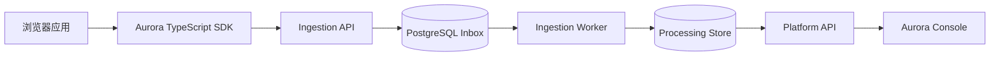

# Aurora GitHub Main and README Refresh Implementation Plan

> **For agentic workers:** REQUIRED SUB-SKILL: Use superpowers:subagent-driven-development (recommended) or superpowers:executing-plans to implement this plan task-by-task. Steps use checkbox (`- [ ]`) syntax for tracking.

**Goal:** Publish the branch represented by the current Aurora server release to GitHub `main`, replace the internal-ledger homepage with a product-focused README, add a maintainable changelog, update GitHub About metadata, and verify CI/CD plus the public deployment.

**Architecture:** Treat `codex/email-verification-aliyun-implementation` as the source branch because its runtime files match server release `20260815-132409` and its head only adds truthful completion documentation after the deployed runtime commit. Make the documentation changes on that clean worktree, verify locally, then fast-forward `origin/main`; GitHub Actions runs the full main gate and deploys the exact passing SHA to the single-host preview.

**Tech Stack:** Markdown, Mermaid, Git, pnpm 11.17.0, Node.js 24.18.0, GitHub CLI 2.94.0, GitHub Actions, SSH/Docker Compose deployment evidence.

## Global Constraints

- README language is Chinese-first with one English tagline.
- Do not display ADR ledgers, completion counters, internal Agent recovery instructions, or detailed quality-gate history on the repository homepage.
- Do not claim npm availability, a formal semantic version, a license, or any capability that cannot be verified in the repository.
- Because `LICENSE_PENDING` is recorded, use “可自托管” and do not claim Aurora is open source.
- The About description is exactly `面向前端应用的可自托管可观测平台：错误、请求与性能监控，配套 TypeScript SDK 与管理控制台。`
- The About website is exactly `https://aurora.ah.cn/`.
- Update `main` only by fast-forward; never use `--force` or `--force-with-lease`.
- Preserve unrelated worktrees and the root worktree’s untracked `.superpowers/brainstorm/` directory.
- Do not modify server secrets, databases, Lumina services, or any path outside the existing Aurora deployment scope.
- CI-passed SHA, deployed SHA, and final `origin/main` SHA must match before completion is claimed.

---

### Task 1: Replace the Repository Homepage and Add the Changelog

**Files:**
- Modify: `README.md`
- Create: `CHANGELOG.md`

**Interfaces:**
- Consumes: existing public URLs, implemented package/application capabilities, and repository documentation paths.
- Produces: a stable product homepage and one user-facing change log that later releases can update without rewriting the stable README sections.

- [ ] **Step 1: Replace `README.md` with the approved product-first structure**

Use `apply_patch` to replace the file with this exact content:

````markdown
<!--
title: Aurora 仓库入口
status: approved
owner: documentation
last-reviewed: 2026-08-15
applies-to: Aurora 用户、部署者与贡献者
related: CHANGELOG.md, docs/README.md, docs/architecture/system-overview.md
supersedes: none
-->

# Aurora

> See what broke. Understand why. Fix with evidence.

Aurora 是面向前端应用的可自托管可观测平台。它通过 TypeScript SDK 捕获错误、请求与 Web 性能事实，并在管理控制台中把分散信号组织成可调查、可协作、可追溯的证据。

[在线体验](https://aurora.ah.cn/) · [项目文档](docs/README.md) · [更新日志](CHANGELOG.md)

## 为什么选择 Aurora

前端故障往往散落在浏览器错误、失败请求、性能指标和发布记录之间。Aurora 将采集、可靠接收、异步处理、问题聚合与团队处置连接为一条完整链路，让团队从“哪里坏了”继续追到“为什么发生”和“下一步做什么”。

## 核心能力

| 能力 | 说明 |
| --- | --- |
| 错误追踪 | 捕获 JavaScript 运行时错误、未处理 Promise 拒绝与资源加载错误，聚合为可处理的 Issue。 |
| 请求监控 | 观测 `fetch` 与 `XMLHttpRequest` 的安全请求事实，识别失败和慢请求，不采集请求体或响应体。 |
| Web 性能 | 采集 LCP、INP、CLS 与页面加载耗时，提供可查询的聚合指标和有界诊断样本。 |
| 调查与响应 | 关联发布与 Source Map，支持 Issue 生命周期、告警、站内通知和审计轨迹。 |
| 团队治理 | 提供账号、组织、项目、成员权限、客户端密钥、资源策略与数据状态管理。 |
| 自托管部署 | 通过 provider-neutral Docker Compose 运行 Console、API、Worker、PostgreSQL 与 Redis。 |

## 从源码开始

环境要求：Node.js `24.18.x`、pnpm `11.17.0`。

```bash
corepack enable pnpm
pnpm install --frozen-lockfile
pnpm build
```

Aurora 当前提供单主机 Docker Compose 部署路径。部署拓扑、TLS、备份和回滚说明见[单主机部署文档](docs/operations/public-preview-single-host-deployment.md)。公开 API 契约位于 [`docs/api`](docs/api/)。

> SDK 公共包的发布工程已经就绪，但正式 npm 发布凭据尚未配置；在可验证的包版本发布前，README 不提供 npm 安装命令。

## 工作原理



接入 API 在事务提交后才确认可靠接收；Worker 通过租约、fencing、重试预算和死信机制异步处理事件。Console 只通过公开 Platform API 读取和修改业务状态，不直连存储。

## 当前 Preview

- 全面采用 `Calm Observability` 控制台界面，围绕“状态 → 证据 → 行动”组织调查流程；
- 接入阿里云 DirectMail 邮箱验证投递，并为历史未验证账号提供受限重发；
- 修复部署后的首次引导、邮箱重发冷却与额度状态保持问题。

完整增量与 Bug 修复记录见 [CHANGELOG.md](CHANGELOG.md)。正式版本发布后，本节只保留最新版本摘要。

## 隐私与部署边界

Aurora 默认不采集请求体、响应体、Cookie、Authorization、表单内容、密码或验证码、完整 DOM、完整页面文本、完整 IP 或设备指纹。隐私过滤发生在事件进入发送链之前，服务端存储继续使用受协议约束的安全投影。

当前公开实例运行在 provider-neutral 单主机架构上，定位为 MVP / early-production：可部署、可回滚、可备份，但不宣称 Multi-AZ、自动故障转移或跨区域灾备。

## 文档

- [正式文档索引](docs/README.md)
- [系统架构与模块边界](docs/architecture/system-overview.md)
- [SDK 可靠发送链](docs/sdk/sdk-reliable-delivery-chain.md)
- [数据接入 OpenAPI](docs/api/ingestion.openapi.yaml)
- [管理平台 OpenAPI](docs/api/platform-openapi-v1.yaml)
- [部署、Migration 与回滚](docs/releases/release-migration-and-rollback.md)
- [架构决策记录](docs/adr/README.md)

## 开发

```bash
pnpm format:check
pnpm typecheck
pnpm test
pnpm check
```

包级任务使用 `pnpm --filter <package-name> <script>`。仓库规则与 Agent 入口见 [AGENTS.md](AGENTS.md) 和 [AURORA_RULES.md](AURORA_RULES.md)。
````

- [ ] **Step 2: Add `CHANGELOG.md` with a stable Unreleased workflow**

Use `apply_patch` to create this exact content:

```markdown
<!--
title: Aurora 更新日志
status: approved
owner: release
last-reviewed: 2026-08-15
applies-to: Aurora 用户可感知功能、行为、Bug 与安全修复
related: README.md, docs/releases/release-migration-and-rollback.md
supersedes: none
-->

# Changelog

本文件记录 Aurora 用户可感知的功能、行为变化、Bug 修复与安全修复。开发中的变化先写入 `Unreleased`；创建正式版本标签时，再移动到 `## [x.y.z] - YYYY-MM-DD`。

## [Unreleased]

### Added

- 推出 `Calm Observability` 管理控制台，以“状态 → 证据 → 行动”组织监控、调查与治理工作区。
- 增加阿里云 DirectMail 邮箱验证投递，以及登录 Session 下的历史未验证账号重发能力。
- 完成 TypeScript SDK 的错误、请求与 Web 性能采集、可靠发送链及 Vue/React 框架适配。
- 提供 Issue、Source Map、请求与性能查询、告警、站内通知、组织/项目治理和资源策略能力。

### Changed

- Aurora v1 使用 provider-neutral 单主机 Docker Compose 部署，不绑定特定云厂商 API。
- 控制台认证与首次使用流程统一到新的双层导航和上下文界面。

### Fixed

- 修复部署后首次引导状态丢失的问题。
- 修复邮箱重发冷却时间和滚动额度状态未被正确保持的问题。
- 修复平台运行时依赖、数据库 Migration 兼容与部署回滚安全问题。

### Security

- 邮箱验证链接保持最新链接唯一有效，重发采用 60 秒冷却和滚动 24 小时最多 5 次限制。
- 验证意图令牌不进入请求日志，邮件 Outbox 失败状态和终态数据保持脱敏。
- 默认隐私边界继续禁止采集请求/响应正文、凭据、表单内容、完整 DOM、完整 IP 与设备指纹。
```

- [ ] **Step 3: Verify the two documents before moving on**

Run:

```powershell
pnpm exec prettier --check README.md CHANGELOG.md
git diff --check
git diff -- README.md CHANGELOG.md
```

Expected: Prettier reports both files matched; `git diff --check` exits 0; the diff contains only the approved README replacement and new changelog.

### Task 2: Run Local Verification and Commit the Homepage Change

**Files:**
- Modify: `docs/superpowers/specs/2026-08-15-github-main-readme-refresh-design.md`
- Modify: `docs/superpowers/plans/2026-08-15-github-main-readme-refresh.md`
- Modify: `packages/platform-email/test/documentation.test.ts`
- Modify: `tooling/workspace-policy/test/documentation-contract.test.ts`
- Modify: `packages/browser/test/documentation-contract.test.ts`
- Test: repository-wide documented quality commands

**Interfaces:**
- Consumes: Task 1 documentation artifacts.
- Produces: one clean commit whose parent history already contains the server-matching implementation branch and its design/plan records.

- [ ] **Step 1: Verify stable homepage requirements with explicit assertions**

Run:

```powershell
$readme = Get-Content -Raw -LiteralPath 'README.md'
$required = @('# Aurora','See what broke. Understand why. Fix with evidence.','## 核心能力','## 从源码开始','## 工作原理','## 当前 Preview','## 隐私与部署边界','## 文档')
$forbidden = @('当前门禁','completed / remaining','ADR-001 与 ADR-006','npm install @aurora','开源可观测')
foreach ($item in $required) { if (-not $readme.Contains($item)) { throw "README missing: $item" } }
foreach ($item in $forbidden) { if ($readme.Contains($item)) { throw "README contains forbidden text: $item" } }
$changelog = Get-Content -Raw -LiteralPath 'CHANGELOG.md'
foreach ($item in @('## [Unreleased]','### Added','### Changed','### Fixed','### Security')) { if (-not $changelog.Contains($item)) { throw "CHANGELOG missing: $item" } }
```

Expected: exit 0 with no output.

- [ ] **Step 2: Run formatting and the full repository quality command**

Run:

```powershell
pnpm format:check
pnpm check
```

Expected: both commands exit 0. If a failure predates this change, preserve the full output, prove it is unrelated, and do not claim the full gate passed.

- [ ] **Step 3: Inspect and commit only the intended files**

Run:

```powershell
git status --short
git diff --check
git diff --stat
git add README.md CHANGELOG.md docs/superpowers/specs/2026-08-15-github-main-readme-refresh-design.md docs/superpowers/plans/2026-08-15-github-main-readme-refresh.md
git diff --cached --check
git diff --cached --stat
git commit -m "docs(repo): refresh Aurora project homepage"
```

Expected: the commit contains exactly README, CHANGELOG, this updated implementation plan, and the three stale documentation-contract corrections proven by red→green targeted tests: the email Runbook deployment status, the obsolete “no CI” root-README assertion, and the Browser implementation-ledger assertion that no longer belongs on the project homepage. The approved design's license-wording correction already exists in the preceding plan checkpoint commit.

### Task 3: Fast-Forward GitHub Main and Update About Metadata

**Files:**
- Modify externally: GitHub ref `refs/heads/main`
- Modify externally: GitHub repository About description, website, and topics

**Interfaces:**
- Consumes: the clean verified commit from Task 2 and the current `origin/main` relation.
- Produces: GitHub `main` pointing at the target commit without history rewriting, plus discoverable repository metadata.

- [ ] **Step 1: Re-fetch and prove fast-forward safety immediately before push**

Run:

```powershell
git fetch origin main
$targetSha = git rev-parse HEAD
$remoteMainBefore = git rev-parse origin/main
git merge-base --is-ancestor origin/main HEAD
if ($LASTEXITCODE -ne 0) { throw 'origin/main is not an ancestor; refusing non-fast-forward update' }
git status --porcelain=v1
```

Expected: ancestor check exits 0 and status is empty. Record `$targetSha` and `$remoteMainBefore` for final evidence.

- [ ] **Step 2: Push the verified target as a normal main fast-forward**

Run:

```powershell
git push origin HEAD:main
git ls-remote origin refs/heads/main
```

Expected: push reports a fast-forward from the recorded old main to `$targetSha`; `ls-remote` reports `$targetSha`.

- [ ] **Step 3: Update GitHub About metadata**

Run:

```powershell
gh repo edit GehrmannMerlin/Aurora `
  --description '面向前端应用的可自托管可观测平台：错误、请求与性能监控，配套 TypeScript SDK 与管理控制台。' `
  --homepage 'https://aurora.ah.cn/' `
  --add-topic observability `
  --add-topic monitoring `
  --add-topic error-tracking `
  --add-topic performance-monitoring `
  --add-topic typescript `
  --add-topic javascript `
  --add-topic vue `
  --add-topic react `
  --add-topic self-hosted `
  --add-topic web-vitals
gh repo view GehrmannMerlin/Aurora --json description,homepageUrl,repositoryTopics,defaultBranchRef
```

Expected: JSON contains the exact description and website, default branch `main`, and all ten approved topics.

### Task 4: Wait for CI/CD and Verify GitHub, Server, and Public URLs

**Files:**
- Read externally: GitHub Actions runs and repository page
- Read externally: `/opt/aurora-preview/current` and public HTTPS endpoints

**Interfaces:**
- Consumes: target SHA pushed in Task 3.
- Produces: fresh completion evidence that GitHub, CI, deployment, server pointer, and public behavior agree.

- [ ] **Step 1: Find and watch the Main Quality Gates run for the target SHA**

Run:

```powershell
$targetSha = git rev-parse HEAD
$mainRun = gh run list --repo GehrmannMerlin/Aurora --workflow main.yml --commit $targetSha --limit 1 --json databaseId,headSha,status,conclusion,url | ConvertFrom-Json
if (-not $mainRun) { throw 'Main Quality Gates run not found for target SHA' }
gh run watch $mainRun.databaseId --repo GehrmannMerlin/Aurora --exit-status
```

Expected: the run for `$targetSha` reaches `success`. If the run has not been created yet, poll with bounded waits shorter than 60 seconds and keep the user updated.

- [ ] **Step 2: Find and watch Preview Continuous Delivery**

Run:

```powershell
$deployRun = gh run list --repo GehrmannMerlin/Aurora --workflow deploy-preview.yml --limit 10 --json databaseId,headSha,event,status,conclusion,url,createdAt | ConvertFrom-Json | Where-Object { $_.headSha -eq $targetSha } | Select-Object -First 1
if (-not $deployRun) { throw 'Preview Continuous Delivery run not found for target SHA' }
gh run watch $deployRun.databaseId --repo GehrmannMerlin/Aurora --exit-status
```

Expected: deploy workflow reaches `success`; its exact checkout SHA is `$targetSha` and its public smoke passes.

- [ ] **Step 3: Verify final GitHub content and metadata**

Run:

```powershell
git fetch origin main
if ((git rev-parse origin/main) -ne $targetSha) { throw 'origin/main moved away from target SHA' }
gh api repos/GehrmannMerlin/Aurora/readme -H 'Accept: application/vnd.github.raw+json' | Select-String -SimpleMatch 'See what broke. Understand why. Fix with evidence.'
gh repo view GehrmannMerlin/Aurora --json description,homepageUrl,repositoryTopics,defaultBranchRef
```

Expected: remote main equals `$targetSha`, the raw default-branch README contains the tagline, and About metadata matches Task 3.

- [ ] **Step 4: Verify the server release and public behavior without reading secrets**

Run:

```powershell
$current = ssh -o BatchMode=yes -o ConnectTimeout=10 -i "$env:USERPROFILE\.ssh\lumina_ops_ed25519" ecs-user@47.238.145.24 'readlink -f /opt/aurora-preview/current'
if (-not $current.EndsWith("cd-$targetSha")) { throw "Server current does not match target SHA: $current" }
$consoleCode = (Invoke-WebRequest -UseBasicParsing -Uri 'https://aurora.ah.cn/' -TimeoutSec 20).StatusCode
$redirect = Invoke-WebRequest -UseBasicParsing -Uri 'http://aurora.ah.cn/' -MaximumRedirection 0 -SkipHttpErrorCheck -TimeoutSec 20
$ingest = Invoke-WebRequest -UseBasicParsing -Uri 'https://ingest.aurora.ah.cn/v1/batches' -Method Post -ContentType 'application/json' -Body '{}' -SkipHttpErrorCheck -TimeoutSec 20
if ($consoleCode -ne 200) { throw "Console HTTP $consoleCode" }
if ($redirect.StatusCode -notin 301,302,307,308) { throw "HTTP redirect status $($redirect.StatusCode)" }
if ($ingest.StatusCode -ne 401) { throw "Ingestion unauthenticated status $($ingest.StatusCode)" }
```

Expected: `current` ends with `cd-<target SHA>`, console is 200, HTTP redirects to HTTPS, and unauthenticated ingestion remains 401.

- [ ] **Step 5: Run the final clean-worktree and commit evidence check**

Run:

```powershell
git status --short --branch
git log -1 --oneline --decorate
git show --stat --oneline --summary HEAD
```

Expected: the implementation worktree is clean; HEAD is the same SHA as `origin/main` and the server release; the final commit includes only the planned documentation artifacts.
