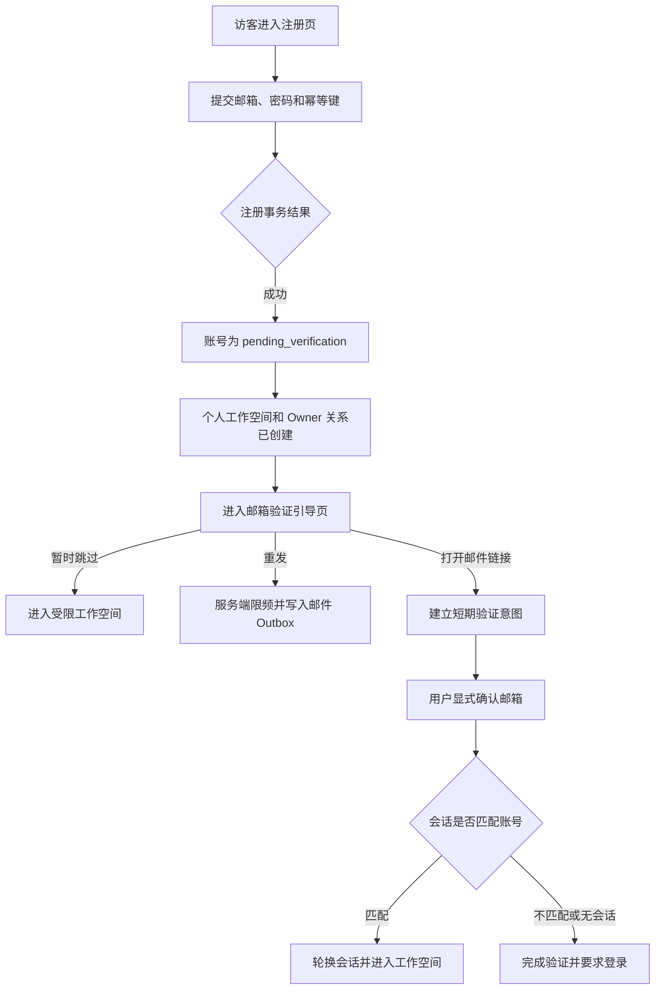

# Aurora 管理平台前端 UX/UI 设计

## 1. 文档元数据

| 字段 | 内容 |
|---|---|
| 标题 | Aurora 管理平台前端 UX/UI 设计 |
| 状态 | `draft` |
| Owner | `platform` |
| 创建日期 | 2026-07-27 |
| 最后复查日期 | 2026-07-27 |
| 适用范围 | Aurora 第一版管理平台的业务流程、页面边界、信息架构、交互状态、数据口径和公开 API 依赖 |
| 关联 PRD | [Aurora 第一版核心业务 PRD](../../../Auroa-PRD-业务逻辑汇总-v2.1-核心业务定稿版.md) |
| 关联规则 | [AGENTS.md](../../../AGENTS.md)、[AURORA_RULES.md](../../../AURORA_RULES.md)、[架构规范](<../../../Aurora 架构规范.md>)、[代码规范](<../../../Aurora 代码规范.md>)、[测试规范](<../../../Aurora 测试规范.md>)、[文档规范](<../../../Aurora 文档规范.md>)、[ADR 规范](<../../../Aurora ADR 规范.md>) |
| 关联 ADR | [ADR 索引](../../adr/README.md)及 ADR-001 至 ADR-006；截至本文创建时全部为 `proposed / not-started` |
| 关联后端设计 | 仓库当前没有服务端设计文档、公开 API 文档或模块 README；会话中确认的相关设计层结论记录于第 13、14 节 |
| supersedes | `none` |
| 当前设计阶段 | `brainstorming` 收口；页面 A1 已获用户批准，页面 A2 尚未开始 |

## 2. 文档定位

本文档用于把当前会话中 Aurora 管理平台 UX/UI 的真实讨论结果固化为可恢复、可审查的设计记录。它解决以下问题：

- 明确第一版管理平台候选页面及其 PRD 依据；
- 区分用户已确认、待确认、已否决和尚未讨论的内容；
- 固化已经批准的页面 A1“注册与邮箱验证”；
- 记录页面元素与业务、权限和服务端能力之间的追踪关系；
- 记录下一会话的准确恢复位置。

本文档不解决：

- 前端框架、状态管理、组件库和视觉设计系统选型；
- 服务端、数据库、队列、缓存、搜索、邮件供应商或部署平台的正式技术决策；
- 公共 API 的独立发布文档、实现代码和数据库迁移；
- 页面 A2 及其后页面的正式 UX/UI 方案；
- 第一版 PRD 明确排除的产品能力。

PRD 决定产品范围和业务规则；approved 架构规范决定系统边界；服务端设计和公开 API 为页面提供真实能力；本文档负责把这些能力映射为前端体验。若聊天结论与 approved 文档冲突，approved 文档优先，冲突结论不得进入最终方案。

本文档状态为 `draft`，只是一份设计记录，不是代码实施授权。进入实现前仍须完成全部页面设计、用户审查、必要 ADR 审批以及独立的 `writing-plans` 阶段。

## 3. 当前项目与设计状态

### 3.1 产品阶段

Aurora 当前处于“核心业务规则冻结、工程实现准备”阶段。第一版核心闭环是：

```text
创建项目
→ 安装并初始化 SDK
→ 接收错误、请求异常和性能数据
→ 聚合为问题
→ 查看源码、调用栈和安全上下文
→ 分配、处理并解决问题
→ 符合条件时再次打开
→ 通过基础告警和站内通知发现异常
```

仓库当前只有规则、PRD、ADR 提案和文档治理材料，没有前端代码、服务端代码、公开 API 文档或模块 README。根目录也不存在 `README.md`。

### 3.2 已完成的前端设计范围

- 管理平台 UX/UI 的强制业务追踪原则已经由用户明确提出并确认作为讨论约束；
- 第一版候选页面清单已经按 PRD 梳理，但除 A1 外尚未获得页面边界批准；
- 页面 A1“注册与邮箱验证”的业务流程、页面结构、交互、安全状态和设计级 API 映射已经获得用户批准；
- 与前端数据解释直接相关的接收结果、代表样本、Source Map、聚合水位等服务端设计层结论已经记录；
- 已明确所有聊天结论遇到 PRD 冲突时以 PRD 为准。

### 3.3 尚未完成的设计范围

- 全局导航、工作空间和项目切换结构；
- 页面 A2 至 D2 的逐页业务、数据、状态、交互和 API 设计；
- 跨页面表格、筛选、分页、危险操作和异步状态模式；
- 视觉语言、设计令牌和组件规范；
- 前端工程技术选型；
- 全部后端公开 API 的正式服务端规格和实现授权。

### 3.4 当前停留位置

页面 A1 已由用户明确批准。当前会话按用户要求暂停，不继续提出问题。下一会话应从页面 A2“登录”的第一个关键问题开始：登录成功后的安全目标地址优先级。

### 3.5 规则与 ADR 核对结果

- 当前未发现本文档已确认内容与 approved PRD、架构、代码、测试、文档或 ADR 规范存在未记录冲突；
- ADR-001 至 ADR-006 全部为 `proposed / not-started`，本文仅引用其讨论背景，不把它们视为实施授权；
- 会话中涉及框架、数据库、认证和基础设施的选择只具有“会话设计层已确认”含义，需要 ADR 或正式服务端设计时仍受门禁阻塞；
- 早期聊天中与 PRD 冲突的完整事件永久保存、Source Map 只改展示、不支持有限重解析等结论已经作废，见第 14.3 节。

## 4. 前端设计强制原则

### 4.1 先业务，后页面

每个页面在设计布局前必须先说明：

- 用户角色；
- 用户进入页面的目的；
- 前置条件；
- 核心业务流程；
- 可执行操作；
- 操作后的业务状态变化；
- 加载、空数据、错误、无权限、部分数据、处理中、陈旧、归档、删除或不可用状态。

### 4.2 页面元素必须有真实用途

页面中的按钮、菜单、标签页、筛选器、搜索、排序、分页、批量操作、表单、开关、状态、数字和提示必须对应明确业务规则、数据来源或服务端能力。

禁止加入：

- 只为填充页面的卡片、数字或图表；
- 点击后没有真实业务结果的按钮；
- 没有数据来源和计算口径的趋势；
- 第一版不会实现的入口；
- 无后端能力支撑的批量操作、导出、搜索、筛选或设置；
- 以“敬请期待”等形式占据正式页面的功能区；
- 为了视觉丰富而虚构的功能。

### 4.3 前端—业务—后端必须可追踪

每个业务交互必须记录：

- 触发的业务动作；
- 所需权限；
- 对应公开 API 或服务端 Command；
- 请求参数和返回数据；
- 成功后的界面变化；
- 失败、超时、冲突和重复提交处理；
- 幂等、审计和二次确认要求。

没有后端能力的功能不能进入正式页面设计。发现缺口时：

1. 判断是否属于第一版；
2. 不属于第一版则从页面移除；
3. 属于第一版但后端尚未设计，则登记为阻塞项；
4. 在公开能力和业务语义确认前，不伪造可用接口或保留无效入口。

追踪表遇到尚不存在的服务端能力时统一填写“后端能力缺口：待判断是否属于第一版”，并从正式 UX/UI 方案移除对应元素，直到范围和能力均获确认。

### 4.4 数据必须可追溯

每个列表字段、详情字段、状态、计数、趋势和图表必须说明：

- 数据来源；
- 计算口径和时间范围；
- 更新时间与最终一致性；
- 空值含义；
- 权限过滤；
- 采样、额度降级或处理延迟造成的不完整性。

原型可以使用示意数据，但必须标注真实字段和接口。示意数据不构成新增功能授权。

### 4.5 权限和边界

- 后端对每次查询和修改执行权威权限校验；
- 前端隐藏按钮不能代替权限控制；
- 路由无权限时不得先加载或短暂泄露受保护数据；
- 管理平台只能通过公开 API 使用服务端能力，禁止直连数据库或内部队列；
- 上报事件协议继续以 `event-schema` 为唯一来源；管理平台业务 API 使用独立公开契约，不依赖存储模型。

### 4.6 设计流程门禁

一次只讨论一个页面中的一个关键问题。每个问题用实际业务场景解释，并提供两至三个可行方案、优缺点和推荐。页面完成后先展示完整设计并等待批准；全部设计获批、文档复查通过后，才能进入 `writing-plans`。设计阶段不得编写产品代码。

## 5. 第一版信息架构

### 5.1 已确认的页面关系

目前只确认页面 A1 的路由关系：

```text
/register
├─ /login
└─ /verify-email
   ├─ /workspace
   └─ /verify-email/confirm
      ├─ /workspace
      └─ /login
```

若用户从邀请流程进入注册，邀请意图必须安全保留，但邀请接受页面和恢复规则尚未设计。

全局导航、侧边栏、组织切换、项目切换、面包屑以及移动端导航均尚未确认。下列 A、B、C、D 分组只是恢复讨论用的候选业务分组，不代表已批准导航菜单。

### 5.2 候选页面清单及 PRD 依据

| 编号 | 候选页面 | PRD 业务依据 | 当前状态 |
|---|---|---|---|
| A1 | 注册与邮箱验证 | §4.1、§4.2、§19.1 | 已确认并完成页面设计 |
| A2 | 登录 | §4.1、§19.1 | 页面边界待确认，页面细节尚未讨论 |
| A3 | 忘记密码与重置密码 | §4.1、§19.1 | 页面边界待确认，页面细节尚未讨论 |
| A4 | 接受组织邀请 | §4.3 | 页面边界待确认，页面细节尚未讨论 |
| A5 | 账号安全、修改密码与注销 | §4.1 | 页面边界待确认，页面细节尚未讨论 |
| B1 | 工作空间与项目入口 | §4.2、§4.5 | 页面边界待确认，页面细节尚未讨论 |
| B2 | 创建项目 | §4.4.1—§4.4.4 | 页面边界待确认，页面细节尚未讨论 |
| B3 | 组织成员与邀请 | §4.2、§4.3、§13 | 页面边界待确认，页面细节尚未讨论 |
| B4 | 组织设置与业务时区 | §12.3 | 页面边界待确认，修改权限尚无 PRD 明文 |
| B5 | 资源用量 | §15.1、§15.4—§15.7 | 页面边界待确认，页面细节尚未讨论 |
| B6 | 私密管理令牌 | §5.4、§13.2—§13.3 | 页面边界待确认，页面细节尚未讨论 |
| B7 | 安全审计 | §13.3、§16 | 页面边界待确认，查看权限尚未细化 |
| B8 | 项目回收站 | §17 | 页面边界待确认，页面细节尚未讨论 |
| C1 | SDK 接入向导 | §4.4.5—§4.4.11 | 页面边界待确认，页面细节尚未讨论 |
| C2 | 项目概览 | §12.1、§12.3—§12.4 | 页面边界待确认，页面细节尚未讨论 |
| C3 | 问题列表 | §9、§10、§12.1—§12.2 | 页面边界待确认，页面细节尚未讨论 |
| C4 | 问题详情 | §8.3、§9.3、§10 | 页面边界待确认，页面细节尚未讨论 |
| C5 | 请求监控 | §5.1.2—§5.1.6、§11.2.1 | 页面边界待确认，后端查询模型尚未设计 |
| C6 | 页面性能 | §5.1.9、§11.2.1 | 页面边界待确认，后端查询模型尚未设计 |
| C7 | 数据接收状态与诊断 | §4.4.10、§7.2—§7.3 | 页面边界待确认，页面细节尚未讨论 |
| C8 | 发布与部署 | §8.1—§8.2 | 页面边界待确认，页面细节尚未讨论 |
| C9 | Source Map 管理 | §8.3 | 页面边界待确认，页面细节尚未讨论 |
| C10 | 告警规则与实例列表 | §11.1—§11.3 | 页面边界待确认，告警服务能力尚未设计 |
| C11 | 告警规则编辑 | §11.2 | 页面边界待确认，告警服务能力尚未设计 |
| C12 | 告警实例详情 | §11.2.9—§11.2.10、§11.3 | 页面边界待确认，告警服务能力尚未设计 |
| C13 | 项目成员与角色 | §13.1—§13.2 | 页面边界待确认，页面细节尚未讨论 |
| C14 | 客户端上报密钥与接入策略 | §5.3、§7.3、§13.2 | 页面边界待确认，页面细节尚未讨论 |
| C15 | 项目设置与运行环境 | §4.5—§4.6、§5.1.15 | 页面边界待确认，页面细节尚未讨论 |
| C16 | 项目归档与删除 | §17 | 页面边界待确认，页面细节尚未讨论 |
| D1 | 站内通知中心 | §11.4 | 页面边界待确认，页面细节尚未讨论 |
| D2 | 平台资源策略管理 | §15.8—§15.9 | 页面边界待确认，平台管理员模型尚未细化 |

### 5.3 第一版明确不提供的页面和入口

以下内容不得出现在第一版正式导航或页面中：

- 套餐、升级、计费、账单、支付、发票；
- 邮件、短信、电话、Webhook、Slack、飞书或企业微信通知配置；
- Session Replay 和完整用户行为分析；
- AI 根因分析；
- 高级查询语言、动态基线和异常检测；
- 自定义角色、企业 SSO、设备管理和双重验证；
- 责任小组、关注成员、自动分配和值班排班；
- 大规模后台批量任务中心；
- Source Map 独立任务中心；
- 可视化动态采样、路径规则或错误归一化规则编辑器；
- 项目共享视图和自定义工作台；
- 以占位形式展示的未来功能入口。

测试数据清理、问题活动和个人保存视图应在对应业务页面内设计，不单独扩展为后台中心。

## 6. 用户角色和核心任务

组织角色与项目角色可以叠加，服务端返回的有效权限是界面可见性和操作能力的权威来源。菜单隐藏或按钮禁用的具体表现需在对应页面确认。

| 角色 | 主要目标与可查看数据 | 可执行操作 | 不允许的操作 | 无权限界面原则 |
|---|---|---|---|---|
| 未登录访客 | 注册、验证、登录、重置密码 | 公开认证流程 | 查看任何组织或项目数据 | 不请求受保护数据，转到认证页 |
| 已登录未验证用户 | 完成验证并使用 PRD 未禁止的功能 | 重发和确认邮箱、进入工作空间 | 邀请成员、创建私密令牌 | 服务端拒绝受限 Command，页面解释验证要求 |
| 组织所有者 | 查看组织全部项目、成员、用量和审计 | 组织全部操作、转让所有权、删除组织 | 无法注销唯一所有者账号 | 冲突状态说明必须先转让所有权 |
| 组织管理员 | 管理组织成员和项目，默认访问组织项目 | 邀请成员、管理项目 | 转让所有权 | 路由或操作级 `forbidden`，不得泄露受限数据 |
| 组织成员 | 访问被分配项目 | 由项目角色决定 | 默认不能创建项目或管理组织 | 只展示可访问项目 |
| 项目管理员 | 查看项目全部数据 | 设置、成员、密钥、告警和全部问题操作 | 组织所有者专属操作 | 受保护操作由服务端校验 |
| 开发成员 | 查看项目数据和定位信息 | 处理问题、添加备注、上传 Source Map | 管理成员、密钥和项目生命周期 | 保留可查看内容，移除未授权操作 |
| 只读成员 | 查看授权项目数据 | 无修改操作 | 所有写操作 | 页面进入只读态，写 API 不应发出 |
| 平台管理员 | 配置平台保护性资源策略 | 设置默认或单个组织、项目资源上限 | 收费和商业套餐操作 | 只在平台管理员权限明确后提供入口 |

包含用户上下文或敏感事件字段的数据必须额外执行字段级权限过滤。普通客户端上报密钥不是管理平台用户身份，不能读取任何项目数据。

## 7. 核心业务流程

### 7.1 通用页面交互链路

每个正式页面遵循同一业务链路：

```text
用户进入页面
→ 前端请求公开查询 API
→ 服务端校验会话、权限和业务范围
→ 页面展示当前业务状态
→ 用户执行已授权操作
→ 前端提交 Command
→ 服务端再次校验权限、业务状态和并发版本
→ 返回成功、失败、冲突或处理中结果
→ 页面更新或重新获取权威状态
→ PRD 要求时写入活动或审计
```

状态要求：

- `loading`：不显示伪造的旧值；
- `empty`：解释业务上为什么为空，并只提供真实下一步；
- `error`：区分可重试和不可重试；
- `forbidden`：不泄露数据，不能只隐藏按钮；
- `duplicate`：幂等操作视为已完成或返回原结果；
- `conflict`：刷新权威状态，不覆盖他人更新；
- `processing`：显示异步状态和可解释的刷新方式；
- `partial` 或 `stale`：展示水位、延迟、采样或额度影响；
- `archived`、`deleted`、`unavailable`：根据业务状态机限制操作并提供允许的恢复路径。

### 7.2 已确认的 A1 流程



失败和恢复：

- 注册超时使用相同幂等键重试，不重复创建账号或工作空间；
- 邮件供应商失败不回滚注册事务，验证页显示邮件请求状态并允许在冷却后重发；
- 邮件扫描器访问链接不会直接更新 `verified_at`；
- 令牌过期或无效时不确认邮箱，匹配的未验证会话可以请求重发；
- 已验证账号重复确认返回幂等成功；
- 会话过期或账号不可用时清除本地认证状态并转到登录页。

### 7.3 已确认的数据接收与展示语义

- `accepted` 只表示事件已经可靠进入异步处理缓冲，不表示问题、指标或告警已经可查询；
- 所有有效且进入处理的事件更新总量和聚合，完整事件只保存有限代表样本；
- Source Map 上传或替换后自动创建有界异步重解析，只处理受影响且仍保留完整详情的样本；
- 历史问题不批量重组，新事件按处理时可用的 Source Map 结果参与分组；
- 分钟桶和生命周期总量由事件处理事务更新，小时和天桶异步滚动生成；
- 长时间范围的查询必须返回数据水位、分辨率和完整性信息；
- 批量接入响应同时具有请求级和逐事件结果，前端诊断不得把 `accepted` 解释为处理完成。

这些语义只约束未来相关页面的数据解释；对应页面元素尚未完成设计。

## 8. 页面设计

### 8.1 页面 A1：注册与邮箱验证

**状态：已确认**

#### 业务目标

让新用户通过邮箱和密码创建唯一账号，原子获得个人工作空间和 Owner 关系，并完成邮箱验证。验证前只应用 PRD 明确规定的权限限制。

#### 目标用户和权限

- 未登录访客可以注册并进入登录页；
- 已登录未验证用户可以重发邮件、确认邮箱或暂时进入工作空间；
- 已验证用户重复打开验证流程时获得幂等结果；
- 邀请进入的新用户需要保留安全邀请意图，接受邀请由 A4 设计负责。

#### 进入条件

- 用户当前未登录，或当前会话属于待验证账号；
- 注册邮箱可接收邮件；
- 服务端可以执行邮箱唯一性、密码哈希、会话、工作空间原子创建和邮件发送请求；
- 如果服务端能力尚未形成正式公开 API 文档，页面不得进入实现阶段。

#### 核心任务

1. 使用邮箱和密码注册；
2. 了解验证邮件发送目标和当前状态；
3. 在限频允许时重发验证邮件；
4. 显式确认邮箱；
5. 暂时进入工作空间，或在跨设备确认后重新登录。

#### 信息架构

`/register`：

- 邮箱输入；
- 密码输入；
- 注册按钮；
- 登录页入口。

`/verify-email`：

- 验证状态说明；
- 服务端脱敏邮箱；
- 邮件请求状态；
- 重发按钮和服务端冷却时间；
- 暂时进入工作空间入口。

`/verify-email/confirm`：

- 验证意图状态；
- 显式“确认邮箱”操作；
- 成功、过期、无效、已验证和服务不可用结果；
- 工作空间或登录页入口。

#### 交互流程

注册 Command 原子写入账号、个人工作空间、Owner 关系、验证令牌摘要、邮件 Outbox 和幂等记录，并建立受限会话。验证链接的 `GET` 只建立短期 HttpOnly 验证意图并清理地址中的原始令牌；最终验证由受 CSRF 保护的 `POST` 完成。

验证令牌只证明邮箱所有权，不作为长期登录凭据。当前匹配会话在验证成功后轮换；无匹配会话时要求用户登录。站内目标地址必须经过白名单校验，禁止开放重定向。

#### 数据需求

| 数据 | 来源 | 口径与更新时间 | 空值含义 | 权限与完整性 |
|---|---|---|---|---|
| `emailMasked` | Account，经服务端脱敏 | 注册结果或 Session 查询时更新 | 不允许为空；为空视为接口错误 | 仅当前账号可见 |
| `verificationStatus` | `Account.verified_at` | 确认事务提交后更新 | `verified_at` 为空表示未验证 | 仅当前账号或有效验证意图可查询 |
| `deliveryStatus` | Email Delivery Outbox | 注册或重发 Command 提交时更新 | 没有创建发送请求 | 只能说明请求已提交，不能声称邮件已送达 |
| `resendAvailableAt` | 服务端限频状态 | 每次注册或重发后更新 | 当前无需或不能重发 | 前端倒计时不替代服务端校验 |
| `serverTime` | Platform API | 每次相关响应 | 缺失时不展示精确倒计时 | 用于校正客户端时钟 |
| `workspaceId` | 原子注册事务 | 注册提交成功时确定 | 不允许为空 | 当前账号个人工作空间 |

本页面没有统计数字、趋势或图表。

#### 页面状态

| 状态 | 表现与处理 |
|---|---|
| `loading` | 恢复 Session 或验证意图；不闪现受保护内容 |
| `empty` | 注册表单初始状态；不使用监控类空数据占位 |
| `error` | 字段错误、不可注册、限频、邮件服务或平台暂不可用；保留非敏感输入 |
| `forbidden` | Session 或 CSRF 无效；转登录并只保留安全站内目标 |
| `partial` | 账号和工作空间已创建，但邮件仍排队或发送失败；注册不回滚 |
| `processing` | 注册、重发或确认提交中；禁止重复提交 |
| `stale` | 重发倒计时可能陈旧；用 `serverTime` 和新响应校正 |
| `archived` | 不适用于账号注册流程，不设计该状态的视觉区块 |
| `deleted` | 账号在页面打开后被注销；清除会话并转登录 |
| `unavailable` | 账号被禁用、验证意图无效或服务不可用；不泄露内部原因 |

#### UX/UI 方案

- 使用单列窄宽度认证布局；
- 页面标题和一句业务说明位于表单前；
- 标签始终位于输入框上方；
- 字段错误紧邻字段，同时提供页面级错误摘要；
- 键盘顺序与视觉顺序一致，状态变化通过 `aria-live` 宣告；
- 小屏幕保持同一业务步骤，不隐藏关键状态；
- 不使用装饰性统计、营销卡片或无业务动作的功能入口；
- 不设计无法保证结果的“打开邮箱”按钮，只提供准确文字说明。

#### 非目标

- 第三方登录、企业 SSO、双重验证和设备管理；
- 实时邮箱存在性检查；
- PRD 未定义的协议同意复选框；
- “记住我”开关；
- 邮箱验证码输入流程；
- 验证前完全阻止进入工作空间；
- 自动删除长期未验证账号；该删除规则没有 PRD 授权。

## 9. 前端—业务—后端追踪表

### 9.1 页面 A1

仓库尚无正式 API 文档。下表中的接口是已随页面 A1 获得用户批准的设计级公开契约，必须在实现前由后端形成独立 API 规格并完成必要评审。

| 页面元素 | 用户目的 | 业务规则 | 所需权限 | 后端能力或 API | 请求参数 | 返回结果 | 成功表现 | 失败表现 |
|---|---|---|---|---|---|---|---|---|
| 邮箱输入框 | 指定账号邮箱 | 同一邮箱只能对应一个账号；不实时探测是否存在 | 公开 | `POST /v1/auth/registrations` | `email` | 注册结果或 RFC 9457 错误 | 进入注册事务 | 本地格式错误或通用 `registration_not_available` |
| 密码输入框 | 设置登录凭据 | 密码策略来自公开契约，服务端权威校验；不得记录明文 | 公开 | `POST /v1/auth/registrations` | `password` | 注册结果或字段错误 | 服务端保存 Argon2id 摘要 | 显示契约对应字段错误，不回显密码 |
| 注册按钮 | 创建账号、工作空间和会话 | 原子、限频、幂等 | 公开 | `POST /v1/auth/registrations` | `email`、`password`；`Idempotency-Key` 请求头 | Account 摘要、`workspaceId`、验证状态、重发时间、`serverTime` | 进入 `/verify-email` | 422、409、429、503；超时复用幂等键重试 |
| 登录链接 | 已有账号进入登录流程 | 不产生业务状态变化 | 公开 | 站内导航 `/login` | 无 | A2 路由 | 打开登录页 | 路由加载错误显示可重试错误页 |
| 脱敏邮箱 | 确认邮件目标 | 必须由服务端统一脱敏 | 当前账号 | `GET /v1/auth/session` | Session Cookie | `emailMasked`、`verificationStatus` | 显示脱敏地址 | 401 转登录；字段缺失显示页面错误 |
| 邮件请求状态 | 理解邮件是否已请求发送 | 不把进入 Outbox 表述为已送达 | 当前账号 | 注册结果或 `GET /v1/auth/session` | Session Cookie | `deliveryStatus` | 显示“发送请求已提交”等准确状态 | `partial` 状态提供冷却后重发 |
| 重发按钮 | 再次请求验证邮件 | 冷却、有限次数、重复请求合并 | 未验证账号 | `POST /v1/auth/email-verifications/resend` | Session Cookie、CSRF | `deliveryStatus`、`resendAvailableAt`、`serverTime` | 更新状态并重新开始倒计时 | 401、409、429、503；按服务端结果恢复 |
| 冷却倒计时 | 知道何时可以重发 | 以服务端时间为准，前端计时不授权请求 | 未验证账号 | 重发响应字段 | `resendAvailableAt`、`serverTime` | 剩余秒数 | 到期后恢复按钮 | 时钟偏差时重新请求权威状态 |
| 暂时进入工作空间 | 延后验证继续使用 | 只保留 PRD 明确限制 | 已登录账号 | 站内导航；写操作仍由后端鉴权 | 安全相对路径 | 工作空间路由 | 进入个人工作空间并显示未验证状态 | Session 过期转登录 |
| 邮件验证链接 | 建立验证意图 | `GET` 不更新 `verified_at`；原始令牌不进入日志或持久化前端存储 | 持有有效令牌 | `GET /v1/auth/email-verifications/intent?token=...` | 高熵一次性令牌 | 303 到干净确认地址并设置短期 HttpOnly 意图 Cookie | 打开确认页 | 过期、非法或服务不可用显示统一不可用状态 |
| 确认邮箱按钮 | 完成邮箱验证 | 显式 POST、CSRF、一次有效、幂等 | 有效验证意图 | `POST /v1/auth/email-verifications/confirm` | 意图 Cookie、CSRF | `verified`、`already_verified` 或 `requires_login` | 更新状态；匹配会话轮换 | 403、409、410、503；超时可安全重试 |
| 进入工作空间或登录 | 完成验证流程 | 只允许安全站内目标；跨设备验证不自动建立长期会话 | 已验证账号 | 站内导航 | 服务端返回的枚举式下一步 | `/workspace` 或 `/login` | 到达正确目标 | 非法目标被丢弃并使用安全默认路由 |

页面 A1 不包含菜单、标签页、筛选、搜索、排序、分页、表格行操作、批量操作、开关、图表、统计卡片、下载或导出，因为这些元素没有本页面业务目的。邮箱确认本身是安全确认步骤；刷新通过 Session 和验证意图恢复，重试只使用上表已有操作。

## 10. 数据展示口径

### 10.1 页面 A1

页面 A1 只展示账号验证数据，不展示监控统计。数据口径见第 8.1 节“数据需求”。任何示意邮箱都必须标注为 `emailMasked` 的布局样例，不能成为新的用户资料字段。

### 10.2 未来监控页面必须遵守的已确认口径

- 问题总发生次数与已保留完整样本数必须分开显示；
- 影响用户数必须标注“估算”，并说明客户端采样、匿名编号和资源降级影响；
- `accepted`、`processing` 和可查询完成状态必须分开；
- 分钟、小时和天聚合查询必须返回实际 `resolution`、`dataThrough`、`isPartial` 和预期延迟；
- Source Map 映射状态不能隐藏原始堆栈或失败原因；
- 项目归档、接入异常、额度降级或处理积压不能被解释为正常或告警恢复；
- 统计查询必须使用同一环境、发布版本和时间范围；
- 所有数据查询必须按用户有效权限过滤。

这些规则不授权创建任何尚未逐页批准的图表或统计卡片。

## 11. 表单和操作规则

### 11.1 页面 A1 表单

| 字段 | 必填 | 默认值 | 前端校验 | 后端校验 |
|---|---:|---|---|---|
| `email` | 是 | 无 | 基础格式、去除首尾空白、长度来自契约 | 规范化、长度、唯一约束、限频和防枚举 |
| `password` | 是 | 无 | 使用公开契约生成的规则；不持久化 | 权威密码策略、请求大小、Argon2id 哈希 |

不加入确认密码、显示名称、营销订阅、协议同意或其他 PRD 未要求字段。密码策略具体数值尚无 approved 规则，因此正式 UI 不硬编码未经确认的提示；该数值必须先进入公开认证契约。

### 11.2 提交、幂等和并发

- 提交期间禁用对应按钮并显示 `processing`；
- 注册使用 `Idempotency-Key`，超时重试复用相同键；
- 账号和个人工作空间通过数据库唯一约束执行最终防重；
- 重发在服务端冷却期内合并，不产生重复邮件请求；
- 验证确认重复调用返回已完成状态；
- 页面收到业务冲突后重新获取 Session，不覆盖权威状态。

### 11.3 权限、审计和安全

- 注册是公开 Command，但必须限频和防滥用；
- 重发只允许当前未验证账号；
- 验证确认需要有效短期意图和 CSRF；
- 未验证用户的邀请和私密令牌限制由后端强制；
- 注册和验证使用最小认证安全日志，不进入组织业务审计列表；
- 密码、完整邮箱、令牌、Cookie 和验证 URL 不得进入日志；
- 邮件验证链接设置 `Referrer-Policy: no-referrer`，接入层禁止记录该路由查询参数。

### 11.4 成功反馈和失败恢复

- 注册成功只表述账号和邮件请求已建立，不表述邮件已送达；
- 注册失败保留邮箱，清除密码字段；
- 邮件发送失败不撤销账号和工作空间；
- 限频展示服务端允许的重试时间；
- Session 失效进入登录页；
- 非法或过期验证意图提供重新登录或在匹配未验证会话中重发的真实路径。

## 12. UX/UI 一致性规则

当前只确认以下通用规则：

- 业务流程、权限和数据来源先于页面布局；
- 主操作必须对应页面的核心业务任务，次要操作不能抢占主操作层级；
- 不工作的元素不得进入正式原型；
- 状态文案描述真实服务端语义，不把排队写成完成；
- 错误需要区分字段错误、权限错误、业务冲突、限频和暂时不可用；
- 数据不完整时必须在对应数据附近解释原因，不能只放全局模糊提示；
- 认证页面使用单列窄宽度布局、可见标签、字段邻近错误和页面错误摘要；
- 键盘、焦点、屏幕阅读器状态播报和小屏适配属于验收范围。

以下内容尚未确认，不能作为当前设计结论：

- 管理平台整体视觉风格、颜色、字体和间距令牌；
- 全局导航模式、表格密度、筛选布局和分页模式；
- 危险操作的统一弹窗样式；
- 图表类型、颜色编码和数据可视化规范；
- 组件库和前端框架。

## 13. 后端能力缺口

下表记录当前前端设计或候选页面依赖、但仓库尚无正式服务端设计/API 文档/实现的能力。对 A1，设计级接口已获用户批准，但仍阻塞实现；对其他页面，缺口解决前不得把相关元素纳入正式 UX/UI。

| 缺口 | 涉及页面 | 用户价值 | 是否属于第一版 | 所需权限 | 建议 API 或 Command | 当前处理 |
|---|---|---|---|---|---|---|
| GAP-01 认证 Session、安全策略、CSRF、限频和幂等 | A1—A5 | 安全恢复身份并防重复或滥用 | 是，PRD §4.1 | 公开或当前账号 | Session Query、认证 Commands、统一 RFC 9457 错误 | 阻塞核心流程；会话设计层已确认，需安全评审和正式 API 文档；认证长期方案需评估 ADR |
| GAP-02 注册与个人工作空间原子创建 | A1、B1 | 注册后获得可用工作空间 | 是，PRD §4.2 | 公开注册 | `RegisterAccount` 跨 identity、organization 事务 | A1 设计已确认；阻塞实现；需服务端模块设计，不单独扩大产品范围 |
| GAP-03 邮箱验证与邮件交付 | A1、A3、A4 | 验证身份和完成安全恢复 | 是，PRD §4.1、§4.3 | 公开、当前账号或令牌持有者 | Create/Resend/Confirm Verification、事务 Outbox、EmailDeliveryPort | A1 协议语义已确认；邮件供应商未选；供应商和部署选择需评估 ADR |
| GAP-04 未验证账号保留与清理规则 | A1、A5 | 避免误删并控制滥用数据 | PRD 未明确自动清理 | 平台安全管理 | 尚无可建议的删除 Command | 不自动删除、不提供 UI；需要产品规则明确后再设计 |
| GAP-05 登录、重置、修改密码和账号注销 | A2、A3、A5 | 完成账号生命周期 | 是，PRD §4.1 | 公开或当前账号 | Login、ResetPassword、ChangePassword、DeleteAccount | 后端能力缺口：待补充服务端设计；页面元素尚未进入正式方案 |
| GAP-06 组织邀请 | A4、B3 | 指定邮箱安全加入组织和项目 | 是，PRD §4.3 | 组织所有者或管理员；目标邮箱账号 | Create/Revoke/Accept Invitation | 后端能力缺口：待补充服务端设计；页面元素尚未进入正式方案 |
| GAP-07 工作空间、项目入口和组织时区 | B1、B4 | 选择上下文并按组织时区解释数据 | 是，PRD §4.2、§12.3 | 组织成员；修改权限待产品细化 | Workspace Query、Organization Settings Command | 后端能力缺口：时区修改权限需先明确；页面元素尚未进入正式方案 |
| GAP-08 项目创建、接入轮询、诊断和测试数据清理 | B2、C1、C7 | 完成 SDK 核心接入闭环 | 是，PRD §4.4、§7.3 | 组织所有者/管理员；项目权限 | CreateProject、GetOnboarding、RetryCheck、ClearTestData、Diagnostics Query | 阻塞核心流程；需补充服务端设计，不需要改变五大系统边界 |
| GAP-09 组织和项目成员角色管理 | B3、C13 | 管理最小团队权限 | 是，PRD §4.2—§4.3、§13 | 对应管理员 | Membership Queries/Commands | 后端能力缺口：待补充服务端设计；页面元素尚未进入正式方案 |
| GAP-10 资源用量和平台保护策略 | B5、D2 | 解释降级并由平台管理员保护资源 | 是，PRD §15 | 组织查看权限；平台管理员修改 | Usage Query、SetUsagePolicy | 查询与平台管理员模型尚未设计；基础设施变化需评估 ADR |
| GAP-11 私密管理令牌 | B6 | 支持 CLI、CI/CD、发布和 Source Map | 是，PRD §5.4 | 已验证且有管理权限的账号 | Create/Revoke/List AuthToken | 后端能力缺口：创建时一次显示、摘要存储和审计需正式设计 |
| GAP-12 安全审计查询 | B7 | 查看高风险操作证据 | 是，PRD §13.3、§16 | 查看权限尚未明确 | AuditLog Query | 先明确查看权限和分页口径；未确认前不设计列表操作或导出 |
| GAP-13 项目归档、恢复、回收站和永久删除 | B8、C16 | 安全管理项目生命周期 | 是，PRD §17 | 项目管理员及组织高权限 | Archive/Restore/MoveToTrash/Delete Commands | 需完整状态机、幂等、审计和删除进度设计；页面元素尚未进入正式方案 |
| GAP-14 问题查询、状态、负责人、备注、合并、批量和个人视图 | C3、C4 | 完成问题定位和处理闭环 | 是，PRD §9、§10、§12.2 | 项目角色和敏感字段权限 | Issue Queries/Commands、Merge、PageBatch、SavedView | 阻塞核心流程；需补充服务端设计；大规模后台批量明确排除 |
| GAP-15 项目概览、请求和性能聚合查询 | C2、C5、C6 | 查看真实趋势、失败率和性能 | 是，PRD §5、§11、§12 | 项目查看权限 | Overview/Request/Performance Metric Queries | 需计算口径、水位、采样和权限字段；存储技术变化需评估 ADR |
| GAP-16 发布和部署 | C8 | 关联版本、环境和再次出现 | 是，PRD §8.1—§8.2 | 项目管理令牌或获准成员 | Release/Deployment Queries and Commands | 后端能力缺口：待补充服务端设计；复杂部署流水线明确排除 |
| GAP-17 Source Map 上传、替换、下载、诊断和重解析 | C4、C9 | 展示可读源码并解释失败 | 是，PRD §8.3 | 项目管理员或获准开发成员 | SourceMap Queries/Commands、Reparse Status | 重解析语义已确认；对象存储与服务端 API 尚无正式设计，存储选择需 ADR |
| GAP-18 告警规则、计算、实例和暂停原因 | C10—C12 | 及时发现持续异常并正确解释恢复 | 是，PRD §11 | 项目管理员管理；成员查看 | AlertRule Commands、AlertInstance Queries、Evaluation Worker | 告警状态机来自 PRD；计算模型和 API 尚未设计；基础设施选择需评估 ADR |
| GAP-19 客户端密钥、环境和项目设置 | C14、C15 | 管理接入边界和运行环境 | 是，PRD §4.6、§5.3、§13 | 项目管理员 | ClientKey/Environment/Project Settings Commands | 后端能力缺口：待补充服务端设计；控制台不能远程扩大 SDK 采集 |
| GAP-20 站内通知查询与已读状态 | D1 | 接收告警和问题变化提醒 | 是，PRD §11.4 | 当前账号 | Notification Query、MarkRead Command | 去重原则已由 PRD 确定；查询、分页和已读语义尚未设计；外部渠道明确排除 |

后端能力缺口共 20 项。其中 GAP-01 至 GAP-03 直接阻塞已批准的 A1；GAP-04 需要产品规则；GAP-05 至 GAP-20 阻塞尚未逐页设计的页面。涉及框架、认证基础设施、数据库、对象存储、队列或部署的长期选择必须先满足 ADR 门禁。

## 14. 决策记录与状态分类

### 14.1 已确认

以下 19 项只记录用户明确确认或由用户明确要求以 approved PRD 为准的结论。“会话设计层已确认”不等于 ADR accepted，也不授权实现。

| 编号 | 设计问题 | 已选方案 | 选择原因 | 状态 | 影响页面 |
|---|---|---|---|---|---|
| FUX-001 | 管理平台设计方法 | 先业务后页面；所有元素追踪到业务、权限和后端 | 防止虚构功能和错误数据解释 | 已确认 | 全部页面 |
| FUX-002 | 聊天结论与正式规则冲突 | 一切冲突以 approved PRD 和规则为准 | 业务范围已经冻结 | 已确认 | 全部页面 |
| PLAT-001 | 管理服务边界 | `platform-api` 模块化单体加独立 `platform-worker` | 保持模块边界并控制第一版运维复杂度 | 会话设计层已确认；需 ADR/正式设计 | 全部登录后页面 |
| PLAT-002 | 管理 API HTTP 适配 | Fastify 作为 Node HTTP 适配，领域和 Worker 不依赖框架 | 限制框架侵入 | 会话设计层已确认；框架 ADR 未批准 | 全部页面 |
| PLAT-003 | 管理业务数据 | 独立逻辑 PostgreSQL 平台数据库和角色 | 隔离平台业务数据和事件处理数据 | 会话设计层已确认；数据库 ADR 未批准 | 全部登录后页面 |
| PLAT-004 | 浏览器与平台 API | REST/JSON、OpenAPI 契约优先，Platform API 组合其他服务，使用 RFC 9457 错误 | 管理平台只依赖公开稳定契约 | 会话设计层已确认；正式 API 文档不存在 | 全部页面 |
| PLAT-005 | 用户认证 | 邮箱密码、Argon2id、不透明服务端 Session、HttpOnly Cookie、CSRF、不使用 localStorage Bearer Token | 降低浏览器令牌暴露风险 | 会话设计层已确认；需安全评审/ADR 判断 | A1—A5及全部受保护页面 |
| PLAT-006 | PostgreSQL 数据访问 | Kysely 加权威版本化 SQL Migration | 保持查询类型和迁移可审查 | 会话设计层已确认；数据库 ADR 未批准 | 后端支撑 |
| PLAT-007 | 管理 API Schema | Zod 4 Mini 为管理契约来源，生成 JSON Schema、OpenAPI 和独立校验器 | 降低前后端契约漂移 | 会话设计层已确认；正式契约不存在 | 全部页面 |
| PLAT-008 | 服务间权限 | 短期、受 audience/resource/action 约束的内部能力令牌，不转发浏览器 Cookie | 防止服务间权限扩散 | 会话设计层已确认；需安全评审 | 组合查询和 Command |
| DATA-001 | 问题详情保存 | 总量持续更新，每问题只保留有限代表样本，建议默认上限 100 且由服务端配置 | 遵守 PRD 并控制存储 | PRD 基线已确认 | C3、C4、C2 |
| DATA-002 | Source Map 与分组 | 新事件优先使用映射位置；历史问题不批量重组，未来事件可能进入新问题 | 遵守 PRD 并保持历史稳定 | PRD 基线已确认 | C4、C9 |
| DATA-003 | Source Map 重解析触发 | 上传或替换后自动创建有界异步任务 | 避免阻塞上传且不遗漏重解析 | 已确认方案 A | C4、C9 |
| DATA-004 | 自定义 fingerprint | 有界字符串数组，服务端归一化和哈希；无效值回退默认分组 | 支持组合业务维度并限制隐私和高基数风险 | 已确认方案 A | SDK 配置、C4 |
| DATA-005 | 多分辨率聚合 | 实时写生命周期总量和分钟桶，小时/天桶确定性异步滚动生成 | 降低事件写放大并暴露水位 | 已确认方案 A | C2、C3、C5、C6、C10—C12 |
| INGEST-001 | 批量接收结果 | 请求级结果加逐事件结果，明确重试语义 | 支持混合批次并驱动诊断 | 已确认方案 A | C1、C7 |
| A1-001 | 注册创建时点 | 立即原子创建 `pending_verification` 账号、个人工作空间、Owner 关系和受限会话 | 符合 PRD 对未验证账号的明确限制 | 已确认方案 A | A1、B1 |
| A1-002 | 邮箱验证 UX | 独立验证引导页、允许暂时进入工作空间、显式 POST 确认 | 兼顾邮件延迟、可用性和扫描器安全 | 已确认方案 A | A1 |
| A1-003 | 页面 A1 完整方案 | 采用第 8.1、9.1、10、11 节设计 | 页面业务、状态、安全和追踪关系完整 | 用户已批准 | A1 |

### 14.2 待确认

- A2 至 D2 的页面是否保持当前候选拆分；
- 全局导航、组织/项目切换和路由层级；
- 各候选页面中的具体元素、数据和 API 映射；
- 页面 A1 设计级 API 在独立服务端 API 规格中的最终路径、错误码和字段兼容规则；
- 组织业务时区的修改权限；
- 安全审计的查看权限；
- 平台管理员身份模型和资源策略页面边界。

这些内容不得写成最终 UX/UI。

### 14.3 已否决

| 结论或方案 | 否决原因 |
|---|---|
| 为视觉丰富加入无业务卡片、统计、图表或按钮 | 违反前端强制追踪原则 |
| 无后端能力时保留正式入口或“敬请期待”占位 | 无法形成真实业务结果 |
| 每条 accepted 事件永久保存完整详情 | 与 PRD 的有限代表样本规则冲突 |
| Source Map 永远只改善展示、不影响未来分组 | 与 PRD 的映射位置优先规则冲突 |
| Source Map 上传后批量重组全部历史问题 | 超出第一版并破坏历史状态稳定性 |
| 不支持保留期内 Source Map 有限重解析 | 与 PRD §8.3.8 冲突 |
| Source Map 重解析由用户手动启动 | 已选择上传后自动创建异步任务 |
| Source Map 在上传请求内同步重解析 | 容易超时且资源边界不稳定 |
| 自定义 fingerprint 只使用单字符串或由 SDK 预先哈希 | 组合能力、校验和版本一致性较弱 |
| 查询时根据代表样本计算真实总量 | 样本不是完整集合，统计结果错误 |
| 接入批次只返回总体状态或取消批量 | 无法正确处理混合结果，增加 SDK 网络成本 |
| 邮箱验证完成后才创建账号和工作空间 | 不符合已选未验证账号状态模型，邮件延迟会阻塞使用 |
| 邮箱链接 GET 自动完成验证 | 邮件扫描器可能提前消费令牌 |
| 邮箱验证码阻塞页且验证前完全不能进入产品 | 增加 PRD 未规定的限制和防暴力破解能力 |
| 第三方登录、SSO、2FA、设备管理 | PRD 明确后置 |

### 14.4 尚未讨论

- 页面 A2 至 D2 的业务目标、操作流程、信息架构、状态和视觉方案；
- 管理平台全局导航与跨页面返回关系；
- 前端框架、路由、状态管理、请求层、表单和组件库；
- 视觉品牌、颜色、字体、图标、密度和设计令牌；
- 表格、筛选、分页、批量操作和危险操作的跨页面模式；
- 密码策略具体数值、验证令牌有效期、重发冷却数值和邮件供应商；
- 长期未验证账号的数据保留或删除规则；
- 各统计页面的具体 API 字段和图表形式。

## 15. 待决策清单

下表共 31 个后续讨论单元：30 个尚未完成的页面/流程，加 1 个跨页面一致性收口。每项仍需按“实际场景 → 两至三个方案 → 优缺点 → 推荐 → 用户确认”推进。

| 顺序 | 问题 | 为什么现在需要决定 | 影响页面 | 依赖的业务或后端能力 |
|---:|---|---|---|---|
| 1 | A2 登录成功后的安全目标地址优先级 | 决定邀请、深链、上次访问位置和个人工作空间之间的恢复行为 | A2、A4、B1 | Session、站内 `returnTo` 校验、可访问组织/项目查询 |
| 2 | A3 忘记密码与重置流程 | PRD 要求一次有效、有期限的链接 | A3 | ResetPassword Commands、邮件交付、限频 |
| 3 | A4 邀请接受与注册/登录衔接 | 邮箱必须匹配且成员与项目权限需原子创建 | A4、A1、A2 | Invitation Commands、身份匹配、幂等 |
| 4 | A5 账号安全、修改密码和注销 | 唯一组织所有者不能直接注销 | A5 | ChangePassword、DeleteAccount、Owner 冲突查询 |
| 5 | B1 工作空间、组织和项目入口 | 全局导航必须建立在真实可访问范围上 | B1及全部登录后页面 | Workspace Query、权限投影 |
| 6 | B2 创建项目 | 项目、环境、密钥、接入记录和审计必须原子创建 | B2、C1 | CreateProject 幂等 Command |
| 7 | B3 组织成员与邀请 | 需要确定列表、邀请和角色修改的最小交互 | B3 | Membership/Invitation APIs、审计 |
| 8 | B4 组织设置与业务时区 | 修改权限和时间变更影响尚未明确 | B4及统计页面 | Organization Settings、产品权限决定 |
| 9 | B5 资源用量 | 必须准确解释额度、降级和数据不完整 | B5、C2—C7 | Usage Query、资源策略和采样标记 |
| 10 | B6 私密管理令牌 | 只在创建时显示一次且需要范围、撤销和审计 | B6、C8、C9 | AuthToken Commands、安全审计 |
| 11 | B7 安全审计 | 查看权限、字段脱敏、分页和保留期尚未设计 | B7 | Audit Query、字段级权限 |
| 12 | B8 项目回收站 | 需要区分恢复期、永久删除和删除处理中 | B8、C16 | Project lifecycle Commands、删除进度 |
| 13 | C1 SDK 接入向导 | 核心闭环需要区分接收、处理和问题生成 | C1 | Onboarding Query、测试事件状态、诊断 |
| 14 | C2 项目概览 | 只能展示有明确口径的状态和指标 | C2 | Overview Query、告警摘要、聚合水位 |
| 15 | C3 问题列表 | 筛选、搜索、排序、个人视图和当前页批量需严格映射 | C3 | Issue Query、SavedView、PageBatch Commands |
| 16 | C4 问题详情 | 代表样本、Source Map、状态、负责人、备注和合并集中交互 | C4 | Issue Detail Query、Commands、字段权限 |
| 17 | C5 请求监控 | 请求失败率、慢请求和 URL 归一化需要真实查询模型 | C5 | Request Metric Query、采样和水位 |
| 18 | C6 页面性能 | LCP、INP、CLS 和加载耗时需要确定展示口径 | C6 | Performance Metric Query、样本阈值和水位 |
| 19 | C7 数据接收状态与诊断 | 需要把最近请求、拒绝原因、密钥和环境状态映射为可行动建议 | C7 | Diagnostics Query、接入结果枚举 |
| 20 | C8 发布与部署 | 需要确定自动发现发布与手工/令牌创建部署的边界 | C8 | Release/Deployment APIs |
| 21 | C9 Source Map 管理 | 上传、替换确认、下载权限、失败诊断和重解析状态需统一 | C9 | SourceMap APIs、对象存储、审计 |
| 22 | C10 告警规则与实例列表 | 规则和实例是不同状态来源 | C10 | Alert Queries、暂停原因 |
| 23 | C11 告警规则编辑 | 固定指标、窗口、阈值、持续时间和接收成员需动态约束 | C11 | AlertRule Command、校验契约 |
| 24 | C12 告警实例详情 | 需要解释触发、等待、恢复、冷却和数据不足 | C12 | AlertInstance Query、评估证据 |
| 25 | C13 项目成员与角色 | 组织继承权限和项目显式角色需要清晰表现 | C13 | ProjectMembership APIs |
| 26 | C14 客户端密钥与接入策略 | 密钥启停、来源、环境和最近使用时间均属高风险操作 | C14 | ClientKey Commands、审计、诊断 |
| 27 | C15 项目设置与运行环境 | 设置不能远程扩大 SDK 未启用采集 | C15 | Project/Environment Commands、隐私边界 |
| 28 | C16 项目归档与删除 | 危险操作、名称确认、7 天恢复和不可逆删除需逐态设计 | C16 | Lifecycle Commands、审计、删除状态 |
| 29 | D1 站内通知中心 | 通知类型、去重、已读和目标跳转尚未设计 | D1 | Notification Query/Command |
| 30 | D2 平台资源策略管理 | 仅平台管理员可见，不能引入收费语义 | D2 | PlatformAdmin、UsagePolicy Commands |
| 31 | 跨页面 UX/UI 一致性收口 | 页面业务完成后才能确定导航、表格、危险操作、视觉和可访问性规范 | 全部页面 | 已批准逐页设计和前端工程专题 |

## 16. 下一会话恢复入口

将以下提示词复制到新的 Codex 会话：

```text
请继续使用 Superpowers 的 brainstorming 流程讨论 Aurora 管理平台前端 UX/UI，暂时不要编写代码、初始化项目、修改正式规则、修改 ADR 状态或进入 writing-plans。

开始前请按 AGENTS.md 的顺序完整阅读 AURORA_RULES.md、核心业务 PRD、架构/代码/测试/文档/ADR 规范，以及 docs/superpowers/specs/2026-07-27-aurora-frontend-ux-ui-design.md。读取 ADR-001 至 ADR-006 时必须注意它们仍是 proposed / not-started。仓库当前没有服务端设计文档、API 文档或模块 README。

不要重新讨论设计文档第 14.1 节已经确认的结论，也不要把第 14.2、14.4 和第 15 节内容写成已确认。聊天结论与 approved PRD 或规则冲突时，记录冲突并以正式规则为门禁，不得自行修改规则或 ADR。

页面 A1“注册与邮箱验证”已经批准。请从待决策清单第 1 项继续：页面 A2“登录”成功后的安全目标地址优先级。先说明实际业务场景，再给出 2—3 个可行方案、优缺点和推荐，一次只提出一个关键问题。

每个页面继续按以下顺序设计：业务目标 → 用户角色与权限 → 用户操作流程 → 页面信息架构 → 每个交互元素的业务含义 → 后端能力与 API 映射 → 页面状态和异常处理 → 第一版范围检查 → UX/UI 方案。

每个正式元素必须填写前端—业务—后端追踪表。没有真实业务依据、数据来源或后端能力的元素不得保留；属于第一版但后端未设计的能力登记为阻塞项，不得伪造接口。设计获得确认前不得实施。
```

## 17. 设计文档自检记录

复查日期：2026-07-27。复查范围为本文档全部章节。

| 检查项 | 结果 |
|---|---|
| 占位标记和含糊承诺 | 通过；待处理内容均使用明确状态、Owner/领域和解除条件 |
| 待确认内容是否误写为最终结论 | 通过；页面清单除 A1 外均标明边界待确认、细节尚未讨论 |
| 是否虚构 PRD 外功能 | 通过；第一版排除项集中记录且不提供入口 |
| 页面是否具有业务依据 | 通过；31 个候选页面均注明 PRD 章节，只有 A1 进入正式页面设计 |
| 交互是否映射后端能力 | 通过；A1 全部正式元素已映射，仓库无 API 文档的事实明确标注为阻塞 |
| 页面状态是否覆盖异常和权限 | 通过；A1 覆盖 loading、empty、error、forbidden、partial、processing、stale、archived、deleted 和 unavailable |
| 统计和图表口径 | 通过；A1 不含统计或图表，未来规则不授权具体可视化 |
| 与 approved 规则是否冲突 | 通过；已识别的旧聊天冲突列入已否决 |
| 是否误用 proposed ADR | 通过；所有相关技术结论均标明 ADR/正式设计门禁 |
| 是否足够恢复下一会话 | 通过；当前停点、31 项顺序和可复制提示词完整 |
| 相对链接、标题、元数据和围栏 | 通过；以仓库文件检查结果为准 |
| 是否存在无负责人、无条件的实现承诺 | 通过；缺口表记录负责领域、第一版判断和当前阻塞条件 |

本文档的下一状态门禁是用户审查本文件。只有用户批准整份前端设计文档且剩余页面设计全部完成后，才允许进入 `writing-plans`。
