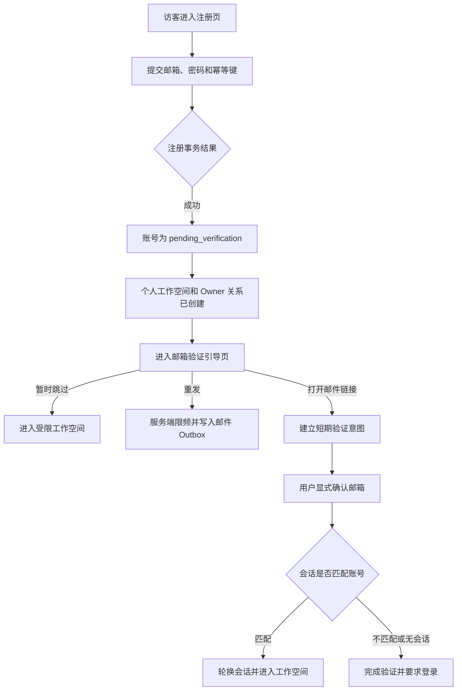

---

implementation-status: "implemented-in-feature-branch / final-verification-partial"
implementation-status-note: "Detailed business requirements remain authoritative; Calm Observability supersedes the historical visual language. The production Navigation Context producer and D2 production discoverability remain blocked; no deployment is implied."
title: Aurora 管理平台前端 UX/UI 设计
status: approved
owner: platform
created: 2026-07-27
last-reviewed: 2026-07-30
applies-to: Aurora 第一版管理平台的业务流程、页面信息架构、交互状态与公开 API 依赖
related:
  - ../../../AGENTS.md
  - ../../../AURORA_RULES.md
  - ../../../Auroa-PRD-业务逻辑汇总-v2.1-核心业务定稿版.md
  - "../../../Aurora 架构规范.md"
  - "../../../Aurora 代码规范.md"
  - "../../../Aurora 测试规范.md"
  - "../../../Aurora 文档规范.md"
  - "../../../Aurora ADR 规范.md"
  - ../../adr/README.md
  - ../../adr/ADR-001-use-monorepo.md
  - ../../adr/ADR-002-five-system-boundaries.md
  - ../../adr/ADR-003-sdk-plugin-architecture.md
  - ../../adr/ADR-004-asynchronous-event-processing.md
  - ../../adr/ADR-005-event-schema-source-of-truth.md
  - ../../adr/ADR-006-one-way-dependencies.md
  - ./2026-07-30-aurora-console-visual-language-design.md
  - ./2026-08-14-aurora-console-ux-ui-redesign-design.md
  - ./2026-07-28-aurora-frontend-technology-stack-design.md
  - ./2026-07-28-aurora-foundation-topic-approval-baseline.md
  - ./2026-07-28-aurora-platform-backend-design.md
  - ./2026-07-30-aurora-platform-openapi-and-implementation-design.md
  - ./2026-07-28-aurora-testing-deployment-release-design.md
  - ./2026-07-29-aurora-topic-discussion-summary.md
  - ../../prd/platform-product-domains.md
  - ../../architecture/platform-frontend.md
  - ../../security/account-deletion-and-data-lifecycle.md
  - ../../architecture/formalization-readiness.md
supersedes: none
design-stage: approved-detailed-frontend-source-awaiting-contracts-and-readiness
---

# Aurora 管理平台前端 UX/UI 设计

## 1. 文档元数据

| 字段 | 内容 |
|---|---|
| 标题 | Aurora 管理平台前端 UX/UI 设计 |
| 状态 | `approved` |
| Owner | `platform` |
| 创建日期 | 2026-07-27 |
| 最后复查日期 | 2026-07-29 |
| 适用范围 | Aurora 第一版管理平台的业务流程、页面边界、信息架构、交互状态、数据口径和公开 API 依赖 |
| 关联 PRD | [Aurora 第一版核心业务 PRD](../../../Auroa-PRD-业务逻辑汇总-v2.1-核心业务定稿版.md) |
| 关联规则 | [AGENTS.md](../../../AGENTS.md)、[AURORA_RULES.md](../../../AURORA_RULES.md)、[架构规范](<../../../Aurora 架构规范.md>)、[代码规范](<../../../Aurora 代码规范.md>)、[测试规范](<../../../Aurora 测试规范.md>)、[文档规范](<../../../Aurora 文档规范.md>)、[ADR 规范](<../../../Aurora ADR 规范.md>) |
| 关联 ADR | [ADR 索引](../../adr/README.md)及 ADR-001 至 ADR-006；截至本文创建时全部为 `proposed / not-started` |
| 关联后端设计 | [管理平台后端设计](./2026-07-28-aurora-platform-backend-design.md)与[总体 OpenAPI/实现约束设计](./2026-07-30-aurora-platform-openapi-and-implementation-design.md)已批准；仓库仍没有机器 Platform OpenAPI、可执行平台数据模型或管理平台实现 |
| supersedes | `none` |
| 当前设计阶段 | 管理平台前端 UX/UI、前端技术栈、管理平台后端及测试/部署/发布完整设计均已批准；当前进行正式化、ADR 与实施就绪审查 |

## 2. 文档定位

本文档用于把当前会话中 Aurora 管理平台 UX/UI 的真实讨论结果固化为可恢复、可审查的设计记录。它解决以下问题：

- 明确第一版管理平台候选页面及其 PRD 依据；
- 区分用户已确认、待确认、已否决和尚未讨论的内容；
- 固化已经批准的页面 A1“注册与邮箱验证”；
- 记录页面元素与业务、权限和服务端能力之间的追踪关系；
- 记录下一会话的准确恢复位置。

本文档不解决：

- 前端框架、状态管理、组件库和视觉设计系统选型；
- 服务端、数据库、队列、缓存、搜索、邮件供应商或部署平台的正式技术决策；
- 公共 API 的独立发布文档、实现代码和数据库迁移；
- 前端工程技术选型、精确视觉设计系统和正式服务端契约；
- 第一版 PRD 明确排除的产品能力。

PRD 决定产品范围和业务规则；approved 架构规范决定系统边界；服务端设计和公开 API 为页面提供真实能力；本文档负责把这些能力映射为前端体验。若聊天结论与 approved 文档冲突，approved 文档优先，冲突结论不得进入最终方案。

本文档状态为 `approved`，表示用户已批准本文适用范围内的管理平台前端 UX/UI 设计；它仍不是代码实施授权。前端、后端和测试/部署/发布的设计批准门禁已经关闭，但进入实现前仍须完成产品/安全缺口、正式文档、required ADR、机器契约、真实基准和最终实施就绪审查；只有用户明确允许后才可独立进入 `writing-plans`。

本文是 A1—D2、`NAV-A`、`AUDIT-A`、页面进入条件、结构、权限、Query/Command、状态、数据口径、危险操作、一次性秘密、可访问性、第一版排除项和 GAP-01—GAP-20 的详细前端权威来源。[六专题总结](./2026-07-29-aurora-topic-discussion-summary.md)只承担跨专题摘要、ADR/正式化映射与阻塞追踪，不得用于删除、弱化或替代本文细节。

## 3. 当前项目与设计状态

### 3.1 产品阶段

Aurora 当前处于“核心业务规则冻结、工程实现准备”阶段。第一版核心闭环是：

```text
创建项目
→ 安装并初始化 SDK
→ 接收错误、请求异常和性能数据
→ 聚合为问题
→ 查看源码、调用栈和安全上下文
→ 分配、处理并解决问题
→ 符合条件时再次打开
→ 通过基础告警和站内通知发现异常
```

仓库当前只有规则、PRD、ADR 提案和文档治理材料，没有前端代码、服务端代码、公开 API 文档或模块 README。根目录也不存在 `README.md`。

### 3.2 已完成的前端设计范围

- 管理平台 UX/UI 的强制业务追踪原则已经由用户明确提出并确认作为讨论约束；
- 第一版候选页面清单已经按 PRD 梳理；A1—D2 共 31 页均已获整页批准；
- 页面 A1“注册与邮箱验证”的业务流程、页面结构、交互、安全状态和设计级 API 映射已经获得用户批准；
- 页面 A2“登录”整页已随 A 组批准：使用最小邮箱/密码登录，成功后按邀请意图、安全 `returnTo`、工作空间的顺序恢复任务；正式认证契约仍阻塞实施；
- 页面 A3“忘记密码与重置密码”整页已随 A 组批准：请求重置与设置新密码保持两个安全子页，统一公开结果、一次性意图、原子更新和全部 Session 撤销不变；正式认证与邮件契约仍阻塞实施；
- 页面 A4“接受组织邀请”整页已随 A 组批准：邀请意图、认证衔接、账号邮箱匹配、显式接受、原子权限创建和安全终态不变；正式邀请契约仍阻塞实施；
- 页面 A5“账号安全、修改密码与注销”整页已随 A 组批准：修改密码、退出登录与账号注销使用同一账号安全入口中的独立区域，注销继续受唯一所有者预检、独立转让恢复和最终权威复核约束；账号数据生命周期已由[正式安全规则](../../security/account-deletion-and-data-lifecycle.md)收敛，机器契约、数据模型和 required ADR 仍阻塞实施；
- 页面 B1“工作空间与项目入口”已确认以组织分组展示个人工作空间、可访问组织和权限过滤后的项目；不记录最近访问，不自动进入项目；整页已随 B 组批准，正式后端契约仍阻塞实施；
- 页面 B2“创建项目”已确认单页最小表单、唯一操作编号、同步原子创建、超时恢复原结果和成功后进入 C1；整页已随 B 组批准，正式后端契约仍阻塞实施；
- 页面 B3“组织成员与邀请”已确认同一组织页面下使用“成员”和“待处理邀请”两个业务标签页，区分已生效权限与待接受意图；角色、移除、邀请和所有权转让分别映射独立 Command；整页已随 B 组批准，正式后端契约仍阻塞实施；
- 页面 B4“组织设置与业务时区”已确认所有者和管理员可以修改唯一组织业务时区，修改立即对全组织生效；真实时间点不变，历史展示和日历边界查询按当前组织时区重新解释；整页已随 B 组批准，正式后端契约仍阻塞实施；
- 页面 B5“资源用量”已确认状态优先的组织级当前周期摘要：展示权威保护状态、周期与时区、用量比例、PRD 要求的真实计数、更新时间和完整性影响；第一版不展示趋势图或项目排行；整页已随 B 组批准，正式后端契约仍阻塞实施；
- 页面 B6“私密管理令牌”已确认先选择精确权限范围和有效期，再原子创建并立即激活；明文只在首次成功响应中交付，离开后不可恢复，响应丢失时只能查询安全元数据并撤销重建；整页已随 B 组批准，正式后端契约仍阻塞实施；
- 页面 B7“安全审计”已确认组织所有者和组织管理员可查看统一的组织级安全审计时间线；项目级高风险事件进入同一时间线，仅为项目管理员或普通成员的用户没有入口，第一版不建设项目级独立审计页；整页已随 B 组批准，正式后端契约仍阻塞实施；
- 页面 B8“项目回收站”已确认使用组织级统一列表，仅组织所有者和组织管理员可以查看并恢复；恢复期内项目可执行恢复，进入正在删除后只读且不可恢复，仅为项目管理员或普通成员的用户没有入口；整页已随 B 组批准，正式后端契约仍阻塞实施；
- 页面 C1“SDK 接入向导”已确认采用单页渐进式三步结构：当前步骤展开、已完成步骤折叠但可回看，第三步内嵌等待请求、收到其他数据、测试事件处理中、接入成功或接入异常的权威状态轨迹；自动检查不超过 60 秒，之后由用户重新检查；整页已随 C 组批准，正式后端契约仍阻塞实施；
- 页面 C2“项目概览”已确认采用状态与原因优先的信息层级：先展示服务端权威的正常/异常/无数据及原因，再展示同一 URL 筛选口径下的问题数量、影响用户估算、重要告警摘要、最近数据时间和数据完整性；第一版不展示趋势图、健康评分、预测或排行；整页已随 C 组批准，正式后端契约仍阻塞实施；
- 页面 C3“问题列表”已确认 URL 是当前筛选、问题搜索、排序和分页上下文的权威来源；个人保存视图是显式应用和显式更新的个人快照，不保存页码或选择；选择仅在当前页和当前页面会话有效，任何查询变化都会清空；整页已随 C 组批准，正式后端契约仍阻塞实施；
- 页面 C4“问题详情”已确认采用问题聚合优先的单一工作区：问题摘要和问题级操作保持主对象，有限代表样本、所选样本详情、Source Map 结果及问题活动作为从属区域；不得把代表样本当成完整事件历史或问题本身；整页已随 C 组批准，正式后端契约仍阻塞实施；
- 页面 C5“请求监控”已确认采用当前查询内规范化接口列表与选中接口详情的单一工作区；列表不是静态 API 目录，失败率、耗时、慢请求和时间变化只能来自服务端指标查询，必须展示采样、水位和额度影响；整页已随 C 组批准，正式后端契约仍阻塞实施；
- 页面 C6“页面性能”已确认采用当前查询内安全页面/路由列表与选中页面详情的单一工作区；LCP、INP、CLS、页面加载耗时和时间变化只能来自服务端性能查询，必须展示采样、水位、指标可用性和额度影响；整页已随 C 组批准，正式后端契约仍阻塞实施；
- 页面 C7“数据接收状态与诊断”已确认采用权威接收状态、原因和行动优先的单一诊断工作区；接收、校验、可靠缓冲、异步处理和问题生成使用有限阶段事实，最近请求/成功/拒绝、密钥、环境、归档、限流和额度状态映射真实入口；整页已随 C 组批准，正式后端契约仍阻塞实施；
- 页面 C8“发布与部署”已确认采用发布版本列表与选中发布部署记录的单一工作区；SDK 首次出现或获准私密令牌可创建发布记录，管理平台不提供手工发布创建按钮；部署记录从属于发布，只有成功部署参与再次出现判断；整页已随 C 组批准，正式后端契约仍阻塞实施；
- 页面 C9“Source Map 管理”已确认采用选中发布范围内的当前有效文件列表与选中文件详情单一工作区；上传、显式替换和有限自动重解析保持同一文件上下文，重解析不成为独立任务中心；整页已随 C 组批准，正式后端契约仍阻塞实施；
- 页面 C10“告警规则与实例列表”已确认在同一项目告警页使用“告警规则”和“告警实例”双标签页；规则定义、当前评估投影和每次触发产生的实例保持对象分离，数据不足或计算暂停不等于恢复；整页已随 C 组批准，正式后端契约仍阻塞实施；
- 页面 C11“告警规则编辑”已确认采用指标优先的自适应单页表单；指标能力约束后续筛选、单位、阈值、窗口、持续时间、最小样本数和接收成员，前端即时基础校验与服务端权威组合校验分离；整页已随 C 组批准，正式后端契约仍阻塞实施；
- 页面 C12“告警实例详情”已确认采用当前状态、直接原因和评估证据优先的只读单页详情，并附服务端确认的有序状态轨迹；实例使用的规则版本/安全快照与当前规则分离，不以图表、通知或浏览器计时推断状态；整页已随 C 组批准，正式后端契约仍阻塞实施；
- 页面 C13“项目成员与角色”已确认采用以人员为唯一行的统一访问清单，并分离展示有效权限与组织继承/项目显式来源；组织继承在项目页只读，显式关系只按服务端允许操作管理；整页已随 C 组批准，正式后端契约仍阻塞实施；
- 页面 C14“客户端上报密钥与接入策略”已确认采用以密钥为主对象的列表＋选中详情工作区；启停、允许来源、允许运行环境和最近使用逐密钥归属，与私密管理令牌分离；整页已随 C 组批准，正式后端契约仍阻塞实施；
- 页面 C15“项目设置与运行环境”整页已获用户批准并已纳入 C 组复核：同一页面使用“基本设置”和“运行环境”两个 URL 可定位的业务标签页；两类对象使用独立查询、Command、版本和状态；第一版正式环境采用稳定身份和固定名称，只允许查看与创建，不提供重命名、停用、归档或删除；基本设置只允许修改项目名称和可选生产网站地址，框架/接入类型只读且网站地址修改不得联动 C14 或 SDK；正式后端契约仍阻塞实施；
- 页面 C16“项目归档与删除”已确认权限分工：项目管理员、组织管理员和组织所有者可以归档及从归档状态恢复；只有组织管理员和组织所有者可以将项目移入回收站；回收站查看与恢复继续只在 B8 提供，不向项目管理员开放；最小页面方案已随 C 组批准，正式后端契约仍阻塞实施；
- 页面 D1“站内通知中心”采用账号级统一时间流：跨当前账号可访问的组织/项目按服务端时间倒序展示，提供“全部/未读”筛选；打开或显式处理只将该条通知标为已读，并使用后端授权目标跳转；第一版不做线程、分类标签、批量已读、标记未读或通知偏好；整页已随整份文档获得用户批准；
- 页面 D2“平台资源策略管理”采用最小分层策略：平台默认策略适用于无组织覆盖的组织；组织可保存一份版本化完整覆盖或恢复默认；项目只允许可选资源上限覆盖，其他保护参数继承组织有效策略；页面展示生效值和来源，不引入逐字段三级继承、收费或组织自助配置；整页已随整份文档获得用户批准；
- 与前端数据解释直接相关的接收结果、代表样本、Source Map、聚合水位等服务端设计层结论已经记录；
- 已确认采用收束方案 A：停止按字段、单个错误码或假想接口逐项拆问，只把 PRD 无法直接推出且会改变页面边界、主流程、权限、安全或数据语义的事项交给用户决定；其余细节由已批准规则和既有结论推导后按页面组审查；按用户最新要求，D1 与 D2 的关键问题同轮提出，A1—A5、B1—B8、C1—C16 三组整页方案也在同一轮分别批准；A1 作为已单独批准的账号组基线，不重复讨论；
- 已明确所有聊天结论遇到 PRD 冲突时以 PRD 为准。

### 3.3 本文批准后仍独立处理的专题

- Console UX/UI 全面重设计已经独立批准：`Calm Observability`、深石墨窄全局栏、冷灰上下文侧栏、浅色内容区、状态→证据→行动和平衡证据密度；精确实现见[Console UX/UI 全面重设计](./2026-08-14-aurora-console-ux-ui-redesign-design.md)。旧琥珀橙侧栏/横向顶栏视觉设计已 superseded；新设计令牌、共享组件、业务页面和视觉基线已 `implemented-in-feature-branch / final-verification-partial`、未部署，最终移动验证仍为 residual gate；
- 前端技术栈、管理平台后端设计及总体 OpenAPI/实现约束均已批准，但机器 OpenAPI、领域 Schema、数据模型、精确依赖、required ADR 和实现仍是独立门禁；
- 测试/部署/发布的三个关键方向、完整派生方案、浏览器矩阵、量化预算、CI、AWS、迁移、恢复和 Runbook 设计已批准；它们仍不是现存实现或验证证据；
- 六专题总结已确认作为正式化输入，后续还需按 ADR/文档规范完成正式化及最终跨专题、ADR 与实施就绪审查。

### 3.4 当前停留位置

页面 A1—D2 共 31 页、整份前端 UX/UI、控制台视觉语言、前端技术栈、管理平台后端领域/API 与技术栈、总体 OpenAPI 与实现约束，以及完整测试/部署/发布设计均已批准。前四个基础专题的可追溯既有设计基线也由用户追认，但机器契约制品、主题和组件实现、其他实现细节与 ADR 门禁仍保持未决。

### 3.5 规则与 ADR 核对结果

- 当前未发现本文档已确认内容与 approved PRD、架构、代码、测试、文档或 ADR 规范存在未记录冲突；
- ADR-001/003/005/006 当前为 `accepted / in-progress`，ADR-002/004 为 `accepted / not-started`；accepted 只约束对应后续工作，不把未实施部分视为现有能力；
- 会话中涉及框架、数据库、认证和基础设施的选择只具有“会话设计层已确认”含义，需要 ADR 或正式服务端设计时仍受门禁阻塞；
- 早期聊天中与 PRD 冲突的完整事件永久保存、Source Map 只改展示、不支持有限重解析等结论已经作废，见第 14.3 节。

### 3.6 全库文档审计与专题状态

2026-07-28 和 2026-07-29 的历史审计记录由 Git 保留；当前文件数量不在本文维护。仓库已经实施 Monorepo 基础、`@aurora/event-schema` 协议基础和 `@aurora/core` 基础增量，但仍没有机器 Platform OpenAPI、平台数据模型、管理平台前后端业务实现、CI、云基础设施或部署证据。

“业务规则已冻结”“高层架构方向已写入 approved 规范”“专题方案已完成并获实施授权”是三个不同状态。六个专题的实际文档状态如下：

| 专题 | 当前文档证据 | 实际完成层级 | 尚存门禁 |
|---|---|---|---|
| Monorepo 与工程工具 | approved 架构规范、ADR-001/006/007、正式 Monorepo 规格 | 根 Workspace、pnpm 原生任务入口和 `@aurora/workspace-policy` 已实施 | ADR-001/006 仍为 in-progress；版本发布、缓存和制品编排仍待直接模块收口 |
| SDK Core、Browser、插件和框架适配 | approved PRD、架构/代码/测试规范、ADR-003/005/006/007、Core 正式规格 | `@aurora/core` 生命周期与插件编排基础增量已实施；SDK 分层和宿主安全边界已冻结 | Browser、具体插件、传输、持久化、完整公共 API 与真实浏览器/性能证据仍缺失 |
| 数据接入与可靠缓冲 | approved PRD、架构/测试规范、基础专题基线、ADR-004/005 | 接收成功语义、校验/限流/隐私和异步边界已批准；event-schema 信封基础已实施 | 接收 API/错误契约、批次协议、缓冲技术、顺序/并发、死信和处理 SLO 仍缺失；ADR-004 未实施 |
| 异步处理、问题聚合与存储 | approved PRD、架构/测试规范、基础专题基线、ADR-002/004/005 | 聚合、代表样本、再次出现、Source Map、告警和保留的设计基线已批准；相关 ADR 已 accepted | 无独立完整实施规格；数据库/对象存储/队列、数据模型、幂等并发、任务与重解析执行设计仍缺失 |
| 管理平台前端 | 本文档、独立前端技术栈设计和总体契约设计 | UX/UI、技术栈、A1—D2、NAV-A、AUDIT-A、FE-STACK-001—005 与机器导航结构均已收口 | 机器 OpenAPI/Client、required ADR、精确依赖和实现仍缺失；浏览器/预算基准缺失 |
| 管理平台后端 | 已批准后端设计、总体契约设计及本文 GAP-01—GAP-20 | 领域、公开能力边界、技术栈、总体契约结构与派生方案已批准 | 机器 OpenAPI、精确领域 Schema、数据模型、产品/安全缺口、必要 ADR、实现仍缺失 |
| 测试、部署和发布 | approved 测试规范及完整设计 | TD-001/002/003 与测试、CI、AWS、发布、恢复和运行派生方案均已批准 | 正式化、区域/运营、前四专题物理规格、机器契约、真实基准和 required ADR |

因此，前四个专题不需要重新进行大范围产品 brainstorming，但只能标记为“业务和高层方向已冻结、实施细节与 ADR 门禁待收口”，不能标记为“正式实施方案全部完成”。后续主讨论按以下顺序收束：

1. 前端 UX/UI、前端技术栈和管理平台后端已经批准，不再重开既有问题；
2. 完整测试/部署/发布设计和六专题总结已获批准/确认，不再重开既有选择；
3. 当前按六专题总结和正式化追踪执行跨专题、ADR 与实施就绪审查；
4. 最终审查未明确批准前不进入 `writing-plans`。

后端不是单向“照着前端实现”。正确约束关系是：PRD/领域不变量和架构、接入、处理存储语义约束后端；前端设计提供用户任务、所需投影、Command、状态与错误恢复需求；后端正式公开契约再反向约束前端可实现元素。三者需要闭环核对，前端不能覆盖领域规则，后端也不能忽略已确认用户流程。

## 4. 前端设计强制原则

### 4.1 先业务，后页面

每个页面在设计布局前必须先说明：

- 用户角色；
- 用户进入页面的目的；
- 前置条件；
- 核心业务流程；
- 可执行操作；
- 操作后的业务状态变化；
- 加载、空数据、错误、无权限、部分数据、处理中、陈旧、归档、删除或不可用状态。

### 4.2 页面元素必须有真实用途

页面中的按钮、菜单、标签页、筛选器、搜索、排序、分页、批量操作、表单、开关、状态、数字和提示必须对应明确业务规则、数据来源或服务端能力。

禁止加入：

- 只为填充页面的卡片、数字或图表；
- 点击后没有真实业务结果的按钮；
- 没有数据来源和计算口径的趋势；
- 第一版不会实现的入口；
- 无后端能力支撑的批量操作、导出、搜索、筛选或设置；
- 以“敬请期待”等形式占据正式页面的功能区；
- 为了视觉丰富而虚构的功能。

### 4.3 前端—业务—后端必须可追踪

每个业务交互必须记录：

- 触发的业务动作；
- 所需权限；
- 对应公开 API 或服务端 Command；
- 请求参数和返回数据；
- 成功后的界面变化；
- 失败、超时、冲突和重复提交处理；
- 幂等、审计和二次确认要求。

没有后端能力的功能不能进入正式页面设计。发现缺口时：

1. 判断是否属于第一版；
2. 不属于第一版则从页面移除；
3. 属于第一版但后端尚未设计，则登记为阻塞项；
4. 在公开能力和业务语义确认前，不伪造可用接口或保留无效入口。

追踪表遇到尚不存在的服务端能力时统一填写“后端能力缺口：待判断是否属于第一版”，并从正式 UX/UI 方案移除对应元素，直到范围和能力均获确认。

### 4.4 数据必须可追溯

每个列表字段、详情字段、状态、计数、趋势和图表必须说明：

- 数据来源；
- 计算口径和时间范围；
- 更新时间与最终一致性；
- 空值含义；
- 权限过滤；
- 采样、额度降级或处理延迟造成的不完整性。

原型可以使用示意数据，但必须标注真实字段和接口。示意数据不构成新增功能授权。

### 4.5 权限和边界

- 后端对每次查询和修改执行权威权限校验；
- 前端隐藏按钮不能代替权限控制；
- 路由无权限时不得先加载或短暂泄露受保护数据；
- 管理平台只能通过公开 API 使用服务端能力，禁止直连数据库或内部队列；
- 上报事件协议继续以 `event-schema` 为唯一来源；管理平台业务 API 使用独立公开契约，不依赖存储模型。

### 4.6 设计流程门禁

默认一次只讨论一个关键问题；用户已明确授权的 D1/D2、分组审查及收口问题可以同轮提出，但各自选择和批准状态必须独立记录。每个问题用实际业务场景解释，并提供两至三个可行方案、优缺点和推荐。全部设计获批、文档复查通过后，才能进入后续专题；设计阶段不得编写产品代码或进入 `writing-plans`。

## 5. 第一版信息架构

### 5.1 已确认的页面关系

目前只确认页面 A1 的路由关系：

```text
/register
├─ /login
└─ /verify-email
   ├─ /workspace
   └─ /verify-email/confirm
      ├─ /workspace
      └─ /login
```

若用户从邀请流程进入注册或登录，邀请意图必须由服务端安全保留；A1/A2 只完成认证，不隐式接受邀请。

页面 A2、A4 已确认以下认证与邀请衔接关系；最终路由路径仍未设计：

```text
登录成功
├─ 本次访问建立的有效邀请意图 → 继续到 A4 邀请确认流程，不自动接受邀请
├─ 本次受保护访问产生的有效站内 returnTo → 服务端重新鉴权后进入目标
└─ 无有效目标、目标陈旧、无权限或不可用 → /workspace
```

第一版不保存或恢复“上次访问位置”，也不接受外部 URL 作为登录后目标。

```text
邀请邮件链接 GET
→ 服务端校验并建立短期 HttpOnly 邀请意图
→ 重定向到不含原始令牌的干净地址
→ 无 Session：复用 A1 注册或 A2 登录，并保留本次邀请意图
→ 有 Session：按服务端邮箱规范化规则精确匹配受邀邮箱
   ├─ 匹配：展示组织角色、可访问项目和项目角色 → 用户显式接受
   └─ 不匹配：不展示组织或项目详情 → 展示脱敏受邀邮箱并允许用户主动切换账号
```

接受邀请不由链接 `GET`、注册 Command 或登录 Command 自动完成。匹配账号的显式接受 Command 必须一次性创建组织成员和全部项目权限，并把邀请更新为已接受；任一关键步骤失败时不保留部分成员或权限。

页面 A5 已批准以下唯一所有者注销阻塞关系和最小危险区结构；账号注销的身份复核与数据生命周期已由[正式安全规则](../../security/account-deletion-and-data-lifecycle.md)批准，正式 Command、错误、幂等、数据模型和 required ADR 仍是后端/实施阻塞：

```text
用户进入账号注销区
→ 查询当前账号是否为任一组织的唯一所有者
   ├─ 是：列出阻塞组织，不允许提交注销
   │      → 用户前往独立组织流程转让所有权
   │      → 返回 A5 并重新执行预检
   └─ 否：仅在正式身份复核与数据生命周期契约可用时进入注销确认阶段
→ 最终 DeleteAccount Command 再次校验唯一所有者约束
```

A5 不自动提升其他成员、不在注销事务中集中转让多个组织，也不级联删除组织或项目。

页面 B1 已确认以下工作空间层级；这里不假定个人工作空间与组织在服务端使用同一种实体模型：

```text
/workspace
├─ 个人工作空间（独立标识的可访问范围）
│  └─ 当前账号可访问的项目
└─ 当前账号可访问的组织（按组织分组）
   ├─ 当前组织角色
   ├─ 当前账号可访问的项目
   └─ 获授权时的组织级管理入口
```

选择项目后进入该项目的默认业务入口：已有 `active` 项目进入 C2；获准查看历史的 `archived` 项目也进入 C2 并显示归档事实及授权操作；未完成接入的已有项目仍进入 C2，并由 C2 提供 C1 行动目标。`trash`、`deleting`、`deleted` 项目不作为 B1 普通入口，只从 B8 处理。B1 不自动进入唯一项目，不记录最近访问，不提供收藏或最近项目。组织没有项目时，所有者或管理员获得 B2 创建项目入口；普通成员只看到“尚未分配项目”的真实空状态。B2 创建项目成功仍直接进入 C1。

页面 B2 已确认以下创建与接入衔接关系：

```text
B1 中有创建权限的用户进入 B2
→ 单页填写项目名称、接入类型、可选生产网站地址
→ 提交唯一操作编号和表单数据
→ 服务端同步原子完成权限校验、项目、默认生产环境、客户端上报密钥、接入进度和审计
   ├─ 成功：返回第一次创建结果并进入 C1 SDK 接入
   └─ 失败：整体失败，不留下草稿或残缺项目
→ 网络超时：按同一操作编号查询或重试第一次结果，不重复创建
```

B2 不使用服务端草稿、多步写入或异步创建任务。接入类型只影响安装说明；生产网站地址只用于建议允许来源，不是创建必要条件。

页面 B3 已确认以下成员与邀请关系：

```text
组织成员管理
├─ 成员：已生效的组织成员与项目权限
│  ├─ 修改角色或项目权限
│  ├─ 移除成员
│  └─ 所有者专属的所有权转让
└─ 待处理邀请：等待接受的有效邮箱邀请
   ├─ 创建邀请
   └─ 撤销邀请

邀请被接受 → 从待处理邀请转为成员
邀请被撤销或过期 → 进入权威终态，不建设第一版历史档案
```

成员与邀请不能混在同一授权列表中；两个标签页共享组织上下文，但使用各自查询、状态和 Command。

页面 B4 已确认以下组织业务时区关系：

```text
组织成员读取当前业务时区
→ 所有者或管理员选择新的 IANA 时区
→ 页面说明它将影响全部项目的时间展示、日历边界查询和额度周期
→ 用户显式确认并提交组织设置 Command
→ 服务端重新鉴权、校验并发版本、保存新时区并写入审计
→ 前端刷新组织上下文；相关查询按新时区和新的 UTC 边界重新获取
```

真实事件时间点不被修改。“今天、本周、本月”和额度周期使用当前组织时区；“最近 24 小时”等滚动窗口的连续时长不变，但时间标签按当前组织时区展示。第一版不提供项目独立时区、成员本地时区切换、定时生效、双时区并列或复杂影响预览。

页面 B5 已确认以下组织级当前周期信息层级：

```text
组织资源用量
├─ 当前保护状态：正常 / 接近上限 / 已降级 / 已达硬上限
├─ 当前周期：组织业务时区、UTC 起止边界、重置时间、数据更新时间
├─ 权威用量：已使用量、额度上限、使用比例
├─ PRD 要求的真实计数
│  ├─ 已接收事件数量
│  ├─ 已保存完整事件数量
│  └─ 性能和慢请求样本数量
└─ 当前影响：已降低或停止保存的类别、数据完整性说明和真实恢复条件
```

B5 只回答当前组织本周期是否接近或进入资源保护，以及数据可信度受到什么影响。第一版不添加用量趋势、历史周期比较、预测、项目贡献排行、套餐升级或支付入口。

页面 B6 已确认以下私密管理令牌创建与恢复关系：

```text
获授权且已验证的账号进入 B6
→ 选择公开契约允许的精确 scope 和有效期
→ 提交唯一操作编号和 CreatePrivateToken Command
→ 服务端原子创建已激活令牌、仅保存安全摘要并写入审计
→ 首次成功响应一次性交付明文
   ├─ 用户显式复制并保存到外部密钥系统
   └─ 离开结果：明文永久不可重显
→ 若响应丢失或结果不确定
   → 按操作编号查询是否已创建，只返回安全元数据
   → 已创建：撤销该令牌并创建替代令牌
   → 未创建：可以发起新的创建意图
```

B6 不使用用途模板代替精确 scope，不增加待激活令牌状态，也不下载或再次显示明文。任何失去明文的恢复都通过安全元数据识别、撤销和重建完成。

页面 B7 已确认以下安全审计查看关系：

```text
组织所有者或组织管理员进入 B7
→ 服务端按当前组织重新鉴权
→ 查询统一的组织级安全审计时间线
   ├─ 组织级高风险事件
   └─ 项目级高风险事件（携带安全的项目引用）
→ 展示脱敏的安全审计摘要
   ├─ 不包含监控内容、秘密或可验证摘要
   └─ 遵守一年保留期与项目删除后的最小摘要规则
```

仅为项目管理员或普通成员的用户没有 B7 入口，直接访问也不得泄露事件是否存在。第一版不为项目建立独立审计页，不提供审计导出、图表、统计卡片或风险评分。

页面 B8 已确认以下项目回收站关系：

```text
组织所有者或组织管理员进入当前组织的 B8
→ 服务端按当前组织重新鉴权
→ 查询统一的项目回收站列表
   ├─ 回收站：仍在默认 7 天恢复期内，可提交恢复
   └─ 正在删除：恢复期已结束，永久清理进行中，只读且不可恢复
→ 恢复期内提交 RestoreProject Command
→ 服务端重新鉴权、校验权威状态并写入安全审计
```

仅为项目管理员或普通成员的用户没有 B8 入口，项目从正常工作空间移除后也不提供项目级删除状态页。第一版不跨组织聚合，不提供手动“立即永久删除”、批量恢复或删除统计。

页面 C1 已确认以下单页渐进接入关系：

```text
进入 C1 单页向导
→ 第一步安装 SDK：选择 npm / pnpm / yarn 并复制对应命令
→ 第二步初始化 SDK：复制当前项目 clientKey、environment 和可选 release 配置
→ 第三步发送测试错误：复制测试代码并执行
→ 用户点击“我已经发送测试事件”
→ 最多自动检查 60 秒
   ├─ 未收到请求：继续等待并给出基础检查
   ├─ 收到其他合法数据：说明通信正常，仍需发送目标测试错误
   ├─ 测试事件已接收、处理中：等待存储与问题聚合，不要求重复发送
   ├─ 测试问题已生成：接入成功
   └─ 校验或处理拒绝：展示可行动的接入异常
→ 超过自动检查窗口后停止轮询并提供“重新检查”
```

当前步骤展开，已完成步骤折叠但可重新查看；用户可在任一步稍后继续，项目和上报密钥不会因此重建。C1 不把“已接收”当作“接入成功”，也不声称请求监控、性能指标或 Source Map 已完成配置。

页面 C2 已确认以下状态与行动证据关系：

```text
项目成员进入 C2
→ 从 URL 读取运行环境、发布版本和时间范围
→ 查询同一筛选上下文的 Overview Projection
→ 首先展示服务端权威项目状态和原因
   ├─ 正常：当前范围有数据，且没有正在触发的重要告警
   ├─ 异常：存在正在触发的重要告警
   └─ 无数据：当前范围没有足够数据
→ 展示同一筛选口径下的最小行动证据
   ├─ 问题数量与影响用户估算 → C3
   ├─ 正在触发的重要告警摘要 → C10/C12
   └─ 最近数据时间、完整性和资源降级影响 → C7/B5
```

C2 不展示趋势图、复杂健康评分、预测、项目排行或与当前判断无关的统计卡片。任一证据投影缺失时必须标记 `partial` 或 `unavailable`，不能把缺失当作零值或正常状态。

页面 C3 已确认以下查询、个人视图和选择关系：

```text
从 C2 或直接链接进入 C3
→ URL 解析当前筛选、问题搜索、排序和分页上下文
→ Issue Query 返回当前页及权威查询摘要
→ 可将当前筛选 + 搜索 + 排序显式保存为个人视图
   ├─ 打开视图：把快照应用到 URL
   └─ 修改查询：标记为未保存，不自动覆盖视图
→ 选择当前页问题
   ├─ 查询或页码变化：立即清空选择
   └─ 提交允许的当前页批量 Command：逐项鉴权并返回成功/失败
```

个人视图不保存页码、行选择或临时展开状态；选择不会进入 URL、个人视图或浏览器持久化存储，也不能扩展为“选择全部筛选结果”。C3 不把个人视图当作共享或自动保存的可变查询。

全局导航、侧边栏、组织/项目切换、面包屑和移动端行为已经按 `NAV-A` 在第 12 节确认。下列 A、B、C、D 页面编号仍用于业务追踪；真实菜单只采用第 12 节列出的主入口，并按权限和生命周期过滤。

### 5.2 候选页面清单及 PRD 依据

| 编号 | 候选页面 | PRD 业务依据 | 当前状态 |
|---|---|---|---|
| A1 | 注册与邮箱验证 | §4.1、§4.2、§19.1 | 整页已通过 A1-003 单独批准；作为 A1—A5 账号组基线 |
| A2 | 登录 | §4.1、§19.1 | 整页已随 A 组批准；正式后端契约仍是实施阻塞 |
| A3 | 忘记密码与重置密码 | §4.1、§19.1 | 整页已随 A 组批准；正式后端契约仍是实施阻塞 |
| A4 | 接受组织邀请 | §4.3 | 整页已随 A 组批准；正式后端契约仍是实施阻塞 |
| A5 | 账号安全、修改密码与注销 | §4.1 | 整页及账号数据生命周期均已批准；正式后端契约、数据模型和 required ADR 仍是实施阻塞 |
| B1 | 工作空间与项目入口 | §4.2、§4.5 | 整页已随 B 组批准；正式后端契约仍是实施阻塞 |
| B2 | 创建项目 | §4.4.1—§4.4.4 | 整页已随 B 组批准；正式后端契约仍是实施阻塞 |
| B3 | 组织成员与邀请 | §4.2、§4.3、§13 | 整页已随 B 组批准；正式后端契约仍是实施阻塞 |
| B4 | 组织设置与业务时区 | §12.3 | 整页已随 B 组批准；正式后端契约仍是实施阻塞 |
| B5 | 资源用量 | §15.1、§15.4—§15.7 | 整页已随 B 组批准；正式后端契约仍是实施阻塞 |
| B6 | 私密管理令牌 | §5.4、§13.2—§13.3 | 整页已随 B 组批准；正式后端契约仍是实施阻塞 |
| B7 | 安全审计 | §13.3、§16 | 整页已随 B 组批准；正式后端契约仍是实施阻塞 |
| B8 | 项目回收站 | §17 | 整页已随 B 组批准；正式后端契约仍是实施阻塞 |
| C1 | SDK 接入向导 | §4.4.5—§4.4.11 | 整页已随 C 组批准；正式后端契约仍是实施阻塞 |
| C2 | 项目概览 | §12.1、§12.3—§12.4 | 整页已随 C 组批准；正式后端契约仍是实施阻塞 |
| C3 | 问题列表 | §9、§10、§12.1—§12.2 | 整页已随 C 组批准；正式后端契约仍是实施阻塞 |
| C4 | 问题详情 | §8.3、§9.3、§10 | 整页已随 C 组批准；正式后端契约仍是实施阻塞 |
| C5 | 请求监控 | §5.1.2—§5.1.6、§11.2.1 | 整页已随 C 组批准；正式后端契约仍是实施阻塞 |
| C6 | 页面性能 | §5.1.9、§11.2.1 | 整页已随 C 组批准；正式后端契约仍是实施阻塞 |
| C7 | 数据接收状态与诊断 | §4.4.10、§7.2—§7.3 | 整页已随 C 组批准；正式后端契约仍是实施阻塞 |
| C8 | 发布与部署 | §8.1—§8.2 | 整页已随 C 组批准；正式后端契约仍是实施阻塞 |
| C9 | Source Map 管理 | §8.3 | 整页已随 C 组批准；正式后端契约仍是实施阻塞 |
| C10 | 告警规则与实例列表 | §11.1—§11.3 | 整页已随 C 组批准；正式后端契约仍是实施阻塞 |
| C11 | 告警规则编辑 | §11.2 | 整页已随 C 组批准；正式后端契约仍是实施阻塞 |
| C12 | 告警实例详情 | §11.2.9—§11.2.10、§11.3 | 整页已随 C 组批准；正式后端契约仍是实施阻塞 |
| C13 | 项目成员与角色 | §4.2—§4.3、§13.1—§13.3 | 整页已随 C 组批准；正式后端契约仍是实施阻塞 |
| C14 | 客户端上报密钥与接入策略 | §4.4、§5.3、§7.3、§13.2—§13.3 | 整页已随 C 组批准；正式后端契约仍是实施阻塞 |
| C15 | 项目设置与运行环境 | §4.4—§4.6、§5.1.15 | 整页已批准并纳入 C 组复核；正式后端契约仍是实施阻塞 |
| C16 | 项目归档与删除 | §17 | 整页已随 C 组批准；正式后端契约仍是实施阻塞 |
| D1 | 站内通知中心 | §11.4 | 账号级统一时间流和逐条已读整页已随完整 UX/UI 批准；机器契约仍阻塞实施 |
| D2 | 平台资源策略管理 | §15.8—§15.9 | 最小分层策略整页已随完整 UX/UI 批准；平台管理员身份与平台级审计仍是阻塞 |

### 5.3 第一版明确不提供的页面和入口

以下内容不得出现在第一版正式导航或页面中：

- 套餐、升级、计费、账单、支付、发票；
- 邮件、短信、电话、Webhook、Slack、飞书或企业微信通知配置；
- Session Replay 和完整用户行为分析；
- AI 根因分析；
- 高级查询语言、动态基线和异常检测；
- 自定义角色、企业 SSO、设备管理和双重验证；
- 责任小组、关注成员、自动分配和值班排班；
- 大规模后台批量任务中心；
- Source Map 独立任务中心；
- 可视化动态采样、路径规则或错误归一化规则编辑器；
- 项目共享视图和自定义工作台；
- 以占位形式展示的未来功能入口。

测试数据清理、问题活动和个人保存视图应在对应业务页面内设计，不单独扩展为后台中心。

## 6. 用户角色和核心任务

组织角色与项目角色可以叠加，服务端返回的有效权限是界面可见性和操作能力的权威来源。菜单隐藏或按钮禁用的具体表现需在对应页面确认。

| 角色 | 主要目标与可查看数据 | 可执行操作 | 不允许的操作 | 无权限界面原则 |
|---|---|---|---|---|
| 未登录访客 | 注册、验证、登录、重置密码 | 公开认证流程 | 查看任何组织或项目数据 | 不请求受保护数据，转到认证页 |
| 已登录未验证用户 | 完成验证并使用 PRD 未禁止的功能 | 重发和确认邮箱、进入工作空间 | 邀请成员、创建私密令牌 | 服务端拒绝受限 Command，页面解释验证要求 |
| 组织所有者 | 查看组织全部项目、成员、用量和审计 | 组织全部操作、转让所有权、删除组织 | 无法注销唯一所有者账号 | 冲突状态说明必须先转让所有权 |
| 组织管理员 | 管理组织成员和项目，默认访问组织项目 | 邀请成员、管理项目 | 转让所有权 | 路由或操作级 `forbidden`，不得泄露受限数据 |
| 组织成员 | 访问被分配项目 | 由项目角色决定 | 默认不能创建项目或管理组织 | 只展示可访问项目 |
| 项目管理员 | 查看项目全部数据 | 设置、成员、密钥、告警和全部问题操作 | 组织所有者专属操作 | 受保护操作由服务端校验 |
| 开发成员 | 查看项目数据和定位信息 | 处理问题、添加备注、上传 Source Map | 管理成员、密钥和项目生命周期 | 保留可查看内容，移除未授权操作 |
| 只读成员 | 查看授权项目数据 | 无修改操作 | 所有写操作 | 页面进入只读态，写 API 不应发出 |
| 平台管理员 | 配置平台保护性资源策略 | 设置默认或单个组织、项目资源上限 | 收费和商业套餐操作 | 只在平台管理员权限明确后提供入口 |

包含用户上下文或敏感事件字段的数据必须额外执行字段级权限过滤。普通客户端上报密钥不是管理平台用户身份，不能读取任何项目数据。

## 7. 核心业务流程

### 7.1 通用页面交互链路

每个正式页面遵循同一业务链路：

```text
用户进入页面
→ 前端请求公开查询 API
→ 服务端校验会话、权限和业务范围
→ 页面展示当前业务状态
→ 用户执行已授权操作
→ 前端提交 Command
→ 服务端再次校验权限、业务状态和并发版本
→ 返回成功、失败、冲突或处理中结果
→ 页面更新或重新获取权威状态
→ PRD 要求时写入活动或审计
```

状态要求：

- `loading`：不显示伪造的旧值；
- `empty`：解释业务上为什么为空，并只提供真实下一步；
- `error`：区分可重试和不可重试；
- `forbidden`：不泄露数据，不能只隐藏按钮；
- `duplicate`：幂等操作视为已完成或返回原结果；
- `conflict`：刷新权威状态，不覆盖他人更新；
- `processing`：显示异步状态和可解释的刷新方式；
- `partial` 或 `stale`：展示水位、延迟、采样或额度影响；
- `archived`、`deleted`、`unavailable`：根据业务状态机限制操作并提供允许的恢复路径。

### 7.2 已确认的 A1 流程



失败和恢复：

- 注册超时使用相同幂等键重试，不重复创建账号或工作空间；
- 邮件供应商失败不回滚注册事务，验证页显示邮件请求状态并允许在冷却后重发；
- 邮件扫描器访问链接不会直接更新 `verified_at`；
- 令牌过期或无效时不确认邮箱，匹配的未验证会话可以请求重发；
- 已验证账号重复确认返回幂等成功；
- 会话过期或账号不可用时清除本地认证状态并转到登录页。

### 7.3 已确认的数据接收与展示语义

- `accepted` 只表示事件已经可靠进入异步处理缓冲，不表示问题、指标或告警已经可查询；
- 所有有效且进入处理的事件更新总量和聚合，完整事件只保存有限代表样本；
- Source Map 上传或替换后自动创建有界异步重解析，只处理受影响且仍保留完整详情的样本；
- 历史问题不批量重组，新事件按处理时可用的 Source Map 结果参与分组；
- 分钟桶和生命周期总量由事件处理事务更新，小时和天桶异步滚动生成；
- 长时间范围的查询必须返回数据水位、分辨率和完整性信息；
- 批量接入响应同时具有请求级和逐事件结果，前端诊断不得把 `accepted` 解释为处理完成。

这些语义只约束未来相关页面的数据解释；对应页面元素尚未完成设计。

### 7.4 已确认的 A2 登录成功导航语义

```text
用户提交登录并通过认证
→ 是否存在本次访问建立且仍有效的邀请意图
  → 是：继续到 A4 邀请确认流程，不自动接受邀请
  → 否：是否存在本次受保护访问产生的有效站内 returnTo
    → 是：服务端重新校验目标和访问权限后进入目标
    → 否：进入 /workspace
```

安全和回退规则：

- 只有与本次访问直接关联的继续意图可以影响登录结果，历史或其他会话中的邀请不能抢占当前目标；
- `returnTo` 必须是服务端允许的站内目标或等价的不透明继续意图，不能接受协议、域名或任意外部 URL；
- 登录成功不代表目标资源仍可访问，服务端必须按当前账号、组织、项目和资源状态重新鉴权；
- 目标无效、陈旧、无权限、已删除、已归档且不可进入或暂时不可用时，不泄露资源信息并回退 `/workspace`；
- 邀请意图只恢复到 A4，不能在登录 Command 中隐式接受邀请；
- 第一版不保存或恢复上次访问位置，避免引入 PRD 未要求的访问历史存储、保留和权限失效规则。

该结论依赖 Session、继续意图、邀请查询和可访问工作空间查询等后端能力。仓库仍没有正式 API 规格，因此本节是已确认的 UX 语义，不是接口实现授权。

### 7.5 已确认的 A3 密码重置安全流程

```text
用户提交邮箱请求重置密码
→ 服务端无论账号是否存在都返回相同的公开结果
→ 对请求执行限频；仅在账号存在且允许重置时写入邮件 Outbox
→ 用户或邮件扫描器访问邮件 GET 链接
→ GET 只校验并建立短期 HttpOnly 重置意图，随后跳转到不含原始令牌的干净地址
→ 用户输入新密码并显式提交受保护 POST
→ 服务端原子校验并消费一次性令牌、更新密码、撤销该账号全部 Session
→ 不自动创建新 Session，进入登录页重新认证
```

安全和失败规则：

- 请求阶段的公开结果不能泄露邮箱是否注册、账号是否禁用或是否实际创建了邮件请求；
- 邮件进入 Outbox 只表示发送请求已建立，不能表述为邮件已经送达；
- 邮件链接 `GET` 不修改密码、不消费一次性令牌，避免邮件扫描器提前使链接失效；
- 原始令牌不得进入前端持久化存储、应用日志、分析数据或清理后的确认页 URL；
- 最终 `POST` 必须同时校验短期重置意图、CSRF、令牌有效期、一次性状态和公开密码策略；
- 令牌已使用、过期、无效或被替代时不得更新密码，页面提供重新发起重置的真实路径；
- 密码更新、一次性令牌消费和全部 Session 撤销必须形成不可分割的成功结果；
- 成功后不自动登录，避免让重置链接直接成为长期登录凭据。

该结论依赖密码重置 Command、邮件 Outbox、令牌摘要、限频、服务端时间和 Session 全量撤销能力。仓库仍无正式后端规格，因此继续阻塞实现。

### 7.6 已确认的 A4 邀请接受与认证衔接流程

```text
用户或邮件扫描器访问邀请链接 GET
→ GET 校验链接并建立短期 HttpOnly 邀请意图
→ 重定向到不含原始令牌的干净地址
→ 是否已有有效 Session
  → 否：复用 A1 注册或 A2 登录，邀请意图由服务端保留
  → 是：按服务端邮箱规范化规则精确匹配账号邮箱与受邀邮箱
    → 不匹配：不返回组织或项目详情；显示脱敏受邀邮箱并允许用户主动切换账号
    → 匹配：查询等待接受的邀请及拟授予的组织角色、项目和项目角色
      → 用户显式选择接受
      → 服务端原子创建组织成员、全部项目权限并把邀请标记为已接受
      → 重新查询权威成员关系并进入安全工作空间目标
```

安全、权限和失败规则：

- 邀请链接 `GET` 只建立意图，不接受邀请、不创建成员关系，也不消费接受操作；
- 原始邀请令牌不得进入前端持久化存储、应用日志、分析数据或干净页面 URL；
- 只有本次访问建立且仍有效的邀请意图可以衔接 A1/A2；注册和登录完成后仍须进入 A4 显式确认；
- 未认证或账号邮箱不匹配时不得返回组织名称、组织角色、项目名称或项目角色；不匹配页只显示服务端脱敏的受邀邮箱；
- 账号邮箱必须先按服务端统一规则规范化，再与受邀邮箱精确匹配；A4 不提供修改邀请邮箱或绕过匹配的能力；
- A4 不新增 PRD 未规定的“邮箱已验证后才能接受”门禁，只执行账号邮箱与邀请邮箱一致的规则；
- 匹配后用户必须在提交前看到本次邀请将授予的组织角色、可访问项目和项目角色；页面不允许编辑这些权限；
- 第一版邀请默认有效期为 7 天，同一组织和邮箱只保留一条有效邀请；等待接受、已接受、已撤销和已过期由服务端权威状态决定；
- 接受 Command 必须原子创建组织成员和全部项目权限并更新邀请状态，任一步骤失败都不能产生部分成员或权限；
- 同一账号对同一邀请重复提交时返回已接受或当前权威状态，不重复创建关系；并发导致邀请过期、撤销、已接受或账号已成为成员时，前端重新获取权威状态，不覆盖服务端结果；
- 账号不匹配时不自动退出当前账号；“切换账号”由用户显式触发退出，随后复用 A2，并继续保留同一有效邀请意图；
- 无效、过期、已撤销、组织不可用或项目权限无法完整建立时，不提供接受操作，也不保留部分成功；页面只给出返回工作空间或联系邀请人重新邀请等真实恢复说明，不提供当前尚无后端支撑的“重发邀请”按钮。

该结论依赖 Invitation Intent/Query/Accept、Session Continuation、邮箱规范化、成员权限事务和权威状态查询。仓库仍无正式后端规格，因此本节只确认 UX 业务语义，不授权实现。

### 7.7 已确认的 A5 唯一组织所有者注销阻塞流程

```text
当前账号进入 A5 注销区
→ 服务端查询该账号当前是否是任一组织的唯一所有者
→ 是否存在阻塞组织
  → 是：返回当前账号有权识别的阻塞组织清单
       → 页面说明必须先转让所有权，不允许提交账号注销
       → 用户进入对应组织的独立所有权转让流程
       → 若没有可接任成员，先通过后续 B3 成员流程添加成员
       → 返回 A5 并重新执行注销预检
  → 否：仅在正式身份复核与数据生命周期契约可用时进入注销确认阶段
→ 最终 DeleteAccount Command 再次校验唯一所有者约束
```

安全、并发和恢复规则：

- 注销预检是用户体验层的提前反馈，不能替代最终 `DeleteAccount` Command 的服务端权限和业务约束校验；
- 阻塞清单只返回当前账号确实拥有且当前为唯一所有者的组织，以及进入独立转让流程所需的最小标识和安全站内目标；
- A5 不在注销向导内选择继任者，也不协调多个组织的所有权转让；每个转让由组织业务的独立 Command 完成；
- 没有可接任成员时，用户必须先完成真实的成员添加流程；A5 不自动提升管理员或成员；
- 完成部分组织的转让后，A5 可以显示剩余阻塞组织，但账号注销仍不可提交；这不是账号注销的部分成功；
- 预检结果可能因成员、所有权或组织状态变化而陈旧；每次返回 A5 时重新查询，最终注销时再次校验，不以客户端缓存覆盖权威状态；
- 预检查询失败、权限投影不完整或组织状态不可判定时，不进入注销确认阶段；
- A5 不把“删除组织”作为解除阻塞的默认捷径，也不级联删除组织、项目或数据；组织删除需由独立组织生命周期设计和 Command 负责；
- 修改密码、退出和注销的页面结构已随 A 组批准；注销身份复核、账号删除/匿名化、保留和 Session 影响以[账号注销与数据生命周期](../../security/account-deletion-and-data-lifecycle.md)为准；机器字段、错误、Operation、并发和安全退出目标仍由正式后端契约提供，不由前端推断。

该结论依赖 AccountDeletionPreflight、Organization Ownership Query、TransferOwnership、Membership Query 和 DeleteAccount 的最终二次校验。仓库仍无正式后端规格，因此这些能力继续作为阻塞项，不授权实现。

### 7.8 已确认的 B1 组织分组工作空间入口

```text
用户到达 /workspace
→ 服务端按当前 Session 查询可访问范围和有效权限投影
→ 展示独立标识的个人工作空间
→ 按组织分组展示当前账号可访问的组织
  → 组织所有者或管理员：展示组织内当前可进入的项目和获授权的组织级入口
  → 普通成员：只展示明确分配给当前账号的项目
→ 用户选择项目
→ 服务端按当前权限和项目生命周期重新校验
→ 进入该项目的默认业务入口
```

权限、空状态和恢复规则：

- B1 只展示服务端返回的当前有效访问范围，前端不能根据历史缓存补回组织或项目；
- 个人工作空间必须与加入的组织在界面上清晰区分，但本结论不规定它们是否共享服务端实体模型；
- 每个组织分组展示组织名称、当前组织角色及当前账号可进入的项目；项目条目只提供识别项目和进入所需的真实信息，不附加无口径统计；
- 组织所有者和管理员默认可访问组织内全部项目；普通成员只看到被分配项目，项目角色和字段级权限仍由服务端投影；
- 组织无项目时，拥有创建权限的所有者或管理员获得 B2 创建项目入口；普通成员没有创建入口，只显示尚未分配项目或当前无可访问项目；
- B1 不保存或恢复最近项目、不提供收藏，也不因只有一个组织或项目就自动进入；这与 A2-001 的默认 `/workspace` 回退一致；
- 选择项目时必须重新校验当前权限、归档、删除和不可用状态；失败时回到更新后的 `/workspace`，不泄露已经失去权限的项目数据；
- 工作空间查询部分失败时，只能展示服务端明确标记为完整的分组；无法证明完整性的组织或项目范围必须标记为不可用，不能当作空数据；
- 组织级管理入口只在当前角色和公开 API 同时允许时出现，不把候选 B3—B8 页面提前写成已批准菜单。

该结论依赖 Workspace Query、Authorization Projection、Organization/Project Lifecycle Query 和安全站内项目目标。仓库仍无正式后端规格，因此继续阻塞实现。

### 7.9 已确认的 B2 同步原子创建流程

```text
组织所有者或管理员从 B1 进入 B2
→ 单页填写项目名称、接入类型和可选生产网站地址
→ 前端生成或取得本次唯一操作编号
→ 用户提交 CreateProject Command
→ 服务端一次完成
  1. 重新校验组织创建权限
  2. 创建项目
  3. 创建默认生产环境
  4. 创建默认客户端上报密钥
  5. 创建接入进度记录
  6. 写入项目创建审计
→ 全部成功：返回同一次创建结果并进入 C1 SDK 接入
→ 任一步失败：整体失败，不留下可见草稿或缺少附属资源的项目
```

提交、幂等和恢复规则：

- B2 只收集 PRD 明确的项目名称、接入类型和可选生产网站地址，不增加描述、图标、负责人、标签、套餐或其他字段；
- 接入类型只用于生成安装说明，生产网站地址只用于建议允许来源，缺失网站地址不能阻止创建；
- 项目名称去除首尾空白；同一组织允许同名，服务端返回同名/近似名提示时在名称字段附近显示非阻塞警告和现有项目安全摘要，用户仍可显式提交；不得把提示误写为唯一性冲突；
- 前端提交必须携带唯一操作编号；同一创建意图的网络重试复用该编号，服务端返回第一次创建结果；
- 创建过程使用同步原子 Command，不创建服务端草稿，不把默认环境、密钥、接入进度或审计拆成前端连续调用；
- 提交期间页面处于 `processing`，禁止重复提交和修改当前提交负载；
- 如果响应超时，页面不能断言创建失败，也不能生成新操作编号重新创建；应查询同一操作结果或使用同一编号幂等重试；
- 只有服务端确认全部资源创建完成后，项目才进入 B1 的可访问范围并允许进入 C1；
- 创建成功后的初始状态遵守 PRD：项目正常使用、默认生产环境、接入状态未开始、已接收事件和问题数量为零、暂无告警规则；B2 不把这些初始值做成装饰性统计；
- 创建权限在提交前后变化时，以服务端最终校验为准；无权时不产生任何项目资源，并返回更新后的 B1 安全入口。

该结论依赖同步幂等 CreateProject、按操作编号恢复结果、跨项目/环境/密钥/接入/审计的原子事务及 C1 安全目标。仓库仍无正式后端规格，因此继续阻塞实现。

### 7.10 已确认的 B3 成员与待处理邀请信息架构

```text
组织所有者或管理员进入 B3
→ 服务端返回当前组织上下文和管理权限
→ “成员”标签页查询已生效成员关系
   → 查看账号、组织角色和项目访问摘要
   → 按权限执行组织角色修改、成员移除或所有权转让
→ “待处理邀请”标签页查询等待接受的有效邀请
   → 创建指定邮箱、组织角色、可访问项目和项目角色的邀请
   → 撤销仍在等待接受的邀请
→ 每个写 Command 重新鉴权、校验并发状态并写入安全审计
```

状态、权限和边界规则：

- “成员”只包含已经获得组织成员关系的账号；“待处理邀请”只包含尚未接受且仍有效的邀请，二者不能混成同一授权列表；
- 邀请被接受后，权威状态转为已接受并由成员查询返回；页面不能同时保留一条“待处理邀请”和一条成员记录；
- 邀请被撤销、过期或替代后不再作为可操作待处理项；第一版不建设邀请版本历史或完整终态档案，当前操作和陈旧页面仍要展示权威终态；
- 创建邀请只允许组织所有者或管理员，字段严格限于目标邮箱、组织角色、可访问项目和项目角色；同一组织和邮箱只保留一条有效邀请，已有成员不能重复邀请；
- 组织管理员可以管理成员和项目，但不能转让所有权；所有权转让只对当前所有者开放，并使用独立 Command；
- 成员移除、角色修改、邀请创建/撤销和所有权转让都属于高风险操作，必须由后端鉴权并写入审计；
- B3 不在列表中提供批量邀请、批量移除、自定义角色、责任小组、自动分配、审批或拒绝邀请；
- 项目访问摘要用于解释成员范围；B3 负责组织成员、邀请、组织角色和邀请内初始项目权限，C13 只管理已在组织内人员的项目显式关系；组织继承在 C13 只读，两页不提供互相冲突的角色操作；
- 查询或写操作遇到并发变化时刷新对应标签页；前端不能覆盖新的角色、成员或邀请状态。

该结论依赖 Membership Query、Pending Invitation Query、Create/Revoke Invitation、ChangeOrganizationRole、RemoveMember、TransferOwnership、项目访问摘要和审计写入。仓库仍无正式后端规格，因此继续阻塞实现。

### 7.11 已确认的 B4 组织业务时区变更模型

```text
组织成员进入允许读取组织设置的上下文
→ 查询当前组织业务时区、当前角色和设置版本
→ 普通成员只读；所有者或管理员可以选择新的 IANA 时区
→ 页面在提交前说明影响范围
   ├─ 全部项目的时间标签按新时区展示
   ├─ “今天、本周、本月”和额度周期按新时区形成新的 UTC 边界
   └─ 历史真实时间点和滚动窗口时长不变
→ 用户显式确认并提交 UpdateOrganizationBusinessTimezone Command
→ 服务端重新鉴权、校验 IANA 标识和并发版本、保存设置并写入审计
→ 前端刷新组织上下文，失效并重新获取受影响的统计与用量查询
```

权限、时间语义和边界规则：

- 第一版只有一个组织业务时区，所有项目强制继承；组织所有者和管理员可以修改，普通成员只能读取当前生效值；
- 时区必须使用受支持的 IANA 时区标识，不能只保存易受夏令时影响的固定 UTC 偏移；服务端执行最终校验；
- 修改在服务端成功提交后立即对组织生效，不提供预约生效、审批或分阶段迁移；
- 服务端保存的事件、发布、部署、问题活动和审计等真实时间点不变；页面仅用当前组织时区重新格式化显示；
- “今天、本周、本月”和额度周期等日历边界查询必须按当前组织时区重新计算对应 UTC 起止时间；历史查询也使用当前组织时区，不能混用变更前后的日历语义；
- “最近 24 小时”等滚动窗口仍按连续时间计算，时区变化只影响时间标签，不改变窗口长度或真实起止时刻；
- 时区修改成功后，所有携带旧时区或旧设置版本的页面数据视为 `stale`；前端必须重新查询，不能在浏览器端拼接、移动或重新聚合服务端桶；
- 统计、用量和告警查询必须返回实际使用的 IANA 时区、UTC 起止边界、设置版本或等价一致性标识，以及各自已有的数据水位/完整性字段；
- 修改 Command 必须重新校验所有者或管理员权限、并发版本和 CSRF，并记录操作者、旧值、新值与真实发生时间的审计；
- 确认界面只解释统一影响，不生成历史数值差异预览；第一版不提供项目独立时区、成员本地时间切换、双时区并列、定时生效或一键回滚历史设置。

该结论依赖 Organization Settings Query、UpdateOrganizationBusinessTimezone、审计写入、组织设置版本，以及统计/用量查询的时区和 UTC 边界契约。仓库仍无正式后端规格；聚合存储如何支持当前时区查询也尚未设计，因此继续阻塞实现。

### 7.12 已确认的 B5 状态优先资源用量摘要

```text
获授权组织成员进入 B5
→ 查询当前组织资源用量摘要
→ 首先读取服务端权威保护状态
   ├─ normal：按默认采样和保留策略处理
   ├─ approaching_limit：说明将按固定顺序逐步降低低优先级数据
   ├─ degraded：说明哪些类别已减少采样或不再保存普通完整详情
   └─ hard_limit：说明部分新数据只保留最小统计或被拒绝，不能承诺完整
→ 查看当前周期、组织时区、用量比例和 PRD 要求的真实计数
→ 查看数据更新时间、水位和当前完整性影响
→ 相关 C2—C7 页面使用同一权威状态与完整性标记
```

数据、状态和范围规则：

- B5 是组织级当前周期只读摘要，不是收费、套餐、成本分析或资源策略编辑页面；普通组织成员不能在此修改平台保护参数；
- 顶部首先展示服务端返回的保护状态，而不是仅根据前端百分比推断；阈值、硬上限和高价值事件最低保留策略均由服务端配置；
- 当前周期必须返回组织业务时区、对应 UTC 开始/结束、重置时间和设置版本，遵守 B4-001；
- 用量比例、已使用量和额度上限必须由服务端给出同一计算口径；PRD 尚未定义多类计数如何折算为额度，前端不能自行求和或推导比例；
- 计数至少包含已接收事件、已保存完整事件、性能和慢请求样本；各计数必须标明单位、`dataThrough` 或等价更新时间以及完整性状态；
- “已接收事件”不等于“已保存完整事件”；代表样本数量不能用来反推总发生次数；客户端采样、服务端限流和额度降级的影响必须分别说明；
- `approaching_limit`、`degraded` 和 `hard_limit` 必须返回当前受影响的数据类别、影响类型和真实恢复条件；页面不根据固定 80% 常量自行判断，因为预警比例由服务端配置；
- 硬上限状态只提供 PRD 支持的说明：等待下个周期或联系平台管理员；没有公开申请/调整 Command 时不显示“申请扩容”“提升额度”按钮；
- B5 不展示项目贡献、用量排名、趋势图、预测、历史周期比较或降级历史；这些都需要额外查询能力且不是本项第一版核心任务；
- B5 的状态和完整性字段必须能被 C2—C7 等受影响页面复用，不能在各页面重新计算另一套资源状态。

该结论依赖 Organization Usage Summary Query、服务端权威保护状态、额度计算口径、受影响类别、时区周期边界、数据水位和完整性字段。仓库仍无正式后端规格，因此继续阻塞实现。

### 7.13 已确认的 B6 私密管理令牌创建与一次性交付模型

```text
已验证且具备创建私密令牌权限的账号进入 B6
→ 查询允许的 scope、有效期约束和现有令牌安全元数据
→ 用户为本次令牌选择精确 scope 和有效期
→ 前端生成或取得唯一操作编号并提交 CreatePrivateToken Command
→ 服务端原子完成权限校验、令牌生成、安全摘要保存和创建审计
→ 首次成功响应返回已激活令牌的明文与安全元数据
→ 页面进入一次性交付状态
   ├─ 显示并允许显式复制明文
   └─ 离开、刷新或关闭后不再返回明文
→ 明文丢失或创建响应不确定
   → 按操作编号或安全列表确认是否已创建
   → 已创建：撤销后创建替代令牌
   → 未创建：重新开始创建
```

权限、秘密处理和恢复规则：

- 只有已验证且具有私密令牌创建权限的账号可以创建；具体组织/项目角色映射仍由后端正式权限设计决定；
- scope 必须来自公开契约的固定允许集合，创建前由用户精确选择；不得使用自由文本、前端自创 scope 或用途模板隐式扩大权限；
- 有效期在创建前设置并由服务端按公开约束校验；默认值、最短/最长时长和是否允许无到期时间仍待正式决定；
- 创建 Command 必须使用唯一操作编号，并原子完成令牌记录、安全摘要和审计；业务记录或审计任一失败都不能返回可用明文；
- 令牌创建后立即激活，不引入 `pending_activation`、确认保存后激活或自动清理临时令牌等额外生命周期；
- 服务端只保存不可逆安全摘要；明文只存在于首次成功创建响应和当前一次性交付页面的短暂内存中，不进入 URL、日志、分析、错误报告、浏览器持久化存储或剪贴板以外的自动保存；
- 页面提供显式显示和复制操作，但不自动复制、不生成可下载凭据文件，也不声称能够验证用户已经安全保存；
- 离开、刷新、关闭或 Session 失效后，页面不能通过重新请求、重新认证或历史记录恢复明文；令牌列表只返回安全元数据；
- 创建响应丢失时，同一操作结果查询或幂等恢复只能返回“已创建/未创建”和安全元数据，不能为了重放响应而保存或再次返回明文；
- 已创建但用户无法获得明文时，恢复路径是先识别并撤销该令牌，再创建新令牌；不能直接创建多个未知有效令牌并遗留旧令牌；
- 撤销必须重新鉴权、幂等处理并写入审计；撤销成功后令牌不能再次激活或恢复明文；
- 本项不授权修改已创建令牌的 scope、有效期或资源范围；如确有需要，应另行确认是撤销重建还是增加安全更新 Command。

该结论依赖 Private Token Scope/Expiry Contract、List/Create/Revoke PrivateToken、按操作编号查询创建结果、不可逆摘要和审计写入。仓库仍无正式后端规格，因此继续阻塞实现。

### 7.14 已确认的 B7 组织级安全审计查看边界

```text
组织所有者或组织管理员进入安全审计
→ 服务端按当前组织和当前角色重新鉴权
→ 返回该组织统一的安全审计摘要时间线
   ├─ 成员邀请、移除和角色修改
   ├─ 私密令牌创建和撤销
   ├─ 客户端上报密钥重置或停用
   ├─ 隐私规则修改
   ├─ 项目归档、恢复和删除
   ├─ 问题合并
   └─ 管理员删除成员备注
→ 项目级事件在同一时间线中携带安全项目引用
→ 用户只读取脱敏摘要，不在此执行原业务操作
```

权限、页面边界和范围规则：

- B7 是组织级只读安全证据时间线，仅组织所有者和组织管理员可查看；后端必须对每次查询重新校验当前组织角色，不能只依赖导航隐藏；
- 仅为项目管理员、开发成员、只读成员或其他普通组织成员的用户没有 B7 入口；直接访问时返回 `forbidden`，且不得泄露事件数量、类型、操作者或目标；
- PRD §13.3 的组织级和项目级高风险操作进入同一时间线；项目级事件携带安全的项目引用，但第一版不为项目管理员建立项目级审计入口或独立页面；
- 普通问题状态变化继续进入问题活动，不为了填充时间线而重复写入组织安全审计；
- 时间线只展示安全审计摘要，不包含事件详情、监控内容、私密令牌明文或摘要、客户端上报密钥、凭据、请求/响应体等敏感内容；
- PRD §16 的安全审计摘要默认保留一年；项目永久删除后只保留不含监控内容的最小安全审计摘要；
- 第一版不提供审计导出、项目级审计页、统计卡片、趋势图、风险评分或自定义角色；
- 本项只确认查看角色与统一时间线边界。最终事件字段、脱敏规则、查询排序、筛选、分页、新鲜度和错误契约仍待确认。

该结论依赖 AuditLog Query、组织角色授权投影、安全审计摘要投影、保留期执行和字段级脱敏契约。仓库仍无正式后端规格，因此继续阻塞实现。

### 7.15 已确认的 B8 组织级项目回收站边界

```text
组织所有者或组织管理员进入当前组织的项目回收站
→ 服务端按当前组织和当前角色重新鉴权
→ 返回该组织的统一项目回收站列表
   ├─ trash：恢复期内，可请求恢复
   └─ deleting：恢复期已结束，永久清理进行中，不可恢复
→ 对 trash 项目提交 RestoreProject Command
→ 服务端再次鉴权并校验项目仍可恢复
   ├─ 成功：原子更新权威状态并写入安全审计
   └─ 已过恢复边界或已进入 deleting：拒绝恢复并返回当前状态
```

权限、页面边界和范围规则：

- B8 是当前组织的统一项目回收站，仅组织所有者和组织管理员可以查看和恢复；后端必须对列表和每次恢复 Command 分别重新鉴权；
- 仅为项目管理员、开发成员、只读成员或其他普通组织成员的用户没有入口；直接访问不得泄露回收站项目名称、数量、状态或删除时间；
- B8 同时承载 `trash` 与 `deleting` 两种权威状态：`trash` 仍在默认 7 天恢复期内，`deleting` 表示恢复期结束且永久清理已经开始；
- 恢复资格由服务端权威状态和恢复截止时间决定，前端倒计时只用于解释，不能仅凭客户端时钟决定是否允许恢复；
- 项目进入 `deleting` 后不再提供恢复按钮；永久删除完成后不在 B8 保留历史条目，只由 B7 保留 PRD 允许的最小安全审计摘要；
- 项目进入回收站后不再出现在 B1 正常项目列表，也不提供仅供原项目管理员使用的项目级删除状态页；
- 第一版不跨组织聚合，不提供项目管理员自助恢复、手动立即永久删除、批量恢复、批量删除、删除统计或图表；
- 本项只确认入口、查看/恢复角色和两种列表状态。恢复后的目标项目状态、告警、上报密钥、私密令牌和成员关系语义仍待正式后端设计与后续确认。

该结论依赖 Organization Project Recycle Bin Query、RestoreProject Command、项目生命周期状态机、服务端恢复截止时间、删除进度和安全审计写入。仓库仍无正式后端规格，因此继续阻塞实现。

### 7.16 已确认的 C1 单页渐进式 SDK 接入模型

```text
具备接入权限的项目成员进入 C1
→ 查询项目接入状态、当前步骤和接入所需安全配置
→ 单页内依次推进三步
   1. 安装 SDK：用户显式选择 npm / pnpm / yarn
   2. 初始化 SDK：复制当前项目 clientKey、environment 和可选 release 配置
   3. 发送测试错误：复制测试代码并在应用中执行
→ 用户点击“我已经发送测试事件”
→ 页面开始有界自动检查，最长 60 秒
   ├─ 未发现请求：waiting_for_data，不能猜测密钥错误
   ├─ 仅发现其他合法数据：data_received，通信正常但测试链路未完成
   ├─ 测试错误已接收、仍在处理：展示处理阶段，不要求重复发送
   ├─ 测试问题已生成：connected，核心错误监控链路成功
   └─ 校验或处理拒绝：connection_error，展示服务端可行动原因
→ 自动检查结束仍无终态：停止轮询并提供“重新检查”
```

页面结构、状态和范围规则：

- C1 使用一个页面内的三个固定步骤，不拆成独立路由；同一时刻展开当前步骤，已推进步骤折叠但可重新打开查看；
- 安装和初始化步骤的“完成”只表示用户已继续并保存接入进度，不表示浏览器能够验证依赖已安装或代码已部署；只有测试错误成功生成测试问题才是权威 `connected`；
- 第一步同时提供 npm、pnpm 和 yarn 命令，由用户显式选择；第一版不自动识别包管理器、构建工具或代码仓库；
- 第二步代码使用当前项目客户端上报密钥和运行环境，并解释 `clientKey`、`environment` 与可选 `release`；React/Vue 只追加 PRD 要求的插件说明，不建设插件市场；
- 第三步把发送测试错误的动作和实时状态轨迹放在同一区域；“我已经发送测试事件”只启动检查，不得直接修改权威接入状态；
- 上报接口的“已接收”只表示通过同步接入校验并进入可靠缓冲；测试事件仍需完成存储和问题聚合，页面才能显示接入成功；
- 只收到性能、请求或其他合法数据时显示 `data_received`，说明基础通信正常并继续要求测试错误；不要求同时收到性能数据；
- 自动检查最长 60 秒，具体间隔和退避由正式契约决定；停止后只提供显式重新检查，不创建独立后台任务或无限轮询；
- 后台处理失败时说明服务端正在有限重试，不要求用户重复发送；最终失败显示脱敏原因和内部错误编号，不暴露服务端异常堆栈；
- 用户可在任一步稍后继续；项目、上报密钥和已收到数据保持不变，项目概览显示未完成接入提醒，并可从项目设置恢复；
- 成功摘要只证明错误监控核心链路可用，不声称请求监控、性能指标或 Source Map 已完成配置；
- 第一版不自动修改用户代码、连接代码仓库、生成 CI/CD、自动诊断专家系统或提供逐事件处理轨迹。

该结论依赖 ProjectOnboarding Query/Progress Command、客户端上报密钥和环境安全投影、Test Event Status Query、有限轮询、诊断错误契约及测试问题链接。仓库仍无正式后端规格，因此继续阻塞实现。

### 7.17 已确认的 C2 状态与原因优先项目概览

```text
具备项目查看权限的成员进入 C2
→ 读取 URL 中的运行环境、发布版本和时间范围
→ 服务端规范化筛选并返回同一上下文的概览投影
→ 第一层：权威项目状态与具体原因
   ├─ normal：有数据且没有正在触发的重要告警
   ├─ abnormal：存在正在触发的重要告警
   └─ no_data：当前筛选范围没有足够数据
→ 第二层：支持判断和下一步的最小证据
   ├─ 问题数量、影响用户估算及筛选后 C3 入口
   ├─ 正在触发的重要告警摘要及 C10/C12 入口
   └─ 最近数据时间、完整性、资源保护影响及 C7/B5 入口
```

信息层级、数据和范围规则：

- C2 的首要任务是回答“当前范围是否正常以及为什么”，状态和原因必须由 Overview Query 权威返回；前端不得根据卡片颜色、问题数量或本地阈值重新计算另一套状态；
- 运行环境、发布版本和时间范围是同一页面的公共筛选，保存在 URL；状态、原因、问题证据、影响用户估算、告警摘要和数据可信度必须使用完全相同的规范化筛选与 UTC 边界；
- `normal`、`abnormal`、`no_data` 遵守 PRD §12.4；`no_data` 是权威业务状态，不等于请求失败、聚合不可用或字段缺失；技术不可用使用页面 `unavailable`；
- 每个状态必须带服务端原因，例如正在触发的生产环境错误率告警、最近 24 小时未收到数据或当前筛选环境没有访问量；原因不能由前端从零值猜测；
- 问题证据只展示当前筛选下、服务端明确定义的问题数量和影响用户估算，并提供保留相同筛选的 C3 入口；问题口径和状态范围继续由正式 Query 契约定义；
- 告警证据只展示正在触发且会影响概览状态的重要告警摘要，并提供保留项目上下文的 C10/C12 入口；不在 C2 编辑规则或复制完整告警页；
- 数据可信度展示最近数据时间、查询水位、完整性以及客户端采样、服务端限流和 B5 资源降级影响；受影响数据不能继续标为精确完整；
- 任一辅助证据缺失时逐块标记 `partial`/`unavailable`；如果状态本身依赖的输入不可用，不能降级显示 `normal`；
- C1 未完成且没有足够数据时，`no_data` 原因可提供继续接入的真实入口；不能把测试问题计入默认健康状态；
- 第一版不展示趋势图、复杂健康评分、预测、排名、自定义工作台、装饰性统计卡片或 C3/C5/C6 的完整内容。

该结论依赖 Project Overview Query、统一筛选契约、状态原因投影、Issue Summary、Active Alert Summary、Data Receipt/Completeness Projection、聚合水位和筛选后目标路由。仓库仍无正式后端规格，因此继续阻塞实现。

### 7.18 已确认的 C3 URL 查询、个人视图与当前页选择模型

```text
用户进入 C3
→ 从 URL 解析并规范化筛选、问题搜索、排序和分页上下文
→ 查询当前页问题
→ 可选：把当前筛选 + 搜索 + 排序保存为个人视图快照
   ├─ 应用个人视图：将快照写入当前 URL 并查询
   ├─ 修改查询：仅改变 URL，显示未保存差异
   └─ 显式更新当前视图或另存为新视图
→ 选择当前页行
   ├─ 筛选、搜索、排序或页码变化：清空选择
   └─ 提交当前页批量操作：逐问题鉴权与校验并返回部分结果
```

查询、保存和选择规则：

- URL 是 C3 当前活动查询的唯一权威来源，包含公开契约允许的筛选、问题搜索、排序和分页上下文；刷新或复制链接必须恢复相同查询意图，但服务端仍按接收者权限过滤结果；
- 从 C2 进入时使用相同的项目、环境、发布版本和时间范围语义；C3 不创建另一套隐藏筛选；
- 问题搜索只面向公开契约允许的问题级索引字段，例如问题标题或归一化错误信息；搜索词会进入 URL 和浏览器历史，因此不得用于秘密、凭据或原始敏感载荷，服务端仍需长度、语法和权限校验；
- 个人保存视图是当前用户私有的显式快照，只保存筛选、搜索和排序；不保存页码、当前页选择、行展开、滚动位置或临时 UI 状态；
- 打开个人视图时把快照应用到 URL；之后修改查询只产生“与保存视图不同”的未保存状态，不自动覆盖个人视图；
- 更新当前视图和另存为新视图必须是显式 Command；视图名称、并发版本、数量上限、重命名和删除仍待正式设计；第一版不共享视图、不做推荐、历史或软删除；
- 分页上下文属于当前 URL，但不属于个人视图；任何筛选、搜索或排序改变都回到第一页并清空选择；任何页码变化也清空选择；
- 选择仅存在于当前页和当前页面会话，不进入 URL、个人视图、浏览器持久化存储或跨标签页同步；当前页上限和批量上限都不得超过正式契约，PRD 建议最多 100；
- 批量操作只包含 PRD 允许的修改状态、修改优先级、分配负责人、永久忽略和重新打开；不支持批量解决、合并、修改解决依据或选择全部筛选结果；
- 批量 Command 对每个问题独立校验权限、版本和当前状态，返回成功/失败数量及可安全展示的逐项结果；不建设后台批量任务、取消、任务重试或撤销系统；
- 批量改为处理中不触发单问题的自动分配，已有负责人保留，未分配仍未分配；不能因为批量操作把大量问题分给当前用户。

该结论依赖 Canonical Issue Query Contract、URL 序列化与规范化、Personal SavedView Query/Commands、当前页 PageBatch Commands、逐项授权/并发结果和安全问题搜索契约。仓库仍无正式后端规格，因此继续阻塞实现。

### 7.19 已确认的 C4 问题聚合优先单一工作区

```text
用户从 C3 或其他获授权入口打开一个问题
→ 先加载问题聚合身份、权威状态和问题级操作能力
→ 在同一工作区查看问题总量、影响范围与首次/最后发生等聚合事实
→ 查看服务端有限保留的代表样本
   ├─ 选择样本：只改变当前诊断上下文，不改变问题状态
   ├─ 查看所选样本的原始堆栈、Source Map 结果和获授权上下文
   └─ 样本缺失或映射失败：保留问题聚合事实并解释原因
→ 在问题级区域执行状态、优先级、负责人、解决、忽略、重新打开或合并等获授权操作
→ 查看系统活动并按权限添加或删除轻量备注
```

对象、层级和边界规则：

- C4 的主对象始终是聚合问题；问题标识、标题、状态、优先级、负责人、总发生次数、影响用户估算、首次发生和最后发生构成稳定的问题级上下文，具体字段和排列仍待正式契约；
- 问题级操作只作用于聚合问题，不能因当前选中某个代表样本而看起来只作用于该样本；每次写操作仍由服务端重新鉴权、校验状态和并发版本；
- 代表样本是问题下有限保留的诊断证据，不是完整事件历史。页面必须同时区分问题总发生次数和已保留完整样本数，不能用样本数代替总次数；
- PRD 要求支持首次事件、最新事件、最近代表样本，以及按版本、环境、浏览器和页面筛选样本；默认样本、允许排序和筛选来自正式 Query 契约，稳定所选样本标识按第 12 节进入 URL；
- 所选样本的堆栈、上下文和 Source Map 状态属于样本级详情。Source Map 失败、处理中或不可用时不得隐藏原始堆栈，也不能改变问题身份或伪装成问题已修复；
- 系统活动和成员备注属于问题级协作，不跟随样本切换。第一版只遵守 PRD 的不可编辑系统活动、简单 Markdown/纯文本备注和有限删除规则，不扩展附件、多层回复、提及或完整评论系统；
- 问题合并是独立的问题级高风险操作：用户选择主问题，服务端重新汇总并标记原问题已合并，旧链接跳转主问题并保留活动记录；第一版不提供复杂拆分或 24 小时撤销系统；
- 单一工作区不等于一次请求加载全部数据。问题摘要、代表样本、所选样本详情和活动可以按公开契约分区加载并分别呈现 `partial`/`unavailable`，但不得拆成让用户误判对象归属的独立业务页面；
- 第一版不提供完整事件时间线、无限滚动全部事件、样本导出、附件评论、复杂历史拆分、问题级自定义工作台或无后端依据的诊断建议。

该结论依赖 Issue Aggregate Query、Representative Sample Query、Selected Sample Detail/Source Map Projection、Issue Activity/Note Queries and Commands、单问题生命周期 Commands、Merge Command、字段级授权和并发契约。仓库仍无正式后端规格，因此继续阻塞实现。

### 7.20 已确认的 C5 规范化接口列表与选中接口详情

```text
用户进入 C5
→ 选择当前项目、环境、发布版本和时间范围等正式查询条件
→ 服务端返回当前查询中实际有数据的规范化接口列表
   ├─ 接口身份：请求方法 + 规范化来源/路径或开发者安全名称
   ├─ 指标摘要：服务端计算的失败、耗时和慢请求结果
   └─ 数据质量：采样、限流、额度降级、水位和完整性
→ 用户选择一个规范化接口
→ 在同一工作区查看完全相同查询条件下的接口详情与时间变化
→ 通过获授权的真实入口继续查看关联问题或配置说明（仅当后端返回目标）
```

对象、查询和数据边界：

- C5 的主列表只包含当前规范化查询范围内实际有数据的接口，不建设静态 API 目录、OpenAPI/Swagger 同步、接口登记或可视化路径规则管理；
- 接口身份必须使用服务端权威的规范化标识。开发者路径模板优先，其次才是高置信度动态段识别；前端不得从原始 URL 猜测、重写或合并接口；
- 完整 URL、查询参数值、请求/响应正文、Cookie、Authorization 和其他敏感字段不得进入列表、详情、URL、日志或浏览器持久化；安全接口名称、请求方法和规范化来源/路径来自后端投影；
- 列表摘要与选中接口详情使用完全相同的环境、发布版本、时间范围、页面/来源等正式查询条件；选择接口只缩小诊断对象，不建立另一套隐藏筛选；URL 按第 12 节使用规范化查询和稳定 `selectedEndpoint`；
- 失败率、请求量、耗时统计、慢请求数量和时间序列必须由 Request Metric Query 返回；前端不得从失败事件、关联问题或有限慢请求样本自行计算分母、百分位或趋势；
- 网络失败、超时、429 和 5xx 与默认 20% 慢请求采样具有不同采集语义；页面必须展示服务端返回的有效阈值、采样说明和影响，不能直接比较未校正的样本数量；
- SDK 配置决定浏览器实际采集什么；项目服务端设置只能拒绝、降采样、限来源或进一步过滤，管理平台不得提供远程扩大 SDK 采集范围的操作；
- 选中接口详情可以呈现服务端返回的必要时间变化和安全诊断证据，但图表分辨率、水位、缺桶、采样和空值必须明确；没有正式数据接口时不保留图表占位；
- 接口列表或详情都不提供请求正文查看、原始查询参数搜索、完整 URL 导出、API 管理、GraphQL 专用语义、WebSocket/EventSource 专用分析或机器学习路由猜测。

该结论依赖 Canonical Request Metric Query、Normalized Endpoint Projection、Endpoint Detail/Time-series Query、有效采集/采样上下文、聚合水位、资源保护影响和安全目标路由。仓库仍无正式后端规格，因此继续阻塞实现。

### 7.21 已确认的 C6 安全页面列表与选中页面详情

```text
用户进入 C6
→ 选择当前项目、环境、发布版本和时间范围等正式查询条件
→ 服务端返回当前查询中实际有性能数据的安全页面/路由列表
   ├─ 页面身份：服务端稳定标识 + 已过滤敏感参数的安全名称/地址
   ├─ 指标摘要：服务端聚合的 LCP、INP、CLS 和页面加载耗时
   └─ 数据质量：采样、限流、额度降级、水位、可用性和完整性
→ 用户选择一个页面/路由
→ 在同一工作区查看完全相同查询条件下的多指标详情与时间变化
→ 通过获授权的真实入口继续查看相关告警（仅当后端返回目标）
```

对象、指标和隐私边界：

- C6 的主列表只包含当前规范化查询范围内实际收到性能数据的安全页面/路由，不建设网站地图、页面目录、爬虫、DOM 浏览器或页面内容预览；
- 页面身份必须由后端返回稳定标识和安全投影。敏感查询参数必须在 SDK/服务端边界过滤；前端不得从原始页面地址猜测、归并或保存路由；
- 列表摘要与选中页面详情使用完全相同的环境、发布版本、时间范围和其他正式筛选；选择页面只缩小诊断对象，不建立隐藏筛选；URL 按第 12 节使用规范化查询和稳定 `selectedPage`；
- LCP、INP、CLS、页面加载耗时、百分位、超标比例和时间序列必须由 Performance Metric Query 返回；前端不得从有限性能样本计算总体百分位、平均值、等级或趋势；
- 页面性能默认 10% 采样且主要进入聚合指标；服务端额度保护会优先降低性能采样。页面必须就近说明有效采样、限流、降级、水位和估算影响；
- 某页面或浏览器缺少某项指标不等于该指标为零或页面表现良好；服务端必须返回未采集、不支持、样本不足、处理中、不可用或其他正式原因；
- 如果展示“超标”或质量等级，阈值、比较方向、统计窗口和版本必须由正式契约返回；PRD 没有授权前端硬编码全项目性能评分或自行采用外部阈值；
- 选中页面详情可以呈现必要多指标时间变化，但每条序列必须标明指标、单位、分辨率、UTC 边界、水位、缺桶、采样和空值；没有正式时序能力时移除图表；
- 页面只读取聚合性能数据，不提供逐次访问记录、Session Replay、完整行为分析、DOM/页面文本、动态采样编辑或远程扩大 SDK 采集。

该结论依赖 Canonical Performance Metric Query、Safe Page/Route Projection、Selected Page Metric/Time-series Query、指标可用性/阈值契约、采样和聚合水位、资源保护影响及安全目标路由。仓库仍无正式后端规格，因此继续阻塞实现。

### 7.22 已确认的 C7 权威接收状态、原因与行动诊断

```text
用户从 C1、C2 或项目导航进入 C7
→ 加载当前项目的权威接收诊断投影
→ 先回答当前是否收到数据、当前主要状态和原因
→ 展示有限阶段事实
   接收请求 → 校验/过滤 → 可靠缓冲 → 异步处理 → 问题/指标可查询
→ 展示最近请求、最近接收、最近成功事件、主要拒绝原因及相关时间
→ 展示密钥有效性、来源/环境、归档、限流、额度和服务可用性证据
→ 仅在后端返回获授权目标时，进入 C1、C14、C15、B5 或 C16 等真实处理页面
```

状态、原因和行动边界：

- C7 的首要对象是当前项目的权威诊断状态，不是请求日志、事件列表或用户维护的排查进度；状态和首要原因必须由 Diagnostics Query 返回，前端不得用时间戳、列表空值或本地网络结果猜测；
- “已接收”只表示数据已经可靠进入缓冲，不表示事件已保存、问题已聚合、指标已更新或告警已计算；接收、校验、可靠缓冲、异步处理和可查询结果必须保持不同阶段语义；
- 页面展示的是服务端聚合或最近状态事实，不是某一事件的完整处理轨迹。第一版不建设逐事件追踪、内部队列浏览、失败消息重放或后台积压操作界面；
- PRD 要求回答最近是否收到 SDK 请求、最近接收时间、最近成功事件、主要拒绝原因、密钥有效性、项目归档、限流/额度和最近运行环境；具体字段、时间窗口和保留期仍待正式契约；
- 拒绝结果必须使用公开枚举区分重复、采样、过频、额度耗尽、密钥无效、来源/环境不允许、归档、格式错误、过大和暂不可用；不得显示内部异常、密钥值或原始载荷；
- 事件真实发生时间、服务端接收时间和后台处理时间分别展示。最近接收不能替代最近成功事件，客户端异常时间不能覆盖服务端权威时间；
- 行动入口必须由后端根据原因、权限和资源状态返回安全目标。例如密钥问题进入 C14、配置/环境进入 C15、额度进入 B5、归档进入 C16、首次接入进入 C1；没有后端能力或无权时只解释原因；
- C7 不提供远程修改 SDK 配置、查看/复制密钥、放宽来源、调整额度、恢复项目或操作队列的内联控件；这些变化由各自页面和 Command 负责并重新鉴权；
- 第一版不提供复杂自动诊断专家系统、固定结论评分、原始请求日志、逐事件载荷、无限轮询或泛化“自动修复”。

该结论依赖 Project Diagnostics Query、Receipt/Validation/Buffer/Processing Projections、Recent Receipt/Success/Rejection Summary、Key/Environment/Project/Usage Safe Status、Authorized Action Targets、时间与完整性契约。仓库仍无正式后端规格，因此继续阻塞实现。

### 7.23 已确认的 C8 发布列表与选中发布部署记录

```text
SDK 第一次上报发布版本，或获准私密令牌/CI 创建发布记录
→ 服务端生成或幂等返回项目内发布记录
→ 用户进入 C8 查看发布版本列表
→ 选择一个发布版本
→ 在同一工作区查看该发布在不同运行环境的部署记录
   ├─ 部署状态、部署生效时间和数据来源由服务端返回
   ├─ 只有成功部署参与问题再次出现判断
   └─ 失败/待定部署不由前端推断为已生效
→ 仅在正式 Command 与权限存在时，显示手工记录部署或 C9 Source Map 的真实入口
```

对象、创建和生命周期边界：

- C8 的主对象是发布版本，部署记录从属于选中的发布版本；一个发布可以没有部署记录，也可以在多个环境拥有多条部署记录；
- 新版本随 SDK 首次出现自动创建发布记录；PRD 同时允许具有正确 scope 的私密令牌通过 CLI/CI 创建发布和部署记录。管理平台第一版不提供手工创建发布版本按钮；
- 发布版本字符串和稳定发布标识由服务端权威返回；前端不得自行解析语义版本、猜测先后版本、合并相似名称或创建别名；
- 管理平台的手工部署入口只有在正式公开 Deployment Command、角色权限、环境枚举、幂等和审计契约存在时才进入页面；否则 C8 保持只读，令牌/CI 仍可按其公开能力写入；
- 部署至少关联发布版本、运行环境、生效时间和状态；只有服务端明确认定的成功部署参与按解决版本判断再次出现，前端不能按时间、列表顺序或颜色推断；
- 发布首次出现时间、部署记录创建时间和部署生效时间是不同字段。显示按 B4 当前组织时区，业务判断使用服务端真实时间；
- C9 Source Map 与发布版本严格关联，但 C8 只在后端返回获授权目标时导航，不复制上传、替换、下载或重解析操作；
- 第一版不建设回滚分析、灰度比例、发布比较、部署流水线、审批、环境拓扑、自动化编排、部署日志或成功率图表。

该结论依赖 Release List/Detail Query、Selected Release Deployment Query、SDK/Token Release Upsert、Deployment Command、发布/部署幂等与状态契约、再次出现投影、字段权限和 C9 安全目标。仓库仍无正式后端规格，因此继续阻塞实现。

### 7.24 已确认的 C9 发布范围 Source Map 文件工作区

```text
用户从 C8 选中发布或从 C4 获授权修复目标进入 C9
→ 服务端返回项目、稳定发布标识和 Source Map 权限
→ 页面加载该发布当前有效的 Source Map 文件列表
→ 用户选择一个文件查看严格匹配目标与安全详情
   ├─ 项目管理员或获准开发成员可以上传
   ├─ 默认只有项目管理员可以下载原文件
   └─ 客户端上报密钥不能读取文件或元数据
→ 用户为当前发布提交构建文件路径、Source Map 文件及可选构建标识
   ├─ 同一严格键且摘要相同：幂等返回已有结果
   ├─ 同一严格键但摘要不同：显示冲突并要求显式确认替换
   └─ 上传或替换成功：自动创建当前文件上下文内的有限重解析
→ 页面在所选文件详情中展示等待、处理、完成或失败状态
```

对象、权限和生命周期边界：

- C9 的主对象是选中发布范围内当前有效的 Source Map 文件，文件详情从属于列表选择；项目和发布必须完全一致，构建文件路径只使用 PRD 允许的有限规范化，不跨版本或模糊猜测；
- C8 只传递服务端稳定发布标识和获授权目标，C9 不从版本字符串、问题堆栈或 URL 文本创建发布；直接进入 C9 时也必须通过正式发布查询选择真实发布；
- 管理平台上传与私密令牌/CLI/CI 上传使用相同 Source Map 业务对象、严格键、摘要幂等和替换规则；各认证主体及 scope 由服务端分别授权；
- 上传和替换是不同业务结果。同摘要返回现有记录，不创建重复文件或重解析；不同摘要不得静默覆盖，必须显式确认、通过并发前置条件并写入审计；
- 第一版只保留当前有效文件和最近一次替换记录，不建设完整文件版本历史；页面不展示未经正式权限和安全字段契约批准的源码内容预览；
- 上传或替换成功后自动执行有限重解析，范围只包括当前发布、完整事件保留期内、尚未成功解析或因本次替换受影响的事件；状态从属于文件操作，不建设独立任务中心；
- C4 继续负责所选代表样本的原始堆栈、映射结果、失败原因和修复目标；C9 负责文件管理，不复制问题聚合、完整事件历史或全量重组；
- 第一版不提供跨版本尝试、模糊文件名匹配、代码仓库扫描、长期多版本文件并存、自动重组全部历史问题、网页规则编辑、批量文件任务或统计图表。

该结论依赖 Authorized SourceMap Target、SourceMap File List/Detail Query、Upload/Replace/Download Commands、摘要与并发契约、审计写入、Bounded Reparse Status Projection、对象存储和项目生命周期清理。仓库仍无正式后端规格，因此继续阻塞实现。

### 7.25 已确认的 C10 告警规则与实例双标签页

```text
获准项目成员进入同一项目的告警页面
→ 页面以 URL 中的真实标签页状态区分两类对象
   ├─ “告警规则”标签页
   │  → 查看长期规则定义及服务端当前评估摘要
   │  → 项目管理员进入 C11 创建或编辑规则
   └─ “告警实例”标签页
      → 查看每次触发形成的独立实例及其生命周期
      → 选择实例进入 C12 查看触发、恢复或暂停证据
→ C2/D1 的实例目标直接进入“告警实例”标签页或 C12
→ C11 返回“告警规则”标签页并按权威结果刷新
```

对象、状态和权限边界：

- 告警规则是长期配置对象；规则当前评估投影是服务端计算结果；告警实例是一次触发周期的业务记录。三者不得共用一个状态字段或混成同一列表行类型；
- “告警规则”标签页只展示规则定义的必要摘要和当前评估证据，不把最近实例终态当作规则状态；项目管理员可以进入 C11 管理，其他获准项目成员只查看；
- “告警实例”标签页按服务端稳定实例标识展示每次生命周期。`recovered` 是一个实例的结束状态，规则后来再次触发时创建新实例；前端不得复用旧实例或自行判断新周期；
- `normal`、`pending_trigger`、`triggered`、`pending_recovery`、`recovered` 以及面向用户的“持续异常”映射由正式状态契约返回；前端不根据阈值、最近指标或时间差自行推进；
- 无数据、项目归档、接收异常、额度导致关键数据缺失或后台处理延迟时，显示服务端“数据不足”或“计算暂停”及原因，不把缺失解释为正常、取消等待或恢复；
- 冷却时间只限制重复通知，不改变真实告警状态。C10 不根据 D1 是否收到通知来判断实例状态；
- 两个标签页分别维护 URL 查询、筛选、排序和分页，不共享选择；直接进入 `/alerts` 默认打开“告警实例”，显式 `tab=rules|instances` 可稳定恢复；精确查询字段由各自正式 Query 契约定义；
- 第一版不在 C10 增加图表、统计卡片、规则效果评分、批量管理、任意查询语言、动态基线、异常检测、告警依赖、升级或值班入口。

该结论依赖 AlertRule List Query、Rule Evaluation Projection、AlertInstance List Query、Pause Reason/Completeness Projection、C11/C12 Authorized Targets、独立筛选/分页契约和项目告警权限。仓库仍无正式后端规格，因此继续阻塞实现。

### 7.26 已确认的 C11 指标优先自适应规则表单

```text
项目管理员从 C10“告警规则”标签进入创建或编辑
→ 页面加载告警规则能力契约、接收成员候选和可选现有规则
→ 管理员先选择第一版固定指标
→ 表单按该指标的正式能力展示或启用后续字段
   ├─ 可用筛选维度与目标
   ├─ 指标单位、比较方向和阈值约束
   ├─ 固定滚动窗口与持续时间选项
   ├─ 比例指标所需最小样本数
   └─ 冷却时间与至少一个接收成员
→ 切换指标若使已有值失效，明确列出并确认清除
→ 前端执行即时基础校验，服务端执行权威组合校验
→ Create/Update Command 完成后返回 C10 规则标签并刷新权威记录
```

字段依赖、校验和保存边界：

- C11 是单页规则编辑流程，指标是第一个业务选择；后续字段只根据正式能力契约出现、启用或约束，不把全部无关字段同时堆叠，也不建设多步向导；
- 第一版指标只能是 PRD 明确的错误数量、新问题数量、问题再次出现数量、请求失败率、慢请求数量和 LCP/INP/CLS 超标比例；前端不得增加自定义指标、表达式或函数；
- 筛选只使用正式允许的运行环境、发布版本、页面/接口和错误严重级别组合；不同指标可用维度、是否必填及组合约束由服务端契约返回，不支持嵌套 AND/OR；
- 统计窗口、触发持续时间和冷却时间只使用 PRD 固定选项；恢复持续时间默认与触发持续时间相同，其能否独立修改仍待正式契约，页面不能自行增加任意时长；
- 触发阈值和恢复阈值必须分开，单位、比较方向和合法关系随指标能力返回；比例型指标必须提供最小样本数，数量型指标不得被前端强制增加未经契约要求的样本字段；
- 至少选择一个服务端返回的有效项目成员作为接收者；成员选择只决定规则接收成员，不改变项目角色或 D1 的其他默认通知规则；
- 前端即时校验只负责必填、类型、固定选项和可由公开契约确定的字段依赖；服务端权威校验阈值方向、组合、持续时间上限、最小样本及筛选是否存在有效数据范围；
- 切换指标或关键范围导致已填值不兼容时，先显示将清除的字段和原因，经用户确认后再清除；取消切换保持当前草稿，不静默改写；
- Create/Update 必须使用项目管理员权限、CSRF、幂等/并发和权威操作结果。是否允许编辑正在评估或已有活动实例的规则、修改何时生效及如何关联旧实例仍是后端能力缺口；
- 第一版不加入自动保存、服务端草稿、模板、复制规则、规则测试运行、历史效果预览、图表、删除/启停或通用查询构建器。

该结论依赖 AlertRule Capability/Validation Contract、Filter Target Queries、Eligible Recipient Query、Create/Update Commands、Operation Result、并发版本及规则到活动实例的生效契约。仓库仍无正式后端规格，因此继续阻塞实现。

### 7.27 已确认的 C12 状态、原因与评估证据优先详情

```text
获准项目成员从 C10、C2 或 D1 打开稳定告警实例目标
→ 服务端返回实例身份、当前状态、直接原因和数据完整性
→ 页面先回答“当前是什么状态、为什么”
→ 展示本实例使用的规则版本或安全快照及评估证据
   ├─ 指标、筛选范围和滚动窗口
   ├─ 观测值、触发/恢复阈值和持续时间证据
   ├─ 比例指标的样本与最小样本要求
   └─ 查询水位、完整性、采样/降级或暂停原因
→ 展示服务端确认的有序业务状态轨迹
→ 当前规则作为独立安全目标，不覆盖本实例历史证据
```

对象、证据和只读边界：

- C12 的主对象是一条稳定告警实例；页面首先展示服务端权威当前状态、直接原因、关键时间和数据完整性，再展示评估证据及有序业务状态轨迹；
- 本实例使用的规则版本或安全快照与当前可编辑规则是不同投影。当前规则后来改变时，不能改写实例历史条件、阈值、接收者或状态原因；
- 评估证据必须对应触发或恢复判断实际使用的指标、筛选、滚动窗口、阈值、持续时间、样本要求、观测值、水位和完整性；前端不得从 C5/C6 图表或当前规则重算；
- 状态轨迹只包含服务端确认的业务状态变化和必要暂停记录，如等待触发、已触发、等待恢复、已恢复、数据不足或计算暂停；不展示逐次内部评估、队列日志或 Worker 调试信息；
- `recovered` 是当前实例的终态；规则后续再次满足条件时由服务端创建新实例。C12 不提供手工恢复、重开或复用旧实例；
- 数据不足或计算暂停展示原因、开始/更新时间、受影响证据和当前完整性，不把缺失窗口、归档、接收异常、额度降级或处理延迟显示为恢复；
- 冷却和 D1 通知只作为独立通知语义，不决定实例状态。没有通知、通知已读或冷却抑制都不能用于推断恢复；
- 第一版 C12 完全只读，不提供确认、静默、手工恢复、评论、指派、删除或重算按钮；也不加入指标图表、原始评估日志或跨实例比较。

该结论依赖 AlertInstance Detail Query、Rule Snapshot/Version Projection、Evaluation Evidence、Business Transition Timeline、Pause Reason/Completeness、Authorized Current Rule Target 和安全返回上下文。仓库仍无正式后端规格，因此继续阻塞实现。

### 7.28 已确认的 C13 统一人员访问清单与权限来源边界

```text
具备项目成员管理权限的用户进入 C13
→ 服务端按人员返回当前项目有效访问清单
   ├─ 稳定人员身份与有效权限摘要
   ├─ 组织所有者/管理员继承来源
   ├─ 项目显式成员关系与固定项目角色
   └─ 当前用户对该行的获授权操作
→ 每个人只显示一行；多种来源在同一行分别说明
→ 组织继承来源在项目页只读
→ 项目显式关系可按服务端允许操作添加、改角色或移除
→ 写入后使用服务端返回的新有效访问结果刷新该行
```

对象、权限来源和写操作边界：

- C13 的主对象是“当前项目可访问人员”的服务端权威投影，不是把组织成员表和项目成员表在浏览器合并；同一人员无论有多少访问来源都只出现一行；
- “有效权限”和“访问来源”必须分开显示。组织所有者或管理员的默认项目访问属于组织继承来源；项目管理员、开发成员和只读成员属于 PRD 固定的项目显式角色；前端不得自行计算角色并集或制造自定义角色；
- 组织继承来源在 C13 只读，不能修改组织角色或从单个项目移除。需要治理组织角色时只能使用后端授权的 B3 安全目标；无目标或无权限时不显示入口；
- 项目显式关系只面向已经属于当前组织的成员。新增组织外用户或按邮箱发出邀请仍属于 B3/A4 的组织邀请流程，C13 不复制邀请表单、邀请状态或接受逻辑；
- 项目显式关系的添加、角色修改和移除仅在服务端 `allowedActions` 或等价权限投影授权时显示，并在提交时重新鉴权、校验并发版本、使用 CSRF 并写入审计；前端不能仅凭当前查看者或目标行角色推断操作；
- 同一人员同时具有组织继承和项目显式来源时，移除显式关系后仍保留组织继承访问。成功反馈必须说明实际剩余访问，不得宣称该人员已失去项目访问；
- 第一版不提供批量添加/移除、项目级邮箱邀请、责任小组、临时访问、自定义角色、逐按钮权限编辑或权限模拟器。

该结论依赖 Effective Project Access Query、Eligible Organization Member Query、Grant/Change/Remove Project Membership Commands、行级 Authorized Actions、版本化 Operation Result、Authorized Organization Member Target 和审计写入。仓库仍无正式后端规格，因此继续阻塞实现。

### 7.29 已确认的 C14 密钥列表与选中详情工作区

```text
项目管理员进入 C14
→ 服务端返回当前项目的客户端上报密钥列表
→ 用户选择一条稳定密钥对象
→ 详情展示该密钥的能力边界、启停状态和最近使用时间
→ 分别查看该密钥的允许来源和允许运行环境
→ 仅通过该密钥的获授权 Command 创建、启停或修改策略
→ 写入后刷新同一密钥的权威版本和 C7 诊断目标
```

主对象、策略归属和安全边界：

- C14 的主对象是一条稳定客户端上报密钥。页面采用密钥列表＋选中密钥详情的单一工作区；允许来源、允许运行环境、启停状态和最近使用时间都从属于选中密钥，不能跨密钥混合展示或编辑；
- 一个项目可以有多个客户端上报密钥，用于区分应用或轮换。列表必须保持每条密钥的稳定身份和独立生命周期；前端不能假定只有默认密钥，也不能把多条策略合并成项目级开关；
- 客户端上报密钥可以进入浏览器代码，但能力只限上报监控数据及必要的最小接收状态；它不是 B6 私密管理令牌，不继承私密令牌的 scope、有效期、一次性明文交付或管理 API 能力；
- 新密钥创建、启用、停用、允许来源变更和允许运行环境变更仅在服务端返回获授权操作时显示，提交时重新鉴权、校验并发版本、使用 CSRF/幂等语义并按 PRD 写入审计；
- C7/C1 可以带稳定密钥目标进入 C14。来源被拒绝时只能展示实际安全来源并由项目管理员确认后加入当前密钥；系统不能自动开放全部来源，也不能在前端自行归一化后越过服务端校验；
- 最近使用时间是服务端事实，只用于判断是否观察到该密钥的使用，不等于当前 SDK 正常、事件已处理、项目活跃度或安全风险评分；空值含义必须由正式契约定义；
- 第一版不采用卡片网格或按密钥/来源/环境拆分标签页，不提供跨密钥批量启停、自动轮换、自动放行、使用趋势、活跃排行、密钥删除或私密令牌操作。

该结论依赖 ClientKey List/Detail Query、Create/Enable/Disable ClientKey Commands、Allowed Origin/Environment Queries and Commands、Authorized Actions、版本化 Operation Result、Last Used Projection、C7 安全诊断目标和审计写入。密钥值交付/重显、来源与环境规范化、轮换/重置语义及正式 API 仍缺失，因此继续阻塞实现。

### 7.30 已确认的 C15 基本设置与运行环境双标签页边界

```text
获授权用户进入同一项目的 C15
→ URL 明确当前业务标签页
├─ 基本设置
│  → 独立查询项目设置及版本
│  → 仅提交项目设置 Command
└─ 运行环境
   → 独立查询项目环境目录及版本
   → 仅提交环境 Command

C7 检测到环境拒绝或不存在
→ 后端返回获授权 C15 安全目标与安全环境候选
→ 打开“运行环境”标签页
→ 候选只作为核对上下文，不自动创建环境

现有环境不在某条客户端上报密钥的允许集合
→ 打开 C14 的选中密钥详情
→ 由管理员另行确认并提交逐密钥允许环境 Command
```

已确认边界：

1. “基本设置”和“运行环境”属于同一项目治理入口，但分别对应项目设置对象与环境目录对象；两类查询、Command、并发版本、加载/失败状态和刷新不能合并；
2. 标签页按第 12 节使用 `/settings?tab=general|environments` 稳定定位；默认 `general`，刷新、返回和 C7 获授权深链恢复同一标签；
3. C15 负责项目环境是否存在；C14 负责某条客户端上报密钥是否允许使用现有环境；SDK 配置负责实际发送哪个环境，三者不得互相替代；
4. C7 返回的拒绝环境只可作为安全候选上下文，不得由前端自动创建环境、自动加入密钥允许集合或修改 SDK 配置；
5. 基本设置只允许修改项目名称和可选生产网站地址；框架/接入类型只读。网站地址修改只更新项目元数据，不改变 C14 允许来源、SDK 配置、已接收数据或历史维度；
6. C15 不加入统计数字、图表、跨环境用量、采集开关或远程 SDK 配置；管理平台的服务端策略仍只能缩小接收范围，不能扩大 SDK 未启用的采集。

第一版基本设置补充确认：

- 项目标识和框架/接入类型只读；项目名称和可选生产网站地址由同一版本化 Project Settings Command 原子保存；
- 项目名称成功修改后，导航、页面标题和 C16 危险操作必须读取新的权威名称，不能继续使用旧缓存；
- 生产网站地址为空表示“未配置项目元数据”，不表示没有生产流量、没有允许来源或接入异常；
- 修改生产网站地址不得自动新增、替换或删除任何 C14 允许来源，也不得远程修改 SDK；
- 只有组织所有者、组织管理员或项目管理员可以进入 C15 并执行服务端授权的写操作；开发成员和只读成员继续通过业务数据页面使用环境筛选，不获得项目设置入口；
- 项目设置和环境创建不属于 PRD §13.3 第一版组织级安全审计事件；服务端仍可保留不面向 B7 的必要运行日志，但前端不宣称已写入安全审计。

第一版环境生命周期补充确认：

- 环境一旦由服务端正式创建，即拥有稳定身份和固定名称；显示顺序、SDK 上报文本或历史筛选值不能替代其身份；
- 第一版 C15 只提供环境查看和显式创建，不提供重命名、修改显示名称、停用、重新启用、归档或删除；默认 `production` 与后续创建的内置/自定义环境均遵循该规则；
- 拼写错误或废弃环境继续作为历史维度保留。用户必须修正 SDK 配置，并在需要时创建正确环境；前端不得通过别名、自动合并或隐藏记录伪装清理；
- C7 所说的“启用现有环境”在已确认模型中映射为 C14 对选中密钥显式加入现有环境允许集合；环境不存在时才进入 C15 显式创建，两项操作不得自动串联；
- 该结论不决定内置环境是否预创建、创建表单如何呈现预设/自定义名称、名称规范或数量上限，这些仍属于 C15 页面收口内容。

待整页批准的最小环境创建草案：

- B2 只保证创建一个默认生产环境；C15 不假定预发布、测试和开发环境已经存在；
- “创建环境”只在服务端授权时出现。单一创建表单允许选择尚不存在的内置环境候选，或输入一个自定义名称；不为两类环境建设独立页面或向导；
- 内置候选、名称规范、重复判定和数量上限全部来自 Environment Capability/Validation 契约；前端只做契约允许的即时基础校验，服务端执行最终规范化和唯一性判断；
- 创建成功后使用服务端返回的稳定环境身份、固定名称和新目录版本更新列表；若来自 C7 且服务端同时返回获授权 C14 目标，可显示“前往允许此环境”的后续入口，但不得自动跳转或自动放行；
- 环境目录只展示正式名称及内置/自定义来源，不展示流量、错误数、健康、最近使用或排行；精确内部枚举、字符规则和数量上限留给正式后端契约，不再作为 UX/UI 问题拆问。

## 8. 页面设计

### 8.1 页面 A1：注册与邮箱验证

**状态：整页已获用户批准（A1-003）；作为 A1—A5 账号组基线，不重新讨论**

#### 业务目标

让新用户通过邮箱和密码创建唯一账号，原子获得个人工作空间和 Owner 关系，并完成邮箱验证。验证前只应用 PRD 明确规定的权限限制。

#### 目标用户和权限

- 未登录访客可以注册并进入登录页；
- 已登录未验证用户可以重发邮件、确认邮箱或暂时进入工作空间；
- 已验证用户重复打开验证流程时获得幂等结果；
- 邀请进入的新用户需要保留安全邀请意图，接受邀请由 A4 设计负责。

#### 进入条件

- 用户当前未登录，或当前会话属于待验证账号；
- 注册邮箱可接收邮件；
- 服务端可以执行邮箱唯一性、密码哈希、会话、工作空间原子创建和邮件发送请求；
- 如果服务端能力尚未形成正式公开 API 文档，页面不得进入实现阶段。

#### 核心任务

1. 使用邮箱和密码注册；
2. 了解验证邮件发送目标和当前状态；
3. 在限频允许时重发验证邮件；
4. 显式确认邮箱；
5. 暂时进入工作空间，或在跨设备确认后重新登录。

#### 信息架构

`/register`：

- 邮箱输入；
- 密码输入；
- 注册按钮；
- 登录页入口。

`/verify-email`：

- 验证状态说明；
- 服务端脱敏邮箱；
- 邮件请求状态；
- 重发按钮和服务端冷却时间；
- 暂时进入工作空间入口。

`/verify-email/confirm`：

- 验证意图状态；
- 显式“确认邮箱”操作；
- 成功、过期、无效、已验证和服务不可用结果；
- 工作空间或登录页入口。

#### 交互流程

注册 Command 原子写入账号、个人工作空间、Owner 关系、验证令牌摘要、邮件 Outbox 和幂等记录，并建立受限会话。验证链接的 `GET` 只建立短期 HttpOnly 验证意图并清理地址中的原始令牌；最终验证由受 CSRF 保护的 `POST` 完成。

验证令牌只证明邮箱所有权，不作为长期登录凭据。当前匹配会话在验证成功后轮换；无匹配会话时要求用户登录。站内目标地址必须经过白名单校验，禁止开放重定向。

#### 数据需求

| 数据 | 来源 | 口径与更新时间 | 空值含义 | 权限与完整性 |
|---|---|---|---|---|
| `emailMasked` | Account，经服务端脱敏 | 注册结果或 Session 查询时更新 | 不允许为空；为空视为接口错误 | 仅当前账号可见 |
| `verificationStatus` | `Account.verified_at` | 确认事务提交后更新 | `verified_at` 为空表示未验证 | 仅当前账号或有效验证意图可查询 |
| `deliveryStatus` | Email Delivery Outbox | 注册或重发 Command 提交时更新 | 没有创建发送请求 | 只能说明请求已提交，不能声称邮件已送达 |
| `resendAvailableAt` | 服务端限频状态 | 每次注册或重发后更新 | 当前无需或不能重发 | 前端倒计时不替代服务端校验 |
| `serverTime` | Platform API | 每次相关响应 | 缺失时不展示精确倒计时 | 用于校正客户端时钟 |
| `workspaceId` | 原子注册事务 | 注册提交成功时确定 | 不允许为空 | 当前账号个人工作空间 |

本页面没有统计数字、趋势或图表。

#### 页面状态

| 状态 | 表现与处理 |
|---|---|
| `loading` | 恢复 Session 或验证意图；不闪现受保护内容 |
| `empty` | 注册表单初始状态；不使用监控类空数据占位 |
| `error` | 字段错误、不可注册、限频、邮件服务或平台暂不可用；保留非敏感输入 |
| `forbidden` | Session 或 CSRF 无效；转登录并只保留安全站内目标 |
| `partial` | 账号和工作空间已创建，但邮件仍排队或发送失败；注册不回滚 |
| `processing` | 注册、重发或确认提交中；禁止重复提交 |
| `stale` | 重发倒计时可能陈旧；用 `serverTime` 和新响应校正 |
| `archived` | 不适用于账号注册流程，不设计该状态的视觉区块 |
| `deleted` | 账号在页面打开后被注销；清除会话并转登录 |
| `unavailable` | 账号被禁用、验证意图无效或服务不可用；不泄露内部原因 |

#### UX/UI 方案

- 使用单列窄宽度认证布局；
- 页面标题和一句业务说明位于表单前；
- 标签始终位于输入框上方；
- 字段错误紧邻字段，同时提供页面级错误摘要；
- 键盘顺序与视觉顺序一致，状态变化通过 `aria-live` 宣告；
- 小屏幕保持同一业务步骤，不隐藏关键状态；
- 不使用装饰性统计、营销卡片或无业务动作的功能入口；
- 不设计无法保证结果的“打开邮箱”按钮，只提供准确文字说明。

#### 非目标

- 第三方登录、企业 SSO、双重验证和设备管理；
- 实时邮箱存在性检查；
- PRD 未定义的协议同意复选框；
- “记住我”开关；
- 邮箱验证码输入流程；
- 验证前完全阻止进入工作空间；
- 自动删除长期未验证账号；该删除规则没有 PRD 授权。

### 8.2 页面 A2：登录

**状态：整页已获用户随 A 组批准；正式后端契约和跨页面统一事项仍是实施阻塞**

#### 已确认的业务目标

用户完成邮箱和密码认证后，系统恢复本次访问的明确业务意图；没有有效意图时进入工作空间入口。登录过程不得造成开放重定向、越权访问、隐式接受邀请或历史访问跟踪。

#### 已确认的用户过程

1. 用户可能从邀请流程、受保护页面深链或直接登录入口到达 A2；
2. 登录成功后先检查本次访问建立的有效邀请意图；
3. 没有邀请意图时，再检查本次受保护访问产生的安全站内 `returnTo`；
4. 服务端对目标执行当前权限和资源状态校验；
5. 没有有效目标或目标不可进入时，回退 `/workspace`。

#### 已确认的第一版边界

- 不保存或恢复上次访问位置；
- 不允许外部 URL、客户端自行拼接的任意路径或未经重新鉴权的资源地址；
- 登录不自动接受组织邀请；
- 不加入第三方登录、SSO、双重验证、“记住我”或设备管理。

#### 已批准的最小 UX/UI 方案

- 使用与 A1 一致的单列窄宽度认证布局，仅包含邮箱、密码、“登录”、进入 A3 的“忘记密码”和进入 A1 的“注册”入口；第一版不加入“记住我”或其他身份方式；
- 字段错误紧邻字段，页面级错误摘要区分凭据不可用、限频、未验证账号、Session/CSRF 失效和服务不可用，但不得通过文案泄露账号存在性或内部安全原因；
- `loading`：恢复本次继续意图；恢复完成前不提交，也不闪现陈旧目标；
- `empty`：邮箱/密码表单的初始状态；
- `error`：字段、凭据、限频或临时请求失败；公开文案不得泄露账号存在性；
- `forbidden`：Session/CSRF、目标授权或账号状态不允许继续；不导航到原目标；
- `processing`：当前登录 Command 正在提交，防止重复提交；
- `partial`：认证成功但目标恢复信息不完整时先重新查询 Session/Continuation/Authorization，不把局部结果当成可进入目标；
- `stale`：继续意图、权限或目标生命周期已变化时废弃旧目标并按权威结果回退；
- `unavailable`：认证或继续服务暂不可用时保留安全重试/返回，不从浏览器历史推断状态；
- 登录成功只按已确认优先级导航；未验证账号使用服务端允许的 A1 验证目标，不在登录页复制验证流程。

#### 批准后仍待正式契约或实现约束

- 路由、认证页返回关系、统一字段/错误行为和小屏规则已经由第 12 节收口；精确视觉令牌留给前端技术栈/视觉实现专题；
- 登录 Command、Session Query、继续意图、权限查询、密码规则、限频、错误枚举和安全目标仍需正式公开契约；
- 本页业务方案已获用户批准；本清单仅保留正式后端契约与跨页面统一事项。

### 8.3 页面 A3：忘记密码与重置密码

**状态：整页已获用户随 A 组批准；正式后端契约和跨页面统一事项仍是实施阻塞**

#### 已确认的业务目标

让忘记密码的用户通过一次有效且有期限的邮件链接设置新密码，同时不泄露账号是否存在、不让邮件扫描器消费令牌，并在成功后终止全部既有 Session。

#### 已确认的页面过程

请求重置子页：

- 邮箱输入；
- 请求重置按钮；
- 与账号存在性无关的统一结果；
- 服务端允许再次请求时间；
- 返回登录页入口。

设置新密码子页：

- 从短期 HttpOnly 重置意图恢复状态，不从干净页面 URL 读取原始令牌；
- 新密码输入；
- 确认重置按钮；
- 成功后进入登录页；
- 令牌过期、已使用、无效、被替代或服务不可用时，提供重新发起重置的真实路径。

#### 已确认的状态语义

- `loading`：恢复短期重置意图，不提前展示可提交表单；
- `empty`：请求重置或设置新密码表单的初始状态；
- `error`：邮箱格式、公开密码策略、限频或暂时不可用；不得泄露账号存在性；
- `forbidden`：CSRF 或重置意图校验失败，不提交密码更新；
- `processing`：请求邮件或确认重置正在提交，禁止重复提交；
- `partial`：仅表示邮件发送请求可能已建立，不能声称邮件已送达；密码更新事务不得产生部分成功；
- `stale`：重发时间或重置意图已经过期，使用服务端时间和权威状态解释；
- `unavailable`：令牌不可继续、账号不可恢复或服务暂不可用，公开文案不暴露内部账号状态；
- `archived`、`deleted`：不展示组织或项目语义；账号不可恢复时统一进入 `unavailable`。

#### 已确认的第一版边界

- 不自动登录；
- 不保留任何旧 Session；
- 不展示或管理设备与 Session 列表；
- 不加入短信验证码、备用邮箱、第三方身份或人工申诉；
- 不展示账号、组织、项目或邮件交付内部信息。

#### 批准后仍待正式契约或实现约束

- 两个子页的路由、统一认证布局行为和跨页面返回关系已经由第 12 节收口；精确视觉令牌仍待前端技术栈/视觉实现专题；
- 密码策略具体数值和重置令牌有效期；
- 正式 API 路径、字段、错误码、限频和幂等契约；
- 本页业务方案已获用户批准；本清单仅保留正式后端契约与跨页面统一事项。

### 8.4 页面 A4：接受组织邀请

**状态：整页已获用户随 A 组批准；正式后端契约和跨页面统一事项仍是实施阻塞**

#### 已确认的业务目标

让受邀邮箱对应的账号在了解将获得的组织角色和项目权限后显式加入组织，同时避免链接访问或登录动作自动授权、账号不匹配时泄露组织信息，以及成员与项目权限部分创建。

#### 已确认的用户过程与信息

1. 用户通过邀请邮件链接建立短期邀请意图，随后只停留在不含原始令牌的干净地址；
2. 未登录用户使用现有 A1 或 A2 完成认证，服务端在过程中保留本次邀请意图；
3. 已登录账号与受邀邮箱不匹配时，页面不展示组织和项目详情，只展示服务端脱敏受邀邮箱以及“切换账号”操作；
4. 账号匹配时，页面展示组织名称、本次组织角色、可访问项目以及各项目角色；
5. 用户显式点击“接受邀请”，服务端完成原子接受后，页面重新获取权威成员关系再进入工作空间；
6. 邀请已经接受、撤销、过期、无效或因组织状态不可用时，页面展示权威终态，不再显示可提交的接受按钮。

#### 已确认的交互元素边界

- “接受邀请”是匹配账号且邀请处于等待接受状态时唯一的写操作；
- “切换账号”只在账号不匹配时出现，由用户主动触发退出并进入 A2；不会自动退出当前账号；
- 返回登录、注册或工作空间只作为当前真实状态允许的导航，不改变邀请状态；
- 权限摘要只读，不提供更改受邀邮箱、调整组织角色、增删项目或修改项目角色的控件；
- 不提供“拒绝邀请”、邀请历史、审批、自动接受或当前页面重发邀请；这些能力不是第一版重点或没有当前后端支撑。

#### 已确认的必要状态语义

- `loading`：恢复 Session 和邀请意图并获取权威状态；不闪现组织或项目详情；
- `empty`：不存在可恢复的有效邀请意图时不呈现空列表，转为统一 `unavailable` 状态；
- `error`：查询或提交暂时失败；查询可重试，提交结果不确定时先重新获取权威状态再允许重试；
- `forbidden`：账号邮箱不匹配时不泄露组织和项目详情，显示脱敏受邀邮箱与用户主动切换账号的路径；
- `processing`：接受 Command 提交中，禁用重复提交；
- `partial`：原子接受不允许部分成功；若读取到成员与项目权限不一致，视为服务端异常并停止继续导航；
- `stale`：页面打开后邀请被接受、撤销、替代或过期时，刷新为权威终态，不覆盖并发结果；
- `unavailable`：邀请无效、过期、已撤销，或组织不可用、项目权限不能完整建立；不显示接受操作；
- `archived`、`deleted`：组织或相关项目状态阻止完整授权时归入不可接受结果，不创建部分关系，也不暴露无权查看的资源细节。

#### 批准后仍待正式契约或实现约束

- 路由、统一认证/任务布局行为和页面间返回关系已经由第 12 节收口；精确视觉令牌仍待前端技术栈/视觉实现专题；
- 邀请意图时长、邮箱规范化契约、脱敏格式和并发错误码；
- Invitation Query/Accept、Session Continuation、Logout 和成员权限事务的正式公开 API；
- 本页业务方案已获用户批准；本清单仅保留正式后端契约与跨页面统一事项。

### 8.5 页面 A5：账号安全、修改密码与注销

**状态：整页已获用户随 A 组批准；账号数据生命周期规则、正式后端契约和跨页面统一事项仍是实施阻塞**

#### 已确认的业务目标

在用户进入不可逆账号注销之前，提前识别其作为唯一所有者的组织，阻止产生无所有者组织，并引导用户在独立组织流程中完成所有权转让。预检改善反馈，但最终注销仍必须由服务端重新校验。

#### 已确认的用户过程与信息

1. 用户进入 A5 的注销区域时，页面请求当前账号的注销预检；
2. 如果不存在唯一所有者阻塞，且正式身份复核和账号数据生命周期契约可用，页面进入已批准结构中的注销确认阶段；
3. 如果存在阻塞，页面展示阻塞说明和当前账号有权识别的组织清单，不提供最终注销提交；
4. 每个阻塞组织只提供前往独立所有权转让流程的真实入口，不在 A5 内嵌继任者选择器；
5. 没有可接任成员时，用户先进入后续 B3 成员流程添加成员，再完成所有权转让；
6. 用户返回 A5 后重新执行预检；全部阻塞解除后才可进入注销确认阶段；
7. 最终注销 Command 再次检查唯一所有者约束，拒绝任何陈旧或并发失效的客户端判断。

#### 已确认的交互元素边界

- 阻塞组织清单只为解释和解除真实注销阻塞而存在，不是组织管理概览；
- “转让所有权”入口导航到对应组织的独立流程，不在 A5 内执行批量或跨组织转让；
- “重新检查”只重新请求权威预检状态，不修改成员或所有权；页面重新获得焦点时也应刷新；
- 存在阻塞、预检失败或状态不可判定时，不显示可用的最终注销提交；
- 不提供自动选择继任者、自动提升成员、级联删除组织/项目或在注销向导中删除组织的操作。

#### 已批准的完整最小信息架构

- 同一账号安全入口依次提供“修改密码”“退出登录”和独立危险区“注销账号”；三类操作使用独立 Command、状态和反馈，不使用混合保存；
- 修改密码只呈现正式认证契约要求的当前凭据/新密码字段和公开密码规则；成功后的 Session 处理必须使用服务端结果，不在前端假设保留或撤销范围；
- 退出登录是当前 Session 的显式操作；从 A4 切换账号进入时由服务端继续意图保证邀请任务可恢复，普通退出不保存上次访问位置；
- 注销危险区先执行唯一所有者预检；只有完整且无阻塞的权威结果、正式身份复核契约和账号数据生命周期规则同时可用时才呈现最终提交；缺任一条件都必须阻塞实施；
- 第一版不提供设备或 Session 列表、批量退出、异常登录分析、自动继任者、组织级联删除或账号数据导出。

#### 已确认的必要状态语义

- `loading`：请求注销预检；未获得权威结果前不显示可提交的注销操作；
- `empty`：阻塞组织集合为空表示唯一所有者约束已通过，只允许进入仍待设计的下一阶段，不表示账号已可无条件注销；
- `error`：预检失败或转让流程返回异常；保留安全导航并允许重新查询，但不允许绕过；
- `forbidden`：Session 无效或无法读取当前账号所需的所有权投影时，不展示组织细节，也不进入注销确认；
- `processing`：重新检查正在进行时防止重复查询和状态闪烁；所有权转让本身由独立页面表示处理状态；
- `partial`：部分组织已经完成转让时显示剩余阻塞清单；账号注销仍未发生，也不得写成部分注销成功；
- `stale`：从组织页面返回、页面重新获得焦点或最终提交前重新获取；服务端返回新的阻塞时覆盖旧预检结果；
- `unavailable`：所有权投影、成员服务或组织状态暂不可判定时停止注销流程；
- `archived`、`deleted`：组织生命周期状态不能由前端推断为已解除所有权约束；以预检结果为准，无法判定时继续阻塞。
- 修改密码、退出登录和注销各自维护 `processing/error/forbidden/unavailable`；任一区域失败不能被另一操作的成功反馈覆盖，注销绝不允许 `partial` 成功。

#### 批准后仍待正式契约或实现约束

- 注销身份复核、确认负载、账号数据删除或匿名化、保留期、Session 撤销和成功去向的正式产品/后端契约；
- 阻塞组织清单字段、独立转让流程路由字符串和 B3 成员流程的授权目标；
- AccountDeletionPreflight、TransferOwnership、Membership Query 和 DeleteAccount 的正式公开 API；
- 本页业务方案已获用户批准；本清单仅保留正式产品规则、后端契约与跨页面统一事项。

### 8.6 页面 B1：工作空间、组织和项目入口

**状态：整页已获用户随 B 组批准；正式后端契约和跨页面统一事项仍是实施阻塞**

#### 已确认的业务目标

为登录后没有有效邀请或深链目标的用户提供稳定入口，使其理解个人工作空间、已加入组织和当前可访问项目之间的关系，并在不依赖最近访问记录的情况下进入真实有权限的项目或组织级任务。

#### 已确认的信息架构

`/workspace` 包含：

- 独立标识的个人工作空间分组；
- 当前账号可访问的组织分组；
- 每个组织的名称和当前组织角色；
- 每个分组内当前账号可进入的项目，以及服务端允许公开的当前项目角色；
- 选择项目的入口；
- 组织无项目时，按创建权限显示 B2 创建项目入口或只读空状态；
- 获授权且对应页面/API 已确认后的组织级管理入口。

个人工作空间与组织分组的视觉层级需要清晰，但本项不决定后端是否使用同一实体类型。页面不展示项目事件量、错误数、健康分、告警数或趋势，因为 B1 的业务目的是选择访问范围，且这些统计尚无查询口径。

#### 已确认的用户过程与交互元素

1. 页面加载当前 Session 的工作空间权限投影；
2. 用户从个人工作空间或某个组织分组中查看当前可访问项目；
3. 项目条目展示识别项目和解释当前权限所必需的最小信息；
4. 用户选择项目后，服务端重新校验权限和生命周期；`active` 或获准查看的 `archived` 项目进入 C2，未完成接入时由 C2 提供 C1 行动目标；
5. 组织无项目时，所有者或管理员可进入 B2，普通成员只获得无项目分配说明；
6. 权限或生命周期变化导致项目不可进入时，刷新 B1 的权威范围。

不提供最近项目、收藏项目、项目推荐、自动进入唯一项目、跨组织统一项目排序、项目统计卡片或无业务依据的快捷入口。

#### 已确认的必要状态语义

- `loading`：查询 Session、个人工作空间、组织和项目权限投影；不闪现缓存中的无权内容；
- `empty`：个人工作空间仍存在；具体分组没有项目时按创建权限显示 B2 入口或“尚未分配项目”，不展示空白监控图表；
- `error`：工作空间查询整体失败时提供重试，不展示可能陈旧的权限范围；
- `forbidden`：Session 失效时进入 A2；单个组织或项目无权时从当前结果移除，不披露其数据；
- `processing`：刷新权限范围或执行安全导航时防止重复请求；B1 本身没有写业务 Command；
- `partial`：仅在 API 明确标记可安全展示的分组完整时展示；其余分组标记不可用，不能把缺失项目解释为空；
- `stale`：页面重新获得焦点、从邀请/成员/项目生命周期流程返回或项目进入失败时重新查询；
- `unavailable`：权限投影或某个分组暂不可判定时说明范围暂不可用，不提供猜测性入口；
- `archived`：仅在生命周期规则允许进入时展示明确归档状态；不把归档项目当作普通活跃项目；
- `deleted`：已删除或进入不可访问删除阶段的项目不作为普通项目入口；具体恢复入口由 B8/C16 设计决定。

#### 批准后仍待正式契约或实现约束

- 项目条目精确布局、小屏表现和视觉令牌；稳定路由、分层入口及小屏导航结构已由 NAV-A 与 PLATFORM-CONTRACT-001 收口；
- 项目默认业务入口和组织级入口集合已批准；仍待 Route Target、Navigation Context 与生命周期字段的机器 Schema；
- Workspace Query、Authorization Projection 和生命周期字段的正式契约；
- 大量组织或项目时是否需要分页或搜索；没有真实规模与 API 前不加入控件；
- 本页业务方案已获用户批准；本清单仅保留正式后端契约与跨页面统一事项。

### 8.7 页面 B2：创建项目

**状态：整页已获用户随 B 组批准；正式后端契约和跨页面统一事项仍是实施阻塞**

#### 已确认的业务目标

让组织所有者或管理员使用第一版最少资料创建一个完整可接入的项目，并在单次原子提交成功后立即进入 C1。页面必须避免重复项目、服务端草稿、缺少默认环境或密钥的残缺状态。

#### 已确认的信息架构

- 当前组织上下文，只读显示并防止把项目建到错误组织；
- 项目名称输入；
- 接入类型选择：JavaScript、React、Vue、其他前端框架；
- 可选生产网站地址输入；
- “创建项目”主操作；
- 返回 B1 的取消或返回入口。

不加入项目描述、图标、颜色、标签、负责人、默认成员、环境编辑、告警设置、套餐选择、SDK 预览或项目统计。环境、客户端上报密钥、接入进度和审计由服务端原子创建，不是表单字段。

#### 已确认的用户过程与交互元素

1. 页面从安全站内目标获得组织上下文，并查询当前创建权限；
2. 用户填写项目名称和接入类型，可选填写生产网站地址；
3. 前端执行契约允许的基础校验，但服务端执行最终规范化、权限和业务校验；
4. 用户提交后锁定本次负载并显示 `processing`；
5. 服务端原子创建全部必需资源；
6. 成功后使用服务端返回的项目标识和安全目标进入 C1；
7. 超时或连接中断时，页面使用同一操作编号恢复第一次结果，不新建第二个项目；
8. 明确失败时保留项目名称、接入类型和非敏感网站地址，允许修正后形成新的创建意图。

#### 已确认的必要状态语义

- `loading`：恢复组织上下文、创建权限或已有操作结果；未确认权限前不显示可用提交；
- `empty`：单页表单初始状态，不使用项目统计或接入示意占位；
- `error`：字段校验、组织不可用或明确创建失败；保留非敏感输入并显示真实可恢复路径；
- `forbidden`：普通成员或权限已撤销时不提交 Command，返回更新后的 B1；
- `processing`：同步原子 Command 正在等待结果；禁用重复提交和字段修改；
- `partial`：创建事务不允许部分成功；如果后端返回缺少项目、环境、密钥、接入进度或审计的结果，视为服务端异常且不得进入 C1；
- `stale`：组织权限、同名项目提示或操作恢复结果变化时使用服务端权威状态，不覆盖第一次幂等结果；
- `unavailable`：无法确认操作结果或创建服务暂不可用时保留操作编号并提供恢复，不声称失败或成功；
- `archived`、`deleted`：组织或目标范围不可创建时停止流程；项目尚未原子成功前不存在可供归档或删除的草稿对象。

#### 批准后仍待正式契约或实现约束

- 最终路由、布局、字段帮助文案和键盘/小屏交互；
- 项目名称同名提示的确认方式、正式长度契约和网站地址规范化规则；
- 操作编号生成/恢复方式、超时查询、正式错误码和 C1 目标契约；
- 本页业务方案已获用户批准；本清单仅保留正式后端契约与跨页面统一事项。

### 8.8 页面 B3：组织成员与邀请

**状态：整页已获用户随 B 组批准；正式后端契约和跨页面统一事项仍是实施阻塞**

#### 已确认的业务目标

让组织所有者或管理员清楚区分已经获得访问权限的成员与仍待接受的邮箱邀请，并通过最小、可审计的操作管理组织角色、成员关系和有效邀请，不引入邀请历史、责任小组或复杂审批。

#### 已确认的信息架构

页面共享只读组织上下文，并包含两个具有不同数据来源的业务标签页：

“成员”：

- 当前成员账号的可识别信息；
- 当前组织角色；
- 当前项目访问摘要；
- 按当前权限提供组织角色修改、成员移除或所有权转让入口。

“待处理邀请”：

- 等待接受的目标邮箱；
- 拟授予组织角色；
- 可访问项目和项目角色摘要；
- 到期时间与当前等待状态；
- 创建邀请和撤销邀请操作。

邀请被接受后由成员查询承接。已撤销、已过期和被替代邀请只在当前操作或陈旧状态恢复中显示权威结果，不建设历史列表、筛选或导出。

#### 已确认的用户过程与交互元素

1. 页面加载组织上下文和当前账号的管理权限；
2. 直接进入 B3 默认“成员”标签；路由按第 12 节使用 `tab=members|invitations`，两个标签独立恢复查询和分页，不合并数据语义；
3. 成员操作使用行级独立 Command，提交前展示目标账号和变更内容；
4. “邀请成员”只收集目标邮箱、组织角色、可访问项目和项目角色；
5. 撤销邀请只作用于等待接受的邀请；
6. 所有权转让只对当前所有者出现，并与普通角色修改分开；
7. 每次写操作完成或冲突后重新获取对应成员或邀请权威状态。

#### 已确认的必要状态语义

- `loading`：分别加载组织权限、成员和待处理邀请；未确认管理权限前不闪现写操作；
- `empty`：成员查询至少应包含当前有效成员；待处理邀请为空时说明当前没有等待接受邀请，并只向有权限者提供真实邀请入口；
- `error`：成员或邀请查询失败时在对应标签页就近重试；写失败保留权威行状态，不假装已修改；
- `forbidden`：无成员管理权限时不进入 B3 管理页，也不依赖隐藏按钮代替后端拒绝；
- `processing`：仅锁定正在提交的邀请或成员操作及其冲突范围，不阻塞无关只读内容；
- `partial`：成员和邀请查询相互独立时，一个标签页可展示服务端明确完整的数据，另一个标记不可用；不能把查询失败写成空列表；
- `stale`：邀请被接受/撤销/过期、成员角色变化或成员被移除时刷新对应标签页并采用权威状态；
- `unavailable`：组织、成员服务、邀请服务或审计写入不可用时停止相关写操作；
- `archived`、`deleted`：组织不可管理时页面进入只读或不可用结果；具体组织生命周期尚无正式设计，不由前端推断操作权限。

#### 批准后仍待正式契约或实现约束

- 最终路由、默认标签页、表格/列表布局、分页和大量成员规模处理；
- 成员可识别字段、项目访问摘要字段和隐私脱敏规则；
- 组织角色转换、移除成员、所有权转让及 B3/C13 项目权限编辑边界；
- 邀请创建表单的最终布局、同邮箱冲突反馈和终态即时反馈；
- Membership/Invitation Commands、并发版本、错误码和审计结果的正式公开契约；
- 本页业务方案已获用户批准；本清单仅保留正式后端契约与跨页面统一事项。

### 8.9 页面 B4：组织设置与业务时区

**状态：整页已获用户随 B 组批准；正式后端契约和跨页面统一事项仍是实施阻塞**

#### 已确认的业务目标

让组织成员明确知道全部项目和统计所采用的业务时区，并允许组织所有者或管理员安全纠正配置。修改不能改变真实时间点，也不能制造项目级或成员级时区分叉。

#### 已确认的信息架构

当前只确认 B4 中“业务时区”这一真实设置区，不据此推断组织重命名、品牌、账单或其他设置。该区域包含：

- 当前组织的只读身份上下文，防止用户修改错误组织；
- 当前生效的 IANA 业务时区；
- 仅向所有者和管理员开放的时区选择控件；
- 与选择变化就近展示的影响说明：全部项目、时间标签、日历边界查询和额度周期；
- 只有值发生有效变化时才可用的“保存时区”操作；
- 提交前的显式确认，显示组织、新旧时区和不会改变真实时间点的说明；不计算历史数值差异；
- 成功后显示当前已生效时区，并刷新组织上下文及受影响查询。

普通成员不因需要理解时间口径而获得 B4 设置入口；相关统计和时间标签就近显示当前组织业务时区。只有后端返回组织设置查看能力的用户可进入 B4，只读用户不显示伪禁用表单或保存按钮；B4 路由按第 12 节固定。

#### 已确认的用户过程与交互元素

1. 页面查询当前组织、当前业务时区、当前角色、可修改权限和设置版本；
2. 所有者或管理员从受支持的 IANA 时区集合中选择目标值；固定 UTC 偏移不能作为最终保存值；
3. 页面根据真实选择显示影响说明；选择当前值时不允许无意义提交；
4. 用户打开确认步骤，核对组织、新旧时区和即时生效范围；
5. 提交 Command 后仅锁定该设置操作；服务端成功前继续把旧时区视为权威值；
6. 成功后刷新 Organization Settings Query，并使携带旧时区/版本的统计和用量查询失效后重取；
7. 权限或并发冲突时展示服务端当前值，用户必须基于最新设置重新决定，前端不得覆盖。

#### 已确认的必要状态语义

- `loading`：读取组织上下文、当前时区、权限和设置版本；权限未确定前不闪现编辑控件；
- `empty`：业务时区是第一版组织必有设置，字段缺失属于数据异常，不能显示成“尚未设置”并允许前端猜默认值；
- `error`：查询或字段加载失败时保留安全页面错误和重试；不得显示浏览器本地时区冒充组织时区；
- `forbidden`：无组织读取权限时不泄露设置；普通成员有读取范围时展示只读值，但没有修改入口；
- `processing`：提交期间锁定时区控件和确认操作，不冻结无关只读内容；成功前页面仍按旧权威时区解释数据；
- `partial`：组织、权限、时区或版本任一必要字段不完整时不能提交；设置 Command 不允许部分成功；
- `stale`：其他管理员已修改时区或权限变化时，以服务端当前值/版本替换本地草稿，并要求重新确认；成功后所有旧时区查询均视为陈旧；
- `unavailable`：设置服务、审计写入或必要一致性能力不可用时停止修改，不声称已生效；
- `archived`、`deleted`：组织不可管理时不提供修改；组织生命周期的正式状态和恢复路径仍待后端设计。

#### 批准后仍待正式契约或实现约束

- B4 的最终路由、与其他真实组织设置的页面边界和普通成员读取入口；
- 时区选择控件的搜索、分组、显示名称、键盘与小屏交互；
- 确认步骤的最终承载方式和成功反馈文案；
- Organization Settings Query、Update Command、IANA 时区集合、并发版本、错误码、审计结果以及所有受影响查询的正式公开契约；
- 聚合存储、缓存失效和历史日历查询如何满足当前时区语义；
- 本页业务方案已获用户批准；本清单仅保留正式后端契约与跨页面统一事项。

### 8.10 页面 B5：资源用量

**状态：整页已获用户随 B 组批准；正式后端契约和跨页面统一事项仍是实施阻塞**

#### 已确认的业务目标

让获授权用户先判断当前组织的数据是否仍按正常策略处理，再理解本周期用量、哪些数据受到采样/限流/额度降级影响，以及下游统计还能否视为完整。页面不承担收费、容量预测或平台策略编辑。

#### 已确认的信息架构

页面共享只读组织上下文，并按以下顺序展示：

1. 当前保护状态区：权威状态、准确影响说明和恢复条件；
2. 当前周期区：组织业务时区、周期起止、重置时间、数据更新时间和完整性；
3. 单一总体用量区：服务端返回的已使用量、额度上限和比例，使用一个明确比例指示及精确数值，不复制成多个装饰性仪表；
4. 真实计数区：已接收事件、已保存完整事件、性能与慢请求样本，分别显示单位、水位和完整性；
5. 当前数据影响区：服务端返回的受影响类别和影响类型，并说明 C2—C7 等页面为何可能不完整。

页面不展示项目贡献表、排名、趋势图、历史周期比较、预测、套餐、价格、付款、升级或申请额度入口。

#### 已确认的用户过程与交互元素

1. 用户从组织范围进入 B5，页面查询组织上下文和当前周期 Usage Summary；
2. 页面先展示保护状态；不得等用户阅读多个计数后自行判断是否已降级；
3. 用户核对当前周期和业务时区，再查看总体比例和分类计数；
4. 状态不是 `normal` 时，页面就近说明已发生或即将发生的固定降级顺序、受影响类别和数据可信度；
5. 页面只提供查询失败后的真实重试，不提供没有公开 Command 支持的刷新任务、策略修改、购买、升级或联系工单按钮；
6. 用户进入 C2—C7 等统计页面时，相关页面继续展示同一保护状态或数据完整性标记，不能把 B5 的提示当作一次性免责声明。

#### 已确认的必要状态语义

- `loading`：加载组织权限、当前周期、保护状态、用量和水位；完整响应前不先显示零值或正常状态；
- `empty`：零用量必须显示明确的 `0` 和有效周期；缺少 Usage Summary 不是空状态，而是服务端数据异常；
- `error`：整体或分类查询失败时显示失败范围和重试，不能把失败计数显示为零；
- `forbidden`：无 `OrganizationUsageView` 或等价权限时不返回组织用量；具体哪些组织角色具备该权限仍待确认；
- `processing`：若服务端报告周期切换、时区变化或策略变化后的摘要正在重算，显示权威处理中状态、最后完整水位和受影响字段，不把旧摘要伪装成当前值；
- `partial`：只有服务端逐字段标明完整性时才展示可用计数；总体比例或保护状态缺失时不能由部分计数推算；
- `stale`：超过服务端新鲜度条件、组织时区/周期版本变化或页面恢复前台时重新查询；旧状态不能继续标记为正常；
- `unavailable`：额度服务或必要保护状态不可用时说明当前数据可信度无法判断，并让 C2—C7 保持对应不可用/不完整提示；
- `archived`、`deleted`：组织不可访问时不展示历史缓存用量；项目归档不改变组织级周期定义，但具体是否计入用量由服务端口径返回，前端不推断。

#### 批准后仍待正式契约或实现约束

- B5 的最终路由、组织查看权限、布局密度和小屏/辅助技术表达；
- 已使用量、额度上限和使用比例的统一单位与计算公式；
- 权威状态枚举、阈值配置投影、受影响类别、恢复条件和各计数完整性字段；
- Organization Usage Summary Query、错误码、新鲜度条件以及 C2—C7 复用字段的正式公开契约；
- 本页业务方案已获用户批准；本清单仅保留正式后端契约与跨页面统一事项。

### 8.11 页面 B6：私密管理令牌

**状态：整页已获用户随 B 组批准；正式后端契约和跨页面统一事项仍是实施阻塞**

#### 已确认的业务目标

让获授权用户为 CLI、CI/CD、Source Map、发布部署或后续管理 API 创建最小权限私密凭据，并明确知道明文只出现一次。页面必须支持识别和撤销令牌，但不能成为秘密托管或恢复工具。

#### 已确认的信息架构

B6 包含三个相互区分的状态区域：

1. 令牌安全元数据列表：只展示识别、判断权限/到期和撤销所需的非秘密字段；
2. 创建表单：从公开 allowlist 选择精确 scope，并选择符合契约的有效期；
3. 一次性交付结果：首次成功响应中展示明文、明确“离开后无法再次查看”，并提供显式复制。

一次性交付结果不能在令牌列表行内长期展开，也不能通过路由返回、刷新、浏览器历史、重新认证或“查看令牌”操作恢复。页面不提供用途模板、凭据文件下载、待激活列表或 scope 编辑入口。

#### 已确认的用户过程与交互元素

1. 页面查询当前权限、支持的 scope/有效期约束和现有令牌安全元数据；
2. 用户选择本次实际需要的精确 scope 和有效期；未选择有效 scope 时不能提交；
3. 创建按钮携带唯一操作编号提交原子 Command；提交期间锁定当前创建负载；
4. 首次成功响应进入独立一次性交付状态，页面允许用户显式显示和复制令牌；不自动复制或下载；
5. 用户离开结果时收到明确不可恢复提示；离开后只返回令牌安全元数据列表；
6. 若创建响应丢失，页面查询操作结果或列表，只确认是否创建并返回安全元数据；已创建时引导先撤销该令牌，再重新创建；
7. 撤销操作在提交前展示目标安全元数据和不可恢复影响，成功后刷新列表；
8. scope、有效期或资源范围需要变化时，当前设计不显示编辑入口，等待后续明确撤销重建规则。

#### 已确认的必要状态语义

- `loading`：加载权限、scope/有效期契约和安全元数据列表；未确认权限前不闪现创建或撤销操作；
- `empty`：没有现有令牌时说明尚未创建，并只向有权限者提供真实创建入口；
- `error`：列表、契约或创建前查询失败时就近重试；创建失败不得显示伪明文；
- `forbidden`：无创建权限时不提供表单；无列表权限时不泄露令牌元数据；具体读/建/撤权限是否相同仍待正式设计；
- `processing`：创建或撤销期间只锁定相关操作；创建结果未确定时不允许用新操作编号盲目重复创建；
- `partial`：令牌记录、安全摘要和创建审计不允许部分成功；列表部分字段缺失时不得提供依赖这些字段的撤销确认；
- `stale`：令牌被其他管理员撤销、到期或权限变化时刷新权威状态；一次性交付明文不因列表刷新而重现；
- `unavailable`：令牌服务、摘要存储、审计或创建结果查询不可用时停止相应写操作；结果不确定时保留操作编号和安全恢复说明；
- `archived`、`deleted`：令牌所属资源不可管理时不允许新建；现有令牌的失效和可见性必须由后端返回，前端不根据缓存推断；
- `secret_lost`：首次明文响应未到达、页面被刷新或用户离开后，明确表示无法恢复，并只提供“识别安全元数据 → 撤销 → 重建”的路径。

#### 批准后仍待正式契约或实现约束

- B6 的最终路由、令牌安全元数据字段、列表规模、分页和脱敏表现；
- scope 枚举、资源范围、各角色的读/建/撤权限以及与 C8/C9 的最小权限映射；
- 有效期默认值、允许区间、无到期令牌政策和到期提示；
- 一次性交付状态的最终布局、离开确认、复制反馈和可访问性；
- List/Create/Revoke、操作结果查询、并发/幂等、错误码和审计结果的正式公开契约；
- scope 或有效期变更是否一律撤销重建；
- 本页业务方案已获用户批准；本清单仅保留正式后端契约与跨页面统一事项。

### 8.12 页面 B7：安全审计

**状态：整页已获用户随 B 组批准；正式后端契约和跨页面统一事项仍是实施阻塞**

#### 已确认的业务目标

让组织所有者和组织管理员在一个组织级入口核验 PRD 规定的高风险操作证据，回答“谁在何时对哪个组织或项目资源执行了什么操作，以及结果如何”。B7 是只读安全证据页，不承担原业务操作、监控内容查看或风险分析。

#### 已确认的目标用户和页面边界

- 组织所有者和组织管理员可以查看当前组织的统一安全审计时间线；
- 仅为项目管理员、开发成员、只读成员或普通组织成员的用户不可查看，且没有项目级替代入口；
- 组织内项目相关高风险事件与组织级事件进入同一时间线，通过安全项目引用区分来源；
- 页面只覆盖当前组织，不跨组织聚合，也不提供平台级总览。

#### 已确认的信息架构与用户过程

1. 获授权用户从当前组织上下文进入 B7；
2. 页面先完成当前组织和当前角色校验，再查询统一的安全审计摘要时间线；
3. 时间线包含 PRD §13.3 指定的高风险操作；项目级事件在同一集合中展示安全项目引用；
4. 每条记录只使用后端返回的脱敏摘要；最终字段、展开形式、筛选和分页尚未确认；
5. 页面不提供项目级审计切换、跨组织合并、审计导出、统计、图表、风险评分或从审计记录重放业务操作。

#### 已确认的必要状态语义

- `loading`：加载当前组织权限和首批审计摘要；权限未确认前不闪现事件或数量；
- `empty`：当前组织在一年保留范围内没有可返回的安全审计摘要；不显示伪造示例、统计或引导用户制造事件；
- `error`：权限或查询失败时提供同一组织上下文内的读取重试，不退回缓存事件冒充最新结果；
- `forbidden`：非组织所有者或组织管理员不得查看，且不泄露事件是否存在；
- `processing`：审计查询刷新仍在进行时保持明确读取状态，不把尚未返回的业务操作推断为成功审计事件；
- `partial`：后端明确返回部分结果时标明覆盖范围或缺失，不能把缺失字段显示为空值或把部分时间线声称为完整；安全关键字段不足的记录不得伪装成完整证据；
- `stale`：组织角色、组织上下文、审计水位或页面恢复前台后发生变化时重新鉴权并刷新；旧权限下的缓存事件立即停止展示；
- `unavailable`：审计服务、授权投影或必要脱敏投影不可用时停止展示新结果，说明当前证据不可用；
- `archived`、`deleted`：项目归档或删除不产生独立项目审计页；权威时间线可保留安全项目引用和 PRD 允许的最小摘要。组织本身不可访问时不得展示缓存审计。

#### 批准后仍待正式契约或实现约束

- B7 的最终路由、导航位置、记录字段、操作者与资源的脱敏/缺失表现；
- 默认排序、事件类型筛选、操作者筛选、项目筛选、时间范围与分页方式；
- 审计结果、失败结果、业务 Command 与 Audit Append 的一致性和可见性语义；
- `dataThrough`、游标或等价新鲜度字段，以及部分结果和服务不可用契约；
- AuditLog Query、Authorization Projection、字段级权限、错误码和保留期执行的正式公开契约；
- 本页业务方案已获用户批准；本清单仅保留正式后端契约与跨页面统一事项。

### 8.13 页面 B8：项目回收站

**状态：整页已获用户随 B 组批准；正式后端契约和跨页面统一事项仍是实施阻塞**

#### 已确认的业务目标

让组织所有者和组织管理员在项目进入默认七天恢复期后，从一个当前组织级入口识别其权威生命周期状态，并在永久删除开始前恢复误删项目。B8 不承担正常项目管理、项目历史浏览或删除分析。

#### 已确认的目标用户和页面边界

- 组织所有者和组织管理员可以查看当前组织的统一项目回收站，并恢复仍处于 `trash` 的项目；
- 仅为项目管理员、开发成员、只读成员或普通组织成员的用户不可查看，也没有项目级替代入口；
- 页面只覆盖当前组织，不跨组织聚合；B1 正常项目列表不混入回收站项目；
- `deleting` 项目只展示权威清理状态，不提供恢复或其他项目操作。

#### 已确认的信息架构与用户过程

1. 获授权用户从当前组织上下文进入 B8；
2. 页面先校验当前组织角色，再查询该组织处于 `trash` 或 `deleting` 的项目；
3. 每个项目至少需要足以识别目标的安全元数据、权威状态、进入回收站时间和服务端恢复截止时间；最终字段和布局尚未确认；
4. `trash` 项目显示恢复资格和截止时间；用户提交恢复后，服务端重新鉴权并校验权威状态；
5. `deleting` 项目只读展示永久清理进行中；永久删除完成后从列表移除；
6. 页面不提供手动立即永久删除、批量操作、项目级删除状态路由、统计或图表。

#### 已确认的必要状态语义

- `loading`：加载当前组织权限和回收站项目；权限未确认前不闪现项目名称、数量或恢复按钮；
- `empty`：当前组织没有 `trash` 或 `deleting` 项目；不显示伪项目、删除统计或引导用户删除项目；
- `error`：权限或列表查询失败时提供同一组织上下文内的读取重试，不把缓存恢复资格当作当前事实；
- `forbidden`：非组织所有者或组织管理员不得查看，且不泄露回收站项目是否存在；
- `processing`：单个恢复 Command 提交期间只锁定对应项目；进入 `deleting` 或永久清理期间保持只读状态，不提供取消删除；
- `partial`：项目安全元数据、权威状态或恢复截止时间缺失时不得显示可恢复按钮；部分列表必须明确标记覆盖不足；
- `stale`：角色、项目状态或恢复截止时间变化时重新鉴权和刷新；客户端倒计时到零不能自行把项目改成 `deleting`，必须读取服务端状态；
- `unavailable`：生命周期服务、授权投影、恢复 Command 或删除进度不可用时停止相应操作并保留真实不可用说明；
- `archived`：已归档项目仍属于 C16/正常项目生命周期，不进入 B8；
- `deleted`：恢复期内使用 `trash`；永久清理中的权威状态为 `deleting`；清理完成后不保留可操作项目行，只在 B7 保留最小审计摘要。

#### 批准后仍待正式契约或实现约束

- B8 的最终路由、导航位置、项目安全元数据字段、默认排序、列表规模和分页方式；
- 恢复确认文案、并发冲突、幂等结果和恢复成功后的去向；
- 恢复后项目回到正常还是归档状态，以及告警、上报密钥、私密令牌和成员关系如何处理；
- `recoverableUntil`、服务端当前时间、删除进度、水位和正式生命周期状态契约；
- Organization Project Recycle Bin Query、RestoreProject Command、错误码、审计和删除完成语义的正式公开契约；
- 本页业务方案已获用户批准；本清单仅保留正式后端契约与跨页面统一事项。

### 8.14 页面 C1：SDK 接入向导

**状态：整页已获用户随 C 组批准；正式后端契约和跨页面统一事项仍是实施阻塞**

#### 已确认的业务目标

引导获授权项目成员安装并初始化 Aurora SDK，通过一个明确标记的测试错误验证“发送 → 接收 → 校验 → 存储 → 聚合为测试问题”的核心错误监控链路。页面必须帮助用户区分没有请求、收到其他数据、异步处理中、接入成功和真实异常，不能以一次 HTTP 接收结果替代链路完成。

#### 已确认的信息架构

C1 是单页渐进式三步向导：

1. 安装 SDK：npm、pnpm、yarn 显式选择和对应安装命令；
2. 初始化 SDK：当前项目初始化代码、字段解释及适用的 React/Vue 插件说明；
3. 发送测试错误：测试代码、用户已发送确认、实时状态轨迹、重新检查及终态反馈。

同一时刻展开当前步骤；已推进步骤折叠但可回看，后续步骤不作为独立路由。步骤进度是用户流程记录，不是 SDK 安装证明。用户可在任一步选择稍后继续。

#### 已确认的用户过程与交互元素

1. 页面查询当前接入状态、`current_step`、项目框架类型、客户端上报密钥安全投影、允许环境及必要代码模板数据；
2. 用户在 npm、pnpm、yarn 中显式选择一种并复制安装命令；页面不猜测其工具；
3. 用户复制初始化代码；复制按钮只执行本地显式复制，不上报代码、密钥或剪贴板内容；
4. 用户复制并执行测试错误代码，然后点击“我已经发送测试事件”；该按钮只进入检查模式，不声称事件已到达；
5. 页面最多自动检查 60 秒，持续读取服务端权威接入状态和测试事件处理阶段；
6. 自动检查结束仍未成功或失败时停止轮询，保留当前诊断并显示“重新检查”；
7. `connected` 时展示测试问题名称、环境、接收时间、SDK 版本、查看测试问题和进入项目概览；
8. 用户跳过时保存可恢复进度，不重新创建项目或上报密钥；项目概览提醒未完成，并可从项目设置继续。
9. 服务端确认当前项目存在接入测试数据时，在成功区提供次要“清除测试数据”操作；确认文案明确只删除标记的接入测试事件和测试问题，不影响普通问题，提交后通过权威结果刷新测试问题引用。

#### 已确认的必要状态语义

- `loading`：加载权限、项目接入状态、代码模板所需配置和当前步骤；必要数据未完成前不显示可能属于其他项目的缓存密钥或代码；
- `empty` / `not_started`：尚未推进接入时从第一步开始；没有请求时显示 `waiting_for_data`，不能把空结果解释为密钥错误；
- `error`：接入状态查询或进度保存失败时就近重试；复制的静态代码仍需标明可能已过期，不能用旧状态声称成功；
- `forbidden`：无接入查看权限时不展示项目密钥、环境、接收结果或测试问题信息；能否查看与能否修改来源/环境必须分别由后端授权；
- `processing`：用户声明已发送后执行最长 60 秒的有界检查；测试事件已接收但尚未形成问题时明确显示异步处理，不要求重复发送；
- `partial`：收到其他合法数据但没有目标测试问题时显示 `data_received`；代码配置或处理阶段字段缺失时标明部分信息，不能升级为 `connected`；
- `stale`：密钥重置、环境/来源策略、项目状态或接入版本变化时刷新代码和权威状态；旧代码不得继续标为当前；
- `unavailable`：接入查询、事件处理或诊断服务不可用时停止自动检查，说明服务不可用并保留显式重新检查；
- `archived`：项目已归档时停止接入检查并展示服务端“项目已归档”结果，不提供发送测试事件成功状态；
- `deleted`：项目处于回收站、正在删除或已永久删除时不可继续 C1，也不展示缓存密钥；
- `connected`：只有测试错误已经保存并聚合为测试问题；成功摘要明确不代表请求监控、性能指标或 Source Map 已配置；
- `connection_error`：请求确已到达但因密钥、来源、环境、格式或最终处理失败；展示服务端脱敏原因和用户真实可执行的下一步。
- 清除测试数据是独立 `processing`；Command 必须原子限定测试标记。失败、超时或权限变化时保留测试问题并恢复权威结果，绝不显示普通监控数据已被清理。

#### 批准后仍待正式契约或实现约束

- C1 的最终路由、可进入角色、步骤进度保存时机、折叠与回看的最终交互及可访问性；
- npm/pnpm/yarn 命令、SDK 版本、框架插件说明和初始化代码的版本化来源；
- 客户端上报密钥、环境、来源策略的读取权限，以及异常修复入口与 C14/C15 的边界；
- 自动检查间隔、退避、页面后台/恢复前台行为、手动重查限频和多标签页一致性；
- `data_received` 与测试事件处理阶段的正式字段，处理失败的错误码和内部错误编号展示规则；
- 跳过/恢复、清除测试数据、查看测试问题和进入项目概览的正式权限、Operation Result 与公开契约；路由遵守第 12 节；
- 本页业务方案已获用户批准；本清单仅保留正式后端契约与跨页面统一事项。

### 8.15 页面 C2：项目概览

**状态：整页已获用户随 C 组批准；正式后端契约和跨页面统一事项仍是实施阻塞**

#### 已确认的业务目标

让具备项目查看权限的成员在进入项目后，先理解当前运行环境、发布版本和时间范围内的项目状态及其原因，再用最少的真实证据判断应该进入问题、告警还是接入诊断。C2 不是通用数据仪表盘，也不承担问题处理、告警编辑或详细性能分析。

#### 已确认的信息架构

1. 公共筛选：运行环境、发布版本、时间范围，写入 URL 并由服务端规范化；
2. 状态与原因：`normal`、`abnormal`、`no_data` 及一个或多个权威原因；
3. 问题证据：问题数量、影响用户估算和保留筛选条件的 C3 入口；
4. 重要告警证据：正在触发的重要告警摘要及 C10/C12 入口；
5. 数据可信度：最近数据时间、水位、完整性、采样/限流/资源降级影响及 C7/B5 入口。

第一版不增加趋势图、健康分数、预测、排名、项目贡献、推荐操作卡片或与当前状态无关的统计数字。

#### 已确认的用户过程与交互元素

1. 页面从 URL 读取筛选并提交给 Overview Query；服务端返回规范化筛选、实际 IANA 时区和 UTC 边界；
2. 用户修改环境、发布版本或时间范围时，URL 和全部证据使用同一新上下文重新查询，不允许局部卡片保留旧筛选；
3. 页面首先展示三态和服务端原因；状态原因可以指向对应告警、接入诊断或继续 C1 的真实入口；
4. 问题摘要只显示后端有正式口径的问题数量与影响用户估算，进入 C3 时保留当前项目和筛选；
5. 告警摘要只显示正在触发且影响状态的重要告警，查看详情时进入 C10/C12；
6. 数据可信度说明最近数据时间、聚合水位和当前不完整原因；组织资源降级时复用 B5 权威状态，不在 C2重新计算；
7. 任一辅助投影失败时保持其余可用内容，但明确 `partial`；状态依赖缺失时显示不可用，不能回退为正常。

#### 已确认的必要状态语义

- `loading`：加载规范化筛选、权威状态、原因和最小证据；查询完成前不闪现上一项目或上一筛选的状态；
- `empty` / `no_data`：服务端确认当前范围没有足够数据时展示 `no_data` 和具体原因；不显示全零仪表盘，必要时提供继续 C1 或进入 C7 的真实入口；
- `error`：整个 Overview Query 失败时提供同一 URL 上下文的重试；某一证据失败时使用 `partial`，不把失败值显示为零；
- `forbidden`：无项目查看权限时不展示状态、问题数量、影响用户、告警或数据接收信息；敏感字段仍需字段级授权；
- `processing`：新数据已接收但聚合水位尚未覆盖当前范围时显示正在处理和实际水位，不提前承诺状态已反映最新数据；
- `partial`：问题、影响用户、告警或完整性投影任一缺失时逐块标记；状态输入不完整时不能显示 `normal`；
- `stale`：筛选、组织时区、项目状态、资源保护状态或水位版本变化时重新查询；旧状态和新证据不能拼接；
- `unavailable`：状态计算或必要数据服务不可用时明确表示当前项目状态无法判断，不能用 `no_data` 替代；
- `archived`：项目已归档时展示归档事实，允许按 PRD 查看历史数据，但不把停止接收新数据简单标成当前项目正常；告警已停止的事实由服务端返回；
- `deleted`：项目进入回收站、正在删除或永久删除后不可进入 C2，不展示缓存概览；
- `normal`：当前范围有足够数据且没有正在触发的重要告警，同时仍展示数据完整性；
- `abnormal`：存在正在触发的重要告警，并展示可核验原因和告警入口。

#### 批准后仍待正式契约或实现约束

- C2 的最终路由、可查看角色、默认环境/发布版本/时间范围和筛选控件细节；
- 问题数量的状态范围、去重单位、影响用户估算算法和空值语义；
- “重要告警”的严重级别映射、摘要字段、排序和多条告警展示上限；
- 最近数据时间、状态计算水位、证据完整性和资源降级字段的正式组合契约；
- 跳转 C1、C3、C7、B5、C10/C12 时保留或转换筛选条件的规则；
- Project Overview Query、部分失败、缓存、新鲜度、错误码和字段级权限的正式公开契约；
- 本页业务方案已获用户批准；本清单仅保留正式后端契约与跨页面统一事项。

### 8.16 页面 C3：问题列表

**状态：整页已获用户随 C 组批准；正式后端契约和跨页面统一事项仍是实施阻塞**

#### 已确认的业务目标

让具备项目查看权限的成员用可刷新、可分享且权限安全的查询定位问题，按需保存自己的常用查询，并对当前页少量问题执行受限批量处理。C3 不承担问题详情分析、跨页大规模任务或共享工作台。

#### 已确认的信息架构

1. 当前查询区：环境、发布、时间及后端正式支持的问题筛选、搜索和排序；全部状态写入 URL；
2. 个人视图区：选择并应用个人快照，显示是否与快照存在未保存差异，提供显式保存/更新入口；
3. 查询结果区：权威结果摘要、分页上下文和问题列表；最小列服务于问题识别、状态、影响和允许操作，精确字段/行操作由正式投影与 `allowedActions` 定义；
4. 当前页选择区：行选择及只在有选择时出现的受限批量操作摘要；
5. 完整性说明：查询水位、采样/额度降级影响和部分结果提示。

#### 已确认的用户过程与交互元素

1. 页面解析 URL，通过服务端规范化后查询当前页；未知、无权或非法参数不由前端静默扩展；
2. 用户修改筛选、问题搜索或排序时更新 URL、回到第一页并清空当前选择；修改页码同样清空选择；
3. 用户打开个人视图时将其筛选、搜索和排序快照应用到 URL；视图本身不控制当前页和选择；
4. 用户在已应用视图后修改查询，页面显示未保存差异；只有显式更新或另存才写 SavedView Command；
5. 用户选择当前页问题后，页面展示选中数量和允许的目标修改；不得出现“选择全部结果”；
6. 提交批量操作前再次展示选中数量与目标值；服务端逐项鉴权、校验状态和版本，并返回成功/失败；
7. 批量结果完成后刷新当前 URL 查询；成功项按权威状态更新，失败项保留可行动原因，所有选择清空；
8. 点击问题行进入 C4 时保留可安全恢复的 C3 返回查询，但不把当前选择带入详情。

#### 已确认的必要状态语义

- `loading`：解析和规范化 URL、加载个人视图与当前页问题；未确认项目/权限前不闪现上一查询的问题；
- `empty`：当前规范化查询没有问题时显示实际筛选摘要和清除/修改筛选入口；不显示全零统计、示例问题或创建问题按钮；
- `error`：查询失败时在同一 URL 上重试；个人视图加载或保存失败与问题查询错误分区处理，不互相伪装成功；
- `forbidden`：无项目查看权限时不展示查询结果、问题总量或个人视图内容；字段级无权时由服务端投影而非前端遮挡；
- `processing`：保存视图或提交当前页批量 Command 时只锁定相关操作；批量期间固定选中集合和目标值，不允许修改查询；
- `partial`：列表字段、总量、水位或批量逐项结果不完整时明确标记；不能把未返回问题或失败项视为成功；
- `stale`：问题被其他成员修改、个人视图版本冲突、URL 查询版本变化或页面恢复前台时刷新权威结果；冲突不覆盖远端新值；
- `unavailable`：Issue Query、SavedView 或 PageBatch 服务不可用时分别停止相应能力；不能用浏览器缓存执行写操作；
- `archived`：已归档项目可按 PRD 查看历史问题，但批量写操作是否允许由正式权限和生命周期契约返回，前端不自行放开；
- `deleted`：项目进入回收站、正在删除或永久删除后不可进入 C3，不展示缓存问题；
- `search_invalid`：搜索词超长、语法非法或超出允许字段时显示字段错误，不回退成无条件全量查询；
- `view_dirty`：当前 URL 查询与已应用个人视图快照不同，仅提示未保存差异，不自动写回；
- `batch_partial`：批量操作返回成功和失败集合时明确显示数量及安全原因，刷新后清空选择，不提供后台任务或全局撤销。

#### 批准后仍待正式契约或实现约束

- C3 的最终路由、可查看/处理角色、默认查询、允许筛选字段、问题搜索字段和排序集合；
- URL 参数编码、长度上限、规范化、未知字段和敏感搜索词安全策略；
- 问题列表列、行级快捷操作、分页方式、总量口径和大列表性能；
- 个人视图名称、数量上限、重命名、删除、并发版本、默认应用和未保存差异表现；
- 当前页选择上限、批量确认、逐项结果、冲突重试及各批量动作的权限/状态矩阵；
- 返回 C3 的查询恢复、C4 导航、测试问题和已忽略问题默认可见性；
- Issue Query、SavedView、PageBatch、错误码、完整性和字段级权限的正式公开契约；
- 本页业务方案已获用户批准；本清单仅保留正式后端契约与跨页面统一事项。

### 8.17 页面 C4：问题详情

**状态：整页已获用户随 C 组批准；正式后端契约和跨页面统一事项仍是实施阻塞**

#### 已确认的业务目标

让具备项目查看权限的成员在不混淆“聚合问题”和“有限代表样本”的前提下理解影响、检查诊断证据并完成获授权的问题处理与轻量协作。C4 不承担完整事件浏览器、评论系统或历史拆分工具。

#### 已确认的信息架构

1. 问题级上下文区：稳定展示问题身份、聚合摘要、权威状态、优先级、负责人和服务端允许的问题级操作；
2. 聚合事实区：区分总发生次数、影响用户估算、首次/最后发生与已保留完整样本数；第一版不在 C4 增加趋势或分布图；
3. 代表样本诊断区：选择有限代表样本，查看所选样本的时间、版本、环境、浏览器/页面、原始堆栈、Source Map 结果和获授权上下文；字段由安全投影定义，布局保持问题主对象、样本从属；
4. 问题活动与备注区：展示不可编辑的系统活动以及 PRD 允许的简单成员备注；其归属不随样本切换；
5. 危险操作区：问题合并与普通状态处理分离，明确主问题和不可自动撤销边界；具体确认流程待确认。

#### 已确认的用户过程与交互边界

1. 页面先确认问题标识、查看权限、项目生命周期和合并状态，再展示问题级上下文；无权或不存在时不泄露问题摘要；
2. 用户查看聚合事实时始终能分辨“总发生次数”和“已保留完整样本数”，样本为空或部分保留不使问题聚合消失；
3. 用户选择代表样本只切换样本级诊断上下文，不修改问题状态、负责人、优先级或活动归属；
4. Source Map 可用时展示映射结果；处理中、失败或不可用时保留原始堆栈和真实状态，不把映射失败写成没有错误；
5. 用户执行单问题 Command 时以问题标识和版本提交；服务端重新鉴权并返回权威问题状态，冲突时刷新而不覆盖其他成员更新；
6. 单个未分配问题进入处理中时遵守 PRD 的原子自动分配当前操作人规则；已有负责人不改变，其他状态转换不自行清空负责人；
7. 备注和活动保持问题级时间线；备注发布后不可编辑，删除权限由后端返回；页面不提供附件、回复层级或提及入口；
8. 打开已合并问题旧链接时按服务端结果进入主问题并保留安全返回上下文；前端不自行拼接合并后的统计。

#### 已确认的必要状态语义

- `loading`：先确认问题、权限和合并状态；问题级上下文未确定前不闪现上一问题的样本、活动或操作；
- `empty`：问题存在但没有可展示的完整代表样本时仍展示聚合事实，并说明样本未保留、受额度/保留策略影响或暂不可用的权威原因；不得把它解释为问题没有发生；
- `error`：问题主查询失败时在原安全上下文重试；样本、Source Map 或活动失败时使用分区错误，不清空已成功的问题事实；
- `forbidden`：无问题查看权限时不展示标题、统计、样本或活动；无敏感字段权限时使用服务端安全投影，不依赖前端遮挡；
- `processing`：问题 Command、合并或 Source Map 重解析处理中时展示各自权威阶段；只锁定受影响操作，不伪造百分比或完成时间；
- `partial`：样本、映射、上下文或活动投影缺失时保留可用问题事实并逐区说明；总量与样本数不能因某区失败而相互替代；
- `stale`：问题被其他成员更新、再次出现、合并、样本集合变化或项目/权限版本改变时刷新权威数据；旧问题状态不能与新样本详情拼接；
- `unavailable`：问题详情、代表样本、Source Map 或活动能力不可用时分别停止相应区域；没有权威问题状态时禁止写操作；
- `archived`：归档项目仍可按 PRD 查看历史数据；可用的问题操作由正式生命周期和权限契约返回，前端不自行开放；
- `deleted`：项目进入回收站、正在删除或永久删除后不可进入 C4，也不展示缓存问题或样本；
- `merged`：原问题已合并时展示最小合并事实并跳转服务端返回的主问题；不保留可编辑的旧问题副本。

#### 批准后仍待正式契约或实现约束

- C4 的最终路由、可查看/处理角色、字段级敏感数据权限和从 C3 返回上下文；
- 问题标题、聚合摘要、状态、优先级、负责人、解决/忽略信息的具体字段、排列和空值语义；
- 单问题状态转换、负责人、优先级、解决、忽略、重新打开、备注删除和合并的精确权限/状态矩阵及确认方式；
- 代表样本默认选择、筛选、排序、分页或上限、URL 表达和切换行为；
- 样本详情、原始/映射堆栈、上下文脱敏、Source Map 状态和重解析入口的最终字段；
- 活动与备注的分页、排序、Markdown 安全、删除状态和并发更新；
- Issue Detail、Representative Sample、Source Map、Activity/Note、Commands、Merge、错误码、完整性和并发的正式公开契约；
- 本页业务方案已获用户批准；本清单仅保留正式后端契约与跨页面统一事项。

### 8.18 页面 C5：请求监控

**状态：整页已获用户随 C 组批准；正式后端契约和跨页面统一事项仍是实施阻塞**

#### 已确认的业务目标

让具备项目查看权限的成员在明确采样、归一化和数据完整性影响的前提下，定位当前范围内失败或变慢的真实业务接口，并查看同一规范化接口的服务端指标详情。C5 不承担 API 目录管理、SDK 采集配置编排或原始请求内容浏览。

#### 已确认的信息架构

1. 当前查询区：项目上下文、环境、发布版本、时间范围和后端正式支持的页面/来源/方法等条件；URL 使用第 12 节规范，精确字段来自 Query 能力；
2. 规范化接口列表区：展示当前查询内实际出现的接口身份、服务端指标摘要、排序/分页上下文和数据质量；最小列与排序来自正式投影；
3. 选中接口详情区：展示同一查询下的失败、耗时、慢请求和必要时间变化，以及获授权的安全诊断入口；只保留满足第 10.12 节口径的选中接口时间序列；
4. 数据可信度区：说明有效慢请求阈值、采样、服务端限流、组织额度降级、聚合水位、更新时间和部分结果影响；
5. 非管理边界：页面不提供创建接口、重命名规范化路径、编辑 SDK 路径规则或扩大请求采集的控件。

#### 已确认的用户过程与交互边界

1. 页面规范化查询条件后请求接口列表；未知、非法或无权筛选不能由前端静默扩大；
2. 用户按后端允许字段排序或筛选当前接口集合，页面始终展示实际生效条件和数据完整性；
3. 用户选择一个接口时使用服务端稳定接口标识加载详情；前端不把显示名称或路径文本重新解析为查询键；
4. 列表摘要与详情的筛选、时间边界、归一化版本和聚合水位不一致时明确标记并刷新，不能拼成同一快照；
5. 指标、比率、百分位和时间序列只展示服务端返回结果；页面可以格式化但不能用有限样本重新计算；
6. 慢请求数据必须明确采样和有效阈值；错误完整采集与慢请求抽样分开解释，不能把样本数差异写成真实发生率差异；
7. 如果后端返回关联问题或配置说明的获授权目标，页面可以导航；没有目标、无权或能力缺失时不显示占位按钮；
8. C5 只读解释已有数据，不提供远程开启请求监控、修改 SDK 采样或路径模板的操作。

#### 已确认的必要状态语义

- `loading`：加载规范化查询和接口列表；切换接口时保留已确认的列表上下文，但不把上一接口详情显示为当前接口；
- `empty` / `no_data`：当前范围没有监控到接口数据时展示服务端原因，例如尚未收到请求、当前环境无请求、SDK 未启用相应采集或数据已超出范围；不显示全零接口或示例 API；
- `error`：列表主查询失败时在同一条件重试；选中接口详情或时序失败时分区处理，不清空已成功列表；
- `forbidden`：无项目查看权限时不展示接口名称、指标或筛选结果；字段级无权使用服务端安全投影；
- `processing`：请求数据已接收但指标水位尚未覆盖当前范围时展示实际处理水位，不提前显示完整结果；
- `partial`：部分桶、指标、接口页或质量字段缺失时逐区标记；不能把缺失接口、失败次数或慢请求样本显示为零；
- `stale`：查询、组织时区、归一化版本、采样/阈值、资源保护状态或水位变化时重新查询；旧列表不能与新详情拼接；
- `unavailable`：列表、详情或时序能力不可用时分别停止相应区域；不能从浏览器缓存或问题列表重建指标；
- `archived`：归档项目只展示服务端仍可查询的历史范围和停止接收新数据的事实，不把没有新请求解释为健康；
- `deleted`：项目进入回收站、正在删除或永久删除后不可进入 C5，也不展示缓存指标；
- `sampled`：慢请求或其他指标受客户端采样时展示有效采样语义；采样数据不是 `partial` 的同义词，也不能标成完整总体；
- `degraded`：限流或额度保护降低慢请求/性能保存比例时展示受影响指标和恢复条件，不用旧数据填补。

#### 批准后仍待正式契约或实现约束

- C5 的最终路由、可查看角色、默认时间范围、允许筛选/排序字段和 URL 序列化；
- 规范化接口身份字段、显示名称、方法/来源/路径的脱敏、归一化版本及高基数保护；
- 接口列表列、分页、总量口径、默认排序和选中接口恢复行为；
- 失败率的分子/分母、请求量、耗时统计、百分位、慢请求数量和阈值的正式定义及空值语义；
- 选中接口时间序列的指标、图表形式、分辨率、桶、缺桶、时区、水位和采样表现；
- 关联问题、发生页面、环境/版本分布或安全诊断证据是否进入详情及其权限；
- Request Metric、Normalized Endpoint、Endpoint Detail/Time-series、Completeness、错误码和字段级权限的正式公开契约；
- 本页业务方案已获用户批准；本清单仅保留正式后端契约与跨页面统一事项。

### 8.19 页面 C6：页面性能

**状态：整页已获用户随 C 组批准；正式后端契约和跨页面统一事项仍是实施阻塞**

#### 已确认的业务目标

让具备项目查看权限的成员在明确采样、指标可用性和数据完整性影响的前提下，定位当前范围内需要关注的真实页面/路由，并在同一上下文查看该页面的 LCP、INP、CLS 和页面加载耗时。C6 不承担页面目录管理、用户行为分析或全项目性能评分。

#### 已确认的信息架构

1. 当前查询区：项目上下文、环境、发布版本、时间范围及后端正式支持的设备/浏览器等条件；URL 使用第 12 节规范，精确字段来自 Query 能力；
2. 安全页面/路由列表区：展示当前查询内实际有性能数据的页面身份、服务端多指标摘要、排序/分页和数据质量；最小列来自正式投影；
3. 选中页面详情区：在同一查询下并列解释 LCP、INP、CLS、页面加载耗时及必要时间变化；只保留满足第 10.13 节口径的选中页面时间序列；
4. 数据可信度区：说明有效采样、浏览器/指标可用性、服务端限流、组织额度降级、聚合水位、更新时间和部分结果影响；
5. 非管理边界：页面不提供页面登记、路由重命名、DOM 查看、采样编辑或远程开启额外采集的控件。

#### 已确认的用户过程与交互边界

1. 页面规范化查询条件后请求安全页面列表；未知、非法或无权筛选不能由前端静默扩大；
2. 用户按后端允许字段排序或筛选当前页面集合，页面展示实际生效条件以及各指标的可用性和完整性；
3. 用户选择页面时使用后端稳定页面标识加载详情；前端不把显示地址、标题或路径文本重新解析为查询键；
4. 列表摘要与详情的筛选、时间边界、页面标识版本、指标定义和聚合水位不一致时标记并刷新，不能拼成同一快照；
5. LCP、INP、CLS、加载耗时、百分位、超标比例和时间序列只展示服务端返回结果；页面可以格式化但不能自行聚合样本；
6. 指标缺失时展示服务端原因，不把不支持、样本不足或采样未命中写成零值或良好；
7. 如果后端返回关联告警的获授权目标，页面可以导航；没有目标、无权或能力缺失时不显示占位按钮；
8. C6 只读解释已有性能数据，不提供 Session Replay、页面内容、用户行为轨迹或采集配置操作。

#### 已确认的必要状态语义

- `loading`：加载规范化查询和页面列表；切换页面时不把上一页面详情显示为当前页面；
- `empty` / `no_data`：当前范围没有性能数据时展示服务端原因，例如尚未收到页面性能、当前环境/版本无访问、SDK 未启用或数据已超出范围；不显示全零指标或示例页面；
- `error`：页面列表主查询失败时在同一条件重试；选中页面详情或时序失败时分区处理，不清空已成功列表；
- `forbidden`：无项目查看权限时不展示页面身份、指标或筛选结果；敏感地址字段使用服务端安全投影；
- `processing`：性能数据已接收但聚合水位尚未覆盖当前范围时展示实际水位，不提前承诺指标完整；
- `partial`：部分页面、指标、时间桶或质量字段缺失时逐区标记；不能把缺失指标显示为零；
- `stale`：查询、组织时区、页面身份/指标版本、采样、资源保护状态或水位变化时重新查询；旧列表不能与新详情拼接；
- `unavailable`：列表、详情或时序能力不可用时分别停止相应区域；不能从浏览器缓存或样本列表重建指标；
- `archived`：归档项目只展示服务端仍可查询的历史性能范围和停止接收新数据的事实，不把无新样本解释为性能良好；
- `deleted`：项目进入回收站、正在删除或永久删除后不可进入 C6，也不展示缓存指标；
- `sampled`：页面性能受客户端采样时展示有效采样语义和估算影响；采样不是 `partial` 的同义词，也不代表完整总体；
- `degraded`：额度保护降低性能采样时展示受影响指标和恢复条件，不用旧样本填补；
- `metric_unavailable`：某项指标不支持、未采集、样本不足或当前无法计算时展示服务端原因，其他指标仍可用。

#### 批准后仍待正式契约或实现约束

- C6 的最终路由、可查看角色、默认时间范围、允许筛选/排序字段和 URL 序列化；
- 安全页面/路由标识、显示名称、地址脱敏、路由归并、版本和高基数保护；
- 页面列表列、分页、默认排序、指标摘要及选中页面恢复行为；
- LCP、INP、CLS、页面加载耗时的聚合方法、百分位、超标阈值、样本下限、单位和空值语义；
- 选中页面时间序列的图表形式、分辨率、桶、缺桶、时区、水位、指标可用性和采样表现；
- 浏览器/设备/页面/版本分布、关联告警或其他安全诊断证据是否进入详情及其权限；
- Performance Metric、Safe Page/Route、Selected Page Detail/Time-series、Completeness、错误码和字段级权限的正式公开契约；
- 本页业务方案已获用户批准；本清单仅保留正式后端契约与跨页面统一事项。

### 8.20 页面 C7：数据接收状态与诊断

**状态：整页已获用户随 C 组批准；正式后端契约和跨页面统一事项仍是实施阻塞**

#### 已确认的业务目标

让具备项目诊断查看权限的成员确认当前项目是否正在接收数据、数据停在哪个有限阶段、主要原因是什么，并进入获授权的真实处理页面。C7 不承担逐事件追踪、原始请求日志、SDK 配置编辑或后台队列运维。

#### 已确认的信息架构

1. 权威诊断摘要区：当前总体接收状态、首要原因、最近更新时间和服务端完整性；
2. 有限阶段事实区：接收请求、校验/隐私过滤、可靠缓冲、异步处理、问题/指标可查询等阶段的最近权威事实；不呈现单事件流水线；
3. 最近证据区：最近 SDK 请求、最近接收时间、最近成功事件、主要拒绝原因和最近运行环境；
4. 配置与保护证据区：密钥有效性、来源/环境允许性、项目归档、限流、额度和系统可用性安全状态；
5. 行动区：仅展示后端返回且当前用户有权访问的 C1/C14/C15/B5/C16 等目标；不在 C7 直接执行目标页面 Command。

#### 已确认的用户过程与交互边界

1. 页面先加载当前项目身份、生命周期和诊断查看权限，再加载诊断投影；未确认前不显示上一项目的状态；
2. 用户首先看到服务端权威总体状态、首要原因和最近证据，而不是自行阅读日志推断结论；
3. 页面按阶段解释最近事实，但明确“已接收”只到可靠缓冲；异步处理或问题生成尚未完成时显示对应阶段，不把它写成接入成功；
4. 拒绝原因只使用公开安全枚举和必要时间/环境摘要；不显示密钥、完整来源参数、载荷、内部异常或队列信息；
5. C7 初次进入和用户显式“刷新诊断”时重新获取整套诊断版本；只有服务端在 `processing` 状态返回允许的下次检查时间时才执行有界自动刷新，页面进入后台即暂停；旧阶段和新原因不能拼接；
6. 后端返回行动目标时，页面显示原因与目标的明确关系；进入目标页面后仍由目标资源重新鉴权；
7. 无真实目标、目标不可用或用户无权时只说明原因和联系角色，不显示禁用占位按钮；
8. C7 不保存用户排查进度，不提供诊断向导状态、请求日志分页、队列重试、数据重放或自动修复。

#### 已确认的必要状态语义

- `loading`：加载项目、权限和整套诊断投影；完成前不闪现上一项目状态或行动；
- `empty` / `no_data`：服务端确认从未收到或当前窗口没有 SDK 请求时展示具体原因和首次接入入口；不等于查询失败或处理不可用；
- `error`：整个 Diagnostics Query 失败时提供同一项目重试；单个证据来源失败时使用 `partial`，不把失败状态改写为无数据；
- `forbidden`：无诊断查看权限时不展示密钥状态、来源、环境、用量或接收时间；行动目标也不得泄露；
- `processing`：数据已进入可靠缓冲或异步处理中时展示当前阶段、水位和最近事实，不承诺问题或指标已生成；
- `partial`：密钥、来源、环境、额度或处理投影部分缺失时逐区标记；总体状态依赖缺失时不能显示正常；
- `stale`：项目、密钥、来源/环境设置、归档、额度、处理水位或诊断版本变化时刷新整套投影；旧原因不能与新行动拼接；
- `unavailable`：诊断服务或必要依赖不可用时明确当前无法判断；不能用 `no_data`、缓存或 C1 的本地进度替代；
- `archived`：项目已归档时展示权威归档原因和获授权生命周期入口，不把停止接收写成 SDK 故障；
- `deleted`：项目进入回收站、正在删除或永久删除后不可进入 C7，也不展示缓存诊断；
- `accepted`：最近请求已可靠进入缓冲；不表示保存、聚合、指标或告警完成；
- `duplicate` / `sampled`：重复数据被忽略或数据命中采样时按公开结果解释，均不要求 SDK 重试；
- `rate_limited`：展示服务端允许的重试时间和受影响范围，不由前端自定退避；
- `quota_exhausted`：展示当前额度状态、受影响数据和 B5 获授权入口，不使用收费语义；
- `rejected`：密钥、来源、环境、项目状态、格式或大小等拒绝使用明确安全原因；不泄露原始值或内部规则；
- `temporarily_unavailable`：接收端暂不可用且可重试时展示服务端重试语义，与诊断页面自身不可用分开。

#### 批准后仍待正式契约或实现约束

- C7 的最终路由、可查看角色、默认诊断时间窗口、刷新/轮询策略和从 C1/C2 返回关系；
- 总体诊断状态、首要原因、阶段状态、接收结果和完整性枚举；
- 最近请求、接收、成功事件、拒绝原因和运行环境的字段、排序、保留窗口、脱敏和空值语义；
- 密钥有效性、来源/环境、归档、限流、额度和系统可用性的安全投影及字段级权限；
- 原因到 C1/C14/C15/B5/C16 的行动映射、无权表现和返回上下文；
- 接收、处理和可查询阶段的水位、延迟、失败/重试说明及组合一致性；
- Diagnostics、Receipt/Processing Projection、Safe Status、Authorized Targets、错误码和权限的正式公开契约；
- 本页业务方案已获用户批准；本清单仅保留正式后端契约与跨页面统一事项。

### 8.21 页面 C8：发布与部署

**状态：整页已获用户随 C 组批准；正式后端契约和跨页面统一事项仍是实施阻塞**

#### 已确认的业务目标

让具备项目发布查看权限的成员确认项目中已经自动发现或由获准令牌创建的发布版本，并查看选中发布在各运行环境的部署状态和生效时间。C8 不承担部署流水线、回滚分析或 Source Map 文件管理。

#### 已确认的信息架构

1. 发布查询区：项目上下文以及后端正式支持的环境、版本和时间条件；URL 按第 12 节规范，精确筛选来自 Query 能力；
2. 发布版本列表区：展示项目内权威发布标识、版本字符串、来源/首次出现时间和必要状态；最小列、排序与分页来自正式投影；
3. 选中发布上下文区：稳定展示当前发布身份及其与问题筛选、再次出现和 C9 的安全关联；
4. 部署记录区：展示该发布在各环境的部署生效时间和状态；只有成功状态标明参与再次出现判断；
5. 条件操作区：仅在后端公开 Deployment Command 与权限存在时显示手工部署记录入口；C9 入口同样由授权目标返回。

#### 已确认的用户过程与交互边界

1. 页面加载当前项目的发布列表；用户选择发布时使用服务端稳定标识，不从版本字符串推断资源；
2. SDK/令牌自动或幂等创建的发布会进入列表；C8 不提供手工创建、重命名、合并或删除发布版本；
3. 用户选择发布后加载其部署记录；无部署记录是有效状态，不表示发布不存在或失败；
4. 每条部署展示服务端状态和生效时间；只有成功状态参与再次出现，其他状态不得被前端升级；
5. 如果提供手工记录部署，提交只作用当前发布，必须选择正式环境、时间和状态字段并使用服务端幂等/并发语义；最终表单仍待确认；
6. 令牌/CI 创建记录与管理平台手工记录使用同一业务对象和状态语义，但认证、scope 和审计主体分别由后端识别；
7. C9 Source Map 入口保留发布标识和安全返回上下文；无权或能力缺失时不显示占位按钮；
8. C8 不提供回滚、灰度、比较、审批、重新部署、部署日志或流水线控制。

#### 已确认的必要状态语义

- `loading`：加载发布列表；切换发布时不把上一发布的部署记录显示为当前发布；
- `empty` / `no_data`：项目尚未收到任何发布版本且令牌未创建记录时说明需由 SDK release 或获准 CLI/CI 创建；不显示手工发布创建按钮或示例版本；
- `error`：发布列表失败时在同一项目重试；选中发布的部署查询或手工 Command 失败时分区处理；
- `forbidden`：无发布查看权限时不展示版本、环境、部署时间或 C9 目标；写入权限与读取权限由后端分别返回；
- `processing`：手工部署 Command 结果未确定时锁定相关提交并查询权威结果；不提前新增成功记录；
- `partial`：发布字段、部署页、再次出现资格或 C9 目标部分缺失时逐区标记；不能把缺失状态显示为成功；
- `stale`：新发布出现、令牌/CI 写入部署、状态变化、环境/权限或项目版本变化时刷新；旧发布信息不能与新部署记录拼接；
- `unavailable`：Release/Deployment Query 或 Command 不可用时分别停止相应区域；不能从问题、Source Map 或浏览器缓存重建记录；
- `archived`：归档项目展示历史发布/部署；能否写入新部署由正式生命周期契约返回，前端不自行开放；
- `deleted`：项目进入回收站、正在删除或永久删除后不可进入 C8，也不展示缓存发布/部署；
- `discovered`：发布由 SDK 首次出现或令牌幂等创建，表示发布记录存在，不表示已部署；
- `deployment_pending`：部署记录尚未被服务端认定为成功，不参与再次出现；最终状态名待契约；
- `deployment_succeeded`：服务端认定部署成功并返回生效时间，才参与再次出现判断；
- `deployment_failed`：部署失败不参与再次出现；C8 只展示安全原因，不扩展为流水线诊断。

#### 批准后仍待正式契约或实现约束

- C8 的最终路由、查看/手工记录角色、默认筛选、排序、分页和 URL 序列化；
- 发布稳定标识、版本字符串规则、来源、首次出现时间、幂等和重复处理；
- 部署环境、状态枚举、生效时间、创建时间、创建来源、失败原因和空值语义；
- 管理平台是否正式提供手工 Deployment Command、表单字段、确认、幂等、并发、审计和结果恢复；
- 私密令牌创建发布/部署所需 scope、资源范围和与管理平台主体的安全显示；
- 成功部署参与再次出现的精确版本/环境/时间契约及与 C4 解决版本的组合一致性；
- C9 Source Map 目标、无权表现和返回上下文；
- Release/Deployment Queries/Commands、错误码、权限和生命周期的正式公开契约；
- 本页业务方案已获用户批准；本清单仅保留正式后端契约与跨页面统一事项。

### 8.22 页面 C9：Source Map 管理

**状态：整页已获用户随 C 组批准；正式后端契约和跨页面统一事项仍是实施阻塞**

#### 已确认的业务目标

让具备相应项目权限的成员在明确发布上下文中查看当前有效的 Source Map 文件，上传缺失文件、显式替换冲突文件，并理解由上传或替换自动触发的有限重解析状态。C9 不承担发布创建、问题聚合或独立任务管理。

#### 已确认的信息架构

1. 发布上下文区：显示当前项目和服务端稳定发布身份；从 C8/C4 进入时保留获授权上下文，直接进入时使用正式发布查询；
2. 当前有效文件列表区：只列出选中发布的当前有效 Source Map 文件；URL、选择和分页按第 12 节，精确列、排序和筛选来自正式投影；
3. 选中文件详情区：展示严格匹配目标、服务端返回的安全文件元数据、最近一次替换摘要和当前重解析状态；不预设源码内容预览；
4. 上传与替换区：只向项目管理员和获准开发成员显示上传；同键不同摘要时进入显式替换确认，不能静默覆盖；
5. 条件下载区：默认只向项目管理员显示原文件下载；读取与下载权限分别由后端返回；
6. 关联导航区：使用服务端安全目标返回 C8 发布或 C4 问题样本；不复制发布、问题或映射结果管理。

#### 已确认的用户过程与交互边界

1. 页面先确认当前项目、稳定发布标识及有效权限，再加载文件列表；发布不存在、已失效或无权时清除旧文件上下文；
2. 用户选择文件后加载其安全详情和从属重解析状态；切换文件时不能暂时把上一文件详情标成当前文件；
3. 上传至少提交当前项目、当前发布、构建文件路径、Source Map 文件及可选构建标识；前端只能做契约允许的基础格式校验，严格匹配和路径规范化由服务端权威执行；
4. 服务端认定同一严格键摘要相同时返回已有结果，页面显示幂等复用，不新增文件、替换记录或重解析任务；
5. 服务端认定同一严格键摘要不同时返回冲突和安全当前版本信息；用户显式确认后调用 Replace Command，并使用版本/并发前置条件；
6. 上传或替换成功后，页面在对应文件详情内展示自动有限重解析的等待、处理、完成或失败状态；失败不撤销已成功保存的文件，也不伪装成解析完成；
7. 下载只在后端明确授权时显示；客户端上报密钥不能用于 C9 查询、上传或下载；
8. CLI/CI 改变当前有效文件后，列表和选中文件详情按服务端新版本刷新；前端不合并旧详情与新文件状态。

#### 已确认的必要状态语义

- `loading`：加载发布上下文和文件列表；选中文件详情与重解析状态可以分区加载；
- `empty` / `no_data`：选中发布尚无当前有效文件；只对获准角色展示真实上传入口，不添加示例文件或伪诊断；
- `error`：列表、详情、上传、替换、下载或重解析状态查询分别在对应区域失败并提供真实重试；
- `forbidden`：文件元数据读取、上传、替换和原文件下载分别鉴权；无权操作不显示，不能通过错误文案泄露文件存在或摘要；
- `processing`：上传或替换结果尚未确定时锁定相关提交并查询权威结果；不能提前刷新为新文件；
- `partial`：列表成功但详情、替换摘要或重解析投影缺失时逐区标记，不把未知状态写成完成；
- `stale`：CLI/CI 上传、替换、权限、发布或项目生命周期改变时刷新；旧摘要、下载目标和重解析状态不得继续使用；
- `unavailable`：Source Map 查询、对象存储、Command 或重解析投影不可用时分别停止受影响操作；其他区域保持可解释；
- `duplicate`：同严格键且同摘要时幂等返回已有记录；不是新上传成功，也不触发重复重解析；最终枚举待契约；
- `replace_conflict`：同严格键但摘要不同时等待显式替换确认；取消后当前有效文件保持不变；
- `reparse_queued`：已保存文件且有限重解析等待处理；不表示事件已完成映射；
- `reparse_processing`：后台正在处理符合范围的事件；页面不显示未经后端返回的进度百分比；
- `reparse_completed`：服务端完成本次有界处理；不表示所有历史事件已映射或问题已重组；
- `reparse_failed`：文件保存与重解析失败分别表达；保留原始堆栈并提供正式失败原因或重试目标；
- `archived`：归档项目的文件是否只读、是否允许下载由正式生命周期和权限契约返回；不得自行开放上传/替换；
- `deleted`：项目进入回收站、正在删除或永久删除后不可进入 C9；永久删除必须连同 Source Map 清理。

#### 批准后仍待正式契约或实现约束

- C9 的最终路由、文件元数据查看角色、默认发布选择、URL 序列化、文件列、排序、筛选和分页；
- Source Map 稳定文件标识、严格键字段、构建路径规范化版本、摘要安全显示、可选构建标识和最近替换摘要；
- 上传文件类型、大小、传输、校验、幂等、超时恢复、错误码、恶意文件处理和对象存储契约；
- 替换确认文案、并发前置条件、审计结果和提交失败恢复；
- 项目管理员与获准开发成员的精确上传/替换权限、私密令牌 scope、元数据读取权限和管理员下载原文件的正式契约；
- 自动有限重解析的操作关联、状态字段、更新时间、失败原因、可重试目标、受影响范围及完整性；
- C4/C8 的授权目标、返回上下文和项目归档/删除后的行为；
- SourceMap Queries/Commands、审计、清理和错误语义的正式公开契约；
- 本页业务方案已获用户批准；本清单仅保留正式后端契约与跨页面统一事项。

### 8.23 页面 C10：告警规则与实例列表

**状态：整页已获用户随 C 组批准；正式后端契约和跨页面统一事项仍是实施阻塞**

#### 已确认的业务目标

让获准项目成员在同一项目上下文中分别查看告警规则和每次触发形成的告警实例；让项目管理员从规则列表进入 C11 管理，让异常响应者从实例列表、C2 或 D1 进入 C12。C10 不编辑规则字段，也不复制实例详情。

#### 已确认的信息架构

1. 项目告警上下文：显示当前项目和服务端返回的查看/管理权限，不增加跨项目告警中心；
2. “告警规则”标签页：独立规则列表、查询状态和分页，展示规则定义摘要、当前评估投影及 C11 安全目标；最小列和筛选来自正式规则投影；
3. “告警实例”标签页：独立实例列表、查询状态和分页，展示所属规则、安全范围摘要、权威生命周期状态、关键时间和暂停原因，并进入 C12；最小列和筛选来自正式实例投影；
4. 标签页与深链：标签页是 URL 权威状态；来自 C2/D1 的实例引用直接落到实例标签或 C12，来自 C11 的返回落到规则标签；
5. 条件操作区：只有项目管理员获得创建/编辑规则入口；删除、启停、复制、批量等未获 PRD/Command 支撑的操作不进入当前方案。

#### 已确认的用户过程与交互边界

1. 页面加载当前项目的告警权限和 URL 指定标签；标签无效时使用正式默认规则，不从上次访问或本地持久化猜测；
2. 进入规则标签时只请求规则列表和必要当前评估投影；选择或进入编辑使用稳定规则标识；
3. 进入实例标签时只请求实例列表；进入 C12 使用稳定实例标识，不通过规则名、状态和时间拼接目标；
4. 两个标签的筛选、排序和页码分别写入 URL；切换标签保留各自允许的查询，但清除不兼容的临时选择；
5. C2/D1 的服务端授权实例目标可以直接打开对应实例或预置实例标签查询；目标失效、无权或实例过期时回到安全实例列表并说明结果；
6. C11 创建/编辑结果只有在 Command 权威完成后才刷新规则列表；返回结果未确定时不插入或覆盖规则；
7. 规则当前评估投影与实例列表可以独立刷新和失败；不能因为实例查询失败而把规则显示为正常，也不能用规则摘要覆盖实例状态；
8. 数据不足或计算暂停时显示原因、更新时间和数据完整性；只有正式状态机能将实例推进到恢复。

#### 已确认的必要状态语义

- `loading`：标签页首次加载各自列表；切换标签不把另一标签的数据作为占位内容；
- `empty` / `no_data`：规则标签无规则与实例标签从未产生实例分别表达；只有项目管理员在无规则时看到真实 C11 创建入口；
- `error`：权限、规则列表、评估投影、实例列表或安全目标失败时分区处理；错误不能变成空列表；
- `forbidden`：无项目查看权限时不展示任何规则或实例；有查看无管理权限时保留列表但不显示 C11 写入口；
- `processing`：从 C11 返回的创建/编辑操作结果未确定时查询权威结果，不提前修改规则行；最终操作模型待 C11 确认；
- `partial`：规则定义已加载但评估投影缺失，或实例主体已加载但暂停原因/完整性缺失时逐行或逐区标记；
- `stale`：规则被其他管理员修改、评估状态推进、新实例产生、实例恢复、权限或数据水位变化时刷新对应标签；旧页不得与新投影拼接；
- `unavailable`：规则查询、实例查询或评估服务不可用时分别停止受影响区域；不能从 C2 摘要或 D1 通知反推完整列表；
- `normal`：服务端认定规则当前未满足触发条件；不代表近期没有已恢复实例；
- `pending_trigger`：指标已越过触发阈值但持续时间不足；是否已有实例及其关联由正式契约返回；
- `triggered` / `ongoing`：服务端认定已满足触发条件或持续异常；冷却期不能把它改成正常；最终用户枚举待契约；
- `pending_recovery`：已达到恢复阈值但恢复持续时间不足；仍不是已恢复；
- `recovered`：一个告警实例已完成恢复判断并结束；后续再触发必须关联新实例；
- `insufficient_data` / `evaluation_paused`：显示服务端暂停原因和更新时间；不创建伪正常/恢复状态，也不由前端倒计时恢复；
- `archived`：项目归档导致评估暂停时保留获准历史查看并显示暂停原因；是否允许规则管理由正式生命周期契约决定；
- `deleted`：项目进入回收站、正在删除或永久删除后不可进入 C10，也不显示缓存规则或实例。

#### 批准后仍待正式契约或实现约束

- C10 最终路由、默认标签、两个标签各自的 URL 参数、列、筛选、排序、分页和选择规则；
- 规则列表的名称/标识、指标、筛选摘要、窗口、阈值、接收成员和当前评估字段；
- 规则定义状态、当前评估状态与活动实例之间的精确关联，以及实例创建时点；
- 实例列表的稳定标识、所属规则、状态、范围、触发/恢复时间、暂停原因、完整性和保留期；
- 项目管理员与开发/只读成员的精确查看、创建和编辑权限，以及字段级脱敏；
- C2/D1/C11/C12 的安全深链、返回上下文、目标失效和筛选转换；
- AlertRule/AlertInstance Queries、Evaluation Projection、缓存/水位、错误码和权限的正式公开契约；
- 本页业务方案已获用户批准；本清单仅保留正式后端契约与跨页面统一事项。

### 8.24 页面 C11：告警规则编辑

**状态：整页已获用户随 C 组批准；正式后端契约和跨页面统一事项仍是实施阻塞**

#### 已确认的业务目标

让项目管理员在第一版固定告警能力内创建或编辑一条可被服务端权威校验和计算的规则，并在提交前理解指标、范围、触发、恢复、样本和通知之间的真实约束。C11 不提供高级查询、规则模拟或运行指标看板。

#### 已确认的信息架构

1. 规则上下文区：区分创建/编辑、显示当前项目和安全返回 C10 的上下文；规则名称是否为正式字段待后端契约；
2. 指标区：第一项选择固定指标，并显示服务端返回的单位、方向和适用能力；
3. 动态范围区：只展示该指标允许的环境、发布、页面/接口或严重级别筛选；不提供任意条件组合；
4. 触发与恢复区：固定滚动窗口、触发阈值、触发持续时间、独立恢复阈值及契约允许的恢复持续时间；
5. 样本与通知区：比例指标显示最小样本数；所有规则选择至少一个有效接收成员及固定冷却时间；
6. 校验与提交区：字段邻近错误、页面级组合错误、保存/取消操作和未保存变更提示；不增加测试、预览或草稿按钮。

#### 已确认的用户过程与交互边界

1. 页面先加载权限、能力契约、筛选目标和接收成员；编辑模式还加载稳定规则标识、定义版本和当前字段；
2. 未选择指标前不启用依赖字段；选择后只显示该指标支持的字段、单位、固定选项和约束说明；
3. 管理员填写范围、窗口、触发阈值/持续时间、恢复阈值、必要最小样本、冷却时间和接收成员；
4. 改变指标或关键范围时，页面比较现有草稿与新能力；存在失效值时列出字段并要求确认清除，取消则保持原值和原指标；
5. 前端即时显示可确定的字段错误，但不声称组合有效；提交时服务端重新鉴权并执行完整规则校验；
6. 服务端返回字段错误时定位到对应字段，返回跨字段/数据范围错误时在相关分区及页面摘要中解释，不清空其他有效输入；
7. 创建/更新处理中锁定重复提交；超时或响应丢失使用相同幂等上下文查询第一次结果，不在本地创建规则；
8. 成功后只使用服务端返回的稳定规则目标回到 C10 规则标签；失败、冲突或权限变化时保留安全草稿并提供可执行恢复路径。

#### 已确认的必要状态语义

- `loading`：加载权限、能力、目标、成员和编辑规则；依赖未完成前不显示带猜测默认值的可提交表单；
- `empty` / `no_data`：某指标没有可用筛选目标、没有有效接收成员或当前范围没有有效数据时分别解释；不自动改选其他项目/指标；
- `error`：能力、规则、目标、成员或提交失败分别处理；读取失败不能降级为默认能力；
- `forbidden`：只有项目管理员可以进入；权限撤销后立即停止提交并返回获授权 C10 目标；
- `processing`：Create/Update 结果未确定时禁止重复提交并查询 Operation Result；不提前导航或显示成功；
- `partial`：能力、目标或成员数据不完整时标记对应分区并阻止依赖该数据的提交；不能提交残缺规则；
- `stale`：能力版本、目标、成员、规则版本或项目权限变化时提示重新校验；不静默覆盖管理员草稿；
- `unavailable`：验证服务或 Command 不可用时保留本地页面草稿但禁止把它保存为事实；不得将草稿写入持久化秘密或遥测；
- `invalid`：区分字段错误、跨字段阈值关系、最小样本、接收成员和无有效数据范围；使用服务端稳定错误定位；
- `metric_change_conflict`：切换指标将清除不兼容值时等待确认；取消后不改变表单；最终状态名待契约；
- `conflict`：编辑规则版本已变化时不得覆盖；重新加载权威版本后由用户重新应用修改，不自动合并；
- `dirty`：离开有未保存变更的页面时提供明确确认；刷新或返回不自动保存草稿；
- `archived`：项目归档后是否允许查看而禁止保存由正式生命周期契约决定；不能自行开放管理；
- `deleted`：项目进入回收站、正在删除或永久删除后不可进入 C11，也不保留可提交草稿。

#### 批准后仍待正式契约或实现约束

- C11 最终路由、创建/编辑返回规则、规则名称/描述是否属于第一版字段及字段长度；
- AlertRule Capability Contract 的版本、指标标识、单位、方向、筛选维度、固定选项、默认值和依赖表达；
- 各指标允许的筛选组合、目标查询、空目标和“有效数据范围”的精确定义；
- 触发/恢复阈值关系、恢复持续时间是否可独立修改、最小样本数范围、冷却默认值和高价值事件例外；
- 接收成员资格、成员变化、至少一人校验和与 D1 默认接收者的关系；
- 创建/编辑对当前评估状态和活动实例的生效时点、规则版本/实例关联和通知影响；
- Create/Update 的幂等、并发、CSRF、Operation Result、错误码、审计判断和返回目标；
- 本页业务方案已获用户批准；本清单仅保留正式后端契约与跨页面统一事项。

### 8.25 页面 C12：告警实例详情

**状态：整页已获用户随 C 组批准；正式后端契约和跨页面统一事项仍是实施阻塞**

#### 已确认的业务目标

让获准项目成员理解一次告警实例当前处于何种状态、为何进入该状态、服务端使用了哪些规则条件与数据证据，以及状态如何演进。C12 不承担规则编辑、通知管理或人工改变告警状态。

#### 已确认的信息架构

1. 实例身份与当前状态区：实例稳定标识的安全显示、所属规则引用、当前状态、直接原因、状态更新时间和完整性；
2. 当前评估证据区：本次判断采用的指标、范围、窗口、观测值、触发/恢复阈值、持续时间、最小样本、水位和降级影响；具体字段按指标能力返回；
3. 实例规则快照区：显示实例实际关联的规则版本或安全快照，并与当前规则目标明确分离；
4. 业务状态轨迹区：按服务端真实时间展示已确认的状态变化和暂停记录；不是逐次评估日志；
5. 安全导航区：返回 C10 实例标签，必要时进入当前规则 C11 只读/编辑目标；只使用后端授权目标。

#### 已确认的用户过程与交互边界

1. 页面使用后端稳定实例标识加载详情，不通过规则名称、状态、通知文本或时间拼接实例；
2. 主查询优先返回当前状态、直接原因和完整性；证据、规则快照或轨迹可分区加载，但缺失时必须标记 `partial`；
3. 用户先读取当前状态，再核对该状态实际使用的规则版本和评估证据；当前规则不同只显示差异事实，不自动替换历史条件；
4. 比例指标证据显示观测比例、分子/分母、最小样本要求和水位；数量指标使用对应数量及窗口，不能混用；
5. 轨迹只展示服务端确认的状态转移、真实时间和必要原因；浏览器不运行持续时间倒计时来推进状态；
6. 活动实例初次进入和用户显式刷新时使用同一实例版本更新状态/证据/轨迹；只有服务端返回活动状态和允许的下次检查时间时才有界自动刷新，页面进入后台即暂停；旧状态与新证据不能拼接；
7. 数据不足或计算暂停时保持上一个已确认业务状态的历史事实，并单独显示暂停原因；是否有独立当前暂停投影由正式契约定义；
8. 实例恢复后页面保持历史只读；若同一规则再次触发，安全目标进入新实例，不把旧页变成新周期。

#### 已确认的必要状态语义

- `loading`：加载实例主体；证据、规则快照和轨迹可以分区加载，但不能展示其他实例缓存；
- `empty` / `no_data`：实例存在但当前窗口证据为空或样本不足时展示服务端原因；整个实例不存在使用 `not_found`，不能显示空详情；
- `error`：实例主体、证据、快照、轨迹或安全目标分别失败；主体失败时不展示缓存状态；
- `forbidden`：无实例查看权限时不泄露规则、指标、范围、状态或存在性；当前规则入口另行鉴权；
- `processing`：仅表示页面正在刷新活动实例投影，不是业务状态；业务含义必须使用正式告警枚举；
- `partial`：主体可用但证据、规则快照、轨迹、暂停原因或完整性缺失时逐区标记；不能因此显示正常或恢复；
- `stale`：活动实例版本、评估水位、权限或来源规则目标变化时刷新；旧证据不能与新状态组合；
- `unavailable`：详情或评估服务不可用时说明无法判断最新事实，不从通知、当前规则或指标页重建；
- `pending_trigger`：展示越过触发阈值但持续时间不足的服务端证据；不由浏览器倒计时完成；
- `triggered` / `ongoing`：展示满足触发条件或持续异常的权威证据；冷却或通知缺失不改变状态；
- `pending_recovery`：展示达到恢复阈值但恢复持续时间不足的证据；仍不是恢复；
- `recovered`：展示服务端完成恢复判断的时间和证据；终态后不追加新周期状态；
- `insufficient_data` / `evaluation_paused`：显示暂停原因、时间和完整性，不等于正常、取消触发或恢复；
- `not_found`：实例不存在、已超出保留或目标失效时使用正式不泄露语义返回 C10；精确区分受安全契约约束；
- `archived`：项目归档时历史实例按权限只读，活动评估显示计算暂停而不是恢复；
- `deleted`：项目进入回收站、正在删除或永久删除后不可进入 C12，也不展示缓存详情。

#### 批准后仍待正式契约或实现约束

- C12 最终路由、返回规则、刷新策略、活动/终态缓存和深链失效语义；
- 实例稳定标识、安全身份字段、所属规则引用、实例创建时点和保留期；
- 规则版本/安全快照的字段、创建时点、当前规则差异和规则已删除/变更后的显示；
- 各指标的观测值、分子/分母、样本、窗口、阈值、持续时间、方向、水位、完整性和空值契约；
- 状态轨迹允许的业务事件、顺序、重复/修正、暂停覆盖、时间字段和分页/上限；
- 数据不足/计算暂停与上一个业务状态的组合投影、恢复计算和前端文案；
- C2/C10/C11/D1 的授权目标、返回上下文和字段级权限；
- AlertInstance Detail、Evaluation Evidence、Rule Snapshot、Timeline、错误码和权限的正式公开契约；
- 本页业务方案已获用户批准；本清单仅保留正式后端契约与跨页面统一事项。

### 8.26 页面 C13：项目成员与角色

**状态：整页已获用户随 C 组批准；正式后端契约和跨页面统一事项仍是实施阻塞**

#### 已确认的业务目标

让具备项目成员管理权限的用户准确回答“谁可以访问当前项目、实际具有什么权限、权限来自哪里”，并只对项目显式成员关系执行获授权操作。页面不承担组织角色管理或组织邀请生命周期。

#### 已确认的信息架构

1. 项目访问上下文：明确当前项目和当前组织，不展示装饰性成员统计；
2. 统一人员访问清单：每人唯一一行，显示安全身份、有效权限摘要和一个或多个访问来源；
3. 来源解释：区分组织所有者/管理员继承与项目显式角色，并解释不可操作原因；
4. 行级项目关系操作：仅对后端授权的显式关系提供添加、角色修改或移除；
5. 安全治理目标：组织角色或组织外人员邀请只能进入获授权的 B3/A4 目标，不在 C13 内复制表单。

#### 已确认的用户过程与交互边界

1. 页面按项目稳定标识请求服务端有效访问清单；浏览器不得分别获取两张表后自行去重或计算最终权限；
2. 用户在同一行核对人员、有效权限和来源。若同时存在组织继承与项目显式来源，两者并列展示但不产生重复人员；
3. 添加项目成员时，候选人只能来自服务端返回的当前组织合格成员，并选择 PRD 固定项目角色；组织外邮箱不进入该控件；
4. 修改或移除只作用于稳定的项目显式成员关系，提交携带关系版本或等价并发条件；组织继承来源没有项目级删除或降级操作；
5. 写入成功后以服务端返回或重新查询的有效访问投影为准。若移除显式关系后仍有组织继承来源，行继续保留并说明剩余访问；
6. 权限、组织角色或成员关系在操作期间变化时，不覆盖新状态；刷新该行或清单并重新获取允许操作；
7. 新用户邀请、邀请等待/撤销/过期、组织角色修改和所有权转让继续由 B3/A4 负责。

#### 已确认的必要状态语义

- `loading`：加载服务端统一访问投影；不先显示可能重复或过期的组织/项目缓存行；
- `empty`：没有项目显式成员时仍展示组织继承访问，并准确说明“尚无显式项目成员”；不得表示无人可访问；
- `error`：主体查询、合格成员查询、安全治理目标或单行写入分别失败；失败操作不得改变本地角色；
- `forbidden`：没有项目成员管理权限时不展示人员身份、角色、来源或数量；是否提供只读清单仍待正式权限契约确认；
- `processing`：添加、改角色或移除时只锁定受影响表单/行，其他行保持可读；不能提前显示新权限；
- `partial`：来源、有效权限、允许操作或分页结果不完整时就近标记，禁止对不确定行执行写操作，也不显示完整总人数；
- `stale`：关系版本、组织角色或当前用户权限变化时停止提交并刷新；不把旧来源与新角色拼接；
- `unavailable`：权限投影或成员服务不可用时不从 B3 缓存、自有 Session 声明或前端角色表重建清单；
- `conflict`：目标已被添加、移除、改角色或组织继承关系已变化时展示服务端当前结果，并要求用户重新确认仍可执行的操作；
- `removed`：显式关系删除成功后，仅在没有其他有效来源时移除该人员行；仍有继承来源时保留为只读行。

#### 批准后仍待正式契约或实现约束

- C13 最终路由、清单字段、人员安全身份、排序、搜索、分页和大组织规模处理；
- 项目成员管理页的查看权限，以及组织所有者/管理员与项目管理员的精确操作矩阵；
- 有效权限摘要的正式枚举、组织继承与项目显式来源组合、冲突优先级和空值语义；
- 合格组织成员查询、添加控件、默认角色、重复关系处理和 B3 邀请目标；
- 项目显式角色转换矩阵、移除确认、本人/最后管理员边界、并发和审计字段；
- 组织角色变化、成员离开组织、项目归档/回收站及账号注销时的清单刷新和关系生命周期；
- Effective Project Access、Eligible Member、Grant/Change/Remove、Allowed Actions、Operation Result 和错误码的正式公开契约；
- 本页业务方案已获用户批准；本清单仅保留正式后端契约与跨页面统一事项。

### 8.27 页面 C14：客户端上报密钥与接入策略

**状态：整页已获用户随 C 组批准；正式后端契约和跨页面统一事项仍是实施阻塞**

#### 已确认的业务目标

让项目管理员在明确的单条密钥上下文中查看和管理客户端上报能力边界，支持多个应用或密钥轮换，并从 C1/C7 准确处理密钥、来源或运行环境问题。页面不承担私密管理令牌或 SDK 采集配置管理。

#### 已确认的信息架构

1. 客户端上报密钥列表：每条密钥独立展示安全可识别字段、启停状态和最近使用时间；具体字段待契约确认；
2. 选中密钥身份与能力说明：明确当前目标及“只能上报/必要最小接收状态，不能读取或管理项目”的边界；
3. 选中密钥状态与操作区：展示服务端允许的创建、启用或停用入口；不加入删除；
4. 允许来源区：只管理当前密钥的来源规则，并接收 C7 的安全候选来源；
5. 允许运行环境区：只管理当前密钥可以上报到的现有环境，并与 C15 环境生命周期保持分离；
6. 诊断与接入目标：返回 C1/C7 或打开获授权诊断目标，不根据本页本地状态宣称接入成功。

#### 已确认的用户过程与交互边界

1. 页面加载密钥列表并按稳定标识选择目标；刷新和安全深链恢复同一密钥，目标失效时回到列表而不自动选择可能错误的另一条密钥；
2. 用户先确认选中密钥身份、启停状态和能力边界，再查看允许来源、允许运行环境与最近使用时间；
3. 创建新密钥用于新增应用或轮换，但密钥值如何交付、能否重显和复制仍待正式安全契约；未确认前不套用 B6 的一次性交付模型；
4. 启用或停用只作用于选中密钥。停用不会在前端改写其他密钥、项目状态、历史事件或 SDK 配置；
5. 添加来源必须由管理员确认服务端返回的规范化目标。来自 C7 的拒绝来源只是候选输入，不自动提交，也不扩展到所有来源；
6. 允许运行环境只引用 C15 中服务端确认存在且可选的环境。环境创建、重命名、停用或删除不在 C14 内复制；
7. 任一写入成功后使用服务端返回或重新查询的密钥版本、策略和允许操作刷新选中详情；版本冲突时不覆盖新状态；
8. 客户端上报密钥始终与 B6 私密管理令牌分开，页面不显示私密 scope、CI/CLI、Source Map 或管理 API 操作。

#### 已确认的必要状态语义

- `loading`：加载密钥列表或选中详情；不得闪现其他项目或其他密钥的策略；
- `empty`：有效项目按 B2 应至少有默认密钥；权威列表为空属于不变量异常或迁移缺口，不显示“暂无内容”式正常空态，只在后端授权时提供恢复性创建操作；
- `error`：列表、详情、来源、环境、最近使用或单项写入分别失败；失败不得乐观改变启停或策略；
- `forbidden`：无客户端密钥管理权限时不展示密钥值、可识别字段、来源、环境、最近使用时间或数量；
- `processing`：创建、启停或策略保存时只锁定对应操作/详情，不提前显示成功，也不阻塞无关密钥读取；
- `partial`：列表可用但选中详情、来源、环境、最近使用或允许操作缺失时逐区标记，并禁用依赖缺失数据的写入；
- `stale`：密钥版本、项目权限、来源/环境版本或诊断目标变化时刷新选中对象；旧详情不能与新列表状态拼接；
- `unavailable`：密钥或策略服务不可用时不从 C1 代码片段、C7 诊断缓存或浏览器存储重建权威策略；
- `enabled` / `disabled`：使用服务端正式状态；停用仅说明该密钥不再接受上报，不代表项目归档或所有密钥不可用；
- `never_used`：最近使用时间为空时使用正式空值原因，不把它解释为密钥无效或接入失败；
- `conflict`：密钥或策略已被其他操作修改时展示权威当前版本，要求重新确认高风险写入；
- `archived`：项目归档时 C14 按生命周期契约只读；不能把项目级拒绝改写为单条密钥已停用；
- `deleted`：项目进入回收站、删除中或永久删除后不提供 C14 管理入口，也不展示缓存密钥。

#### 批准后仍待正式契约或实现约束

- C14 最终路由、列表字段、安全标识、默认选择、排序、搜索、分页和多密钥规模上限；
- 密钥值的生成、保存、返回、重显、复制和脱敏规则，以及创建超时/响应丢失后的恢复语义；
- 创建、启用、停用、轮换或重置之间的正式生命周期、确认级别、幂等、并发和审计字段；
- 允许来源的 scheme、host、port、子域、通配符、规范化、重复和上限契约；
- 允许运行环境使用稳定标识还是名称、空集合含义、环境变化同步和 C15 安全目标；
- 最近使用时间由何种请求更新、延迟、时区、空值、失效密钥使用和诊断证据关系；
- 项目管理员之外的查看权限、字段级权限和所有行级 `allowedActions`；
- ClientKey List/Detail/Create/Enable/Disable、Origin/Environment Policy、Last Used、Operation Result、错误码和审计的正式公开契约；
- 本页业务方案已获用户批准；本清单仅保留正式后端契约与跨页面统一事项。

### 8.28 页面 C15：项目设置与运行环境

**状态：整页已获用户批准，并已纳入 C 组复核；正式后端契约和跨页面统一事项仍是实施阻塞**

#### 已确认的业务目标

让获授权用户在一个稳定的项目治理入口中分别维护项目基本设置和项目运行环境目录，并从接入诊断准确处理“环境不存在”问题。C15 不承担逐密钥允许环境管理，也不远程修改 SDK 实际采集或发送配置。

#### 已确认的信息架构

1. “基本设置”标签页：默认标签；展示只读项目标识、可编辑项目名称、只读框架/接入类型和可编辑的可选生产网站地址；保存使用独立版本化 Command；
2. “运行环境”标签页：展示具有稳定身份和固定名称的项目环境目录；只提供从服务端候选创建尚不存在的内置环境，或创建自定义环境；不提供重命名、显示名称修改、停用、归档或删除；
3. URL 标签状态：刷新、返回和获授权深链必须恢复同一标签；具体路径和参数字符串由跨页面路由专题统一，不再作为 C15 独立决策；
4. C7 诊断上下文：只携带后端批准的安全环境候选和原因，供用户核对，不构成已存在环境、允许策略或待执行 Command；
5. 职责边界说明：项目环境存在性归 C15，逐密钥允许环境归 C14，SDK 实际上报环境归 SDK 配置。

#### 已确认的用户过程与交互边界

1. 用户进入 C15 后，页面按 URL 识别当前标签页，只查询该标签页的对象；切换标签页更新 URL，不复用另一标签页的响应、错误或保存状态；
2. 在“基本设置”中，用户读取权威设置和版本；只修改项目名称或生产网站地址。保存按钮仅在有获授权变更且基础校验通过时可用；成功后用服务端返回值刷新设置、导航名称和 C16 当前名称；
3. 在“运行环境”中，用户读取权威目录、创建能力和版本；单一创建表单在“尚不存在的内置候选”与“自定义名称”之间选择一种，成功后只刷新环境目录及服务端返回的获授权目标；
4. 从 C7 进入时，页面打开“运行环境”标签页并显示安全候选上下文。用户必须核对后显式发起允许的环境操作；页面不得自动创建或启用环境；
5. 如果环境已经存在但被某条客户端上报密钥拒绝，用户进入 C14 的选中密钥详情另行修改允许集合；C15 不代替该 Command，也不在环境创建成功后自动放行；
6. 两个标签页拥有独立查询、Command、并发版本和状态。一个标签页不可用时，另一标签页在其自身授权和数据完整时仍可使用；
7. 第一版不在 C15 展示环境流量、错误数、趋势、健康评分或使用排行，也不提供 SDK 采集开关。

#### 已批准的最小布局与操作

“基本设置”标签按以下顺序组织：

1. 项目标识：只读文本，仅用于核对当前项目；不提供编辑；
2. 项目名称：必填输入，使用正式契约的长度和字符能力；
3. 框架/接入类型：只读值，说明其来自创建时选择；不提供隐式迁移或重新检测；
4. 生产网站地址：可选 URL 输入；空值表示未配置元数据；
5. “保存基本设置”主操作：原子提交名称和网站地址的当前变更，携带设置版本和幂等语义；
6. 边界说明：网站地址不会自动改变允许来源或 SDK 配置，需要时进入 C14 明确管理当前密钥。

“运行环境”标签按以下顺序组织：

1. 环境目录：服务端稳定排序的正式环境名称和内置/自定义来源；默认生产环境必须存在；
2. “创建环境”操作：打开一个小型表单，选择服务端返回且尚未存在的内置候选，或输入自定义名称；
3. C7 候选提示：仅从获授权诊断目标进入时显示原因和安全候选，用户仍需显式创建；
4. 创建后的可选后续入口：只有服务端返回获授权的选中密钥目标时，才可前往 C14 另行允许该环境；
5. 固定生命周期说明：创建后不能重命名、停用、归档或删除；错误名称通过修正 SDK 配置并另建正确环境处理。

该页面没有统计卡、图表、环境计数 KPI、跨环境批量操作、保存全部标签、远程采集开关、环境别名或自动清理入口。

#### 已确认的必要状态语义

- `loading`：只加载当前 URL 标签对应的对象及允许操作；切换项目或标签时不得闪现上一项目或另一标签的数据；
- `empty`：基本设置的必要对象缺失不是正常空态；按 PRD，成功创建的项目至少有默认 `production` 环境，权威环境目录为空属于不变量异常或迁移缺口，不能显示普通“暂无环境”；
- `error`：基本设置查询/保存与环境目录查询/Command 分区失败；失败不能乐观改写字段或环境目录，也不能让另一标签复用错误结果；
- `forbidden`：仅组织所有者、组织管理员和项目管理员具有 C15 入口；服务端拒绝时不泄露设置值、环境名称、数量或候选是否存在；
- `processing`：只锁定当前提交及其依赖字段；不提前显示保存或创建成功，也不锁定另一标签页的独立读取；
- `partial`：当前标签必要字段、版本、允许操作或目录项不完整时逐区标记，并禁用依赖缺失输入的写入；另一标签成功不能掩盖本标签不完整；
- `stale`：项目设置版本、环境目录版本、项目权限或 C7 目标变化时重新查询权威对象；旧表单值、旧候选和新目录不得拼接，冲突不得覆盖远端新值；
- `unavailable`：对应服务不可用时停止该标签的写入，不从 C1/C7 缓存、C14 策略、历史筛选值或 SDK 配置重建项目设置与环境目录；
- `candidate`：C7 的环境文本只是经过安全约束的候选证据；它既不是环境稳定身份，也不意味着服务端已创建、启用或允许；
- `immutable`：正式环境创建后名称固定且始终保留为历史维度；页面不显示重命名、停用、归档或删除状态，也不通过别名/隐藏模拟这些操作；
- `archived`：归档项目的 C15 只读，保留设置和环境目录供核对，不提供保存或创建；恢复项目进入 C16/B8 的获授权生命周期入口；
- `deleted`：项目进入回收站、删除中或永久删除后不提供 C15 项目内入口，也不展示缓存设置或环境目录。

#### 实施阻塞与后续统一事项

- 前端路由和标签 URL 按第 12 节执行；它们不改变本页对象、权限或 Command 边界；
- Project Settings Query/Update Command、Environment Capability/List/Create、Authorized C7/C14 Targets、Operation Result、正式字段、校验、错误码、并发版本和新鲜度仍属于后端能力缺口；
- 内置环境的正式枚举值、自定义名称字符/长度/大小写/重复规则和数量上限必须由后端公开契约决定，不在 UX/UI 中虚构；
- 项目设置和环境创建不进入 PRD §13.3 的 B7 第一版安全审计列表；如后端设计需要额外安全审计，必须先核对 PRD 并明确契约，不能由前端自行宣称。

### 8.29 页面 C16：项目归档与删除

**状态：整页已获用户随 C 组批准；正式后端契约和跨页面统一事项仍是实施阻塞**

#### 已确认的业务目标与权限边界

让项目治理者安全地区分“可逆暂停监控”和“移入组织回收站”两种生命周期操作，同时准确说明数据接收、告警、凭据和恢复后状态。C16 只处理正常/已归档项目的生命周期入口，不复制 B8 的组织级回收站。

1. 项目管理员、组织管理员和组织所有者可以归档正常项目，也可以从已归档状态恢复；
2. 只有组织管理员和组织所有者可以将正常或已归档项目移入回收站；项目管理员不显示该操作；
3. 回收站查看、恢复和删除进度继续只在 B8 提供；项目管理员不能因曾经管理该项目而进入回收站；
4. 每次归档、从归档恢复和移入回收站均由后端重新鉴权并写入 PRD §13.3 要求的安全审计；
5. C16 不提供直接永久删除。恢复期结束后的永久删除由服务端生命周期执行，并在 B8 展示权威状态。

#### 已批准的最小页面结构与用户过程

页面是一个项目级“生命周期”单页，先展示权威项目名称、稳定标识、当前生命周期状态和当前允许操作，再根据状态只展示适用操作：

1. 正常项目：展示“归档项目”区域；组织管理员/所有者另见独立的“移入回收站”危险区域；
2. 已归档项目：先说明不接收正式新事件、历史仍可查看、告警停止和 SDK 返回归档结果；展示“恢复项目”；组织管理员/所有者仍可进入移入回收站区域；
3. 归档确认：明确列出接收停止、历史可见、告警停止和可恢复，不要求输入项目名称；用户显式确认后提交版本化 Archive Command；
4. 从归档恢复确认：明确列出重新接收新数据、告警规则保持关闭且需管理员另行启用、已撤销私密令牌不会恢复；用户显式确认后提交版本化 RestoreFromArchive Command；
5. 移入回收站确认：必须输入当前服务端权威项目名称并精确匹配；说明上报密钥立即失效、私密令牌撤销、项目离开普通项目入口并进入服务端权威恢复期；成功后离开项目上下文，组织管理员/所有者进入 B8，其他情况返回安全工作空间；
6. 页面不把浏览器缓存名称作为危险确认依据。C15 改名后，C16 必须重新读取当前权威名称和生命周期版本；
7. 所有 Command 使用独立操作标识、当前生命周期版本和结果恢复语义；超时先查询原操作结果，不通过重复点击创建第二次生命周期变更。

#### 已确认的必要状态语义

- `loading`：加载当前项目的权威名称、生命周期状态、版本和允许操作；不得短暂显示缓存的归档或删除按钮；
- `empty`：可访问项目缺少生命周期对象不是正常空态，按不变量错误处理；
- `error`：读取或 Command 失败时保留当前权威状态，不乐观切换项目状态或撤销凭据；
- `forbidden`：无项目生命周期查看权限时不泄露项目名称、状态或恢复资格；项目管理员可以看到归档区，但不能看到移入回收站的表单、恢复期或 B8 入口；
- `processing`：锁定当前生命周期操作及相互冲突的其他操作，显示正在确认的真实动作，不提前退出项目上下文；
- `partial`：缺少权威名称、状态、版本、允许操作或影响摘要时禁用依赖该字段的 Command，不用 C15/B1/B8 缓存补齐；
- `stale` / `conflict`：名称、角色或生命周期版本变化时废弃旧确认输入并重新加载；不能以旧名称提交删除，也不能覆盖已经归档、恢复或移入回收站的结果；
- `unavailable`：生命周期或审计所需服务不可用时停止写入，保留只读解释和安全返回入口；
- `archived`：只显示归档状态适用的恢复和获授权移入回收站操作，不显示再次归档；
- `trash/deleting/deleted`：不继续渲染项目内 C16；按后端安全目标进入 B8 或工作空间，不从旧页面提供恢复或永久删除按钮。

#### 明确排除与实施阻塞

C16 第一版不提供批量归档/删除、计划删除、自定义恢复期、立即永久删除、暂停但继续接收、自动重新启用告警、恢复已撤销令牌、导出后删除或复杂审批流，也不展示生命周期统计、图表或倒计时推断。

仓库仍缺少 Lifecycle Status/Capability Query、Archive、RestoreFromArchive、MoveToTrash、Operation Result、安全退出目标、审计一致性、恢复期策略和正式错误/并发契约。这些均登记在 GAP-12/GAP-13，能力名称不是已存在 API；前端路由按第 12 节执行。

### 8.30 页面 D1：站内通知中心

**状态：整页已随整份前端 UX/UI 文档获得用户批准；正式后端契约仍是实施阻塞**

#### 已确认的业务目标与页面边界

D1 是当前账号的全局个人通知入口，不从属于当前组织或项目。它跨当前账号仍有权访问的组织和项目，帮助用户发现 PRD §11.4 的告警触发、告警恢复、新问题、问题再次出现、问题分配给我、数据接入异常或额度不足，并进入真正的业务页面处理。

1. 页面使用单一服务端时间倒序列表，提供 URL 可恢复的“全部/未读”筛选和服务端分页；不按通知类型拆标签页，不构造项目线程；
2. 每条通知只展示安全标题/摘要、通知类型、最小组织与项目上下文、服务端发生时间、已读状态和后端授权目标可用性；
3. 同一业务动作对同一成员只生成一条通知。通知生成与默认接收者由服务端依据 PRD 规则决定，D1 不提供通知订阅或接收人配置；
4. 用户打开通知时只将该条设为已读，并进入后端返回的授权目标；也可以不跳转而显式将单条通知标为已读；
5. 已读只表示用户处理过通知入口，不表示问题已解决、告警已恢复、接入已正常或额度已恢复；目标页面的权威 Query 始终决定业务状态；
6. 目标过期、资源已删除或权限失效时，页面显示安全结果并允许留在通知列表，不回显已无权访问的对象详情；用户已经打开该通知时仍可将其视为已读；
7. 第一版不提供“全部标为已读”、标记未读、批量选择、线程合并、通知删除、通知偏好、静音、邮件或外部渠道。

#### 最小布局与用户过程

1. 全局通知入口：显示服务端账号级未读数量；数量未知或不完整时显示不可用状态而不是 `0`；
2. 页面标题与筛选：“全部”和“未读”二选一，筛选写入 URL；不加入组织、项目或类型组合筛选；
3. 通知列表：按服务端稳定顺序分页；每条通知整行可打开授权目标，并提供不跳转的单条“标为已读”次操作；
4. 打开通知：先记录用户对该通知的打开/已读意图，再按服务端授权目标进入 C3/C4、C7、C10/C12、B5 等真实页面；两项结果分别可恢复，已读失败不伪装成功，目标失效不伪造替代对象；
5. 返回通知中心时恢复 URL 筛选和页码，但不保存跨会话行选择；已读成功后以服务端结果刷新该条和全局未读数量。

#### 必要状态语义

- `loading`：列表和未读数量分别加载；切换账号会话时不得闪现上一账号通知；
- `empty`：全部为空表示当前保留范围内没有通知；未读为空表示没有未读通知，不表示没有活动问题或告警；
- `error`：列表、未读数量、单条已读和目标跳转分别报错；局部失败不能把通知业务状态改成已处理；
- `forbidden`：会话或通知查询无权时不泄露组织、项目、类型、数量或目标；
- `processing`：只锁定正在标记的单条通知；不阻塞其他通知打开；
- `partial`：通知摘要、上下文、未读数量或授权目标不完整时逐项标记；缺少目标仍可安全标记已读，但不能猜测跳转；
- `stale`：权限、通知状态或目标版本变化时使用服务端新结果；本地未读数量不覆盖新查询；
- `unavailable`：通知服务不可用时不从 C2、C10 或浏览器历史重建通知列表；业务页面仍可通过其正常导航访问；
- `target-unavailable`：目标过期、删除或无权时只显示安全原因和可用返回入口，通知本身与目标业务对象保持分离。

D1 不展示通知趋势、按类型数量图表、响应时间、解决率或跨项目排行。仓库仍缺少 Notification List/Unread Count Query、MarkRead Command、授权目标、分页/保留/新鲜度和正式错误契约；这些登记在 GAP-20。

### 8.31 页面 D2：平台资源策略管理

**状态：整页已随整份前端 UX/UI 文档获得用户批准；平台管理员身份、平台级审计和正式后端契约仍是实施阻塞**

#### 已确认的业务目标与策略模型

D2 只向后端确认的平台管理员开放，用于维护保护数据接收和存储资源的第一版策略。普通组织成员和组织管理员没有编辑入口；B5 继续只读展示当前组织用量与保护状态。

1. 平台默认策略适用于没有组织覆盖的组织；
2. 组织可以保存一份版本化完整覆盖策略，也可以显式恢复平台默认；组织覆盖不是逐字段继承；
3. 项目只允许设置可选资源上限覆盖，或清除覆盖以继承组织当前有效策略；预警比例、硬上限、降级开关和高价值事件最低保留策略继续来自组织有效策略；
4. 页面分别展示“配置值、来源、生效值”，不得把继承值伪装成当前目标自身保存的值；
5. 平台默认、组织覆盖和项目上限使用独立查询、版本和 Command，不提供跨目标“保存全部”；
6. 服务端权威校验资源单位、比例关系、上下限组合、项目上限与组织策略关系，以及策略收紧后的允许结果；前端只做公开契约能表达的基础校验；
7. 第一版不提供组织自助调整、申请扩容、套餐、收费、购买、账单、欠费、商业升级、批量策略、动态成本优化或按功能售卖额度。

#### 最小布局与用户过程

页面是一个平台管理工作区：

1. 目标选择区：在“平台默认、组织、项目”三种目标中选择一种；组织和项目使用服务端授权搜索，不加载或暴露无关完整目录；
2. 生效策略摘要：展示目标身份、策略来源、当前生效值、版本和更新时间；项目同时显示组织策略来源及自身可选上限覆盖；
3. 平台默认编辑：编辑默认组织周期额度、预警比例、硬上限、降级开关和高价值事件最低保留策略，按服务端能力和单位呈现；
4. 组织覆盖编辑：以当前有效策略作为只读参照，创建或替换一份完整组织覆盖；“恢复平台默认”是独立确认 Command；
5. 项目上限编辑：只编辑可选资源上限；“清除项目覆盖”恢复继承组织有效策略；不复制其他保护字段；
6. 保存前显示目标、来源变化和服务端返回的最小影响说明；降低上限、启用降级或改变最低保留策略需要显式确认，但不在前端预测事件数量或删除量；
7. 保存成功后重新查询生效策略和来源；策略对接收链路的实际执行以服务端策略传播结果和新鲜度为准，不因表单成功立即宣称所有数据面节点已生效。

#### 必要状态语义

- `loading`：目标身份、能力、配置值和生效值成组加载；切换目标时清除上一目标草稿和数据；
- `empty`：组织无覆盖、项目无上限覆盖是有效继承状态；平台默认策略缺失不是正常空态；
- `error`：目标搜索、策略读取、校验和各 Command 分区失败；失败不乐观改写来源或 B5 保护状态；
- `forbidden`：非平台管理员没有 D2 导航或目标搜索能力；拒绝时不泄露组织/项目目录、策略或用量；
- `processing`：只锁定当前目标和 Command；不同目标不共用提交状态；
- `partial`：能力、单位、配置值、来源、生效值、版本或传播状态缺失时禁用依赖写入；
- `stale` / `conflict`：平台默认、组织覆盖或项目上限版本变化时展示服务端当前值并要求重新确认；不合并旧草稿与新来源；
- `unavailable`：策略或传播服务不可用时停止写入；不得从 B5 用量、接收结果或本地默认值反推当前策略；
- `propagating`：Command 已保存但数据面尚未确认应用时显示服务端传播状态和更新时间，不写成“已全面生效”；
- `inherited`：明确显示继承来源及当前生效值；清除覆盖成功后刷新来源，不保留灰色旧覆盖值作为事实。

D2 不展示用量趋势、组织/项目排行、成本、预测或收费信息。仓库仍缺少 PlatformAdmin Capability、Target Search、Default/Organization/Project Effective Policy Queries、Set/Reset/Clear Commands、组合校验、影响说明、传播状态、并发和正式错误契约；这些登记在 GAP-10。PRD §13.3 未把平台策略修改列入 B7 组织安全审计，平台级审计需求必须由正式后端安全设计另行定义，不能由前端自行纳入 B7。

## 9. 前端—业务—后端追踪表

### 9.1 页面 A1 已批准设计

仓库尚无正式 API 文档。下表只记录已随页面 A1 获得用户批准的设计级公开能力需求；能力名称不是接口路径、字段或实现状态，必须在实现前由后端形成独立 API 规格并完成必要评审。

| 页面元素 | 用户目的 | 业务规则 | 所需权限 | 后端能力或 API | 请求参数 | 返回结果 | 成功表现 | 失败表现 |
|---|---|---|---|---|---|---|---|---|
| 邮箱输入框 | 指定账号邮箱 | 同一邮箱只能对应一个账号；不实时探测是否存在 | 公开 | 后端能力缺口：RegisterAccount Validation/Command | 邮箱及正式请求上下文 | 注册结果或正式公开错误 | 进入注册事务 | 本地格式错误或统一不可注册结果 |
| 密码输入框 | 设置登录凭据 | 密码策略来自公开契约，服务端权威校验；不得记录明文 | 公开 | 后端能力缺口：RegisterAccount Validation/Command、Password Contract | 密码及正式请求上下文 | 注册结果或字段错误 | 服务端保存 Argon2id 摘要 | 显示契约对应字段错误，不回显密码 |
| 注册按钮 | 创建账号、工作空间和会话 | 原子、限频、幂等 | 公开 | 后端能力缺口：RegisterAccount Command、Operation Result | 邮箱、密码及正式幂等上下文 | Account 安全摘要、工作空间标识、验证状态、重发时间、服务端时间 | 进入 `/verify-email` | 校验、冲突、限频或暂不可用；超时先恢复原操作结果 |
| 登录链接 | 已有账号进入登录流程 | 不产生业务状态变化 | 公开 | 站内导航 `/login` | 无 | A2 路由 | 打开登录页 | 路由加载错误显示可重试错误页 |
| 脱敏邮箱 | 确认邮件目标 | 必须由服务端统一脱敏 | 当前账号 | 后端能力缺口：Session Query、Safe Account Projection | 当前 Session | 脱敏邮箱、验证状态 | 显示脱敏地址 | Session 无效转登录；字段缺失显示页面错误 |
| 邮件请求状态 | 理解邮件是否已请求发送 | 不把进入 Outbox 表述为已送达 | 当前账号 | 后端能力缺口：Session Query、Email Request Projection | 当前 Session 或注册结果上下文 | 邮件请求状态 | 显示“发送请求已提交”等准确状态 | `partial` 状态提供冷却后重发 |
| 重发按钮 | 再次请求验证邮件 | 冷却、有限次数、重复请求合并 | 未验证账号 | 后端能力缺口：ResendEmailVerification Command、Operation Result | 当前 Session、CSRF、正式幂等上下文 | 邮件请求状态、可重发时间、服务端时间 | 更新状态并重新开始倒计时 | Session、冲突、限频或暂不可用；按服务端结果恢复 |
| 冷却倒计时 | 知道何时可以重发 | 以服务端时间为准，前端计时不授权请求 | 未验证账号 | 重发响应字段 | `resendAvailableAt`、`serverTime` | 剩余秒数 | 到期后恢复按钮 | 时钟偏差时重新请求权威状态 |
| 暂时进入工作空间 | 延后验证继续使用 | 只保留 PRD 明确限制 | 已登录账号 | 站内导航；写操作仍由后端鉴权 | 安全相对路径 | 工作空间路由 | 进入个人工作空间并显示未验证状态 | Session 过期转登录 |
| 邮件验证链接 | 建立验证意图 | 安全读取不更新验证状态；原始令牌不进入日志或持久化前端存储 | 持有有效令牌 | 后端能力缺口：CreateEmailVerificationIntent | 高熵一次性令牌 | 干净确认目标和短期 HttpOnly 意图 | 打开确认页 | 过期、非法或服务不可用显示统一不可用状态 |
| 确认邮箱按钮 | 完成邮箱验证 | 显式写入、CSRF、一次有效、幂等 | 有效验证意图 | 后端能力缺口：ConfirmEmailVerification Command、Operation Result | 验证意图、CSRF、正式幂等上下文 | 已验证、已经验证或需要登录的正式结果 | 更新状态；匹配会话轮换 | 无权、冲突、过期或暂不可用；超时先恢复权威结果 |
| 进入工作空间或登录 | 完成验证流程 | 只允许安全站内目标；跨设备验证不自动建立长期会话 | 已验证账号 | 站内导航 | 服务端返回的枚举式下一步 | `/workspace` 或 `/login` | 到达正确目标 | 非法目标被丢弃并使用安全默认路由 |

页面 A1 不包含菜单、标签页、筛选、搜索、排序、分页、表格行操作、批量操作、开关、图表、统计卡片、下载或导出，因为这些元素没有本页面业务目的。邮箱确认本身是安全确认步骤；刷新通过 Session 和验证意图恢复，重试只使用上表已有操作。

### 9.2 页面 A2 已批准设计

仓库尚无登录、继续意图、邀请和工作空间查询的正式公开 API。下表记录已随 A 组批准的最小登录元素与导航语义；接口路径、字段和错误码仍属于后端能力缺口。

| 页面行为 | 用户目的 | 业务规则 | 所需权限 | 后端能力或 API | 输入 | 返回结果 | 成功表现 | 失败表现 |
|---|---|---|---|---|---|---|---|---|
| 邮箱与密码输入 | 提交当前账号凭据 | 只做公开契约允许的基础校验；不得记录、持久化或回显密码，也不得通过差异反馈探测账号 | 公开 | 后端能力缺口：Login Validation/Command | 邮箱、密码、CSRF/请求上下文 | 字段结果或统一认证结果 | 形成一次登录提交 | 字段错误就近显示；安全错误使用统一公开语义 |
| 登录按钮 | 建立当前 Session 并恢复本次任务 | 限频、防重复提交；成功后只使用服务端返回的枚举式安全下一步 | 公开 | 后端能力缺口：Login Command、Session Establishment、Operation Result | 凭据、本次继续意图上下文 | Session、认证状态、安全下一步 | 按既定优先级进入 A4、获授权站内目标或 B1 | 结果不确定时查询 Session；不重复创建或沿用未经鉴权目标 |
| 忘记密码/注册入口 | 进入真实账号恢复或创建流程 | 只导航到 A3/A1，不改变认证状态，不保存上次访问位置 | 公开 | 站内安全导航目标 | 当前继续意图的安全服务端上下文 | A3 或 A1 目标 | 保留服务端允许继续的本次任务 | 目标不可用时留在 A2 并显示可重试错误 |
| 恢复本次邀请意图 | 登录后继续加入组织或项目 | 只接受本次访问建立且有效的邀请意图；登录不自动接受邀请 | 公开登录；邀请内容和接受资格由 A4 校验 | 后端能力缺口：Login Command、Session/Continuation、Invitation Query | 登录凭据和服务端关联的继续意图 | 枚举式下一步：继续 A4 | 进入邀请确认流程 | 意图无效或不可用时不泄露邀请内容，继续检查安全 `returnTo` 或回退 `/workspace` |
| 恢复本次受保护深链 | 返回触发登录的站内业务目标 | 目标必须是安全站内地址或不透明意图，并在登录后重新鉴权 | 目标资源的当前查看权限 | 后端能力缺口：Login Command、Continuation、Authorization Query | 登录凭据和服务端校验的 `returnTo` | 允许进入的安全站内目标，或不可进入结果 | 进入原目标 | 无权限、陈旧、删除、归档限制或不可用时回退 `/workspace`，不泄露资源信息 |
| 默认进入工作空间 | 没有有效业务目标时获得稳定入口 | 不使用上次访问位置；只返回当前账号可访问范围 | 当前账号 | 后端能力缺口：Workspace Query、有效权限投影 | 当前 Session | `/workspace` 及可访问范围 | 进入工作空间入口 | Session 无效返回登录；工作空间查询暂不可用时展示 A2 后续需设计的 `unavailable` 状态 |

A2 不包含“记住我”、第三方登录、SSO、双重验证、设备管理、上次访问恢复或开放重定向。统一认证布局行为和路由使用第 12 节规则。

### 9.3 页面 A3 已批准设计

仓库尚无密码重置、邮件交付和 Session 撤销的正式公开 API。下表记录已随 A 组批准的业务语义，能力名称不是最终路径、字段名或错误码。

| 页面元素或行为 | 用户目的 | 业务规则 | 所需权限 | 后端能力或 API | 输入 | 返回结果 | 成功表现 | 失败表现 |
|---|---|---|---|---|---|---|---|---|
| 重置邮箱输入 | 指定需要恢复的账号 | 基础格式校验；不得通过页面结果探测账号是否存在 | 公开 | 后端能力缺口：RequestPasswordReset Command | `email` | 统一公开结果、允许再次请求时间和可用的 `serverTime` | 进入统一确认状态 | 本地格式错误就近显示；服务不可用显示可重试错误 |
| 请求重置按钮 | 请求发送一次性重置链接 | 服务端限频；仅符合条件时写入邮件 Outbox；重复请求不得泄露账号状态 | 公开 | 后端能力缺口：RequestPasswordReset、RateLimit、Email Outbox | `email`、请求上下文 | 与账号存在性无关的统一结果 | 表述“如果账号符合条件，将收到邮件”，不声称已送达 | 429 使用服务端允许的重试时间；503 不推断账号状态 |
| 邮件重置链接 | 建立短期重置意图 | `GET` 不消费令牌；清理地址中的原始令牌；设置短期 HttpOnly 意图 | 持有有效一次性令牌 | 后端能力缺口：CreatePasswordResetIntent | 高熵一次性令牌 | 跳转到干净的设置新密码子页，或统一不可用结果 | 展示新密码表单 | 过期、已用、非法或被替代时不泄露内部细节，并允许重新发起重置 |
| 新密码输入 | 设置新的登录凭据 | 规则来自公开密码契约；不得记录、持久化或回显明文 | 有效短期重置意图 | 后端能力缺口：ConfirmPasswordReset Command | 新密码、重置意图、CSRF | 字段校验或最终重置结果 | 进入原子提交 | 只显示公开的密码策略错误，不泄露账号内部状态 |
| 确认重置按钮 | 完成密码更新并终止旧会话 | 原子消费令牌、更新密码和撤销全部 Session；重复成功不得再次产生不同状态 | 有效短期重置意图 | 后端能力缺口：ConfirmPasswordReset、RevokeAllSessions | 新密码、重置意图、CSRF | `reset_completed` 或不可继续结果 | 清除本地认证状态并进入登录页 | 令牌冲突、过期、CSRF 失败或服务不可用时不产生部分成功 |
| 登录页入口 | 使用新密码重新认证 | 重置成功不自动创建 Session | 公开 | 站内导航到 A2 | 无 | A2 路由 | 进入登录页 | 路由不可用时显示可重试错误页 |

A3 不展示账号名称、成员关系、组织、项目、现有 Session 数量或邮件交付细节，因为公开重置流程无权读取这些信息。

### 9.4 页面 A4 已批准设计

仓库尚无邀请意图、邀请查询、接受邀请、账号切换和成员权限事务的正式公开 API。下表记录已随 A 组批准的业务语义，能力名称不是最终接口路径、字段或错误码。

| 页面元素或行为 | 用户目的 | 业务规则 | 所需权限 | 后端能力或 API | 输入 | 返回结果 | 成功表现 | 失败表现 |
|---|---|---|---|---|---|---|---|---|
| 邀请邮件链接 | 安全恢复一次受邀任务 | `GET` 只建立短期 HttpOnly 邀请意图并清理 URL，不接受邀请 | 持有有效邀请令牌 | 后端能力缺口：CreateInvitationIntent | 高熵邀请令牌 | 干净邀请地址或统一不可用结果 | 继续 Session 与邮箱匹配检查 | 无效、过期、撤销或服务不可用时不泄露组织信息 |
| 注册或登录衔接 | 使用受邀邮箱对应的账号完成认证 | 复用 A1/A2；邀请意图仅与本次访问关联；认证成功不自动接受 | 公开认证或当前账号 | 后端能力缺口：Session/Invitation Continuation | 服务端邀请意图、认证结果 | 下一步为邮箱匹配或不可用状态 | 进入 A4 权威检查 | 意图失效时清除继续状态并回退安全入口 |
| 账号不匹配提示 | 理解为何当前账号不能接受并切换账号 | 不返回组织或项目详情；只展示服务端脱敏受邀邮箱；不自动退出 | 当前已认证账号和有效邀请意图 | 后端能力缺口：Invitation Preview、Email Masking | Session、邀请意图 | `email_mismatch`、`invitedEmailMasked` | 展示用户可控的切换账号路径 | 不得回显完整邮箱或组织权限数据 |
| 切换账号操作 | 改用与受邀邮箱匹配的账号 | 用户显式退出；同一有效邀请意图由服务端保留并衔接 A2 | 当前账号 | 后端能力缺口：Logout、Session/Invitation Continuation | Session、邀请意图、CSRF | 已退出和可继续登录结果 | 进入 A2，登录后重新匹配 | 退出失败时保留当前页面，不伪装成已切换 |
| 邀请权限摘要 | 在接受前了解将获得的权限 | 仅匹配账号可见；只读展示组织名称、组织角色、项目和项目角色 | 与受邀邮箱匹配的当前账号 | 后端能力缺口：Invitation Query、Authorization Projection | Session、邀请意图 | 邀请状态、到期时间、组织角色、项目权限清单 | 显示真实待接受内容 | 撤销、过期、替代或资源不可用时刷新为权威终态 |
| 接受邀请按钮 | 显式加入组织并获得指定项目权限 | 原子创建组织成员和全部项目权限并标记已接受；重复提交幂等 | 与受邀邮箱匹配的当前账号；邀请等待接受 | 后端能力缺口：AcceptInvitation、Membership Transaction | 邀请意图、CSRF、幂等或并发上下文 | `accepted` 或当前权威状态 | 重新获取成员关系，进入安全工作空间目标 | 冲突或结果不确定时先查询权威状态；不得产生部分成功 |
| 邀请终态与返回入口 | 理解已接受或不可继续的结果 | 等待接受、已接受、已撤销、已过期由服务端决定；页面不能重写终态 | 当前账号或有效邀请意图允许的最小读取范围 | 后端能力缺口：Invitation Status、Workspace Query | Session、邀请意图 | 权威邀请状态和允许的安全下一步 | 已接受时进入可访问工作空间 | 不可用时不提供接受操作，只给出返回或联系邀请人的说明 |

A4 不包含拒绝邀请、修改受邀权限、邀请历史、审批、批量接受、自动接受或重发邀请控件。它们不属于本次已确认流程、不是第一版重点，或缺少当前后端支撑。

### 9.5 页面 A5 已批准设计

仓库尚无修改密码、退出登录、账号注销预检、组织所有权查询、所有权转让、成员管理或账号注销的正式公开 API。下表记录已随 A 组批准的最小账号安全页面；账号数据生命周期与最终契约仍阻塞实施。

| 页面元素或行为 | 用户目的 | 业务规则 | 所需权限 | 后端能力或 API | 输入 | 返回结果 | 成功表现 | 失败表现 |
|---|---|---|---|---|---|---|---|---|
| 修改密码区域 | 更新当前账号登录凭据 | 仅使用正式认证契约要求的凭据与新密码字段；密码不记录、不持久化、不回显；Session 影响以服务端结果为准 | 当前账号 | 后端能力缺口：ChangePassword Capability/Command、Password Contract | 契约要求的凭据、新密码、CSRF、幂等上下文 | 字段结果、更新结果、Session 影响 | 显示权威成功状态并清除密码输入 | 校验/冲突/超时不宣称已更新，不影响注销预检 |
| 退出登录 | 显式结束当前 Session | 普通退出不保存上次位置；A4 切换账号时服务端只保留有效邀请继续意图 | 当前账号 | 后端能力缺口：Logout Command、Continuation | Session、CSRF、可选服务端继续意图 | Session 已终止及安全目标 | 清除受保护页面状态并进入 A2 或获授权目标 | 失败时不伪装退出，也不清除尚有效的页面状态 |
| 进入注销区并预检 | 在确认前发现不能注销的组织所有权约束 | 查询当前账号是否为任一组织的唯一所有者；预检不替代最终校验 | 当前账号 | 后端能力缺口：AccountDeletionPreflight、Ownership Projection | Session | 阻塞组织最小清单或无阻塞结果 | 展示准确阻塞状态或进入后续确认阶段 | 查询失败、权限不足或状态不完整时停止注销流程 |
| 阻塞组织清单 | 理解必须先处理哪些组织 | 只返回当前账号有权识别且当前独占所有权的组织；不扩展为组织概览 | 当前账号及其组织所有者权限 | 后端能力缺口：Ownership Query | Session、预检上下文 | 组织最小标识、显示名称和安全转让目标 | 逐项展示真实阻塞和允许的下一步 | 不得泄露已不再可访问的组织；不完整结果不能放行注销 |
| 转让所有权入口 | 前往独立流程解除一个组织的阻塞 | A5 只导航，不在账号注销事务中选择继任者或执行转让 | 对应组织所有者 | 后端能力缺口：TransferOwnership Flow/Command | 组织标识、安全站内目标 | 独立组织转让页面 | 完成后返回 A5 重新预检 | 目标无权、陈旧或不可用时保留阻塞并显示真实错误 |
| 无可接任成员提示 | 理解为何当前不能转让 | 先通过 B3 的真实成员流程添加成员；不自动提升任何账号 | 对应组织成员管理权限 | 后端能力缺口：Membership Query/Commands | 组织标识 | 是否存在可接任成员和允许的成员管理目标 | 导航至后续 B3 流程 | 成员能力不可用时不提供伪造的添加或提升操作 |
| 重新检查 | 获取转让后的权威阻塞状态 | 返回 A5、页面重新获得焦点或用户显式触发时重新查询 | 当前账号 | 后端能力缺口：AccountDeletionPreflight | Session | 最新阻塞组织清单 | 已解除项消失，剩余项继续阻塞 | 查询失败时保留安全阻塞，不沿用旧结果放行 |
| 最终注销确认与二次校验 | 防止误操作及预检后的所有权并发变化 | 只有正式身份复核/数据生命周期契约可用且最新预检完整无阻塞时显示；`DeleteAccount` 必须重新检查唯一所有者约束 | 当前账号及正式复核资格 | 后端能力缺口：Account Deletion Confirmation Contract、DeleteAccount、Ownership Recheck | 服务端要求的复核证明、显式危险确认、预检/版本与幂等上下文 | 成功、唯一所有者冲突、规则阻塞或不可继续结果 | 仅完整成功后结束 Session 并使用安全目标离开 | 冲突时回到最新预检；不得部分注销、猜测删除范围或提前清除资源 |

A5 不包含设备/Session 列表、批量退出、内嵌继任者选择、跨组织批量转让、自动提升、级联删除、组织删除入口或账号数据导出。账号数据生命周期已批准；正式 OpenAPI、数据模型、Session/安全 ADR、删除任务和恢复验证仍继续阻塞注销实现。

### 9.6 页面 B1 已批准设计

仓库尚无工作空间、可访问组织/项目、有效角色投影和生命周期过滤的正式公开 API。下表记录已批准设计中的组织分组入口业务语义，不确定最终接口路径和字段名。

| 页面元素或行为 | 用户目的 | 业务规则 | 所需权限 | 后端能力或 API | 输入 | 返回结果 | 成功表现 | 失败表现 |
|---|---|---|---|---|---|---|---|---|
| 加载工作空间范围 | 获得当前账号真实可访问入口 | 仅使用当前 Session 的权威权限投影；不恢复最近访问或客户端缓存范围 | 当前账号 | 后端能力缺口：Workspace Query、Authorization Projection | Session | 个人工作空间、可访问组织、项目及角色投影、完整性标记 | 展示组织分组入口 | 整体失败时不展示旧范围；部分结果必须携带明确完整性语义 |
| 个人工作空间分组 | 识别注册时自动创建的个人范围 | 与加入的组织清晰区分；不假定相同后端实体模型 | 当前账号 | 后端能力缺口：Personal Workspace Query | Session | 个人工作空间最小标识、名称或类型、可访问项目 | 展示独立分组 | 缺失视为注册/权限数据异常，不能静默隐藏 |
| 组织分组 | 理解组织边界和当前组织角色 | 只展示当前账号可访问组织；角色来自服务端有效投影 | 当前组织成员 | 后端能力缺口：Organization Access Query | Session | 组织最小标识、名称、当前角色、完整性状态 | 按组织展示项目 | 权限撤销、组织不可用或结果不完整时不泄露历史数据 |
| 项目条目 | 进入当前有权访问的项目 | 所有者/管理员可见组织内可进入项目；普通成员仅见获分配项目；进入时重新鉴权 | 当前项目查看权限 | 后端能力缺口：Accessible Project Query、Project Authorization/Lifecycle Query | Session、组织范围、项目安全目标 | 项目标识、名称、允许公开的项目角色和生命周期状态 | `active`/获准历史 `archived` 进入 C2；未完成接入由 C2 提供 C1 目标 | 无权、回收站/删除或不可用时刷新工作空间并返回安全状态 |
| 有创建权限的空组织入口 | 在组织尚无项目时开始核心闭环 | 只有组织所有者或管理员显示 B2 创建项目入口；不展示空白监控图表 | 组织所有者或管理员 | 后端能力缺口：CreateProject Authorization、B2 Route | 组织标识、当前权限 | 是否允许创建和安全 B2 目标 | 进入 B2 | 权限变化时移除入口并刷新组织分组 |
| 无创建权限的空状态 | 理解当前没有可进入项目 | 普通成员没有创建入口，只说明尚未分配项目或当前无可访问项目 | 当前组织成员 | Workspace Query 的权限过滤结果 | 组织范围 | 空项目集合及完整性状态 | 展示准确只读说明 | 查询不完整时显示不可用，不能误写为空 |
| 刷新工作空间 | 在权限或生命周期变化后获取权威范围 | 页面重新获得焦点、相关流程返回或项目进入冲突后重新查询 | 当前账号 | 后端能力缺口：Workspace Query | Session | 最新范围、角色和完整性状态 | 移除失效入口并展示新增有效范围 | 失败时停止进入不确定目标，不沿用旧权限放行 |

B1 不包含最近项目、收藏、推荐、项目健康、事件量、错误数、告警数、统一项目排序或自动进入项目。这些元素没有当前业务授权或数据口径。

### 9.7 页面 B2 已批准设计

仓库尚无项目创建、幂等操作恢复、项目初始资源事务或 C1 安全目标的正式公开 API。下表记录已批准设计中的同步原子创建模型语义，不确定最终接口路径和字段名。

| 页面元素或行为 | 用户目的 | 业务规则 | 所需权限 | 后端能力或 API | 输入 | 返回结果 | 成功表现 | 失败表现 |
|---|---|---|---|---|---|---|---|---|
| 当前组织上下文 | 确认项目创建位置 | 组织来自安全 B1 目标并由服务端重新鉴权，不能用客户端文本替换标识 | 当前组织成员；创建需所有者或管理员 | 后端能力缺口：Organization Context/Authorization Query | Session、组织安全目标 | 组织最小标识、名称、当前角色、可创建状态 | 只读显示组织 | 无权或不可用时停止创建并返回更新后的 B1 |
| 项目名称输入 | 指定项目可识别名称 | 去除首尾空白；长度使用公开契约；同组织允许同名；同名/近似名作为字段邻近非阻塞警告 | 组织所有者或管理员 | 后端能力缺口：CreateProject Validation | 项目名称 | 规范化值、字段结果或同名安全摘要 | 用户确认后仍可提交 | 不把同名误报为唯一性冲突；摘要不可用时不伪造提示 |
| 接入类型选择 | 生成对应 SDK 安装说明 | 必填，只允许 JavaScript、React、Vue、其他前端框架；修改不影响历史数据 | 组织所有者或管理员 | 后端能力缺口：CreateProject Contract | `integrationType` | 受支持枚举或字段错误 | 保存到项目并供 C1 使用 | 未知值由服务端拒绝，前端不自行扩展枚举 |
| 生产网站地址输入 | 为允许来源提供建议 | 可选，不作为创建必要条件；正式规范化和安全校验来自契约 | 组织所有者或管理员 | 后端能力缺口：CreateProject Validation、Allowed-Origin Suggestion | `productionSiteUrl?` | 规范化建议值或字段错误 | 保存建议并进入原子提交 | 无效输入显示字段错误；为空不阻止创建 |
| 创建项目按钮 | 一次创建完整可接入项目 | 携带唯一操作编号；同步原子创建项目、生产环境、客户端密钥、接入进度和审计 | 组织所有者或管理员 | 后端能力缺口：Idempotent CreateProject Command | 组织标识、表单负载、唯一操作编号、CSRF | 第一次创建结果、项目标识和 C1 安全目标 | 进入 C1 | 明确失败整体回滚；超时不得生成新编号重复创建 |
| 超时恢复 | 确认第一次提交究竟成功还是失败 | 按同一操作编号查询或幂等重试；客户端不推断结果 | 原创建请求的当前账号及组织权限 | 后端能力缺口：CreateProject Operation Result/Idempotent Retry | 唯一操作编号、原请求上下文 | 第一次结果、仍处理中或权威失败 | 成功进入同一项目 C1 | 不可判定时保持 `unavailable`，不创建第二个项目 |
| 返回 B1 | 放弃尚未提交或明确失败的创建意图 | 不产生项目草稿或业务写入；处理中或结果不确定时不能伪装成安全取消 | 当前账号 | 安全站内导航、必要的操作结果查询 | B1 目标、可选操作编号 | B1 或需先恢复结果状态 | 返回更新后的工作空间 | 结果不确定时先恢复，不丢失可能成功的操作关联 |

B2 不包含草稿保存、服务端多步骤写入、异步创建任务、项目描述、图标、标签、负责人、成员配置、环境编辑、告警设置或套餐选择。

### 9.8 页面 B3 已批准设计

仓库尚无成员、待处理邀请、组织角色、所有权转让和审计写入的正式公开 API。下表记录已批准设计中的双标签页与独立操作边界，不确定最终接口路径、字段或角色转换矩阵。

| 页面元素或行为 | 用户目的 | 业务规则 | 所需权限 | 后端能力或 API | 输入 | 返回结果 | 成功表现 | 失败表现 |
|---|---|---|---|---|---|---|---|---|
| “成员”标签页 | 查看已经生效的组织访问关系 | 只返回当前成员，不混入等待邀请；项目访问摘要必须来自有效权限投影 | 组织所有者或管理员 | 后端能力缺口：Membership Query、Project Access Projection | Session、组织标识、分页上下文 | 成员标识、可识别账号字段、组织角色、项目访问摘要、并发版本 | 展示成员列表和获授权操作 | 查询失败不显示旧权限；无权时不泄露成员信息 |
| “待处理邀请”标签页 | 查看尚未获得权限的有效邀请 | 只列等待接受且仍有效的邀请；终态不建设历史档案 | 组织所有者或管理员 | 后端能力缺口：Pending Invitation Query | Session、组织标识、分页上下文 | 邀请标识、邮箱、拟授予权限、到期时间、状态、并发版本 | 展示可操作等待邀请 | 过期、撤销、接受或替代时刷新权威状态 |
| 邀请成员操作 | 邀请指定邮箱加入组织和项目 | 仅目标邮箱、组织角色、可访问项目和项目角色；同组织邮箱只有一条有效邀请；已有成员不能重复邀请 | 组织所有者或管理员 | 后端能力缺口：CreateInvitation Command、审计写入 | 邀请字段、CSRF、幂等/并发上下文 | 等待邀请或权威冲突 | 新邀请进入待处理列表 | 同邮箱冲突、已有成员、权限变化或服务不可用时不产生重复邀请 |
| 撤销邀请操作 | 阻止尚未接受的邀请继续生效 | 只作用于等待接受邀请；接受、撤销或过期后不得覆盖终态 | 组织所有者或管理员 | 后端能力缺口：RevokeInvitation Command、审计写入 | 邀请标识、并发版本、CSRF | 已撤销或当前权威状态 | 从可操作待处理列表移除并反馈终态 | 并发接受/过期时显示权威结果，不伪装撤销成功 |
| 修改组织角色 | 调整当前成员的组织权限 | 使用固定所有者/管理员/成员角色；无自定义角色；所有权转让不通过普通角色修改完成 | 当前操作所需组织权限 | 后端能力缺口：ChangeOrganizationRole Command、审计写入 | 成员标识、目标角色、并发版本、CSRF | 更新成员或冲突 | 刷新成员行和权限摘要 | 非法转换、最后所有者约束或并发变化时保留原状态 |
| 移除成员 | 终止成员的组织关系和相应访问 | 服务端重新鉴权并校验所有权/项目关系；结果必须写审计 | 当前操作所需组织权限 | 后端能力缺口：RemoveMember Command、审计写入 | 成员标识、并发版本、CSRF | 已移除或冲突 | 成员离开列表并刷新权限范围 | 最后所有者、无权或并发变化时不产生部分移除 |
| 转让所有权 | 把组织所有权显式交给现有合格成员 | 仅当前所有者可执行，独立于普通角色修改；完成后刷新双方角色 | 当前组织所有者 | 后端能力缺口：TransferOwnership Command、审计写入 | 目标成员、并发版本、CSRF | 新所有者与原所有者角色 | 更新成员列表并解除 A5 对应阻塞 | 目标不合格、权限变化或并发冲突时不改变所有权 |

B3 不包含成员与邀请混合列表、邀请历史、批量邀请/移除、自定义角色、责任小组、自动分配、复杂审批或拒绝邀请。B3 管理组织关系和邀请内初始项目权限；C13 只管理组织内人员的项目显式关系，组织继承在 C13 只读。

### 9.9 页面 B4 已批准设计

仓库尚无组织设置、业务时区修改、审计写入或时区一致统计查询的正式公开 API。下表记录已批准设计中的组织业务时区语义，不确定最终接口路径、字段或错误码。

| 页面元素或行为 | 用户目的 | 业务规则 | 所需权限 | 后端能力或 API | 输入 | 返回结果 | 成功表现 | 失败表现 |
|---|---|---|---|---|---|---|---|---|
| 组织与当前时区上下文 | 确认正在查看哪个组织及其数据时间口径 | 返回当前 IANA 时区、角色、可修改权限和设置版本；字段缺失不能回退浏览器时区 | 当前组织成员 | 后端能力缺口：Organization Settings Query、Authorization Projection | Session、组织标识 | 组织最小标识、当前时区、权限、版本、`serverTime` 或等价字段 | 展示权威当前值 | 无权不泄露；必要字段不完整时停止修改 |
| 时区选择控件 | 选择新的组织业务时区 | 只接受服务端支持并最终校验的 IANA 标识；全部项目继承；相同值不可提交 | 组织所有者或管理员 | 后端能力缺口：Supported Timezone Contract、Update Validation | 目标 IANA 时区 | 规范化标识或字段错误 | 形成待确认变更 | 非法/不支持标识就近报错，不自行保存固定偏移 |
| 影响说明 | 理解修改会改变哪些数据解释 | 说明全部项目、时间标签、日历边界和额度周期；真实时间点及滚动窗口时长不变 | 当前组织成员；编辑说明仅随可编辑草稿出现 | Organization Settings Query 与公开时间语义契约 | 当前值、目标值 | 固定业务影响说明 | 用户能在提交前理解语义 | 不生成没有后端支持的数值预览或保证 |
| 保存与显式确认 | 立即更新全组织业务时区 | 提交前核对组织、新旧值；服务端重新鉴权、校验并发版本和 CSRF；写入审计；不允许部分成功 | 组织所有者或管理员 | 后端能力缺口：UpdateOrganizationBusinessTimezone Command、审计写入 | 组织标识、目标 IANA 时区、预期版本、CSRF | 新时区、新版本、生效真实时间或权威冲突 | 刷新当前设置并反馈已生效 | 无权、并发、校验、审计或服务不可用时保留旧权威值 |
| 修改后的查询刷新 | 避免继续查看旧时区口径的数据 | 旧时区/版本结果全部标记为陈旧；按新时区重新查询；前端不自行重组服务端聚合桶 | 当前查询所需原权限 | 后端能力缺口：Timezone-aware Usage/Metric Queries、Cache Invalidation/Versioning | 组织、原查询条件、新设置版本 | 实际 IANA 时区、UTC 起止边界、设置版本、数据水位和完整性 | 相关页面显示统一新口径 | 重取失败时明确 `stale`/`unavailable`，不混合新旧口径 |

B4 不包含项目独立时区、成员本地时区切换、固定偏移保存、双时区展示、定时生效、审批、复杂历史影响预览或设置历史回滚。

### 9.10 页面 B5 已批准设计

仓库尚无资源用量、保护状态、受影响类别或数据完整性的正式公开 API。下表记录已批准设计中的状态优先组织摘要语义，不确定最终接口路径、字段、权限或额度计算公式。

| 页面元素或行为 | 用户目的 | 业务规则 | 所需权限 | 后端能力或 API | 输入 | 返回结果 | 成功表现 | 失败表现 |
|---|---|---|---|---|---|---|---|---|
| 当前组织上下文 | 确认查看哪个组织的用量 | 使用当前 Session 的权威组织范围；不从历史缓存补回已失去权限的组织 | 后端待确认的 `OrganizationUsageView` 或等价权限 | 后端能力缺口：Organization Context、Usage Authorization Projection | Session、组织标识 | 组织最小标识、当前角色、可查看状态 | 展示正确组织 | 无权、组织不可用或删除时不泄露用量 |
| 当前保护状态 | 首先判断数据是否正常、接近上限、已降级或已达硬上限 | 状态由服务端根据当前策略返回；前端不按固定百分比推断 | 组织用量查看权限 | 后端能力缺口：Organization Usage Summary Query、Protection State Projection | 组织、当前周期上下文 | `normal`、`approaching_limit`、`degraded`、`hard_limit` 或正式等价枚举，附影响与恢复语义 | 状态和说明一致 | 状态缺失时标记不可用，不显示“正常” |
| 当前周期与更新时间 | 理解计数对应何时及何种时区 | 周期按 B4 当前组织时区；返回 IANA 时区、UTC 边界、重置时间、设置版本和 `dataThrough` | 组织用量查看权限 | 后端能力缺口：Usage Period Query、Timezone/Version Contract | 组织标识 | 周期起止、时区、重置时间、水位、完整性 | 明确显示当前口径 | 边界、版本或水位缺失时不把结果当作当前完整周期 |
| 总体用量比例 | 判断离额度上限还有多远 | 已使用量、上限、单位和比例由服务端使用同一口径返回；前端不对分类计数求和 | 组织用量查看权限 | 后端能力缺口：Authoritative Usage Calculation | 当前周期 | `used`、`limit`、`unit`、`usageRatio`、完整性 | 单一比例指示与精确值一致 | 公式或必要值缺失时显示不可判定，不仅隐藏分母 |
| 分类计数 | 区分接收量、完整详情和低优先级样本 | 至少包含已接收事件、已保存完整事件、性能与慢请求样本；计数不能互相替代 | 组织用量查看权限 | 后端能力缺口：Usage Counter Projection | 当前周期 | 各计数、单位、`dataThrough`、完整性/采样影响 | 逐项展示真实数值 | 部分失败逐项标记，不显示为零或用其他计数推算 |
| 数据影响说明 | 理解当前降级对监控结论的影响 | 返回受影响类别、影响类型和真实恢复条件；硬上限不能承诺完整数据 | 组织用量查看权限 | 后端能力缺口：Degradation Impact Projection、Shared Completeness Contract | 当前保护状态、周期 | 影响类别、采样/不保存完整详情/最小统计/拒绝语义、恢复条件 | B5 与 C2—C7 使用同一说明 | 字段不完整时扩大不确定提示，不生成乐观解释 |
| 查询失败重试 | 重新获取权威摘要 | 只重试读取，不修改额度或创建后台刷新任务；继续遵守权限和服务端新鲜度 | 组织用量查看权限 | Organization Usage Summary Query | 原查询上下文 | 新摘要或错误 | 使用同一口径恢复页面 | 重试失败保持错误/不可用，不沿用旧正常状态 |

B5 不包含策略编辑、额度申请、项目贡献表、排名、趋势图、预测、历史周期比较、收费、套餐、支付或升级入口。

### 9.11 页面 B6 已批准设计

仓库尚无私密管理令牌的 scope、有效期、列表、创建、操作恢复、撤销或审计正式 API。下表记录已批准设计中的安全语义，不确定最终接口路径、字段、权限矩阵或错误码。

| 页面元素或行为 | 用户目的 | 业务规则 | 所需权限 | 后端能力或 API | 输入 | 返回结果 | 成功表现 | 失败表现 |
|---|---|---|---|---|---|---|---|---|
| 令牌安全元数据列表 | 识别现有令牌并决定是否撤销 | 只返回非秘密识别字段、scope、有效期、状态和必要使用信息；永不返回明文或可验证摘要 | 后端待确认的私密令牌读取权限 | 后端能力缺口：ListPrivateTokens、Token Metadata Projection | Session、组织/资源范围、分页上下文 | 安全元数据、状态、并发版本 | 展示可管理令牌 | 无权不泄露；字段不完整时停止依赖操作 |
| scope 选择 | 只授予实际需要的管理能力 | 从公开 allowlist 精确选择；无自由文本或用途模板；服务端最终校验调用者能否授予这些 scope | 已验证且有创建私密令牌权限的账号 | 后端能力缺口：Private Token Scope Contract、Grant Authorization | 目标 scope 集合、资源范围 | 允许集合或字段错误 | 形成最小权限创建负载 | 未知、越权或空集合被拒绝，不自动扩大权限 |
| 有效期选择 | 限制凭据暴露时间 | 创建前选择符合公开契约的有效期；默认和上下限尚待确认 | 私密令牌创建权限 | 后端能力缺口：Private Token Expiry Contract | `expiresAt` 或正式等价字段 | 规范化到期时间或字段错误 | 与 scope 一并确认 | 不合法或不允许的永久令牌由服务端拒绝 |
| 创建按钮 | 原子创建立即生效的私密令牌 | 唯一操作编号；原子生成令牌、保存不可逆摘要和写入创建审计；首次成功响应才含明文 | 私密令牌创建权限 | 后端能力缺口：Idempotent CreatePrivateToken Command、Audit Append | scope、有效期、资源范围、唯一操作编号、CSRF | 一次性明文、安全元数据、创建状态 | 进入一次性交付状态 | 明确失败不创建；结果不确定时不得用新编号盲目重试 |
| 一次性明文与复制 | 把凭据安全转移到外部密钥系统 | 明文仅在当前首次成功响应中存在；显式显示/复制，不自动复制、下载、记录或持久化 | 原创建请求的当前会话 | CreatePrivateToken 首次响应；复制为本地显式操作 | 一次性明文 | 明文和“离开后不可恢复”标记 | 用户可以显式复制 | 复制失败只反馈本地失败，不向服务端回传明文；不得生成重显入口 |
| 离开一次性交付状态 | 结束明文暴露 | 刷新、关闭、导航或 Session 失效后永久不可重显；列表只返回安全元数据 | 当前会话 | 安全站内导航，无秘密 API | 无 | 返回 B6 列表 | 明文从页面状态移除 | 返回历史页时显示不可恢复状态，不恢复秘密 |
| 创建结果恢复 | 判断超时请求是否已创建令牌 | 同一操作编号只查询创建状态和安全元数据，不重放明文；已创建但无明文时必须撤销重建 | 原创建权限及当前资源权限 | 后端能力缺口：PrivateToken Operation Result Query | 操作编号、原上下文 | `created_without_secret`、`not_created`、`unknown` 或正式等价状态及安全元数据 | 给出唯一安全下一步 | `unknown` 时保持不可用并停止重复创建 |
| 撤销令牌 | 终止丢失、不再需要或可能暴露的凭据 | 重新鉴权、幂等撤销、并发校验并写审计；撤销后不能恢复 | 后端待确认的私密令牌撤销权限 | 后端能力缺口：RevokePrivateToken Command、Audit Append | 令牌标识、预期版本、CSRF | 已撤销或当前权威状态 | 刷新安全元数据列表 | 无权、冲突或审计不可用时不伪装成功 |

B6 不包含用途模板、待激活令牌、明文重显、重新认证恢复、凭据文件下载、自动复制、scope/有效期编辑或在浏览器业务代码中使用令牌。

### 9.12 页面 B7 已批准设计

仓库尚无安全审计查询、授权投影、脱敏字段或分页的正式 API。下表记录已批准设计中的角色和页面边界，不确定最终接口路径、事件字段、筛选、分页或错误码。

| 页面元素或行为 | 用户目的 | 业务规则 | 所需权限 | 后端能力或 API | 输入 | 返回结果 | 成功表现 | 失败表现 |
|---|---|---|---|---|---|---|---|---|
| B7 组织级入口 | 进入当前组织的安全证据视图 | 只向组织所有者和组织管理员开放；仅为项目管理员或普通成员的用户没有入口 | 当前组织所有者或管理员 | 后端能力缺口：Organization Authorization Projection | Session、组织标识 | 当前角色和允许查看结论 | 进入统一时间线 | 无权时返回 `forbidden` 且不泄露事件元数据 |
| 统一组织级时间线 | 核验组织内高风险操作 | 同时包含 PRD §13.3 的组织级和项目级高风险事件；普通问题状态活动不重复进入 | 当前组织所有者或管理员 | 后端能力缺口：AuditLog Query、Audit Event Taxonomy | 组织标识、尚待确认的查询上下文 | 有界安全审计摘要集合、权威排序/游标或等价上下文 | 在一个组织上下文中读取证据 | 查询失败不展示缓存为最新；部分结果必须明确标记 |
| 项目事件安全引用 | 理解事件关联的项目 | 项目级事件留在组织时间线并返回安全项目引用；不建立项目级审计页 | 当前组织所有者或管理员 | 后端能力缺口：Audit Resource Projection、Deleted Resource Tombstone Contract | 审计事件资源引用 | 当前安全名称或最小不可泄露引用 | 区分组织事件与项目事件 | 项目已删除或字段不可用时使用正式缺失语义，不拼接监控数据 |
| 脱敏审计摘要 | 查看足够但最小的操作证据 | 不返回监控内容、秘密、令牌明文/摘要、客户端密钥或请求/响应体；最终字段待确认 | 当前组织所有者或管理员及字段级授权 | 后端能力缺口：Safe Audit Summary Projection、Field Redaction Contract | 审计记录标识或列表上下文 | 后端脱敏后的摘要 | 展示可审查证据 | 安全字段缺失时不得通过其他数据补全或泄露 |
| 一年保留范围 | 理解为什么更早记录不可见 | 安全审计摘要默认保留一年；项目永久删除后只保留不含监控内容的最小摘要 | 当前组织所有者或管理员 | 后端能力缺口：Audit Retention Enforcement | 组织标识、权威查询边界 | 保留期内摘要及正式边界信息 | 空状态和结果范围可解释 | 过期记录不显示为查询错误，也不由前端缓存恢复 |

B7 不包含项目级独立审计页、项目管理员查看入口、跨组织聚合、审计导出、统计卡片、趋势图、风险评分、自定义角色或原业务操作重放。

### 9.13 页面 B8 已批准设计

仓库尚无组织项目回收站查询、恢复 Command、生命周期状态机、恢复截止时间或删除进度的正式 API。下表记录已批准设计中的入口、角色和状态语义，不确定最终接口路径、字段、排序、分页或错误码。

| 页面元素或行为 | 用户目的 | 业务规则 | 所需权限 | 后端能力或 API | 输入 | 返回结果 | 成功表现 | 失败表现 |
|---|---|---|---|---|---|---|---|---|
| B8 组织级入口 | 查看当前组织可恢复或正在删除的项目 | 只向组织所有者和组织管理员开放；不跨组织聚合，不向项目管理员提供替代入口 | 当前组织所有者或管理员 | 后端能力缺口：Organization Authorization Projection、Recycle Bin Query | Session、组织标识 | 当前角色、允许查看结论、回收站集合 | 进入当前组织统一列表 | 无权时返回 `forbidden` 且不泄露项目元数据 |
| 回收站项目列表 | 识别恢复期和正在删除的项目 | 只返回 `trash` 与 `deleting`；正常和已归档项目不进入；永久删除完成后移除 | 当前组织所有者或管理员 | 后端能力缺口：Organization Project Recycle Bin Query、Lifecycle Projection | 组织标识、尚待确认的查询上下文 | 项目安全元数据、权威状态、时间边界和删除进度 | 明确区分可恢复与不可恢复 | 查询失败不沿用缓存恢复资格；部分结果必须明确标记 |
| 恢复截止时间与资格 | 判断是否仍可恢复 | `canRestore` 或正式等价资格由服务端状态和截止时间决定；客户端倒计时不能授权恢复 | 当前组织所有者或管理员 | 后端能力缺口：Recovery Eligibility Contract、Authoritative Server Time | 项目标识、当前生命周期版本 | `recoverableUntil`、服务端当前时间、权威资格和版本 | 显示真实截止时间及操作资格 | 边界缺失或已过期时不显示可用恢复按钮 |
| 恢复项目 | 在永久删除前撤销误删结果 | 每次重新鉴权；只允许权威 `trash` 状态；幂等、并发校验并写入安全审计 | 当前组织所有者或管理员 | 后端能力缺口：RestoreProject Command、Audit Append | 项目标识、预期版本、唯一操作编号或正式幂等字段、CSRF | 恢复结果、当前权威状态和版本 | 从回收站移除并进入后端返回的目标状态 | 已进入 `deleting`、无权、冲突或审计失败时不伪装成功 |
| 正在删除只读状态 | 理解恢复期已结束且清理正在进行 | `deleting` 不提供恢复、取消或手动加速；完成后只保留最小安全审计摘要 | 当前组织所有者或管理员 | 后端能力缺口：Deletion Progress Projection、Permanent Deletion Completion | 项目标识、生命周期版本 | 权威删除状态、必要进度或正式不可用语义 | 展示只读清理状态 | 进度不可用时说明不可用，不推算完成时间或恢复资格 |

B8 不包含项目管理员查看或恢复、项目级删除状态页、跨组织聚合、手动立即永久删除、批量操作、删除历史、统计卡片、趋势图或风险评分。

### 9.14 页面 C1 已批准设计

仓库尚无 ProjectOnboarding、代码模板、测试事件处理状态、轮询或诊断的正式 API。下表记录已批准设计中的单页结构和状态语义，不确定最终接口路径、字段、权限矩阵、检查间隔或错误码。

| 页面元素或行为 | 用户目的 | 业务规则 | 所需权限 | 后端能力或 API | 输入 | 返回结果 | 成功表现 | 失败表现 |
|---|---|---|---|---|---|---|---|---|
| 接入状态与当前步骤加载 | 从真实进度继续接入 | 读取 `ProjectOnboarding.status/current_step` 及项目状态；不得从浏览器历史推断完成 | 后端待确认的项目接入查看权限 | 后端能力缺口：ProjectOnboarding Query、Authorization Projection | Session、项目标识 | 权威接入状态、当前步骤、版本和权限 | 展开当前步骤并折叠已推进步骤 | 无权不泄露密钥或接收状态；字段缺失不跳到后续步骤 |
| npm/pnpm/yarn 选择与安装命令 | 使用自己的包管理器安装 SDK | 三种命令由版本化契约提供；用户显式选择，不自动识别工具 | 项目接入查看权限 | 后端能力缺口：SDK Installation Template Contract | 项目框架类型、SDK 版本 | 包管理器选项及安装命令 | 显示并允许本地复制 | 模板或版本不可用时不展示猜测命令 |
| 初始化代码与复制 | 将数据发送到当前项目和环境 | 使用当前项目客户端上报密钥安全投影、环境和可选 release；React/Vue 追加对应说明 | 查看项目接入配置和客户端上报密钥的权限 | 后端能力缺口：Onboarding Initialization Projection、ClientKey/Environment Projection | 项目标识、框架类型 | 版本化初始化代码和字段说明 | 显式本地复制，不回传剪贴板 | 密钥、环境或模板陈旧时停止标记为当前并刷新 |
| 测试错误代码 | 发送明确可识别的接入测试事件 | 使用 PRD 固定测试意图并由服务端标记测试事件；不自动执行用户代码 | 项目接入查看权限 | 后端能力缺口：Test Event Contract | SDK 版本/框架上下文 | 测试代码和测试标识规则 | 用户复制并在应用执行 | 不提供远程执行、自动修改代码或伪造发送结果 |
| “我已经发送测试事件” | 开始检查真实链路 | 只切换到检查模式并读取状态，不直接写 `connected`，不创建逐轮询任务 | 项目接入查看权限 | ProjectOnboarding Query / Test Event Status Query；本地有界检查触发 | 项目标识、接入版本、检查上下文 | 当前接入状态和测试事件处理阶段 | 开始最长 60 秒自动检查 | 查询失败停止轮询并提供明确重试，不重复发送事件 |
| 第三步实时状态轨迹 | 理解请求是否到达及处理到哪里 | 区分未收到请求、其他数据、测试事件处理中、测试问题生成和真实异常；“已接收”不等于成功 | 项目接入查看权限；诊断字段按权限投影 | 后端能力缺口：Onboarding Status Projection、Test Event Processing Projection、Diagnostics Contract | 项目标识、上次水位或正式游标 | 状态、阶段、时间、脱敏原因、测试问题引用 | 就地更新权威阶段 | 部分/不可用明确标记，不根据超时猜测密钥错误 |
| “重新检查” | 在自动窗口结束后主动获取新状态 | 自动检查最长 60 秒；结束后显式重查，遵守服务端限频，不启动无限轮询 | 项目接入查看权限 | Onboarding RetryCheck Query、Rate Limit Contract | 项目标识、接入版本 | 最新状态或限频提示 | 恢复同一状态轨迹 | 失败保持原解释并标记陈旧，不重置向导或密钥 |
| 稍后继续与恢复 | 暂停接入而不丢失项目 | 保存当前步骤/跳过语义；项目和上报密钥保持；概览提醒未完成，设置可恢复 | 后端待确认的接入进度修改权限 | 后端能力缺口：UpdateOnboardingProgress Command、Onboarding Reminder Projection | 项目标识、当前步骤、预期版本、CSRF | 保存后的进度和版本 | 返回真实目标并可再次继续 | 保存失败不声称已记住进度，也不重建密钥 |
| 成功摘要与去向 | 验证错误监控并进入后续工作 | 仅 `connected` 展示测试问题名称、环境、接收时间、SDK 版本、问题链接和概览入口 | 项目接入查看权限及测试问题查看权限 | 后端能力缺口：Connected Onboarding Projection、Issue Authorization | 测试问题引用、项目上下文 | 脱敏成功摘要和允许的目标 | 查看测试问题或进入概览 | 问题无权/已清理时不泄露详情，仍按权威接入状态解释 |
| 清除测试数据 | 移除接入验证产生的测试事件和测试问题 | 只作用当前项目中服务端明确标记的接入测试数据；不得按名称、时间或前端缓存扩大到普通问题；独立确认、幂等并返回权威结果 | 后端待确认的测试数据清理权限 | 后端能力缺口：ClearOnboardingTestData Command、Operation Result、Audit Decision | 项目、测试数据范围版本、CSRF、幂等上下文 | 已清理范围、安全剩余状态或冲突 | 移除测试问题引用并刷新接入摘要，不改变普通问题 | 无权/冲突/超时先查询原结果；不得部分或误删普通监控数据 |

C1 不包含包管理器自动识别、自动安装/修改代码、代码仓库连接、CI/CD 生成、插件市场、复杂诊断专家系统、逐事件处理轨迹或无限轮询。

### 9.15 页面 C2 已批准设计

仓库尚无 Project Overview、问题摘要、活动告警摘要、数据接收或完整性组合查询的正式 API。下表记录已批准设计中的信息层级和数据约束，不确定最终接口路径、字段、默认筛选、缓存或错误码。

| 页面元素或行为 | 用户目的 | 业务规则 | 所需权限 | 后端能力或 API | 输入 | 返回结果 | 成功表现 | 失败表现 |
|---|---|---|---|---|---|---|---|---|
| 环境/发布/时间筛选 | 在一致范围内理解项目 | 筛选写入 URL，由服务端规范化；全部状态和证据共享同一筛选、时区与 UTC 边界 | 项目查看权限 | 后端能力缺口：Overview Filter Contract、Environment/Release Options | 项目标识、环境、发布、时间范围 | 规范化筛选、IANA 时区、UTC 边界、设置版本 | 全页原子切换到同一上下文 | 非法筛选返回字段错误或安全默认，不让各区块自行回退 |
| 权威状态与原因 | 先判断是否需要行动 | 只使用服务端 `normal`/`abnormal`/`no_data` 和原因；不由前端阈值或数量重算 | 项目查看权限 | 后端能力缺口：Project Overview Status/Reason Projection | 规范化筛选上下文 | 状态、原因、计算水位、完整性和版本 | 首屏显示可核验状态与原因 | 状态输入不完整时显示 `partial`/`unavailable`，不得显示正常 |
| 问题数量与影响用户估算 | 判断问题影响并进入处理 | 当前筛选下使用正式问题口径；影响用户必须标注估算和采样影响 | 项目查看权限；敏感字段按权限投影 | 后端能力缺口：Filtered Issue Summary、Affected User Estimate | 同一筛选上下文 | 问题数量、估算影响用户、单位、水位、完整性 | 显示最小问题证据并可进入 C3 | 部分失败逐项标记，不用事件样本反推总量或显示零 |
| 问题列表入口 | 处理当前概览发现的问题 | 保留项目、环境、发布和时间范围；不创建隐藏筛选或保存视图 | 项目查看权限 | C3 Issue Query 路由契约 | 当前规范化筛选 | 允许的 C3 目标 | 进入相同业务范围的问题列表 | 目标无权或筛选不兼容时不泄露，并说明无法保留的字段 |
| 正在触发的重要告警摘要 | 理解异常原因并查看证据 | 只返回当前筛选和状态计算采用的重要活动告警；不在 C2 编辑规则 | 项目查看权限 | 后端能力缺口：Active Important Alert Summary、Alert Authorization | 同一筛选上下文 | 告警摘要、状态、原因、引用、水位 | 展示异常证据并进入 C10/C12 | 告警投影失败不能仍把项目标为正常；无权字段脱敏 |
| 最近数据与可信度 | 判断无数据或统计是否可靠 | 返回最近数据时间、处理水位、完整性、采样/限流/额度降级影响；复用 B5 权威保护状态 | 项目查看权限 | 后端能力缺口：Data Receipt/Completeness Projection、Shared Protection Status | 同一筛选上下文、组织周期上下文 | 最近数据、处理水位、完整性、影响类别、恢复条件 | 解释 `no_data` 或当前证据可信度 | 不可用不等于无数据；缺失时不承诺完整或精确 |
| 诊断/用量/告警入口 | 对状态原因采取真实下一步 | 仅在后端原因映射到已有能力时显示 C1/C7/B5/C10/C12 入口，不生成泛化推荐 | 对应目标页面权限 | 后端能力缺口：Reason Action Projection、Authorized Route Targets | 状态原因、当前权限、筛选 | 允许的动作目标和上下文 | 进入能处理原因的真实页面 | 无对应能力或无权时只解释原因，不显示占位按钮 |

C2 不包含趋势图、复杂健康评分、预测、排名、项目贡献、自定义工作台、装饰性统计卡片或问题/告警/请求/性能详情复制。

### 9.16 页面 C3 已批准设计

仓库尚无问题查询、个人保存视图或当前页批量处理的正式 API。下表记录已批准设计中的状态所有权和安全边界，不确定最终接口路径、筛选字段、搜索语法、列表列、分页或错误码。

| 页面元素或行为 | 用户目的 | 业务规则 | 所需权限 | 后端能力或 API | 输入 | 返回结果 | 成功表现 | 失败表现 |
|---|---|---|---|---|---|---|---|---|
| URL 查询解析与规范化 | 刷新或分享同一问题查询 | URL 是筛选、搜索、排序和分页的当前权威来源；服务端规范化并按接收者权限查询 | 项目查看权限 | 后端能力缺口：Canonical Issue Query/URL Contract | 项目标识、URL 查询参数 | 规范化查询、字段错误、权限过滤结果 | URL 与实际查询上下文一致 | 非法/未知参数不静默扩权；无权不泄露结果 |
| 筛选、搜索和排序 | 定位当前需要处理的问题 | 环境、发布、时间与正式问题字段组合；改变查询回第一页并清空选择 | 项目查看权限；字段级权限 | Issue Query、Filter/Search/Sort Contract | 规范化查询条件 | 当前页、分页上下文、总量/水位/完整性 | 列表按同一查询刷新 | 搜索非法显示字段错误，不回退为全量或零结果 |
| 个人视图列表与应用 | 快速恢复个人常用查询 | 个人私有；快照只含筛选、搜索、排序；应用时写入 URL，不包含页码或选择 | 当前账号、项目查看权限 | 后端能力缺口：Personal SavedView Query | 项目标识、当前用户 | 个人视图元数据、快照和版本 | 应用快照并查询 | 无权/已删除/不兼容字段时不泄露他人视图，说明无法应用部分 |
| 保存、更新或另存视图 | 显式持久化当前查询意图 | 只有显式 Command 写入；查询变化只标记 dirty；不自动保存，不共享 | 当前账号、项目查看权限 | 后端能力缺口：Create/Update Personal SavedView Commands | 名称、筛选、搜索、排序、预期版本、CSRF | 保存后的视图和版本 | dirty 清除并保留当前 URL | 名称/数量/冲突错误就近显示，不覆盖新版本 |
| 问题列表当前页 | 浏览当前查询结果并进入详情 | 只展示授权字段和服务端权威问题摘要；最终列待确认 | 项目查看权限、敏感字段权限 | Issue Query、Issue List Projection | 规范化查询、分页上下文 | 当前页问题、安全摘要、版本、水位、完整性 | 展示可处理问题并进入 C4 | 部分字段/总量缺失明确标记，不用样本推算 |
| 当前页行选择 | 对少量问题准备批量操作 | 仅当前页、当前会话，建议最多 100；查询或页码变化立即清空 | 项目查看权限；操作权限提交时逐项确认 | 前端临时状态；服务端返回 selectable/allowed actions 投影 | 当前页问题标识和版本 | 当前选择及允许动作摘要 | 显示选中数量和真实批量入口 | 不提供跨页、全结果或持久化选择 |
| 当前页批量 Command | 执行 PRD 允许的简单批量修改 | 仅状态、优先级、负责人、永久忽略、重新打开；逐项鉴权/校验并返回部分结果 | 每个问题对应处理权限 | 后端能力缺口：PageBatch Issue Commands、Per-item Result Contract | 问题标识/版本、目标修改、唯一操作编号或正式幂等字段、CSRF | 成功/失败集合、数量、权威状态 | 刷新当前查询并清空选择 | `batch_partial` 显示安全原因；无后台任务、取消、全局重试或撤销 |
| 问题详情入口与返回上下文 | 查看 C4 后返回相同查询 | 进入 C4 时保留当前规范化查询作为安全返回意图，不携带选择 | 项目/问题查看权限 | C4 Issue Detail Route、Safe Return Query Contract | 问题标识、规范化 C3 查询 | 允许的详情目标和返回上下文 | 详情后恢复 C3 查询 | 问题无权/已合并/不存在时不泄露，返回当前列表并解释 |

C3 不包含共享/推荐视图、视图历史/软删除、自定义工作台、自动保存视图、持久化选择、跨页选择、选择全部结果、大规模后台批量、批量解决、批量合并或撤销系统。

### 9.17 页面 C4 已批准设计

仓库尚无问题详情、代表样本、活动、备注或单问题 Command 的正式 API。下表记录已批准设计中的对象层级与业务边界，不确定最终接口路径、字段、权限矩阵、分页或错误码。

| 页面元素或行为 | 用户目的 | 业务规则 | 所需权限 | 后端能力或 API | 输入 | 返回结果 | 成功表现 | 失败表现 |
|---|---|---|---|---|---|---|---|---|
| 问题级上下文与摘要 | 确认正在处理哪个聚合问题及其影响 | 问题是主对象；总次数、影响用户估算、首次/最后发生与样本数分离 | 项目/问题查看权限；字段级权限 | 后端能力缺口：Issue Aggregate Query、Safe Issue Projection | 问题标识、项目上下文 | 问题身份、聚合事实、版本、允许动作、完整性 | 稳定展示问题级上下文 | 无权/不存在不泄露；部分字段不以零替代 |
| 问题级单项操作 | 更新状态、优先级、负责人、解决或忽略结论 | 只作用聚合问题；服务端重新鉴权、校验状态/版本；开始处理的自动分配原子执行 | 对应问题处理权限 | 后端能力缺口：Issue Lifecycle/Assignment/Priority Commands | 问题标识/版本、目标值、解决或忽略依据、CSRF/幂等上下文 | 权威问题状态、活动结果或冲突 | 更新问题上下文并追加活动 | 冲突刷新，不覆盖他人更新；无权不伪装成功 |
| 代表样本集合与选择 | 获取足够诊断证据 | 只查询有限保留样本；支持 PRD 要求的首次、最新、最近及正式筛选；选择不改变问题 | 问题查看权限；样本字段权限 | 后端能力缺口：Representative Sample Query | 问题标识、样本选择/筛选、分页或上限 | 样本安全摘要、保留数量、完整性/影响原因 | 切换样本级上下文 | 无样本仍保留问题；不得生成完整事件历史入口 |
| 所选样本详情与 Source Map | 查看发生现场和可读堆栈 | 样本详情从属于问题；映射失败/处理中仍返回原始堆栈和真实状态 | 样本和敏感字段查看权限 | 后端能力缺口：Selected Sample Detail、Source Map Projection/Reparse Status | 问题标识、样本标识、映射版本 | 安全上下文、原始/映射堆栈、映射状态 | 展示所选样本诊断证据 | 脱敏/部分/不可用逐字段说明，不改变问题状态 |
| 问题活动与成员备注 | 追踪处理结论并记录排查信息 | 活动不可编辑删除；备注不可编辑，作者可软删除自己的备注，管理员可删除敏感备注；无附件/回复/提及 | 查看活动；开发成员添加备注；删除按后端权限 | 后端能力缺口：Issue Activity Query、Create/Delete Note Commands | 问题标识、备注正文、分页/版本、CSRF | 活动/备注、安全作者摘要、删除状态 | 追加或更新问题级时间线 | Markdown 非法、无权、冲突或部分加载分区处理 |
| 问题合并与旧链接 | 修正被错误拆分的问题 | 用户选择主问题；服务端重汇总、标记原问题已合并、记录活动；旧链接跳主问题；无复杂拆分或撤销 | 正式合并权限待后端定义 | 后端能力缺口：Merge Issues Command、Merged Issue Resolution | 原/主问题标识、版本、确认上下文 | 主问题引用、合并结果、活动 | 进入权威主问题并保留安全返回路径 | 冲突/无权/不兼容时不产生部分合并 |

C4 不包含完整事件时间线、无限事件浏览、样本导出、附件评论、多层回复、提及通知、复杂历史拆分、24 小时撤销或无后端依据的自动诊断建议。

### 9.18 页面 C5 已批准设计

仓库尚无请求指标、规范化接口列表或选中接口详情的正式 API。下表记录已批准设计中的查询对象和数据边界，不确定最终接口路径、指标公式、筛选字段、分页、图表或错误码。

| 页面元素或行为 | 用户目的 | 业务规则 | 所需权限 | 后端能力或 API | 输入 | 返回结果 | 成功表现 | 失败表现 |
|---|---|---|---|---|---|---|---|---|
| 当前请求查询条件 | 限定需要调查的请求范围 | 环境、发布、时间及正式允许条件统一规范化；服务端按权限和真实 UTC 边界查询 | 项目查看权限；字段级权限 | 后端能力缺口：Canonical Request Metric Query Contract | 项目标识、筛选、时间边界、时区/设置版本 | 实际生效查询、字段错误、权限结果 | 列表和详情共享同一条件 | 非法/无权条件不静默扩宽；不可用不回退全量 |
| 规范化接口列表 | 找出失败或变慢的接口 | 只列当前查询中实际有数据的接口；身份来自方法＋权威规范化来源/路径，不是 API 目录 | 项目查看权限 | 后端能力缺口：Normalized Endpoint List Projection | 规范化查询、排序、分页 | 接口安全身份、指标摘要、版本、水位、完整性 | 展示可选择的真实接口集合 | 原始 URL/参数不返回；部分页或总量缺失明确标记 |
| 选中接口 | 在同页聚焦一个接口 | 使用稳定后端标识；选择不改变基础筛选，不从显示文本重建查询键 | 项目查看权限 | 后端能力缺口：Endpoint Identity/Selection Contract | 接口标识、基础查询 | 选中接口安全摘要和详情资格 | 加载对应详情 | 标识失效、归一化变化或无权时清除旧详情并解释 |
| 接口指标详情 | 判断失败与变慢程度 | 失败率、请求量、耗时/百分位、慢请求由服务端计算；错误与慢请求采样语义分离 | 项目查看权限 | 后端能力缺口：Endpoint Metric Detail Query | 接口标识、同一规范化查询 | 指标值、公式元数据、阈值、采样、水位、完整性 | 展示可解释的服务端指标 | 分母/采样未知时不显示伪精确比率或零值 |
| 接口时间变化 | 定位异常发生时段 | 使用服务端时间桶；返回分辨率、UTC 边界、水位、缺桶和部分结果；前端不从样本生成趋势 | 项目查看权限 | 后端能力缺口：Endpoint Time-series Query | 接口标识、同一查询、服务端允许分辨率 | 时间序列、分辨率、`dataThrough`、完整性 | 展示有口径的必要图表或序列 | 缺桶不连线伪造；无正式序列时不显示占位图 |
| 数据可信度与真实入口 | 判断数据能否支持结论并采取下一步 | 展示客户端采样、限流、额度降级、更新时间和水位；只使用后端返回的获授权目标 | 项目查看权限；目标页面另行鉴权 | 后端能力缺口：Request Completeness/Protection Projection、Authorized Route Targets | 当前查询、接口、权限上下文 | 影响类别、恢复条件、安全目标 | 解释指标并进入真实关联能力 | 无目标/无权不显示按钮；不可用不生成泛化建议 |

C5 不包含静态 API 目录、OpenAPI 同步、路径规则编辑器、完整 URL 或查询参数值查看、请求/响应正文、接口导出、GraphQL/WebSocket 专用分析、动态采样编辑或远程扩大 SDK 采集。

### 9.19 页面 C6 已批准设计

仓库尚无页面性能指标、安全页面列表或选中页面详情的正式 API。下表记录已批准设计中的查询对象和数据边界，不确定最终接口路径、指标公式、阈值、筛选字段、分页、图表或错误码。

| 页面元素或行为 | 用户目的 | 业务规则 | 所需权限 | 后端能力或 API | 输入 | 返回结果 | 成功表现 | 失败表现 |
|---|---|---|---|---|---|---|---|---|
| 当前性能查询条件 | 限定需要调查的页面性能范围 | 环境、发布、时间及正式允许条件统一规范化；服务端按权限和真实 UTC 边界查询 | 项目查看权限；字段级权限 | 后端能力缺口：Canonical Performance Metric Query Contract | 项目标识、筛选、时间边界、时区/设置版本 | 实际生效查询、字段错误、权限结果 | 列表和详情共享同一条件 | 非法/无权条件不静默扩宽；不可用不回退全量 |
| 安全页面/路由列表 | 找出需要关注的页面 | 只列当前查询中实际有性能数据的安全页面；身份来自后端稳定标识和脱敏投影 | 项目查看权限 | 后端能力缺口：Safe Page/Route List Projection | 规范化查询、排序、分页 | 页面安全身份、多指标摘要、版本、水位、完整性 | 展示可选择的真实页面集合 | 原始敏感地址不返回；部分页或总量缺失明确标记 |
| 选中页面 | 在同页聚焦一个页面 | 使用稳定后端标识；选择不改变基础筛选，不从显示地址或标题重建查询键 | 项目查看权限 | 后端能力缺口：Page Identity/Selection Contract | 页面标识、基础查询 | 选中页面安全摘要和详情资格 | 加载对应详情 | 标识失效、归并变化或无权时清除旧详情并解释 |
| 页面多指标详情 | 判断页面的具体性能问题 | LCP、INP、CLS、加载耗时、百分位和超标比例由服务端计算；缺失原因和阈值随结果返回 | 项目查看权限 | 后端能力缺口：Selected Page Metric Detail Query | 页面标识、同一规范化查询 | 指标、单位、聚合/阈值元数据、采样、水位、可用性 | 展示可解释的服务端指标 | 样本不足/不支持/采样未知时不显示伪精确值或评分 |
| 页面性能时间变化 | 定位性能变化时段 | 使用服务端时间桶；返回指标、分辨率、UTC 边界、水位、缺桶、采样和部分结果 | 项目查看权限 | 后端能力缺口：Selected Page Performance Time-series Query | 页面标识、同一查询、指标、服务端允许分辨率 | 序列、定义版本、`dataThrough`、完整性 | 展示有口径的必要图表或序列 | 缺桶不连线伪造；无正式序列时不显示占位图 |
| 数据可信度与真实入口 | 判断指标能否支持结论并采取下一步 | 展示采样、指标可用性、限流、额度降级、更新时间和水位；只使用后端获授权目标 | 项目查看权限；目标页面另行鉴权 | 后端能力缺口：Performance Completeness/Protection Projection、Authorized Alert Targets | 当前查询、页面、权限上下文 | 影响类别、恢复条件、安全目标 | 解释指标并进入真实关联能力 | 无目标/无权不显示按钮；不可用不生成泛化优化建议 |

C6 不包含网站地图、页面目录管理、DOM/页面文本查看、逐次性能访问记录、Session Replay、完整行为分析、全项目性能评分、动态采样编辑或远程扩大 SDK 采集。

### 9.20 页面 C7 已批准设计

仓库尚无项目诊断、接收阶段、最近证据或行动映射的正式 API。下表记录已批准设计中的状态所有权和安全边界，不确定最终接口路径、字段、刷新策略、枚举或错误码。

| 页面元素或行为 | 用户目的 | 业务规则 | 所需权限 | 后端能力或 API | 输入 | 返回结果 | 成功表现 | 失败表现 |
|---|---|---|---|---|---|---|---|---|
| 权威诊断摘要 | 知道当前是否正常接收及主要原因 | 状态和原因由服务端组合投影；前端不从时间戳或空值推断 | 项目诊断查看权限 | 后端能力缺口：Project Diagnostics Query | 项目标识、正式诊断窗口 | 总体状态、首要原因、版本、更新时间、完整性 | 首屏解释当前结论 | 必要输入缺失时不显示正常；无权不泄露摘要 |
| 有限阶段事实 | 区分接收、缓冲、处理和可查询 | 展示阶段最近事实/水位，不构造逐事件轨迹；已接收不等于已处理 | 项目诊断查看权限 | 后端能力缺口：Receipt/Validation/Buffer/Processing Projection | 项目标识、诊断版本 | 阶段状态、最近时间、水位、可用性 | 解释数据停留阶段 | 部分阶段失败逐区标记；不显示内部队列细节 |
| 最近请求与成功证据 | 确认是否有 SDK 流量及最近成功 | 最近 SDK 请求、接收时间、成功事件和运行环境分别返回；时间语义不混用 | 项目诊断查看权限；敏感字段权限 | 后端能力缺口：Recent Receipt/Success Summary | 项目、诊断窗口 | 安全时间/环境摘要、可信度 | 展示最近真实证据 | 客户端时间异常、无数据或不可用分别解释 |
| 主要拒绝原因 | 理解最近为何未接收 | 使用 PRD 公开结果枚举；不返回原始载荷、密钥或内部异常 | 项目诊断查看权限 | 后端能力缺口：Recent Rejection Summary | 项目、诊断窗口 | 主要原因、最近时间、重试语义、安全影响范围 | 展示可行动原因 | 原因未知/部分时不猜测；系统不可用与业务拒绝分开 |
| 密钥/来源/环境/归档/用量证据 | 核对常见阻塞条件 | 只返回安全状态，不显示秘密；服务端设置不能扩大 SDK 未启用采集 | 对应安全状态查看权限 | 后端能力缺口：Key/Origin/Environment/Project/Usage Safe Status | 项目和权限上下文 | 状态、版本、受影响范围、恢复条件 | 解释阻塞证据 | 无权字段不返回；缺失不显示为有效或正常 |
| 获授权行动目标 | 前往真正能解决原因的页面 | 后端按原因、权限和资源状态返回 C1/C14/C15/B5/C16 等安全目标；C7 不执行其 Command | 目标页面权限 | 后端能力缺口：Authorized Diagnostic Action Targets | 首要/次要原因、当前权限、返回上下文 | 枚举式目标和安全参数 | 进入真实处理页面 | 无目标/无权不显示按钮；目标失效时返回 C7 刷新 |

C7 不包含原始请求日志、逐事件处理轨迹、完整载荷、密钥查看、内部队列浏览/重放、固定排查进度、复杂专家系统、自动修复或无限轮询。

### 9.21 页面 C8 已批准设计

仓库尚无发布、部署、再次出现资格或手工部署的正式 API。下表记录已批准设计中的对象层级和写入边界，不确定最终接口路径、字段、状态枚举、权限或错误码。

| 页面元素或行为 | 用户目的 | 业务规则 | 所需权限 | 后端能力或 API | 输入 | 返回结果 | 成功表现 | 失败表现 |
|---|---|---|---|---|---|---|---|---|
| 发布版本列表 | 查看已出现或已登记的版本 | SDK 首次出现自动创建；获准令牌可幂等创建；C8 不手工创建发布 | 项目发布查看权限 | 后端能力缺口：Release List Query、SDK/Token Release Upsert | 项目标识、筛选、分页 | 稳定发布标识、版本、来源、首次出现、版本/完整性 | 展示真实发布集合 | 无权/字段缺失不泄露；重复创建返回同一权威记录 |
| 选中发布 | 在同页查看一个发布的部署 | 使用稳定发布标识；不从版本文本猜测先后、别名或相似版本 | 项目发布查看权限 | 后端能力缺口：Release Detail/Selection Contract | 发布标识、项目上下文 | 发布安全摘要、部署/C9 资格 | 加载当前发布上下文 | 发布失效/无权时清除旧部署并返回列表 |
| 选中发布的部署记录 | 确认环境、状态和生效时间 | 一发布可多环境多记录；无部署有效；只有成功状态参与再次出现 | 项目发布查看权限 | 后端能力缺口：Selected Release Deployment Query、Recurrence Projection | 发布标识、环境筛选、分页 | 部署标识、环境、状态、时间、来源、资格 | 展示部署历史和权威资格 | 缺失/未知状态不视为成功；部分页明确标记 |
| 条件式手工部署入口 | 在无 CI 时记录真实部署 | 仅正式 Deployment Command 和权限存在时显示；C8 不创建发布；提交需幂等/并发校验 | 正式部署写入权限 | 后端能力缺口：Create Deployment Command、Operation Result | 发布标识、环境、生效时间、状态、CSRF/幂等上下文 | 部署记录或权威冲突/结果状态 | 刷新选中发布部署 | 超时查询第一次结果；无权/归档/冲突不产生伪记录 |
| 令牌/CI 创建来源 | 理解记录来源而不暴露秘密 | 私密令牌可创建发布/部署；仅返回安全主体摘要，不返回令牌或摘要 | 发布查看权限；令牌详情另行授权 | 后端能力缺口：Deployment Actor Safe Projection | 部署记录和权限 | 安全创建来源/主体类型 | 区分 SDK、令牌/CI、管理平台 | 令牌撤销/主体删除后保留最小安全摘要 |
| C9 Source Map 入口 | 管理当前发布映射文件 | 只使用后端获授权目标并保留发布标识；C8 不复制文件操作 | C9 查看/管理权限 | 后端能力缺口：Authorized SourceMap Target | 发布、权限、返回上下文 | 安全 C9 目标 | 进入对应发布的 C9 | 无权/无目标不显示按钮，不泄露文件状态 |

C8 不包含手工发布创建、发布重命名/合并/删除、跨版本猜测、回滚分析、灰度比例、发布比较、部署审批、流水线控制、部署日志或成功率图表。

### 9.22 页面 C9 已批准设计

仓库尚无 Source Map 文件、上传/替换、下载、审计或有限重解析状态的正式 API。下表记录已批准设计中的对象层级和交互边界，不确定最终接口路径、字段、读取权限、状态枚举或错误码。

| 页面元素或行为 | 用户目的 | 业务规则 | 所需权限 | 后端能力或 API | 输入 | 返回结果 | 成功表现 | 失败表现 |
|---|---|---|---|---|---|---|---|---|
| 发布上下文 | 管理正确版本的映射文件 | 项目和发布完全一致；使用稳定发布标识，不从版本文本或问题内容推断 | Source Map 元数据查看权限 | 后端能力缺口：Authorized SourceMap Target、Release Selection Query | 项目、发布标识、来源/返回上下文 | 安全发布摘要和允许操作 | 加载当前发布文件工作区 | 无权/失效时清除旧文件且不泄露存在性 |
| 当前有效文件列表 | 查看该发布已有映射文件 | 每个严格键只展示当前有效文件；不建设完整文件版本历史 | Source Map 元数据查看权限待正式确认 | 后端能力缺口：SourceMap File List Query | 项目、发布、筛选、分页 | 文件稳定标识、严格键、安全元数据、版本/完整性 | 展示真实当前文件集合 | 部分页/字段缺失明确标记，不从问题堆栈拼接 |
| 选中文件详情 | 确认匹配目标、当前文件和处理状态 | 严格按项目＋发布＋规范化构建路径；详情与列表版本一致 | Source Map 元数据查看权限 | 后端能力缺口：SourceMap File Detail Query、Reparse Status Projection | 文件标识、列表版本 | 安全文件详情、最近替换摘要、重解析状态 | 在同一工作区解释当前文件 | 文件变化/无权时清空旧详情；不预览未授权源码 |
| 上传 Source Map | 为当前发布补齐映射 | 至少提交项目、发布、构建路径、文件和可选构建标识；服务端权威校验 | 项目管理员或获准开发成员；令牌需正确 scope | 后端能力缺口：UploadSourceMap Command、Operation Result | 严格目标、文件、CSRF/幂等上下文 | 已创建、幂等已有、替换冲突或错误 | 当前文件刷新；符合条件时自动有限重解析 | 超时查询第一次结果；无权/无效文件不产生伪记录 |
| 显式替换确认 | 安全替换同键不同内容 | 不静默覆盖；确认后校验当前版本并写审计；只保留当前文件和最近替换摘要 | 上传/替换权限 | 后端能力缺口：ReplaceSourceMap Command、并发前置条件、Audit Append | 文件标识、预期版本、新文件、确认/幂等上下文 | 替换结果、冲突或操作状态 | 刷新文件详情并关联新重解析 | 并发变化要求重新确认；失败保留旧有效文件 |
| 原文件下载 | 获得已上传文件进行核对 | 默认只有项目管理员可下载；客户端上报密钥不能读取 | 项目管理员，最终契约可收紧 | 后端能力缺口：Authorized SourceMap Download | 文件标识、权限上下文 | 受控文件响应或授权错误 | 下载当前有效文件 | 无权不显示入口；过期目标不能继续使用 |
| 从属重解析状态 | 理解上传/替换后的后台结果 | 只处理当前发布、保留期内、未成功解析或受替换影响事件；不是任务中心 | Source Map 元数据查看权限 | 后端能力缺口：Bounded Reparse Status Query、Authorized Retry Target | 文件/操作标识 | 等待、处理、完成、失败及安全原因/更新时间 | 状态随权威投影更新 | 失败保留文件与原始堆栈；无授权目标不显示重试 |
| C4/C8 安全导航 | 在问题诊断、发布和文件管理间返回 | 只使用服务端获授权目标；C9 不复制问题或发布操作 | 对应目标权限 | 后端能力缺口：Authorized Navigation Targets | 当前项目、发布、文件、问题/样本上下文 | 安全目标与返回上下文 | 回到同一业务对象 | 无权/目标失效时不显示或回到安全父级 |

C9 不包含手工创建发布、跨版本尝试、模糊文件名匹配、代码仓库扫描、完整文件版本历史、独立重解析任务中心、批量任务、历史问题全量重组、网页规则编辑、文件统计或图表。

### 9.23 页面 C10 已批准设计

仓库尚无告警规则列表、当前评估投影、告警实例列表、暂停原因或页面深链的正式 API。下表记录已批准设计中的对象和标签页边界，不确定最终路径、字段、状态映射、筛选、分页或错误码。

| 页面元素或行为 | 用户目的 | 业务规则 | 所需权限 | 后端能力或 API | 输入 | 返回结果 | 成功表现 | 失败表现 |
|---|---|---|---|---|---|---|---|---|
| 规则/实例标签页 | 在同一项目中切换不同业务对象 | 标签写入 URL；两类列表有独立查询、分页和临时选择 | 项目告警查看权限 | 后端能力缺口：Alert Authorization、Tab Route Contract | 项目、标签、各自查询 | 允许标签和安全上下文 | 恢复正确标签及其查询 | 无权/非法参数回到安全目标，不串用数据 |
| 告警规则列表 | 查看长期规则定义及当前评估摘要 | 规则、评估投影和实例分离；不以最近实例终态覆盖规则 | 项目告警查看权限 | 后端能力缺口：AlertRule List Query、Rule Evaluation Projection | 项目、规则筛选/排序/分页 | 规则标识、定义摘要、评估状态、水位/完整性 | 展示权威规则集合 | 评估缺失标记 partial，不显示伪正常 |
| 创建/编辑规则入口 | 进入 C11 管理规则 | 仅后端返回获授权目标时显示；C10 不复制编辑表单 | 项目管理员的告警管理权限 | 后端能力缺口：Authorized AlertRule Editor Target | 项目、规则标识、返回上下文 | C11 安全目标 | 进入创建或编辑流程 | 无权/归档/目标缺失时不显示 |
| 告警实例列表 | 查看每次异常周期 | 使用稳定实例标识；恢复结束当前实例，再触发产生新实例 | 项目告警查看权限 | 后端能力缺口：AlertInstance List Query | 项目、实例筛选/排序/分页 | 实例标识、规则引用、状态、时间、暂停原因、完整性 | 展示真实实例集合 | 未加载不等于无实例；未知状态不升级 |
| 状态与暂停原因 | 正确判断触发、恢复和数据可信度 | 状态由服务端推进；数据不足/计算暂停不等于正常或恢复；冷却只影响通知 | 项目告警查看权限 | 后端能力缺口：Evaluation/Pause Reason Projection | 规则或实例标识、查询版本 | 状态、原因、更新时间、水位/完整性 | 在对应行解释当前事实 | 原因缺失显示 partial/unavailable，不前端推断 |
| C12 实例详情入口 | 查看一次实例的完整评估证据 | 使用后端安全实例目标，不通过规则名/时间拼接 | 项目告警查看权限 | 后端能力缺口：Authorized AlertInstance Detail Target | 实例标识、返回上下文 | C12 安全目标 | 进入相同实例详情 | 目标失效回到实例列表且不泄露 |
| C2/D1 深链进入 | 从状态原因或通知响应异常 | C2 只指向重要活动实例；D1 通知不成为状态来源 | 对应项目/实例权限 | 后端能力缺口：Authorized Alert Deep Link | 来源、实例/规则引用、查询上下文 | 安全标签/详情目标 | 打开实例标签或 C12 | 无权/过期时安全降级，不伪造替代实例 |

C10 不包含规则字段编辑、删除/启停/复制/批量操作、混合规则和实例的统一列表、跨项目告警中心、统计卡片、图表、规则评分、高级查询、动态基线、异常检测、依赖、升级或值班管理。

### 9.24 页面 C11 已批准设计

仓库尚无告警规则能力、筛选目标、接收成员、校验或 Create/Update 的正式 API。下表记录已批准设计中的表单依赖与保存边界，不确定最终路径、字段名称、默认值、错误码或编辑生效语义。

| 页面元素或行为 | 用户目的 | 业务规则 | 所需权限 | 后端能力或 API | 输入 | 返回结果 | 成功表现 | 失败表现 |
|---|---|---|---|---|---|---|---|---|
| 规则/能力加载 | 获得可编辑的真实约束 | 不使用前端猜测默认能力；编辑使用稳定规则标识和版本 | 项目管理员的告警管理权限 | 后端能力缺口：AlertRule Capability Query、AlertRule Detail Query | 项目、可选规则标识 | 能力版本、允许字段/选项、规则定义、权限 | 构造可验证表单 | 能力/规则部分缺失则阻止相关提交 |
| 指标选择 | 决定规则测量对象 | 仅 PRD 固定指标；指标决定单位、方向和后续字段 | 项目管理员 | 后端能力缺口：Metric Capability Contract | 指标标识、当前草稿 | 允许范围、阈值/样本/时间约束 | 展示真正适用字段 | 未知指标不可提交；不回退到通用表达式 |
| 动态筛选字段 | 限定告警业务范围 | 只使用指标允许的环境、发布、页面/接口、严重级别及组合 | 项目管理员 | 后端能力缺口：Filter Capability、Authorized Target Queries | 项目、指标、已选范围 | 可选目标、依赖、版本/完整性 | 选择有效范围 | 目标无权/失效时明确错误，不保留隐藏值 |
| 指标切换确认 | 防止静默带入不兼容配置 | 列出将清除字段，经确认才改变；取消保持原草稿 | 项目管理员 | 前端草稿差异＋能力契约；无需独立业务 Command | 原/新指标及草稿 | 失效字段集合 | 确认后确定性清除 | 能力不完整时禁止切换提交，不猜测影响 |
| 触发与恢复条件 | 定义稳定触发和恢复 | 固定窗口/持续时间；触发与恢复阈值分离；方向由指标决定 | 项目管理员 | 后端能力缺口：Threshold/Duration Capability、Validation | 指标、范围、窗口、阈值、持续时间 | 字段约束和权威校验结果 | 显示单位并通过合法关系 | 字段/跨字段错误定位；不自动修正阈值 |
| 最小样本数 | 避免比例指标小样本误报 | 比例型指标必须设置；数量型按正式能力处理 | 项目管理员 | 后端能力缺口：Sample Requirement Contract | 指标、窗口、样本阈值 | 必填/范围/单位和校验 | 保存有效样本要求 | 缺失或越界阻止保存，不把无数据视为正常 |
| 冷却与接收成员 | 控制普通重复通知并指定接收者 | 冷却不改状态；至少一个有效成员；不修改成员权限 | 项目管理员 | 后端能力缺口：Cooldown Options、Eligible Recipient Query | 冷却选项、成员标识 | 有效成员、选择校验 | 保存通知配置 | 成员失效/无权时阻止并保留其他输入 |
| 创建/更新提交 | 原子保存完整规则 | 重新鉴权、服务端权威组合校验、幂等/并发；不保存残缺规则 | 项目管理员 | 后端能力缺口：Create/Update AlertRule Command、Operation Result | 完整规则、能力/规则版本、CSRF/幂等上下文 | 规则记录、字段/组合错误、冲突或操作状态 | 返回 C10 并刷新权威规则 | 超时查询原结果；冲突不覆盖；错误保留安全草稿 |

C11 不包含通用查询构建器、自定义表达式/函数、动态基线、异常检测、任意时间值、服务端草稿、自动保存、模板、复制、测试运行、历史效果预览、图表、删除/启停或批量规则管理。

### 9.25 页面 C12 已批准设计

仓库尚无告警实例详情、规则快照、评估证据或状态轨迹的正式 API。下表记录已批准设计中的只读信息层级和证据边界，不确定最终路径、字段、状态映射、保留或错误码。

| 页面元素或行为 | 用户目的 | 业务规则 | 所需权限 | 后端能力或 API | 输入 | 返回结果 | 成功表现 | 失败表现 |
|---|---|---|---|---|---|---|---|---|
| 实例身份与当前状态 | 立即理解当前事实 | 使用稳定实例标识；状态、原因、时间和完整性由服务端返回 | 项目告警查看权限 | 后端能力缺口：AlertInstance Detail Query | 项目、实例标识、查询版本 | 实例安全身份、状态、原因、时间、版本/完整性 | 首要展示权威状态和原因 | 无权/不存在不泄露；主体失败不显示缓存状态 |
| 当前评估证据 | 理解为何触发、恢复或暂停 | 使用本次判断的指标、范围、窗口、阈值、持续时间、样本和水位；前端不重算 | 项目告警查看权限 | 后端能力缺口：Evaluation Evidence Projection | 实例标识、评估版本 | 指标型证据、数据范围、水位/完整性 | 解释状态依据 | 字段缺失标记 partial，不以当前指标页补齐 |
| 实例规则版本/快照 | 确认本实例实际采用的配置 | 历史快照与当前规则分离；当前规则修改不改写实例 | 项目告警查看权限；敏感成员字段待确认 | 后端能力缺口：Rule Snapshot/Version Projection | 实例/规则引用 | 版本、安全规则摘要、关联状态 | 展示历史配置事实 | 快照不可用明确标记，不使用当前规则替代 |
| 业务状态轨迹 | 理解状态如何演进 | 只含确认的状态转移和暂停记录，不含逐次评估/队列日志 | 项目告警查看权限 | 后端能力缺口：Alert Business Transition Timeline | 实例标识、轨迹游标/版本 | 状态、原因、真实时间、完整性 | 按顺序展示业务轨迹 | 缺页/乱序由服务端纠正；前端不推断缺失状态 |
| 数据不足/计算暂停 | 避免把缺失误作恢复 | 返回原因、时间、受影响证据和完整性；保留历史状态事实 | 项目告警查看权限 | 后端能力缺口：Pause Reason/Completeness Projection | 实例/评估标识 | 暂停原因、开始/更新时间、影响 | 明确显示暂停而非恢复 | 原因缺失显示 unavailable，不自动恢复 |
| 当前规则安全目标 | 查看现行规则但不覆盖历史 | 目标与实例快照分离；仅后端授权时显示 | 项目告警查看；编辑需项目管理员 | 后端能力缺口：Authorized Current Rule Target | 规则标识、实例返回上下文 | C10/C11 安全目标 | 独立打开当前规则 | 规则删除/无权时不显示，不影响实例详情 |
| 返回/来源深链 | 从 C2/C10/D1 往返同一实例 | 使用安全返回上下文；通知不是状态来源 | 对应页面权限 | 后端能力缺口：Authorized Alert Return Targets | 来源、项目、实例、查询上下文 | 安全返回目标 | 回到原实例列表/来源 | 失效时回 C10 安全实例标签，不伪造目标 |

C12 不包含规则编辑、确认/静默/手工恢复/重开、评论、指派、删除、重算、原始评估日志、Worker/队列诊断、指标图表、跨实例比较或通知状态控制。

### 9.26 页面 C13 已批准设计

仓库尚无有效项目访问清单、合格组织成员或项目成员写入的正式 API。下表记录已批准设计中的对象、来源和写操作边界，不确定最终路径、字段、分页、角色矩阵或错误码。

| 页面元素或行为 | 用户目的 | 业务规则 | 所需权限 | 后端能力或 API | 输入 | 返回结果 | 成功表现 | 失败表现 |
|---|---|---|---|---|---|---|---|---|
| 统一人员访问清单 | 查看当前谁能访问项目 | 服务端按人员去重并返回有效访问；前端不合并两张表 | 项目成员管理权限；只读权限待确认 | 后端能力缺口：Effective Project Access Query | 项目标识、查询/分页版本 | 人员安全身份、有效权限、来源、允许操作、完整性 | 每人唯一一行 | 主体失败不显示缓存清单；不完整时标记 partial |
| 有效权限摘要 | 理解人员实际可执行范围 | 使用服务端固定权限/角色投影，不在前端做角色并集 | 同清单 | 后端能力缺口：Effective Permission Projection | 人员、项目、授权版本 | 有效权限摘要和版本 | 与来源分开显示 | 缺失时不以来源推断权限 |
| 访问来源 | 理解权限为何存在 | 分别返回组织继承和项目显式来源；允许多来源但不重复人员 | 同清单 | 后端能力缺口：Project Access Source Projection | 人员、项目 | 来源类型、安全角色摘要、关系标识/版本 | 解释只读或可操作原因 | 来源不完整时禁用对应写操作 |
| 添加现有组织成员 | 授予项目显式角色 | 候选人必须是当前组织合格成员；只允许固定项目角色 | 后端授权的项目成员管理权限 | 后端能力缺口：Eligible Organization Member Query、GrantProjectMembership | 项目、人员、角色、幂等键 | 新显式关系和新有效访问结果 | 新增或更新唯一人员行 | 重复/越权/并发时显示权威当前关系 |
| 修改项目显式角色 | 调整项目内职责 | 只修改项目关系，不修改组织角色；服务端返回允许操作 | 后端授权的项目成员管理权限 | 后端能力缺口：ChangeProjectRole Command | 稳定关系、目标角色、并发版本 | 新关系版本、有效权限、审计结果 | 原行更新为权威结果 | 冲突时刷新，不覆盖新角色 |
| 移除项目显式关系 | 取消显式项目分配 | 不能移除组织继承来源；若仍有继承访问则保留人员行 | 后端授权的项目成员管理权限 | 后端能力缺口：RemoveProjectMembership Command | 稳定关系、并发版本、确认上下文 | 剩余来源和有效权限、审计结果 | 无其他来源时移除行；否则保留只读行 | 越权/冲突时不改变本地访问状态 |
| 组织治理安全目标 | 在正确层级处理组织角色或邀请 | C13 不修改组织角色、不邀请组织外邮箱；仅显示获授权 B3/A4 目标 | 目标页面自身权限 | 后端能力缺口：Authorized Organization Member/Invitation Target | 项目、组织、人员或邀请意图 | 枚举式安全目标 | 进入对应组织治理流程 | 无权/目标失效时不显示，不伪造路由 |

C13 不包含项目级邮箱邀请、组织角色编辑、所有权转让、批量成员操作、自定义角色、责任小组、临时访问或逐权限点编辑。

### 9.27 页面 C14 已批准设计

仓库尚无客户端上报密钥及其来源/环境策略的正式 API。下表记录已批准设计中的密钥主对象、详情归属和操作边界，不确定最终路径、字段、密钥值安全策略、规范化规则或错误码。

| 页面元素或行为 | 用户目的 | 业务规则 | 所需权限 | 后端能力或 API | 输入 | 返回结果 | 成功表现 | 失败表现 |
|---|---|---|---|---|---|---|---|---|
| 密钥列表 | 查看并选择项目内多条上报密钥 | 每条密钥有稳定身份和独立状态；不聚合策略 | 项目客户端密钥管理权限；只读角色待确认 | 后端能力缺口：ClientKey List Query | 项目标识、查询/分页版本 | 安全可识别字段、状态、最近使用、版本/完整性 | 选中稳定密钥目标 | 列表失败不显示缓存密钥；空列表按不变量异常处理 |
| 选中密钥详情 | 核对当前操作目标和能力边界 | 来源、环境、状态和最近使用均从属于同一密钥 | 同列表 | 后端能力缺口：ClientKey Detail/Capability Query | 项目、密钥稳定标识、详情版本 | 能力说明、状态、策略引用、允许操作 | 在同一上下文展示详情 | 目标失效回列表，不自动选择其他密钥 |
| 创建新上报密钥 | 支持新增应用或轮换 | 创建新的独立密钥；不创建私密管理令牌 | 后端授权的项目客户端密钥管理权限 | 后端能力缺口：CreateClientKey、Operation Result | 项目、幂等键、正式创建字段 | 新密钥身份、交付结果、版本、审计结果 | 新密钥进入列表并选中 | 超时/响应丢失按正式查询恢复，不猜测或重复创建 |
| 启用或停用 | 控制单条密钥是否接受上报 | 只改变选中密钥；不改写项目或其他密钥 | 后端授权的项目客户端密钥管理权限 | 后端能力缺口：Enable/Disable ClientKey Command | 密钥、目标状态、并发版本、确认上下文 | 新状态、版本、允许操作、审计结果 | 权威状态更新 | 冲突/越权时保留并刷新当前状态 |
| 允许来源管理 | 限制浏览器上报来源 | 仅操作选中密钥；服务端规范化并校验；诊断来源需人工确认 | 后端授权的项目客户端密钥管理权限 | 后端能力缺口：Allowed Origin Query/Commands | 密钥、来源候选、策略版本 | 规范化来源、版本、诊断影响、审计结果 | 选中详情更新 | 无效/重复/超限/冲突时不扩大来源 |
| 允许运行环境管理 | 限制密钥可上报的环境 | 只引用服务端现有环境；不在 C14 创建或修改环境 | 后端授权的项目客户端密钥管理权限 | 后端能力缺口：Allowed Environment Query/Commands、Authorized C15 Target | 密钥、环境稳定标识、策略版本 | 允许环境、版本、安全目标、审计结果 | 选中详情更新 | 环境失效/冲突时刷新，不按名称猜测 |
| 最近使用时间 | 判断服务端是否观察到密钥使用 | 使用服务端口径和真实时间；不等于接入成功、活跃度或风险评分 | 获准查看密钥元数据 | 后端能力缺口：ClientKey Last Used Projection | 密钥、查询版本 | 最近使用时间、口径/延迟、空值原因 | 准确显示事实或从未观察到 | 缺失标记 partial，不从事件时间推断 |
| C1/C7 安全目标 | 从接入或诊断处理准确密钥 | 使用稳定密钥与候选来源/环境；只预填不自动提交 | 来源页与 C14 对应权限 | 后端能力缺口：Authorized ClientKey Diagnostic Target | 项目、密钥、候选原因和安全上下文 | 枚举式 C14/C1/C7 目标 | 打开对应密钥详情 | 无权/失效时不显示或回安全列表 |

C14 不包含私密管理令牌、跨密钥批量操作、自动放行、自动轮换、使用趋势、活跃排行、密钥删除、SDK 采集开关或运行环境生命周期编辑。

### 9.28 页面 C15 已批准设计

仓库尚无项目设置、环境目录或 C7/C14 安全目标的正式公开 API。下表记录已批准的双标签、对象隔离、不可变环境生命周期、基本设置可编辑范围和最小页面元素；能力名称不是已存在接口。

| 页面元素或行为 | 用户目的 | 业务规则 | 所需权限 | 后端能力或 API | 输入 | 返回结果 | 成功表现 | 失败表现 |
|---|---|---|---|---|---|---|---|---|
| 页面入口与 URL 标签 | 在正确项目和标签中治理设置 | 使用第 12 节 C15 路由；默认 `general`，两个标签可独立定位且不混用响应或状态 | 组织所有者、组织管理员或项目管理员 | 后端能力缺口：Authorized C15 Target | 项目、标签、安全目标版本 | 获授权标签、项目生命周期和允许操作 | 打开准确标签 | 未知/无权目标回安全入口且不泄露对象 |
| 项目标识 | 核对当前治理对象 | 稳定标识只读，不能通过 C15 修改 | 同页面入口 | 后端能力缺口：Project Settings Query | 项目标识 | 安全显示的稳定项目标识 | 显示权威值 | 缺失时不从路由文本或缓存伪造 |
| 项目名称输入 | 修改管理平台中的项目名称 | 必填；成功后导航、标题和 C16 使用新权威名称 | 服务端授权的项目设置写权限 | 后端能力缺口：Project Settings Query/Update | 新名称、设置版本、幂等键 | 新名称、新版本、允许操作 | 原子刷新设置及项目上下文 | 校验/冲突/越权时保留用户草稿并展示权威当前值 |
| 框架/接入类型 | 核对创建时选择的接入类型 | 第一版只读，不提供迁移、重检或隐式改变 C1 的操作 | 同页面入口 | 后端能力缺口：Project Settings Query | 项目标识 | 正式接入类型及可显示标签 | 只读展示 | 缺失时显示不可用，不从 SDK 事件猜测 |
| 生产网站地址输入 | 维护可选项目元数据 | 空值表示未配置；修改不得联动 C14 允许来源、SDK 或历史数据 | 服务端授权的项目设置写权限 | 后端能力缺口：Project Settings Query/Update | 可选 URL、设置版本、幂等键 | 新地址/空值、新版本 | 只刷新基本设置 | 无效/冲突/越权时不改密钥策略或本地权威值 |
| 保存基本设置 | 原子保存名称和网站地址的当前变更 | 仅有获授权脏值且基础校验通过时可用；不“保存全部标签” | 服务端授权的项目设置写权限 | 后端能力缺口：Update Project Settings、Operation Result | 当前变更、设置版本、幂等键 | 权威设置、新版本、允许操作 | 清除已保存草稿并更新导航名称 | 超时先查询操作结果；冲突刷新权威值并要求重新确认 |
| 环境目录 | 查看项目中正式存在的环境 | 默认生产环境必须存在；名称固定，展示内置/自定义来源 | 同页面入口 | 后端能力缺口：Environment List/Capability Query | 项目、目录版本 | 稳定环境身份、固定名称、来源、版本、允许操作 | 按服务端稳定顺序展示 | 空目录按不变量异常；失败不从筛选值或 C14 推导 |
| 创建环境表单 | 显式创建内置或自定义环境 | 选择尚不存在的服务端内置候选，或输入一个自定义名称；创建后不可改名/停用/归档/删除 | 服务端授权的环境创建权限 | 后端能力缺口：Environment Capability/Validation、Create Environment | 候选标识或自定义名称、目录版本、幂等键 | 稳定身份、固定名称、新目录版本、后续目标 | 新环境进入权威目录 | 无效/重复/冲突/越权时不制造本地环境，不自动放行密钥 |
| C7 环境候选 | 处理“环境不存在”诊断 | 候选只供核对，不是环境身份，不自动创建或允许 | C7 查看权限及 C15 对应操作权限 | 后端能力缺口：Authorized C7→C15 Environment Target | 项目、拒绝原因、安全候选、目标版本 | 规范化且最小披露的候选、允许目标、失效语义 | 打开运行环境标签并等待显式操作 | 失效/无权时不显示候选或 Command |
| C14 后续目标 | 为选中密钥允许已存在环境 | 环境存在性归 C15；逐密钥允许集合归 C14，两个 Command 不合并 | C14 对应密钥策略管理权限 | 后端能力缺口：Authorized C15→C14 Target、Allowed Environment Command | 项目、环境稳定身份、密钥稳定身份、目标版本 | 获授权 C14 目标与策略版本 | 打开选中密钥详情供另行确认 | 不自动选择密钥、不自动加入允许集合 |
| SDK 配置边界说明 | 理解控制台与实际发送配置的关系 | 管理平台策略只能缩小服务端接收范围，不能远程扩大 SDK 采集 | 当前标签查看权限 | 无写入 API；文案依据 PRD §5.1.15 和 SDK 正式配置文档（仓库当前缺失） | 当前项目上下文 | 正式能力说明与外部配置文档目标 | 用户理解应在 SDK 侧修改的事项 | 文档目标缺失时登记缺口，不提供虚假开关 |

C15 当前不包含统计、图表、环境用量、环境健康评分、环境计数 KPI、跨环境排行、逐密钥允许环境编辑或 SDK 采集开关。第一版明确不提供环境重命名、显示名称修改、停用、重新启用、归档或删除，也不需要这些 Commands。项目设置和环境创建不进入 PRD §13.3 的 B7 第一版安全审计列表。

### 9.29 页面 C16 已批准设计

仓库尚无项目生命周期正式公开 API。下表记录已随 C 组批准的权限分工和最小页面元素；能力名称不是已存在接口，正式契约仍阻塞实施。

| 页面元素或行为 | 用户目的 | 业务规则 | 所需权限 | 后端能力或 API | 输入 | 返回结果 | 成功表现 | 失败表现 |
|---|---|---|---|---|---|---|---|---|
| 生命周期摘要 | 确认当前项目和可执行操作 | 名称、稳定标识、状态、版本和允许操作来自同一权威查询 | 当前项目生命周期查看权限 | 后端能力缺口：Lifecycle Status/Capability Query | 项目标识 | 权威名称、状态、版本、允许操作、更新时间 | 只展示当前状态适用区域 | 缺字段时禁用相关 Command，不用缓存补齐 |
| 归档项目 | 可逆地暂停正式监控 | 停止新事件接收与告警，保留历史并允许恢复 | 项目管理员、组织管理员或组织所有者 | 后端能力缺口：Archive Project、Operation Result、Audit Append | 项目标识、生命周期版本、幂等操作标识 | 新状态、新版本、审计结果、安全目标 | 切换为权威已归档状态 | 冲突/超时先恢复原操作结果，不乐观归档 |
| 从归档恢复 | 恢复新数据接收 | 重新接收；告警规则保持关闭；已撤销令牌不恢复 | 项目管理员、组织管理员或组织所有者 | 后端能力缺口：Restore From Archive、Operation Result、Audit Append | 项目标识、生命周期版本、幂等操作标识 | 新状态、新版本、影响摘要、安全目标 | 返回正常状态并提示后续告警管理 | 不自行启用告警或恢复令牌；冲突时刷新 |
| 移入回收站表单 | 发起组织级删除流程 | 精确输入当前权威项目名称；密钥立即失效、令牌撤销并进入恢复期 | 仅组织管理员或组织所有者 | 后端能力缺口：Move To Trash、Operation Result、Audit Append | 项目标识、权威名称确认、生命周期版本、幂等操作标识 | 回收站状态、恢复策略、安全退出/B8 目标 | 离开普通项目上下文并进入获授权目标 | 名称不匹配/越权/冲突时不改变状态或凭据 |
| B8/工作空间安全目标 | 在项目路由失效后继续操作 | B8 只向组织管理员/所有者开放；项目管理员没有回收站入口 | 服务端按当前角色返回目标 | 后端能力缺口：Authorized Lifecycle Exit Target | 项目、组织、结果版本 | 枚举式安全目标和失效语义 | 进入 B8 或工作空间 | 目标失效时回安全工作空间，不拼接旧项目 URL |
| 审计反馈 | 确认高风险操作已被可靠记录 | 归档、恢复和删除必须写入 PRD §13.3 安全审计；页面不展示敏感内部日志 | Command 权限；B7 查看权限仍独立 | 后端能力缺口：Lifecycle/Audit Atomicity Contract | 操作标识、项目安全引用 | 业务结果和最小审计关联 | 业务结果明确，不复制 B7 时间线 | 审计一致性无法保证时不得宣称操作完成 |

C16 不包含批量或计划生命周期操作、自定义恢复期、立即永久删除、恢复令牌、自动启用告警、审批流、统计或图表。回收站列表、恢复资格和删除进度只在 B8 展示。

### 9.30 页面 D1 已确认方向与推导草案

| 页面元素或行为 | 用户目的 | 业务规则 | 所需权限 | 后端能力或 API | 输入 | 返回结果 | 成功表现 | 失败表现 |
|---|---|---|---|---|---|---|---|---|
| 全局入口与未读数量 | 发现当前账号的新通知 | 跨账号可访问组织/项目；数量只统计当前账号可见且未读通知 | 当前账号 | 后端能力缺口：Unread Count Query | 会话、查询版本 | `unreadCount`、`asOf`、完整性 | 显示权威数量 | 未知/部分时不显示 `0`，标记不可用 |
| 全部/未读筛选 | 聚焦待查看通知 | URL 是筛选和分页权威来源；不加入组织/项目/类型筛选 | 当前账号 | 后端能力缺口：Notification List Query | `readState`、分页游标 | 安全通知摘要、分页、完整性 | 恢复相同列表上下文 | 非法参数回安全默认；失败不拼缓存 |
| 通知行 | 理解发生了什么及属于哪里 | 类型限定 PRD 六类；最小组织/项目上下文；同一业务动作对同一成员一条 | 当前账号且仍有摘要查看权 | 后端能力缺口：Notification Safe Projection | 通知标识 | 类型、安全摘要、上下文、时间、已读、目标状态 | 展示真实摘要 | 目标无权时不泄露业务对象字段 |
| 打开通知 | 进入真实处理页面 | 已读与业务状态分离；只使用后端授权目标 | 当前通知与目标各自权限 | 后端能力缺口：MarkRead、Authorized Notification Target | 通知标识、通知版本 | 已读结果、枚举式目标/失效原因 | 刷新单条并导航 | 已读失败和目标失败分别恢复，不伪造替代目标 |
| 单条标为已读 | 不跳转地清理已处理入口 | 幂等；只作用于当前通知；无批量/标未读 | 当前账号 | 后端能力缺口：MarkRead Command | 通知标识、版本、幂等操作 | 新已读状态、未读数量版本 | 单条和角标使用服务端结果 | 超时查询权威状态，不本地强减计数 |

### 9.31 页面 D2 已确认方向与推导草案

| 页面元素或行为 | 用户目的 | 业务规则 | 所需权限 | 后端能力或 API | 输入 | 返回结果 | 成功表现 | 失败表现 |
|---|---|---|---|---|---|---|---|---|
| 平台管理入口 | 只让平台治理者管理保护策略 | 普通组织成员/管理员无入口；身份不由前端角色名推断 | 后端确认的平台管理员能力 | 后端能力缺口：PlatformAdmin Capability | 当前账号 | 允许目标和操作 | 打开平台工作区 | 拒绝时不泄露目标目录或策略 |
| 目标选择 | 选择平台默认、组织或项目 | 授权搜索；切换目标清除上一目标草稿 | 平台管理员 | 后端能力缺口：Policy Target Search | 目标类型、受限搜索 | 安全目标摘要 | 加载准确目标 | 无权/不存在时不回显候选细节 |
| 生效策略与来源 | 理解当前真正执行的配置 | 区分保存值、来源和生效值；项目仅可覆盖资源上限 | 平台管理员 | 后端能力缺口：Effective Policy Query | 目标、版本 | 配置值、来源、生效值、能力、传播状态 | 显示权威继承链 | 缺字段时禁用写入，不从 B5 推导 |
| 平台默认保存 | 更新无组织覆盖时的默认策略 | 完整版本化对象；服务端组合校验 | 平台管理员 | 后端能力缺口：Set Default Policy、Operation Result | 完整默认策略、版本、幂等操作 | 新配置/生效值、版本、传播状态 | 刷新默认与受影响来源说明 | 校验/冲突/超时不乐观生效 |
| 组织覆盖保存/恢复默认 | 维护或移除完整组织覆盖 | 覆盖为完整对象；恢复默认是独立 Command | 平台管理员 | 后端能力缺口：Set/Reset Organization Policy | 组织、完整策略或重置意图、版本 | 新来源、生效值、传播状态 | 明确切换来源 | 不做逐字段隐式继承或旧草稿合并 |
| 项目上限保存/清除 | 限制单项目资源上限 | 只覆盖资源上限；其他字段继承组织有效策略 | 平台管理员 | 后端能力缺口：Set/Clear Project Limit | 项目、可选上限、版本 | 项目上限、组织来源、生效值 | 刷新项目有效策略 | 越界/冲突时保持原来源，不扩展字段 |
| 影响确认与传播 | 避免误解策略已全面生效 | 收紧保护需显式确认；不在前端预测事件数量；传播状态由服务端返回 | 对应 Command 权限 | 后端能力缺口：Policy Validation/Impact/Propagation | 草案、目标、当前版本 | 校验、最小影响、传播状态、更新时间 | 准确显示已保存/传播中/已应用 | 信息不完整时停止提交或标记未知 |

## 10. 数据展示口径

### 10.1 页面 A1

页面 A1 只展示账号验证数据，不展示监控统计。数据口径见第 8.1 节“数据需求”。任何示意邮箱都必须标注为 `emailMasked` 的布局样例，不能成为新的用户资料字段。

### 10.2 未来监控页面必须遵守的已确认口径

- 问题总发生次数与已保留完整样本数必须分开显示；
- 影响用户数必须标注“估算”，并说明客户端采样、匿名编号和资源降级影响；
- `accepted`、`processing` 和可查询完成状态必须分开；
- 分钟、小时和天聚合查询必须返回实际 `resolution`、`dataThrough`、`isPartial` 和预期延迟；
- Source Map 映射状态不能隐藏原始堆栈或失败原因；
- 项目归档、接入异常、额度降级或处理积压不能被解释为正常或告警恢复；
- 统计查询必须使用同一环境、发布版本和时间范围；
- 所有数据查询必须按用户有效权限过滤。

这些规则不授权创建任何尚未逐页批准的图表或统计卡片。

### 10.2.1 页面 A2—A5 已批准的账号与邀请数据口径

- A2 的认证状态、Session、继续意图和安全下一步只能来自 Login/Session/Continuation/Authorization 正式契约；前端不得从 URL、浏览器历史或旧页面缓存推断已登录、可进入或邀请可接受；
- A3 的重置请求公开结果不得体现账号是否存在；邮件请求已建立、邮件已送达、重置意图有效和密码已更新是不同事实，不得合并为单一“成功”；
- A4 的邀请状态、脱敏受邀邮箱、组织/项目权限摘要和允许操作只能来自 Invitation Query/Authorization Projection；空值不得被解释为无权限、已接受或邀请不存在；
- A5 的密码更新结果、Session 影响、唯一所有者阻塞清单、注销资格和账号删除结果分别由服务端权威返回；预检为空只表示当次唯一所有者检查无阻塞，不等于账号数据生命周期条件全部满足；
- 账号与邀请页面不展示统计、趋势或图表。限频时间、邀请/重置到期时间和操作时间使用服务端真实时间及 `serverTime`/正式等价字段；缺失时不显示精确倒计时；
- `loading`、`partial`、`stale` 与 `unavailable` 不能被零值、空列表或旧 Session 代替；敏感值、密码、原始令牌和完整邮箱不进入 URL、日志、分析或浏览器持久化存储。

### 10.3 页面 B4 已批准的时间口径

- 所有真实时间点以服务端保存的明确时间点为准，时区修改不改写事件时间；
- 页面时间标签使用查询返回或当前组织设置明确标识的 IANA 时区；不得默认为浏览器本地时区；
- 日历范围查询必须同时返回实际 IANA 时区和对应 UTC 起止时刻；“今天、本周、本月”按当前组织时区计算；
- 滚动窗口返回真实 UTC 起止时刻和连续时长；“最近 24 小时”不会因时区变化变成更长或更短的窗口；
- 统计、用量和告警查询必须携带组织设置版本或等价一致性标识；时区变化后旧结果不得与新结果拼接；
- 历史日历聚合按当前组织时区解释，服务端负责查询或安全重聚合；前端不得根据样本或已有桶重新计算；
- B4 本身不展示统计或图表，只说明设置影响和当前生效口径。

### 10.4 页面 B5 已批准的资源用量口径

- 数据来源只能是 Organization Usage Summary Query；前端不从事件列表、代表样本或其他页面计数拼出用量；
- `used`、`limit`、`unit` 和 `usageRatio` 必须由服务端同口径返回，正式公式未确定前不得把分类计数相加作为额度用量；
- 周期必须显示 IANA 组织时区、UTC 起止边界、重置时间和组织设置版本；
- 每个计数显示服务端返回的单位、`dataThrough` 或等价水位，以及 `complete`、`partial`、`unavailable` 等正式完整性语义；
- 已接收事件数表示接入侧实际接收，不代表真实世界全部发生次数；已保存完整事件数表示有完整详情的保留量，不代表总量；
- 性能与慢请求样本受客户端采样、服务端限流和额度降级影响，不能与未采样总量直接比较；
- 保护状态与阈值由服务端返回，页面不能硬编码 80% 或根据比例重新分类；
- B5 不展示图表；若未来引入时间序列，必须另行确认分辨率、水位、采样、时区和空值语义。

### 10.5 页面 B6 已批准的秘密与元数据口径

- 明文令牌是一次性交付秘密，不是可查询字段；不得进入日志、URL、分析、错误报告、服务端持久化明文字段或浏览器持久化存储；
- 服务端保存的不可逆摘要不能通过列表或调试接口返回前端；前端只接收识别和撤销所需的安全元数据；
- 一次性交付页面只消费首次成功创建响应；后续查询只能返回安全元数据和创建结果状态；
- 复制是用户显式的本地动作，不能把明文发送到遥测、审计或“验证复制”接口；
- 最近使用时间、状态、到期时间和 scope 等安全元数据必须说明时区、空值和更新口径；最终字段尚待后端设计；
- B6 不展示统计或图表，也不展示令牌使用趋势、调用次数或风险评分。

### 10.6 页面 B7 已批准的安全审计摘要口径

- 数据来源只能是当前组织的 AuditLog Query 和后端安全摘要投影；前端不能从业务页面活动、浏览器日志或监控事件拼接审计；
- 审计事件是离散安全证据，不进行采样、估算或图表聚合；若后端只能返回部分结果，页面必须标明不完整，不能把缺失解释为零事件；
- 真实发生时间由服务端保存并排序，页面按 B4 当前组织业务时区展示；时间字段、并列事件稳定顺序和水位仍由正式 Audit Query 契约定义；
- 组织与项目资源引用必须来自后端脱敏投影；项目永久删除后只使用 PRD 允许的最小安全审计摘要，不反查或恢复已删除监控内容；
- 安全审计摘要默认保留一年。早于保留边界的记录不可由前端缓存、导出副本或其他页面数据恢复；
- 空值必须区分“字段不适用”“资源已删除”“字段被脱敏”和“数据不可用”；正式枚举与展示文案仍待后端契约和后续页面设计；
- B7 不展示统计数字、趋势图、风险评分或采样推断，因此不存在可由前端自行计算的审计指标。

### 10.7 页面 B8 已批准的项目生命周期口径

- 数据来源只能是当前组织的 Project Recycle Bin Query 和项目生命周期权威状态；前端不能从 B1 缓存、审计记录或浏览器时间推导恢复资格；
- `trash` 表示仍在恢复期内，`deleting` 表示恢复期已结束且永久清理已经开始；最终枚举名称以公开契约为准，前端不得新增“已删除但可恢复”等平行状态；
- 默认七天恢复期来自 PRD。服务端必须返回绝对的 `recoverableUntil` 或正式等价时间、服务端当前时间和生命周期版本；页面按 B4 当前组织业务时区展示，但资格判断以服务端为准；
- 倒计时只解释剩余时间，不是恢复授权来源；客户端时间漂移、页面休眠或边界跨越后必须刷新权威状态；
- 删除进度只能展示服务端明确返回的阶段或状态；没有量化进度时不伪造百分比、剩余时长或完成时间；
- 永久删除完成后不在 B8 保留项目历史、监控统计或详情，只由 B7 查询 PRD 允许的不含监控内容的最小安全审计摘要；
- B8 不展示项目数量趋势、删除率或恢复率；空值必须区分“不适用”“尚未开始”“进度不可用”和“项目已清理”，最终枚举仍待后端契约。

### 10.8 页面 C1 已批准的接入状态口径

- 数据来源只能是 ProjectOnboarding Query、Test Event Status Query 和后端诊断投影；前端不能从按钮点击、轮询次数或浏览器网络面板推导权威接入状态；
- 项目接入主状态遵守 PRD 的 `not_started`、`waiting_for_data`、`data_received`、`connected`、`connection_error`；测试事件“已接收、处理中”需要独立处理阶段字段，不能擅自把它写成 `connected`；
- `data_received` 表示发现其他合法数据或基础通信正常，但目标测试错误尚未生成问题；它不是空状态，也不是接入成功；
- `connected` 只在目标测试错误完成接收、校验、存储并聚合为测试问题后成立；不要求同时收到性能数据，也不表示请求监控、性能指标或 Source Map 已配置；
- 页面必须区分事件真实发生时间、服务端接收时间和后台处理时间；成功摘要中的接收时间使用服务端返回字段并按 B4 当前组织时区展示，不能互相替代；
- 自动检查窗口最长 60 秒是页面行为上限，不是服务端失败判定；窗口结束仍无请求时显示暂未收到数据，不能推断为密钥错误；
- 状态轨迹不展示统计、图表或虚构百分比。若处理阶段、水位或诊断字段不完整，显示 `partial`/`unavailable`，不把未知解释为等待或成功；
- 测试问题是明确标记的测试数据，不计入默认健康状态、默认新问题通知或第一版告警；清除测试数据使用 C1 已批准的独立确认操作，只删除服务端确认的接入测试事件和测试问题，正式权限/API 仍是 GAP-08。

### 10.9 页面 C2 已批准的概览证据口径

- 数据来源只能是 Project Overview Query 及其服务端组合投影；前端不能分别请求后把不同筛选、时区、缓存版本或水位的数字拼成同一概览；
- `normal` 表示当前范围有足够数据且没有正在触发的重要告警；`abnormal` 表示存在正在触发的重要告警；`no_data` 表示当前范围没有足够数据。状态原因和计算水位必须随状态返回；
- `no_data`、查询失败、聚合处理中和数据不可用是不同语义；页面不能用全零卡片或空图将它们合并；
- 问题数量必须说明所统计的问题集合、去重单位、状态范围和时间语义；正式口径未确定前不得把事件总次数、完整样本数或问题列表当前页数量当作问题数量；
- 影响用户数必须标注“估算”，并说明匿名用户标识、客户端采样、服务端限流和资源降级影响；空值不能默认显示为零；
- 告警摘要只使用当前筛选下正在触发且被状态计算采用的重要告警；告警数量、严重级别和原因由服务端返回，前端不按颜色或阈值重新分类；
- 最近数据时间必须明确是服务端接收时间或正式定义字段，并与状态计算水位分开；时间按 B4 当前组织时区展示，同时返回实际 UTC 边界和设置版本；
- 证据完整性必须复用 B5/C5/C6/C7 的共享采样、限流、额度降级和水位语义；任一证据不完整时逐项标记，不能把受影响指标展示为精确完整；
- C2 第一版没有趋势图，因此不引入额外分辨率、桶、空桶或图表采样口径；后续若增加必须重新确认，不得从当前标量摘要推导。

### 10.10 页面 C3 已批准的查询与列表口径

- URL 中的筛选、问题搜索、排序和分页上下文必须先按公开契约规范化；页面显示实际生效条件，不能隐藏服务端丢弃或改写的参数；
- 问题列表展示的是聚合问题，不是完整事件列表；问题数量、总发生次数、影响用户估算和已保留完整样本数是不同字段，不得互相替代；
- 搜索只查询后端允许的问题级索引字段，不得扩展到令牌、凭据、原始请求/响应体或未授权敏感事件字段；搜索词进入 URL/历史和个人视图时必须遵守长度、字符和隐私契约；
- 个人视图快照的字段版本必须可校验；不兼容字段不能静默变成更宽查询，需明确忽略、迁移或拒绝，最终兼容规则待正式 API；
- 页码或游标属于当前查询上下文，不属于保存视图；个人视图应用后从第一页开始，任何查询变化清空当前页选择；
- 选择数量是前端当前页临时计数，不是服务端全结果数量；不能用它表示筛选结果总量，也不能在刷新后恢复；
- 批量结果必须区分成功、失败、冲突和无权；每个问题使用提交时标识和版本校验，不能只返回一个整体成功布尔值；
- 批量改为处理中不自动分配负责人；单问题“开始处理”的自动分配规则只在 C4 或对应单项 Command 生效；
- 查询结果必须返回 `dataThrough`/聚合水位、完整性及采样/额度影响；总量不完整时标明不完整，不用当前页、代表样本或旧缓存估算；
- C3 第一版不展示趋势图；若列表上方未来增加统计或趋势，必须使用完全相同查询并另行确认水位、采样、空值和图表口径。

### 10.11 页面 C4 已批准的问题与样本口径

- 问题总发生次数来自持续更新的问题聚合，已保留完整样本数来自有限代表样本存储；二者必须同时标注且不得相互推算；
- 影响用户必须标注为估算，并说明匿名标识、客户端采样、服务端限流、额度降级和高频样本仅统计的影响；空值不能默认显示为零；
- 首次发生、最后发生、首次样本、最新样本和最近代表样本是不同语义；服务端必须返回明确标识，前端不能按当前返回顺序猜测；
- 代表样本筛选只改变样本集合，不重写问题聚合身份、人工状态、负责人、优先级或问题级活动；
- 样本缺失可能表示未保留、保留期到期、额度/保护策略降级、字段无权或能力不可用；正式原因必须由服务端返回，不能统一写成“无数据”；
- 样本上下文和堆栈按字段级权限返回安全投影；Source Map 结果必须携带映射状态或版本，失败/处理中时保留原始堆栈和可解释原因；
- 问题聚合、样本集合、所选样本详情和活动记录可能具有不同的新鲜度或水位；页面逐区展示并在不一致会误导操作时刷新，不能拼成虚假的同一快照；
- 时间点按 B4 当前组织业务时区展示，同时保留服务端真实时间语义；解决时间、忽略到期时间和事件发生/接收时间不得混为一列；
- 已合并问题的事件次数和影响用户由服务端重汇总；前端不从原问题缓存、样本列表或活动记录自行相加；
- C4 第一版不展示趋势或分布；C5/C6 的服务端时序继续承担已批准的对象级时间变化，绝不从有限代表样本推导图表。

### 10.12 页面 C5 已批准的请求指标口径

- 数据来源只能是 Request Metric Query、Normalized Endpoint Projection 和服务端完整性/保护状态；前端不得从事件、问题、慢请求样本或浏览器网络记录拼接指标；
- 规范化接口键必须包含服务端稳定标识并关联请求方法、规范化来源/路径和归一化版本；显示名称不能作为唯一查询键；
- 请求失败率必须由服务端返回分子、分母、计算范围和是否估算；网络失败、超时、429、5xx 及项目配置额外状态码如何计入仍待正式契约，前端不得自行相加；
- 请求耗时、百分位和慢请求数量必须返回统计总体、有效阈值和采样影响；有限慢请求样本不能用于推导全部请求的精确百分位或真实慢请求总数；
- 默认 3 秒慢请求阈值和 20% 采样来自 PRD，但项目可以修改。页面展示查询返回的实际生效/观测值，不把默认值硬编码为所有历史数据口径；
- 时间序列必须返回实际 `resolution`、UTC 起止边界、`dataThrough`、缺桶和 `isPartial`/等价完整性；缺桶、零值、尚未处理和不可用必须分别表达；
- 客户端采样、服务端限流和组织额度降级可能影响不同指标；每个指标或序列就近说明影响，不能只放一个模糊全局提示；
- 更新时间与聚合水位分开：更新时间表示查询结果生成/返回时间，水位表示已纳入计算的数据边界；两者都不能用浏览器时间推断；
- 日历范围按 B4 当前组织业务时区解释并返回真实 UTC 边界；滚动窗口保持连续时长，时区或设置版本改变后不能拼接旧桶；
- `empty/no_data` 表示当前查询没有可统计请求，数值零表示有足够观测且指标为零，`null/unavailable` 表示无法计算；最终枚举由正式契约定义；
- C5 的图表仅服务于选中接口的时间变化。若最终查询不能提供上述口径，图表必须移除，不能用静态线条、样例数据或有限事件代替。

### 10.13 页面 C6 已批准的页面性能口径

- 数据来源只能是 Performance Metric Query、Safe Page/Route Projection 和服务端完整性/保护状态；前端不得从性能样本、错误事件、操作轨迹或浏览器 API 重新计算指标；
- 页面/路由键必须包含服务端稳定标识并关联安全名称/地址、身份版本和必要归并规则；显示地址不能作为唯一查询键，敏感查询参数不得返回；
- LCP、INP、CLS 和页面加载耗时必须分别返回指标定义版本、单位、聚合方法、统计总体和样本量/下限；不同指标不得因为同属一个页面而假设样本集合相同；
- 百分位和超标比例必须由服务端返回计算结果、分子/分母、阈值、比较方向和窗口；前端不得平均百分位或从有限样本推导总体；
- 默认 10% 页面性能采样来自 PRD，但项目或额度保护可能改变有效比例。页面展示查询返回的实际生效/观测采样语义，不把默认值硬编码为所有历史数据口径；
- 指标不可用必须区分浏览器不支持、未采集、采样未命中、样本不足、处理中、被降级和服务不可用；任何一种都不能显示为零或“良好”；
- 时间序列必须返回指标、`resolution`、UTC 起止边界、`dataThrough`、缺桶和 `isPartial`/等价完整性；不同指标水位不同时分别标明，不能拼成同步变化；
- 客户端采样、服务端限流和组织额度降级可能影响不同页面、指标和时段；每个摘要或序列就近说明影响，不能只放全局模糊提示；
- 更新时间表示查询结果生成/返回时间，聚合水位表示已纳入计算的数据边界；二者分开，均不能从浏览器时间推断；
- 日历范围按 B4 当前组织业务时区解释并返回真实 UTC 边界；滚动窗口保持连续时长，时区、页面身份或指标定义版本改变后不能拼接旧桶；
- `empty/no_data` 表示当前查询没有可统计性能数据，数值零表示有足够观测且指标确为零，`null/metric_unavailable` 表示无法计算；正式枚举由公开契约定义；
- C6 的图表只服务于选中页面的多指标时间变化。若查询不能提供上述口径，必须移除相应图表，不能用静态线条、样例数据或少量样本代替。

### 10.14 页面 C7 已批准的诊断状态口径

- 数据来源只能是 Project Diagnostics Query、接收/处理投影、安全配置/用量状态和授权行动映射；前端不得从浏览器请求、C1 点击进度、问题列表或缓存拼接诊断；
- “最近 SDK 请求”表示接入层观察到请求，“最近接收时间”表示请求/事件进入可靠缓冲，“最近成功事件”必须由正式契约定义为可查询或业务成功阶段；三者不得互换；
- `accepted` 只表示可靠缓冲成功；事件保存、问题聚合、指标更新和告警计算分别使用异步阶段和水位，不得由接收结果推断；
- 接收结果使用 PRD 的已接收、重复、采样、过频、额度耗尽、密钥无效、来源/环境不允许、归档、格式错误、过大和暂不可用语义；最终稳定枚举由公开契约定义；
- 主要拒绝原因必须说明聚合/选择窗口、最近发生时间、受影响范围和是否可重试；前端不按最近一条本地记录自行决定“主要”；
- 事件真实发生时间、服务端接收时间和后台处理时间分别标注；页面按 B4 当前组织业务时区展示，但保留服务端真实时间和时钟可信度；
- 密钥状态只能返回有效性、状态版本和必要安全引用，不返回密钥值、摘要或可复制秘密；来源/环境状态也不得回显未经脱敏的敏感参数；
- 限流状态必须返回允许重试时间或正式重试语义；额度状态复用 B5/GAP-10 权威保护状态，不由 C7 重新计算使用比例或阈值；
- 阶段状态必须返回各自更新时间/水位和完整性；阶段未开始、处理中、失败、不可用和无数据是不同语义，不能用单一进度百分比替代；
- 诊断总体状态依赖的投影不完整时必须标记 `partial`/`unavailable`，不能回退为正常或仅显示“未收到数据”；
- C7 不展示趋势图、成功率、拒绝率或队列积压图。若后续需要统计，必须另行确认数据源、公式、时间窗口、水位、采样和空值，不能从最近摘要推导。

### 10.15 页面 C8 已批准的发布与部署口径

- 数据来源只能是 Release/Deployment Queries、SDK/Token Upsert 结果和再次出现资格投影；前端不得从事件、问题、Source Map 文件名或版本字符串拼接发布/部署记录；
- 发布稳定标识与版本字符串分离。版本字符串是项目内业务值，不授权前端按 SemVer、字典序或首次出现时间推断“后续版本”；精确排序/比较由正式契约返回；
- 发布来源必须区分 SDK 首次出现、私密令牌/CI 创建及其他正式来源；管理平台无手工发布创建，空来源不能由前端猜测；
- 发布首次出现时间、记录创建时间、部署生效时间和部署记录创建时间分别返回；再次出现判断使用哪个时间由服务端契约决定；
- 部署状态必须是服务端稳定枚举；只有明确成功状态参与再次出现。待定、失败、未知、缺失或不可用都不能显示为成功；
- 同一发布可以部署到多个环境；环境身份来自项目权威枚举。前端不能把同名显示文本合并，也不能假设所有环境同时生效；
- 手工、令牌/CI 和其他来源创建的部署共享相同业务字段、幂等和状态语义；认证主体只返回安全摘要，不暴露令牌值或摘要；
- 问题按解决版本再次出现的资格必须由服务端返回发布/部署证据及适用环境；C8/C4 不各自计算另一套版本顺序或时间边界；
- 时间按 B4 当前组织业务时区展示，同时保留真实服务端时间；部署时间空值必须区分不适用、尚未生效、未知和不可用；
- C8 不展示发布频率、部署成功率或趋势图。若未来加入，必须另行确认数据来源、公式、时间窗口、环境、空值和部分结果，不能从当前页或部署列表前端计数。

### 10.16 页面 C9 已批准的 Source Map 口径

- 数据来源只能是 SourceMap Queries/Commands、审计结果和有限重解析投影；前端不得从问题堆栈、浏览器文件名、上传表单历史或本地缓存拼接文件清单和状态；
- Source Map 稳定文件标识与严格业务键分离。严格键由项目、发布和经服务端有限规范化的构建文件路径组成，可选构建标识的参与方式由正式契约定义；
- 前端可以显示用户输入路径和服务端规范化结果，但不能自行去域名/CDN 前缀后把本地结果当作权威匹配键；规范化规则必须带版本或等价契约标识；
- 文件摘要由服务端计算并决定幂等已有或替换冲突；前端本地摘要只能用于传输优化，不能越过服务端结果或静默覆盖；
- 第一版查询只返回当前有效文件和最近一次替换的安全摘要。不存在完整版本历史，空替换记录表示从未发生替换，不表示审计缺失；
- 上传成功、文件保存成功、重解析已排队、重解析完成和单个事件映射成功是不同事实；页面不得把前一阶段提升为后一阶段；
- 有限重解析资格和范围由服务端返回。若展示处理数量，必须同时返回范围定义、总量/已处理口径、更新时间和完整性；没有这些字段时不显示数量或百分比；
- 映射失败继续保留原始堆栈；映射成功可更新已有问题的展示位置，但不表示历史问题已拆分或重组；后续新事件仍按 PRD 分组规则处理；
- 原文件内容属于受权限保护的数据；列表、审计和错误中只能出现正式允许的安全元数据，不回显完整源码内容、文件内容片段或对象存储内部地址；
- 时间按 B4 当前组织业务时区展示并保留服务端真实时间；文件创建、最近替换、重解析开始/结束时间不可互换；
- `empty/no_data` 表示当前发布没有有效文件，`null` 必须区分不适用、未发生、未知和不可用；
- C9 不展示上传次数、映射成功率、重解析趋势或文件大小汇总图。若未来加入，必须另行确认数据源、公式、时间窗口、水位、保留和空值语义。

### 10.17 页面 C10 已批准的告警列表口径

- 数据来源只能是 AlertRule Query、Rule Evaluation Projection、AlertInstance Query、暂停原因/完整性投影和授权目标；前端不得从 C2 摘要、D1 通知、C5/C6 指标或本地阈值重建规则/实例状态；
- 规则稳定标识、规则定义版本、当前评估版本和实例稳定标识必须分离。正式关联契约未确定前，前端不能按规则名称、时间接近或相同指标合并记录；
- 规则当前评估状态和实例生命周期状态分别返回；`recovered` 只结束一个实例，不删除规则，也不代表规则永久正常；
- `pending_trigger`、`triggered`、`pending_recovery`、`recovered` 和“持续异常”的用户映射由服务端契约定义；页面不能根据阈值、持续时间或浏览器计时器推进；
- 比例指标必须携带分子、分母、最小样本要求、统计窗口、水位和完整性；数量指标也必须返回时间窗口和水位。C10 只展示必要摘要，不重新计算告警；
- 数据不足和计算暂停必须返回原因、开始/更新时间以及受影响评估；无数据、项目归档、接收异常、额度降级和处理延迟不能统一折叠为正常；
- 冷却时间只影响重复通知资格，状态投影与通知投影分开；没有新通知不表示实例恢复；
- 滚动窗口按真实连续时间计算，不受组织时区改变影响；触发、恢复和更新时间按 B4 当前组织业务时区展示并保留真实时间点；
- 规则页和实例页各自返回分页总量或游标、查询版本、水位和完整性；两个标签不能使用前端当前页计数相互生成统计；
- `empty/no_data` 分别说明尚无规则、规则尚未产生实例或当前筛选无结果；数值零、无实例和数据不足不能互换；
- C10 不展示规则数量卡片、活动实例数量卡片、趋势或成功率图。若未来加入，必须另行确认数据来源、状态集合、去重、窗口、水位、延迟和空值语义。

### 10.18 页面 C11 已批准的规则表单口径

- 表单字段、选项、单位、比较方向、默认值和依赖只能来自版本化 AlertRule Capability Contract 或与其同源生成的公开契约；前端不得维护另一套可漂移业务矩阵；
- 指标标识与显示名称分离。第一版固定指标集合来自 PRD，最终稳定枚举由公开契约定义；未知枚举必须阻止提交而不是显示为可编辑通用指标；
- 筛选目标只能来自获授权的环境、发布、页面/接口和严重级别查询；显示文本不能替代稳定标识，空列表必须区分无目标、无权、部分结果和服务不可用；
- 统计窗口使用服务端定义的滚动连续时间；组织时区只影响展示说明，不改变窗口长度。前端不能把固定选项转换为任意日期范围；
- 阈值单位、精度、边界和比较方向由指标能力返回；恢复阈值合法关系由服务端校验，前端只做同源即时提示；
- 比例型指标的最小样本数与比例阈值分开存储和显示；比例、分子、分母、样本单位及无数据含义不能混用；
- 接收成员查询必须返回稳定成员标识、最小安全显示和有效资格；已离开、失效或无权成员不得仅凭旧表单缓存保存；
- 冷却时间只控制通知资格，不进入规则状态计算；表单说明不能承诺持续异常期间定期提醒；
- 服务端验证响应需要区分字段错误、跨字段错误、无有效数据范围、权限、版本冲突和暂时不可用；前端不能把服务端拒绝改写成成功草稿；
- 编辑加载的规则版本、能力版本、目标版本和成员资格版本必须可用于并发/重新校验；任何版本变化都不能静默覆盖；
- C11 不展示历史指标值、触发预测、预计通知数或规则效果统计；没有正式查询与口径时不以本地表单计算生成。

### 10.19 页面 C12 已批准的实例证据口径

- 数据来源只能是 AlertInstance Detail、Rule Snapshot/Version、Evaluation Evidence、Business Transition Timeline 和 Pause Reason/Completeness Queries；前端不得从 C2、C5、C6、C10、C11 或 D1 缓存拼接详情；
- 实例稳定标识、规则稳定标识、规则定义版本、评估版本和轨迹版本必须分离；显示名称和时间接近不能替代关系；
- 当前状态、直接原因和状态更新时间必须来自同一一致性版本或明确组合契约；状态与证据版本不一致时显示 `stale/partial`，不能选择看起来更“新”的一方；
- 实例规则快照反映本实例实际使用的历史配置，当前规则只作为单独投影；空快照必须区分规则未版本化、已删除、无权、保留过期和服务不可用；
- 数量指标证据与比例指标证据使用各自单位；比例必须携带分子、分母和最小样本要求，不能仅显示百分比；
- 滚动窗口返回真实 UTC 起止、连续时长、数据水位和完整性；组织时区只用于时间展示，不改写评估窗口；
- 触发/恢复持续时间证据由服务端返回已确认起点和状态，不使用浏览器倒计时决定状态；页面刷新只能显示新投影；
- 轨迹只记录业务状态转移和必要暂停记录。若服务端修正或去重，必须通过稳定事件标识/顺序版本表达，前端不保留冲突副本；
- 数据不足、计算暂停、采样、限流、额度降级和处理延迟分别表达；它们可以影响可信度，但不能自动产生正常或恢复；
- 冷却状态、通知生成和已读状态不参与实例状态计算；C12 不从通知数量或时间推断状态；
- 时间按 B4 当前组织业务时区显示，同时保留真实时间点；实例创建、首次越阈、触发、等待恢复、恢复、暂停和更新时间不可互换；
- C12 不展示时间序列图、平均值、预测恢复时间或跨实例统计。若未来加入，必须另行确认来源、窗口、分辨率、水位、采样和空值语义。

### 10.20 页面 C13 已批准的成员与权限口径

- 数据来源只能是 Effective Project Access、Effective Permission、Project Access Source、Eligible Organization Member 和写入后的权威 Operation Result；前端不得把 B3 成员列表、Session 角色声明和本地项目关系拼成最终清单；
- 人员稳定标识、组织成员关系、项目显式成员关系、组织角色版本、项目角色版本和授权投影版本必须分离；邮箱、显示名称或列表位置不能作为去重键；
- 有效权限是服务端在当前组织和项目状态下计算的结果；访问来源是解释该结果的事实。两者均不能互相替代，也不能由前端固定角色表反推；
- 组织继承与项目显式来源可以同时存在；列表按人员唯一，来源集合必须返回完整性和稳定顺序，缺失来源时不能宣称访问已完全解释；
- 项目成员写入结果必须返回或触发查询新的关系版本、有效权限、剩余来源和允许操作；不能先乐观移除人员行再等待服务端纠正；
- 成员清单不受监控事件采样影响，但会受权限过滤、分页水位、组织/项目生命周期和并发角色变化影响；`partial` 不得显示完整人数或执行不确定写操作；
- `empty` 只表示没有项目显式成员或当前合格候选为空，不能表示当前项目无人可访问；组织所有者/管理员的继承访问仍属于有效清单；
- C13 不展示成员增长趋势、活跃度、最近登录、贡献排行、席位使用或角色分布图；这些没有第一版业务依据和正式数据口径。

### 10.21 页面 C14 已批准的密钥与策略口径

- 数据来源只能是 ClientKey List/Detail、Capability、Allowed Origin、Allowed Environment、Last Used、Authorized Diagnostic Target 和写入后的权威 Operation Result；前端不得从 C1 代码片段、C7 最近拒绝或 SDK 配置反推当前策略；
- 项目标识、密钥稳定标识、密钥值/可识别字段、密钥状态版本、来源策略版本、环境策略版本和诊断目标版本必须分离；显示顺序、最近使用时间或相同策略不能替代密钥身份；
- 列表只显示正式契约允许的安全可识别字段。客户端上报密钥虽可进入浏览器代码，也不能在正式安全契约缺失时自行决定完整值重显、复制、日志或缓存规则；
- 启停是单条密钥状态；允许来源和允许运行环境是该密钥的策略集合。项目归档、接入失败或某次请求被拒绝不能被前端改写为密钥 `disabled`；
- 允许来源必须使用服务端规范化结果和稳定策略版本；实际拒绝来源只作为候选证据，未经管理员确认和 Command 成功不能进入允许集合；
- 允许运行环境必须引用服务端稳定环境身份。显示名称变化不能制造新环境或保留失效引用；环境生命周期由 C15 负责；
- 最近使用时间必须携带服务端口径、真实时间点、可接受延迟和空值原因；它不受监控详情保留或统计采样直接替代，也不证明异步处理成功；
- `partial` 必须区分列表缺页、详情缺失、来源/环境策略不完整、最近使用未知和允许操作缺失；任何缺失都不能用其他密钥或项目级默认值补齐；
- C14 不展示跨密钥总使用量、请求次数、趋势、成功率、风险评分或应用排行；这些没有已确认业务需求和正式计算口径。

### 10.22 页面 C15 已批准的设置与环境口径

- “基本设置”和“运行环境”必须分别来自 Project Settings Query 与 Environment List Query；B2 创建表单、C1 代码模板、C7 最近拒绝、C14 允许集合、监控筛选值或 SDK 配置都不能替代权威对象；
- 项目标识、项目设置版本、环境目录版本、环境稳定标识、环境显示名称、C7 安全候选和 C14 密钥策略引用必须分离；环境名称或显示顺序不能充当稳定身份；
- 项目设置只展示正式公开契约返回且获授权的值：项目标识和框架/接入类型只读，项目名称与可选生产网站地址可编辑；名称必填，网站地址空值表示未配置元数据；
- 项目名称写入成功后，导航、页面标题和 C16 名称确认必须使用同一权威新值；旧缓存名称不得继续用于危险操作确认；
- 生产网站地址不是安全允许来源、流量来源或 SDK 配置；修改或清空它不得自动改变 C14 策略、客户端行为、历史数据或接入状态；
- 环境目录必须能够表达 PRD 保证的默认 `production` 环境，并由服务端返回稳定身份、正式名称、版本和允许操作；目录为空是项目不变量异常或迁移缺口，不是普通空数据；
- B2 只保证默认生产环境，其他内置环境不假定已创建。环境能力查询必须返回尚可创建的内置候选、自定义名称校验能力、重复语义和数量上限；前端不得自行维护另一份规则表；
- 正式环境名称在第一版创建后固定；拼写错误、停止使用或 SDK 改配不会重命名、停用、归档、删除或隐藏该环境。历史筛选、告警、部署、再次出现和 C14 引用继续使用稳定身份；
- C7 的环境候选必须携带安全目标版本、来源原因和失效语义；它只表示服务端允许向用户展示的诊断输入，不表示环境已存在、已启用或已被任何密钥允许；
- C14 的允许运行环境是“选中密钥引用的现有环境集合”，不是项目环境目录副本；C15 创建环境后不得自动改变任何密钥策略；
- 每个标签独立记录 `loading/error/processing/partial/stale/unavailable`、更新时间和版本。另一标签成功不能把本标签标成完整，页面级更新时间不能覆盖两个对象的不同新鲜度；
- 环境目录和项目设置不是采样或统计聚合结果，不使用监控水位补值；若后台复制、缓存或同步造成延迟，正式 Query 必须返回版本、新鲜度或不可用原因，前端不得猜测最终一致状态；
- C15 不展示统计数字或图表，因此没有事件采样、额度降级或聚合水位的计算口径。若未来出现此类元素，必须先证明第一版业务用途并补齐来源、公式、更新时间、水位、采样/降级影响和空值含义。
- 项目设置和环境目录属于配置事实，不受事件采样、资源额度或聚合水位影响；查询只有权威值、明确 partial/stale/unavailable 或失败，不能用监控数据补齐。

### 10.23 页面 C16 已批准的生命周期口径

- 生命周期状态、项目名称、版本、允许操作和更新时间必须来自同一次权威 Lifecycle Status/Capability Query；C15 名称缓存、B1 项目卡片、C7 归档原因或 B8 历史条目不能替代当前 C16 对象；
- `active`、`archived`、`trash`、`deleting` 和永久删除后的不可访问结果是服务端业务状态，不由是否收到事件、是否存在告警、SDK 错误或浏览器导航结果推断；
- 归档成功只表示项目进入归档状态，不表示数据已删除、令牌已撤销或告警规则已恢复；恢复成功也不表示告警已重新启用或已撤销令牌重新有效；
- 移入回收站成功必须以服务端结果为准，并返回恢复策略或安全目标；前端不能从本地提交时间自行计算精确永久删除时刻，B8 只展示服务端权威截止时间和资格；
- 名称确认使用与生命周期版本一致的权威当前项目名称。名称为空或不可用不是可跳过确认的空值，必须阻止移入回收站；
- 允许操作是权限和当前状态的服务端投影。隐藏按钮不构成授权，旧投影不能在角色或状态变化后继续使用；
- C16 不展示统计数字或图表；项目生命周期配置事实不受事件采样、资源额度或聚合水位影响。监控数据不完整不能改变生命周期状态，生命周期服务不可用也不能用事件流反推状态。

### 10.24 页面 D1 已确认的通知与未读口径

- 通知列表和未读数量只来自当前账号的 Notification Query，不从告警实例、问题活动、C2 摘要或浏览器推送记录拼接；
- 通知类型限定为 PRD §11.4 六类。服务端必须返回稳定通知标识、业务动作去重标识或等价保证、发生时间、已读状态、安全上下文、授权目标状态和新鲜度；
- 同一业务动作对同一成员只生成一条通知，不表示同一问题或告警生命周期只能有一条通知；告警触发与恢复、问题新建与再次出现是不同业务动作；
- `unreadCount` 是当前账号在查询时点仍可见且未读的通知数量，不是未解决问题数、活动告警数或需要响应的任务数；通知保留、权限变化和部分查询会影响它；
- 未读数量必须返回 `asOf`/版本和完整性。列表分页只影响当前加载行，不应被前端用于计算总未读；数量未知、部分或不可用时显示未知，不显示 `0`；
- MarkRead 成功后使用服务端返回状态与计数版本；前端可以显示处理中，但不能在失败或超时时把本地减一当作权威结果；
- 通知时间是服务端真实时间点并按该时间排序；显示时区使用第 12 节规则：可见来源组织的当前业务时区，否则 UTC；不同来源时区明确标注且不改变发生顺序；
- D1 不展示图表、趋势或比率，因此没有事件采样与聚合水位；通知服务自身的延迟、保留和部分结果必须独立说明，不能继承监控数据完整性水位。

### 10.25 页面 D2 已确认的资源策略口径

- 平台默认、组织覆盖、项目上限、来源、生效值、策略版本和传播状态只能来自正式资源策略 Query；B5 用量摘要、接收拒绝结果或前端默认值不能替代配置事实；
- 平台默认策略是完整策略对象；组织无覆盖时继承它，存在覆盖时使用完整组织对象；项目只有可选资源上限覆盖，其他字段来自组织有效策略；
- `source` 必须区分至少平台默认、组织覆盖、项目上限覆盖及不可用状态。页面分别显示保存值和生效值，不能用灰色表单值暗示已经保存；
- 周期额度、资源上限、预警比例、硬上限、降级开关和高价值事件最低保留策略的正式类型、单位、范围、组合关系和空值语义由后端公开契约决定；前端不硬编码未获授权数值；
- 策略保存成功不等于所有接收/处理节点已应用。服务端必须返回传播状态、`updatedAt`/`effectiveAt` 或不可用原因；页面区分已保存、传播中和已应用；
- 策略是配置事实，不受事件采样或聚合水位影响；如果展示最小影响说明，其来源只能是服务端策略校验/影响投影，必须标明时点和未知项，不能预测将丢弃多少事件；
- D2 不展示用量统计、图表、排行、成本或预测；B5 继续承担组织当前周期用量和完整性解释，二者不共用本地计算口径。

## 11. 表单和操作规则

### 11.1 页面 A1 表单

| 字段 | 必填 | 默认值 | 前端校验 | 后端校验 |
|---|---:|---|---|---|
| `email` | 是 | 无 | 基础格式、去除首尾空白、长度来自契约 | 规范化、长度、唯一约束、限频和防枚举 |
| `password` | 是 | 无 | 使用公开契约生成的规则；不持久化 | 权威密码策略、请求大小、Argon2id 哈希 |

不加入确认密码、显示名称、营销订阅、协议同意或其他 PRD 未要求字段。密码策略具体数值尚无 approved 规则，因此正式 UI 不硬编码未经确认的提示；该数值必须先进入公开认证契约。

### 11.1.1 页面 A2—A5 账号表单

- A2 只包含邮箱和密码；A3 请求页只包含邮箱，确认页只包含正式密码契约要求的字段；任何页面都不保存密码字段或把它带入下一路由；
- A4 权限摘要只读，唯一业务写操作是匹配账号对待接受邀请执行“接受邀请”；账号不匹配时只有显式切换账号，不提供修改邀请表单；
- A5 的修改密码、退出登录和注销各自独立；退出不与其他表单混合；注销确认要求当前密码、已验证邮箱一次性确认和明确危险确认，精确控件、证明期限和错误展示等待正式机器契约；
- 字段标签、邻近错误、页面错误摘要、键盘顺序、焦点恢复和敏感输入清理统一遵守第 12 节；颜色、字体、密度和间距令牌遵守已批准的控制台视觉语言，真实组件仍须验证。

### 11.2 提交、幂等和并发

- 提交期间禁用对应按钮并显示 `processing`；
- 注册使用 `Idempotency-Key`，超时重试复用相同键；
- 账号和个人工作空间通过数据库唯一约束执行最终防重；
- 重发在服务端冷却期内合并，不产生重复邮件请求；
- 验证确认重复调用返回已完成状态；
- 页面收到业务冲突后重新获取 Session，不覆盖权威状态。
- A2 登录、A3 请求/确认重置、A4 接受邀请、A5 修改密码/退出/注销分别使用独立幂等或并发上下文；一个操作的处理中或成功状态不得覆盖另一个操作；
- A2 登录结果不确定时先查询 Session；A4 接受结果不确定时先查询邀请与成员关系；A5 注销结果不确定时先查询账号/Session 的权威可用状态，不直接重复危险 Command；
- C15 项目名称和生产网站地址使用一个设置版本和一个幂等操作原子保存；环境创建使用独立目录版本和幂等操作，两个标签不得组成跨对象“全部保存”；
- C15 写入超时不能直接重发新操作：先通过正式 Operation Result 或权威 Query 判断原操作结果，冲突时展示服务端当前值并要求用户重新确认。
- C16 的归档、从归档恢复和移入回收站分别使用独立幂等操作标识与同一生命周期版本；任一操作处理中禁用相互冲突的生命周期操作；
- C16 操作超时必须先通过 Operation Result 或 Lifecycle Query 恢复原结果。名称、角色或版本冲突时清除旧危险确认并要求基于新权威状态重新确认。
- D1 MarkRead 对单条通知幂等；超时后查询该通知权威状态和未读计数版本，不通过本地重放或批量推断结果；
- D2 平台默认、组织覆盖和项目上限使用独立版本与幂等操作；恢复默认和清除项目覆盖是独立 Command，不通过提交空表单隐式表达；
- D2 切换目标必须清除未保存草稿；冲突时展示当前配置、来源和生效值，不自动合并旧草稿与新的继承链。

### 11.3 权限、审计和安全

- 注册是公开 Command，但必须限频和防滥用；
- 重发只允许当前未验证账号；
- 验证确认需要有效短期意图和 CSRF；
- 未验证用户的邀请和私密令牌限制由后端强制；
- A2/A3 的公开结果不得用于账号枚举；A4 只有匹配受邀邮箱的账号可读取完整权限摘要和提交接受；A5 只操作当前账号，组织所有权转让仍在 B3 独立鉴权；
- 注册和验证使用最小认证安全日志，不进入组织业务审计列表；
- C15 只向组织所有者、组织管理员和项目管理员开放；每次写入仍由后端重新鉴权，但项目设置和环境创建不进入 PRD §13.3 的 B7 第一版安全审计时间线；
- C16 归档和从归档恢复允许项目管理员、组织管理员和组织所有者；移入回收站仅允许组织管理员和组织所有者；每次 Command 重新鉴权并写入 PRD §13.3 安全审计；
- C16 不向项目管理员泄露移入回收站表单、恢复期细节或 B8 入口；项目进入回收站后不依赖删除前项目角色继续授权；
- D1 只查询当前账号通知，且每条摘要和目标都按当前有效权限最小披露；通知存在不能证明用户仍可访问原业务对象；
- D2 只向后端确认的平台管理员开放，组织所有者/管理员不会因组织角色获得入口；目标搜索和策略读取同样逐次鉴权；
- D2 不写入 B7 组织安全审计时间线，除非正式后端安全设计先建立不与 PRD §13.3 冲突的平台级审计契约；
- 密码、完整邮箱、令牌、Cookie 和验证 URL 不得进入日志；
- 邮件验证链接设置 `Referrer-Policy: no-referrer`，接入层禁止记录该路由查询参数。

### 11.4 成功反馈和失败恢复

- 注册成功只表述账号和邮件请求已建立，不表述邮件已送达；
- 注册失败保留邮箱，清除密码字段；
- 邮件发送失败不撤销账号和工作空间；
- 限频展示服务端允许的重试时间；
- Session 失效进入登录页；
- 非法或过期验证意图提供重新登录或在匹配未验证会话中重发的真实路径。
- A2 认证失败保留邮箱并清除密码；登录成功只进入服务端确认的安全目标；
- A3 请求结果不声称邮件送达，重置成功不自动登录；A4 接受成功后重新查询成员关系，原子事务不允许部分成功；
- A5 修改密码成功只展示服务端确认的 Session 影响；退出成功清除受保护页面状态；注销申请被服务端受理后立即终止全部 Session 并进入 168 小时冷静期，任何规则/并发阻塞都返回最新预检；在线跨系统删除尚未完成时不得把注销显示为最终完成；
- C15 设置保存成功后显示已保存并刷新权威项目名称；环境创建成功后刷新目录，不宣称已被任何密钥允许；
- C15 基础校验失败保留当前输入；权限失效、版本冲突或服务不可用时不乐观更新导航、设置或环境目录。
- C16 归档/恢复成功后刷新权威生命周期对象，并分别说明“告警已停止”或“告警仍需手动启用”；不得用笼统“设置成功”掩盖影响；
- C16 移入回收站成功后清除项目内页面状态并使用服务端安全目标离开；失败、超时或冲突时不提前隐藏项目、撤销前端凭据缓存或宣称进入恢复期。
- D1 单条已读成功后刷新该条和服务端未读数量；目标不可用时说明安全原因，不把通知已读写成业务已处理；
- D2 保存成功后显示新配置和来源；传播未确认时明确显示“已保存，正在传播”或服务端等价状态，不宣称全部数据面已经应用；
- D2 校验、冲突或传播失败保留当前可安全恢复的草稿，但不更新 B5、接收状态或本地生效策略。

## 12. UX/UI 一致性规则

用户已选择 `NAV-A`：管理平台使用分层上下文壳层，并采用下述跨页面规则。它们确定 UX/UI 行为，不指定前端框架、组件库或实现代码。

### 12.1 上下文壳层与导航

- A1—A4 属于公开或认证衔接流程，使用单列任务布局，不显示登录后侧栏；A5 属于当前账号入口；
- 登录后顶栏固定提供 B1 工作空间入口、组织切换器、项目切换器、D1 通知入口和 A5 账号入口；没有当前组织或项目时不显示伪造的当前值；
- 组织上下文侧栏承载 B1 的组织项目入口以及 B3—B8；B2 仅作为有创建权限时的真实操作，不占用永久菜单项；
- 项目上下文侧栏只放稳定主入口：C1 接入、C2 概览、C3 问题、C5 请求、C6 性能、C7 数据状态、C8 发布、C10 告警、C13 访问、C14 客户端密钥、C15 设置；
- C4、C9、C11、C12、C16 是对应主对象的详情、编辑或危险操作子路由，不重复成为一级菜单；
- D2 是仅后端确认的平台管理员可见的独立平台作用域；组织所有者或管理员不会因组织角色看到平台入口；
- 菜单可见性只能来自当前 Session、有效权限、资源生命周期和后端能力投影；隐藏菜单不是授权，直接访问仍必须重新鉴权；
- 组织或项目切换会清除旧作用域的选中对象、批量选择和不兼容查询。存在未保存表单时先要求用户确认离开，不把草稿复制到新作用域；
- 项目归档、回收站、删除、权限撤销或目标失效时，壳层使用服务端返回的安全退出目标；不得根据旧菜单缓存继续显示或访问资源。

| 导航作用域 | 常驻入口 | 条件式入口或子路由 |
|---|---|---|
| 公开/认证 | A1—A4 | 仅显示当前流程真实允许的登录、注册、重置、邀请或返回入口 |
| 当前账号 | D1、A5 | D1 未读数只有完整权威结果时显示精确值 |
| 工作空间 | B1 | 有权限的组织和项目；无组织/项目时使用 B1 已批准空状态 |
| 当前组织 | B1、B3—B8 | B2 创建项目；入口按权限与组织状态过滤 |
| 当前项目 | C1、C2、C3、C5—C8、C10、C13—C15 | C4、C9、C11、C12、C16 作为子路由；入口按权限与项目状态过滤 |
| 平台管理 | D2 | 仅平台管理员能力投影允许时出现 |

### 12.2 稳定路由与页面映射

下列是前端信息架构路由，不是后端 API。`:organizationId`、`:projectId` 和对象标识均使用服务端稳定标识；路径不得包含秘密、原始邀请/验证/重置令牌或敏感搜索内容。

| 页面 | 设计路由 | URL 状态 |
|---|---|---|
| A1 | `/register`、`/verify-email`、`/verify-email/confirm` | 原始验证令牌只用于建立服务端意图，随后清理 URL |
| A2 | `/login` | 本次继续意图由服务端保存；不使用任意外部 `returnTo` |
| A3 | `/forgot-password`、`/reset-password` | 原始重置令牌清理后只使用短期服务端意图 |
| A4 | `/invitations/accept` | 原始邀请令牌清理后只使用短期服务端意图 |
| A5 | `/account/security` | 三个独立区域的处理状态不写入 URL |
| B1 | `/workspace` | 可选组织聚焦只使用安全稳定标识 |
| B2 | `/organizations/:organizationId/projects/new` | 幂等操作标识不进入可分享 URL |
| B3 | `/organizations/:organizationId/members?tab=members|invitations` | 标签进入 URL，各标签查询/分页独立 |
| B4 | `/organizations/:organizationId/settings` | 当前组织由路径确定 |
| B5 | `/organizations/:organizationId/usage` | 周期由服务端返回，不由 URL 伪造 |
| B6 | `/organizations/:organizationId/tokens` | 一次性交付秘密不进入 URL |
| B7 | `/organizations/:organizationId/audit` | 筛选、排序和分页进入规范化查询参数 |
| B8 | `/organizations/:organizationId/trash` | 筛选、排序和分页进入规范化查询参数 |
| C1 | `/organizations/:organizationId/projects/:projectId/onboarding` | 当前步骤来自服务端，折叠状态不进入 URL |
| C2 | `/organizations/:organizationId/projects/:projectId/overview` | 环境、发布和时间条件进入规范化查询参数 |
| C3 | `/organizations/:organizationId/projects/:projectId/issues` | 筛选、搜索、排序和分页是 URL 权威；批量选择不进入 URL |
| C4 | `/organizations/:organizationId/projects/:projectId/issues/:issueId` | 代表样本选择可用稳定安全标识表达；返回目标保留 C3 规范化查询 |
| C5 | `/organizations/:organizationId/projects/:projectId/requests` | 查询条件和稳定 `selectedEndpoint` 进入 URL；不得使用显示路径作标识 |
| C6 | `/organizations/:organizationId/projects/:projectId/performance` | 查询条件和稳定 `selectedPage` 进入 URL；不得使用显示地址作标识 |
| C7 | `/organizations/:organizationId/projects/:projectId/data-status` | 诊断窗口使用正式允许值；刷新状态不进入 URL |
| C8 | `/organizations/:organizationId/projects/:projectId/releases` 与 `/releases/:releaseId` | 选中发布用稳定标识；部署分页属于选中发布查询 |
| C9 | `/organizations/:organizationId/projects/:projectId/releases/:releaseId/source-maps` | 稳定 `selectedFile` 可进入 URL；上传草稿和秘密不进入 URL |
| C10 | `/organizations/:organizationId/projects/:projectId/alerts?tab=rules|instances` | 两个标签查询和分页独立 |
| C11 | `/organizations/:organizationId/projects/:projectId/alerts/rules/new`、`/alerts/rules/:ruleId/edit` | 未保存表单和幂等标识不进入 URL |
| C12 | `/organizations/:organizationId/projects/:projectId/alerts/instances/:instanceId` | 深链失效时返回 C10 的安全实例列表 |
| C13 | `/organizations/:organizationId/projects/:projectId/access` | 搜索、排序和分页规范化；行选择不持久化 |
| C14 | `/organizations/:organizationId/projects/:projectId/client-keys` | 稳定 `selectedKey` 进入 URL；密钥值和策略草稿不进入 URL |
| C15 | `/organizations/:organizationId/projects/:projectId/settings?tab=general|environments` | 两标签 URL 可定位且查询/版本/状态独立 |
| C16 | `/organizations/:organizationId/projects/:projectId/settings/lifecycle` | 从 C15 进入；危险确认和操作状态不进入 URL |
| D1 | `/notifications?filter=all|unread` | 筛选和服务端分页进入 URL；已读处理状态不进入 URL |
| D2 | `/platform/resource-policies` | 目标作用域与稳定目标标识进入规范化 URL；策略草稿不进入 URL |

### 12.3 深链、返回和上下文恢复

- 标签、筛选、搜索、排序、分页以及主从工作区的稳定选中对象进入 URL；批量选择、表单草稿、一次性交付秘密、处理中状态和临时展开状态不进入 URL；
- C3 个人视图仍是显式快照；应用视图写入规范化 URL，修改查询不自动覆盖视图；
- 详情页返回列表时恢复进入详情前的规范化列表 URL。查询已失效、过宽、无权或不兼容时返回安全默认列表，并明确说明哪些条件未恢复；
- A2 的 `returnTo` 只能是服务端验证的安全站内相对目标或不透明继续意图；D1、C2、C7 等跨页面入口只消费后端返回的获授权目标；
- D1 跨组织/项目目标在打开时重新鉴权，并在成功后切换壳层当前上下文；目标失效时保留通知内容的最小安全摘要，但不泄露资源详情；
- 未知 URL 参数不得静默扩宽查询；前端展示服务端实际接受的规范化条件。对象标识失效时清除旧详情，不把显示文本转换成替代标识。

### 12.4 表格、筛选、分页和选择

- 管理列表默认采用中等信息密度；列只保留识别对象、理解状态和执行真实操作所必需的字段，不为视觉丰富加入统计列；
- 筛选和搜索位于结果上方，已生效条件始终可见；移动端可收起为筛选面板，但必须显示生效条件数量并提供清除操作；
- 所有大集合使用服务端分页或正式游标；没有权威总量时不显示伪造总页数。页大小选择仅在后端明确支持时出现；
- 查询、排序、页大小或页码变化清空当前页选择；第一版不提供跨页全选。批量结果逐项区分成功、失败、冲突和无权；
- `empty` 区分“对象从未存在”和“当前筛选无结果”；后者提供清除筛选，前者只提供用户有权执行的真实创建或返回操作；
- 主从工作区在桌面并列、窄屏顺序展示。选中对象变化时清除旧详情；列表失败不继续展示可操作的陈旧详情；
- 表格列、排序字段、筛选字段、游标、总量和完整性仍由正式公开 Query 契约定义，前端不得以本地样本补齐。

### 12.5 通用页面状态和异步反馈

- 壳层只在恢复 Session、当前作用域和基础权限时使用页面级 `loading`；页面内部查询分别加载，已可用区域不被无关全屏加载覆盖；
- `empty` 是权威空集合或初始表单；`error` 区分字段、业务、冲突、限频和暂时失败；`forbidden` 不泄露资源是否存在；
- `processing` 只锁定相关 Command 和冲突操作；读区可继续显示已明确标为旧版本的安全数据；
- `partial` 在受影响分区就近说明缺失内容、原因和禁止操作；不能只显示一个全局警告，也不能把缺失字段补成零；
- `stale` 必须显示陈旧原因、数据版本或更新时间以及刷新操作；权限、版本或作用域变化时旧数据不得继续授权写入；
- `unavailable` 区分能力未提供、服务暂不可用、目标失效和安全原因；没有真实恢复操作时不显示禁用按钮或“敬请期待”；
- `archived`、`trash`、`deleting`、`deleted` 等生命周期状态使用服务端允许操作和安全目标；浏览器路由、按钮可见性或事件流不能推断生命周期；
- 成功反馈必须在对象附近持久可读，并可辅以短暂反馈消息；不得只靠短暂消息承载秘密、冲突、部分结果或下一步；
- D1 按真实时间点排序。每条通知使用后端返回的安全显示时区：有可见来源组织时使用其当前业务时区并显示时区标识，否则使用 UTC；不同组织时区不得被前端统一改写为浏览器时区。

### 12.6 Command、危险操作和秘密

- 所有写操作在提交时重新鉴权，并使用正式幂等/并发上下文；超时后先查 Operation Result 或权威对象，不直接创建新操作；
- 普通可逆写入使用就近确认和结果反馈，不为每个保存按钮增加弹窗；会清除不兼容表单值的操作先展示具体影响；
- 角色移除、令牌撤销、Source Map 替换、项目归档等高影响操作使用确认对话框，说明目标、影响、可逆性和当前版本；
- 移入回收站、账号注销等破坏性操作使用独立危险区、最新权威对象、服务端要求的身份复核和明确确认；C16 使用当前项目名称确认，A5 按 approved 生命周期规则显示密码＋邮箱双重复核，仍须等待正式后端契约才能实现提交；
- 对话框打开后焦点进入标题/首个说明，关闭后回到触发点；键盘可完成取消，但破坏性主操作不成为默认焦点；
- 一次性交付秘密只在成功响应中展示；离开、刷新或结果丢失后不得通过浏览器缓存、历史或通用反馈恢复。

### 12.7 可访问性、响应式与最小视觉语言

- 使用任务优先、克制的管理界面；标题、正文、控件、边界和状态层级清楚，不使用装饰性仪表盘、渐变、无业务卡片或无数据图表；
- 正式视觉方向为 `Calm Observability` 浅色主题：`#101828` 深石墨窄全局栏、`#F2F4F7` 冷灰上下文侧栏、`#F7F8FA` 浅色画布和白色工作表面；主操作使用 `#3157D5`，正式表面禁止装饰性渐变、纹理、光晕和玻璃拟态；
- 状态不能只靠颜色表达，必须同时使用文本和必要图标；成功、警告、错误、禁用和数据不完整保持一致语义，普通导航不得使用语义色制造告警含义；
- 小于 960px 时全局栏和上下文侧栏合并为可关闭导航抽屉，层级和入口不变；主从工作区改为列表后详情顺序，不隐藏危险说明、完整性或权限状态；
- 表格在窄屏优先保留对象身份、状态和主操作，其余字段进入可访问详情；不得通过横向裁剪丢失业务必需字段；
- 页面标题区显示当前对象、作用域和必要面包屑；面包屑只用于详情/子路由，不能替代组织/项目切换器；
- 键盘顺序与视觉顺序一致；跳转后焦点进入页面标题或错误摘要；动态状态通过 `aria-live` 或等价机制宣告；所有图表还需提供同口径文本摘要；
- 系统无衬线字体、平衡证据密度、4px 基础间距序列、8px 控件圆角和 10—12px 工作表面圆角已经批准；断点、动效和真实组件校正按[Console UX/UI 全面重设计](./2026-08-14-aurora-console-ux-ui-redesign-design.md)收口，不能另建页面私有主题。

### 12.8 导航所需后端能力

- Workspace/Scope Context Query 必须返回当前账号可访问组织、项目、有效角色、生命周期和安全默认目标；
- Navigation Capability/Authorization Projection 必须返回当前作用域允许的入口和操作，前端不能维护另一份固定角色菜单表；
- Authorized Route Target 必须使用枚举式目标或受约束参数，覆盖登录继续、D1 通知、C2/C7 行动、C8/C9、C15/C16 及生命周期退出；
- Route Target Resolution 必须在权限或资源变化后返回安全替代目标且不泄露资源存在性；
- 上述能力并入 GAP-01、GAP-07、GAP-09、GAP-10、GAP-13、GAP-19、GAP-20，仍不是已存在 API，也不解除 ADR 门禁。

### 12.9 已批准的机器导航与实施约束

[总体 OpenAPI 与实现约束设计](./2026-07-30-aurora-platform-openapi-and-implementation-design.md)已经批准，采用“统一公开契约、内部按领域模块化、生成单一 Platform OpenAPI”的方案 A。31 个页面设计映射 36 个稳定 Route Target；A1、C8、C11 的多个稳定子路由不增加产品页面数，但每个目标都必须有真实 UI 入口。

- `RouteTarget` 是按 `routeId` 区分的封闭联合类型，禁止任意 URL、任意路径和任意 Query Map；
- 服务端 Navigation Context 投影获授权入口和安全退出目标，前端路由注册表只维护路径、标签、顺序、图标、父子关系、懒加载和焦点目标，不复制角色权限；
- 前端首个增量先实现 Session 恢复、路由注册表、顶栏、分层侧栏、作用域切换和可达性测试，不得先并行创建 31 个互相独立的页面；
- CI 同时核对 31 个页面设计与 36 个 Route Target，并断言每个目标可通过真实 UI 操作到达；仅直接 `page.goto()` 不足以证明页面不是 URL 孤岛；
- 该批准不表示 `platform-contract`、机器 OpenAPI、生成 Client、服务端适配或页面实现已经存在。

## 13. 后端能力缺口

下表记录 31 个已批准页面依赖、但仓库尚无正式服务端设计/API 文档/实现的能力。A1—D2 的设计级能力需求已随整份 UX/UI 文档获得用户批准，但批准只确认前端需求，不确认接口路径、字段或实现状态；缺口解决前仍不得实施。

| 缺口 | 涉及页面 | 用户价值 | 是否属于第一版 | 所需权限 | 建议 API 或 Command | 当前处理 |
|---|---|---|---|---|---|---|
| GAP-01 认证 Session、安全策略、CSRF、限频和幂等 | A1—A5 | 安全恢复身份并防重复或滥用 | 是，PRD §4.1 | 公开或当前账号 | Session Query、认证 Commands、统一 RFC 9457 错误、RevokeAllSessions | A3 已确认重置成功撤销全部 Session 且不自动登录；A4 已确认认证过程保留本次邀请意图、账号不匹配时由用户显式切换；会话、CSRF、限频、继续意图和错误契约仍需安全评审与正式 API 文档 |
| GAP-02 注册与个人工作空间原子创建 | A1、B1 | 注册后获得可用且可识别的个人工作空间 | 是，PRD §4.2 | 公开注册或当前账号 | `RegisterAccount` 跨 identity、organization 事务、Personal Workspace Query | A1 已确认原子创建；B1 已确认个人工作空间作为独立标识的入口分组，但不预设其服务端实体模型；正式创建/查询契约仍阻塞实现 |
| GAP-03 邮箱验证与邮件交付 | A1、A3、A4 | 验证身份并完成安全验证、恢复和邀请触达 | 是，PRD §4.1、§4.3 | 公开、当前账号或令牌持有者 | Create/Resend/Confirm Verification、Password Reset Intent、Invitation Intent、事务 Outbox、EmailDeliveryPort | A1 验证、A3 重置和 A4 邀请链接只建立短期 HttpOnly 意图的安全语义已确认；邮件供应商、正式契约和部署仍未确定，相关长期选择需评估 ADR |
| GAP-04 未验证账号保留与清理规则 | A1、A5 | 避免误删并控制滥用数据 | PRD 未明确自动清理 | 平台安全管理 | 尚无可建议的删除 Command | 不自动删除、不提供 UI；需要产品规则明确后再设计 |
| GAP-05 登录、重置、修改密码和账号注销 | A2、A3、A5 | 完成账号生命周期 | 是，PRD §4.1 | 公开或当前账号 | Login、Session/Continuation、Request/ConfirmPasswordReset、ChangePassword、Logout、AccountDeletionPreflight、Account Deletion Confirmation、DeleteAccount | A2、A3、A5 页面及 A5-001—011 生命周期规则已批准：7 天冷静期、密码＋邮箱双重复核、受理后全部 Session 终止、普通业务匿名保留、一年审计、7 天在线清理和 35 天备份淘汰。密码/Session 参数、正式 API/错误/幂等/并发、数据模型、删除任务和 required ADR 仍缺失，继续阻塞实现 |
| GAP-06 组织邀请 | A2、A4、B3 | 指定邮箱安全加入组织和项目 | 是，PRD §4.3 | 组织所有者或管理员；目标邮箱账号 | Create/Revoke/Accept Invitation、Pending Invitation Query、Invitation Intent/Query/Continuation | A4 已确认短期邀请意图、复用 A1/A2、邮箱精确匹配、权限摘要、显式幂等接受和原子成员权限创建；B3 已确认待处理邀请独立列表、创建/撤销命令、有效终态刷新且第一版不建邀请历史。令牌时长、邮箱规范化、并发/幂等字段、错误契约和正式 API 仍缺失，继续阻塞实现 |
| GAP-07 工作空间、项目入口和组织时区 | A2、B1、B4、全部登录后页面 | 选择真实可访问上下文并按组织时区解释数据 | 是，PRD §4.2、§12.3 | 当前账号、组织成员读取；组织所有者或管理员修改时区 | Workspace Query、Authorization Projection、Navigation Capability、Authorized Scope Target、Project Lifecycle Query、Organization Settings Query、UpdateOrganizationBusinessTimezone | B1 已确认组织分组、角色和项目权限过滤、空组织入口、完整性与刷新语义；B4 已确认 IANA 时区、所有者/管理员修改、立即全组织生效、真实时间点不变、历史展示/日历查询按当前时区重新解释及审计；NAV-A 已确认组织/项目切换、条件入口和安全退出目标。正式字段、并发版本、错误契约、聚合/缓存一致性和 API 仍缺失 |
| GAP-08 项目创建、接入轮询、诊断和测试数据清理 | B2、C1、C7 | 完成 SDK 核心接入闭环 | 是，PRD §4.4、§7.3 | 组织所有者/管理员；C1/C7 查看、进度、密钥/环境、测试问题与清理权限待正式映射 | Idempotent CreateProject、Operation Result、ProjectOnboarding Query/Progress、Test Event Status、RetryCheck、ClearOnboardingTestData、Diagnostics Query、Receipt/Processing Projections、Authorized Targets | B2 已确认同步原子创建；C1 已批准渐进三步、有界检查及仅作用明确测试标记的独立清理操作；C7 已批准权威状态/原因/行动优先诊断。正式阶段/结果枚举、测试数据范围版本与原子清理、诊断窗口、密钥/来源/环境/用量投影、行动映射、权限、刷新、水位、错误和 API 仍缺失，继续阻塞 C1/C7 |
| GAP-09 组织和项目成员角色管理 | A4、A5、B3、C13 | 管理最小团队权限并安全解除唯一所有者注销阻塞 | 是，PRD §4.1—§4.3、§13 | 邀请接受者、组织所有者或对应管理员、具备项目成员管理权限的用户 | Organization Membership Query、Effective Project Access/Permission/Source Projections、Eligible Organization Member Query、Grant/Change/Remove Project Membership、ChangeOrganizationRole、RemoveMember、AcceptInvitation Membership Transaction、TransferOwnership、Authorized Actions、审计写入 | A4 已确认邀请接受事务；A5 已确认独立所有权转让；B3 已确认成员与待处理邀请分离及组织治理操作；C13 已确认按人员唯一的项目有效访问清单、有效权限与来源分离、组织继承只读、显式关系按后端授权管理，且组织外用户仍走 B3/A4。人员安全字段、清单排序/搜索/分页、有效权限与来源枚举、查看/操作矩阵、合格成员、角色转换/移除边界、并发、Operation Result、审计和正式 API 仍缺失，继续阻塞 C13 |
| GAP-10 资源用量和平台保护策略 | B5、D2 | 解释降级并由平台管理员保护资源 | 是，PRD §15 | 组织用量查看权限待分组审查；仅后端确认的平台管理员修改策略 | Organization Usage Summary Query、Protection/Impact Projection、Shared Completeness Contract、PlatformAdmin Capability/Target Search、Default/Organization/Project Effective Policy Queries、Set/Reset/Clear Commands、Propagation Status | B5 已确认状态优先的组织级当前周期摘要。D2 已确认最小分层策略：平台默认完整策略、组织完整覆盖/恢复默认、项目仅资源上限覆盖/清除；展示配置值、来源、生效值和传播状态，排除逐字段三级继承、组织自助与收费。平台管理员身份、正式字段/单位/组合校验、目标搜索、影响/传播、版本/幂等/并发、平台级审计和正式 API 仍缺失；基础设施变化需评估 ADR |
| GAP-11 私密管理令牌 | B6 | 支持 CLI、CI/CD、发布和 Source Map | 是，PRD §5.4 | 已验证且有创建权限的账号；读/建/撤角色矩阵待确认 | Private Token Scope/Expiry Contract、List/Create/Revoke PrivateToken、Operation Result Query | B6 已确认精确 allowlist scope 与有效期先选、原子创建立即激活、不可逆摘要、首次成功响应一次性交付、离开后不重显、响应丢失只查安全元数据并撤销重建。发布/部署与 C9 Source Map 上传所需的精确 scope、资源范围、角色权限、有效期政策、安全元数据、幂等/并发、`created_without_secret` 等结果、撤销和正式 API 仍缺失 |
| GAP-12 安全审计写入与查询 | B2—B4、B6—B8、C9、C14、C16 | 可靠记录高风险操作并供获授权用户查看证据 | 是，PRD §13.3、§16 | 各 Command 自身权限负责写入；仅组织所有者和组织管理员查看 | Audit Append Contract、AuditLog Query、Authorization/Safe Summary Projection | B2 创建、B3 成员/邀请、B4 时区修改、B6 私密令牌创建/撤销、B8 项目恢复及 C9 Source Map 上传/替换均要求写审计；B7 已确认所有者/管理员查看统一组织级时间线，项目事件携带安全引用，项目管理员无独立入口。审计不得包含令牌明文/摘要、Source Map 内容或监控内容。写入与业务 Command 的一致性、事件字段、脱敏、排序、筛选、分页、水位、保留期执行和错误语义仍无正式契约，继续阻塞 B7/B8/C9 |
| GAP-13 项目归档、恢复、回收站和永久删除 | B8、C16 | 安全管理项目生命周期 | 是，PRD §17 | 项目管理员、组织管理员和所有者可归档/从归档恢复；仅组织管理员和所有者可移入回收站并通过 B8 查看/恢复 | Lifecycle Status/Capability Query、Project Recycle Bin Query、Archive/RestoreFromArchive/MoveToTrash Commands、Operation Result、Authorized Exit Target、Deletion Progress | B8 已确认当前组织统一列表、所有者/管理员查看和恢复、`trash`/`deleting` 分离及服务端权威恢复资格；C16 已确认可逆归档与组织级删除的权限分工，并形成待分组审查的最小草案。完整状态机、默认 7 天边界与权威截止时间、恢复后的目标状态、告警/密钥/令牌/成员关系、幂等/并发、审计一致性、删除进度、安全目标和正式 API 仍缺失，继续阻塞 B8/C16 |
| GAP-14 问题查询、状态、负责人、备注、合并、批量和个人视图 | C3、C4 | 完成问题定位和处理闭环 | 是，PRD §9、§10、§12.2 | 项目查看/处理角色和敏感字段权限 | Canonical Issue Queries/Commands、Representative Samples、Activity/Notes、Merge、PageBatch、Personal SavedView | C3 已确认 URL 权威查询、个人视图显式快照、未保存差异和当前页临时选择；C4 已确认问题聚合优先的单一工作区，问题级操作、有限代表样本和问题活动保持对象分离。允许字段/搜索/分页、列表与详情投影、样本选择/保留原因、单项操作矩阵、活动/备注、合并、并发、完整性、返回上下文和正式 API 仍缺失，继续阻塞 C3/C4 |
| GAP-15 项目概览、请求和性能聚合查询 | C2、C5、C6 | 查看真实状态、问题影响、请求和性能证据 | 是，PRD §5、§11、§12 | 项目查看权限；敏感字段按正式字段级权限 | Overview/Request/Performance Metric Queries、Normalized Endpoint/Safe Page Projections、Status/Reason、Issue/Alert/Data Completeness Projections | B4 已确认日历查询按当前组织时区、滚动窗口保持连续时间；C2 已确认状态/原因优先；C5 已确认规范化接口列表＋详情；C6 已确认安全页面/路由列表＋详情，并要求服务端返回 LCP/INP/CLS/加载耗时、阈值、指标可用性、时序、采样、水位和保护影响。接口/页面身份、归并版本、指标公式、筛选/分页、时序分辨率、完整性、缓存和正式 API 仍缺失，继续阻塞 C2/C5/C6；存储变化需评估 ADR |
| GAP-16 发布和部署 | C8 | 关联版本、环境和再次出现 | 是，PRD §8.1—§8.2 | 项目管理令牌或获准成员；页面手工记录部署的角色待正式确认 | Release/Deployment Queries and Commands、SDK/Token Release Upsert、Authorized Manual Deployment Command、Recurrence Eligibility Projection | C8 已确认发布列表＋选中发布部署记录；SDK 首次出现或获准私密令牌/CLI/CI 可创建发布，管理平台不手工创建发布；部署从属于发布，只有成功部署参与再次出现。发布稳定标识/版本规则、列表字段与排序、环境身份、部署状态/时间、手工部署 Command、幂等、角色权限、令牌 scope、再次出现证据和正式 API 均缺失，继续阻塞 C8；复杂部署流水线明确排除 |
| GAP-17 Source Map 上传、替换、下载、诊断和重解析 | C4、C9 | 展示可读源码并解释失败 | 是，PRD §8.3 | 项目管理员或获准开发成员上传；默认仅项目管理员下载；元数据读取角色待确认 | Authorized SourceMap Target、File List/Detail Query、Upload/Replace/Download Commands、Selected Sample Mapping Projection、Bounded Reparse Status | C4 已确认映射结果从属于所选代表样本；C9 已确认发布范围当前文件列表＋选中文件详情，严格键、同摘要幂等、不同摘要显式替换和从属有限自动重解析。稳定文件标识、读取权限、字段/分页、路径规范化版本、文件校验/传输、摘要与并发、令牌 scope、下载、审计、重解析投影、生命周期清理、对象存储和正式 API 均缺失，继续阻塞 C4/C9；存储选择需 ADR |
| GAP-18 告警规则、计算、实例和暂停原因 | C10—C12 | 及时发现持续异常并正确解释恢复 | 是，PRD §11 | 项目管理员管理；获准项目成员查看 | AlertRule Capability/Validation、Filter/Recipient Queries、AlertRule Queries/Commands、Rule Evaluation Projection、AlertInstance List/Detail、Rule Snapshot、Evaluation Evidence、Business Timeline、Pause Reason/Completeness、Evaluation Worker | C10 已确认规则/实例双标签页；C11 已确认指标优先自适应单页表单；C12 已确认状态/原因/评估证据优先的只读详情及有序业务轨迹。能力矩阵、筛选目标、接收成员、阈值/样本/时间约束、Create/Update、编辑生效/活动实例关系、稳定标识/版本、实例创建/保留、规则快照、指标证据、轨迹事件、状态与暂停组合、水位/完整性、深链、正式 API 和计算服务均缺失，继续阻塞 C2/C10—C12；基础设施选择需评估 ADR |
| GAP-19 客户端密钥、环境和项目设置 | C14、C15 | 管理接入边界、项目设置和运行环境 | 是，PRD §4.4—§5.3、§7.3、§13 | 组织所有者、组织管理员或项目管理员进入 C15；C14 继续使用独立密钥管理权限 | ClientKey List/Detail/Capability/Last Used Queries、Create/Enable/Disable ClientKey、Allowed Origin/Environment Queries and Commands、Project Settings Query/Update Command、Environment Capability/List/Create、Authorized C7/C14/C15 Targets、版本化 Operation Result | C14 已确认密钥主对象工作区；C15 整页已批准，采用双标签、独立对象、不可变环境，以及仅项目名称/生产网站地址可编辑、接入类型只读。网站地址不得联动 C14 或 SDK；设置和环境创建不进入 PRD §13.3 的 B7 审计列表。仓库仍无正式服务端设计或公开 API；密钥安全、设置正式字段/校验、环境能力与名称规范、版本/幂等/并发、新鲜度、安全目标和正式错误契约继续阻塞 C14/C15；第一版不需要环境重命名/停用/归档/删除 Commands，候选来源/环境不得自动放行或创建 |
| GAP-20 站内通知查询与已读状态 | D1 | 接收告警和问题变化提醒 | 是，PRD §11.4 | 当前账号；每条摘要与目标仍按当前资源权限过滤 | Notification List/Unread Count Queries、MarkRead Command、Authorized Notification Target、Safe Display-Timezone Projection | D1 已确认账号级统一服务端时间流、全部/未读 URL 筛选、服务端分页、逐条已读和安全目标；已读不等于业务处理。通知投影/类型字段、去重标识、未读计数版本/完整性、分页/保留/新鲜度、来源组织时区的安全显示投影、目标失效、幂等/错误和正式 API 仍缺失；线程、批量已读、标记未读、偏好和外部渠道明确排除 |

后端能力缺口共 20 项。其中 GAP-01 至 GAP-07 继续阻塞已批准的 A1—A5 账号与邀请实现；GAP-04 的未验证账号自动清理仍不属于已批准第一版能力，GAP-05 的 A5 产品/安全语义已经收敛但机器契约、数据模型和 required ADR 仍缺失。GAP-02 和 GAP-07 直接阻塞 B1；GAP-08 直接阻塞 B2、C1 和 C7；GAP-10 至 GAP-19 分别阻塞已批准的 B3—B8 与 C2—C16 页面所依赖的权限、审计、用量、令牌、生命周期、监控查询、发布、Source Map、告警、密钥、设置和环境能力；GAP-20 阻塞 D1，GAP-10 的平台管理员与策略能力阻塞 D2。页面批准不解除任何公开 API 或 ADR 门禁。涉及框架、认证基础设施、数据库、对象存储、队列或部署的长期选择必须先满足 ADR 门禁。

此外，GAP-20 的账号级列表、未读计数、逐条已读和安全目标直接阻塞 D1；GAP-10 的平台管理员能力、分层策略查询/Command、组合校验和传播状态直接阻塞 D2。D1/D2 的选择只确认产品语义，不解除任何后端或 ADR 门禁。

## 14. 决策记录与状态分类

### 14.1 已确认

以下 66 项只记录用户明确确认或由用户明确要求以 approved PRD 为准的结论。“用户批准设计”或“会话设计层已确认”不等于 ADR accepted，也不授权实现。

| 编号 | 设计问题 | 已选方案 | 选择原因 | 状态 | 影响页面 |
|---|---|---|---|---|---|
| FUX-001 | 管理平台设计方法 | 先业务后页面；所有元素追踪到业务、权限和后端 | 防止虚构功能和错误数据解释 | 已确认 | 全部页面 |
| FUX-002 | 聊天结论与正式规则冲突 | 一切冲突以 approved PRD 和规则为准 | 业务范围已经冻结 | 已确认 | 全部页面 |
| FUX-003 | 前端及后续专题的收束方式 | 采用方案 A：前端停止逐字段和假想接口拆问，只提交会改变边界、主流程、权限、安全或数据语义的关键决策，其余由权威文档推导并分组审查；按用户最新要求，D1/D2 的关键问题同轮提出，A1—A5、B1—B8、C1—C16 三组整页方案也同轮分别批准；A1 作为已单独批准的账号组基线，不重复讨论；后续后端与测试/部署/发布只询问少数关键方向，细化方案由前序专题推导，全部设计结束后提醒用户最终审查 | 控制过度设计和讨论轮次，同时不跳过第一版边界、公开契约、状态、后端缺口或 ADR 门禁 | 已确认方案 A，并按用户要求合并轮次 | 全部页面及后续设计专题 |
| PLAT-001 | 管理服务边界 | `platform-api` 模块化单体加独立 `platform-worker` | 保持模块边界并控制第一版运维复杂度 | 已由 BACKEND-001 正式确认；需 ADR 且不授权实施 | 全部登录后页面 |
| PLAT-002 | 管理 API HTTP 适配 | Fastify 作为 Node HTTP 适配，领域和 Worker 不依赖框架 | 限制框架侵入 | 已由 BACKEND-001 正式确认；框架 ADR 未批准 | 全部页面 |
| PLAT-003 | 管理业务数据 | 独立逻辑 PostgreSQL 平台数据库和角色 | 隔离平台业务数据和事件处理数据 | 已由 BACKEND-001 正式确认；数据库 ADR 未批准 | 全部登录后页面 |
| PLAT-004 | 浏览器与平台 API | REST/JSON、OpenAPI 契约优先，Platform API 组合其他服务，使用 RFC 9457 错误 | 管理平台只依赖公开稳定契约 | 已由 BACKEND-001 正式确认；正式 API 文档仍不存在 | 全部页面 |
| PLAT-005 | 用户认证 | 邮箱密码、Argon2id、不透明服务端 Session、HttpOnly Cookie、CSRF、不使用 localStorage Bearer Token | 降低浏览器令牌暴露风险 | 会话设计层已确认；需安全评审/ADR 判断 | A1—A5及全部受保护页面 |
| PLAT-006 | PostgreSQL 数据访问 | Kysely 加权威版本化 SQL Migration | 保持查询类型和迁移可审查 | 已由 BACKEND-001 正式确认；数据库 ADR 未批准 | 后端支撑 |
| PLAT-007 | 管理 API Schema | Zod 4 系列为管理契约来源，生成/校验 JSON Schema、OpenAPI 和独立校验器；具体完整/精简入口由后续派生 | 降低前后端契约漂移 | 已由 BACKEND-001 正式确认；正式契约不存在 | 全部页面 |
| PLAT-008 | 服务间权限 | 短期、受 audience/resource/action 约束的内部能力令牌，不转发浏览器 Cookie | 防止服务间权限扩散 | 会话设计层已确认；需安全评审 | 组合查询和 Command |
| DATA-001 | 问题详情保存 | 总量持续更新，每问题只保留有限代表样本，建议默认上限 100 且由服务端配置 | 遵守 PRD 并控制存储 | PRD 基线已确认 | C3、C4、C2 |
| DATA-002 | Source Map 与分组 | 新事件优先使用映射位置；历史问题不批量重组，未来事件可能进入新问题 | 遵守 PRD 并保持历史稳定 | PRD 基线已确认 | C4、C9 |
| DATA-003 | Source Map 重解析触发 | 上传或替换后自动创建有界异步任务 | 避免阻塞上传且不遗漏重解析 | 已确认方案 A | C4、C9 |
| DATA-004 | 自定义 fingerprint | 有界字符串数组，服务端归一化和哈希；无效值回退默认分组 | 支持组合业务维度并限制隐私和高基数风险 | 已确认方案 A | SDK 配置、C4 |
| DATA-005 | 多分辨率聚合 | 实时写生命周期总量和分钟桶，小时/天桶确定性异步滚动生成 | 降低事件写放大并暴露水位 | 已确认方案 A | C2、C3、C5、C6、C10—C12 |
| INGEST-001 | 批量接收结果 | 请求级结果加逐事件结果，明确重试语义 | 支持混合批次并驱动诊断 | 已确认方案 A | C1、C7 |
| A1-001 | 注册创建时点 | 立即原子创建 `pending_verification` 账号、个人工作空间、Owner 关系和受限会话 | 符合 PRD 对未验证账号的明确限制 | 已确认方案 A | A1、B1 |
| A1-002 | 邮箱验证 UX | 独立验证引导页、允许暂时进入工作空间、显式 POST 确认 | 兼顾邮件延迟、可用性和扫描器安全 | 已确认方案 A | A1 |
| A1-003 | 页面 A1 完整方案 | 采用第 8.1、9.1、10、11 节设计 | 页面业务、状态、安全和追踪关系完整 | 用户已批准 | A1 |
| A2-001 | 登录成功后的安全目标优先级 | 本次有效邀请意图 → 本次安全 `returnTo` → `/workspace`；第一版不恢复上次访问位置 | 保留当前明确任务，避免开放重定向、越权、隐式接受邀请和非必要历史跟踪 | 已确认方案 A | A2、A4、B1 |
| A3-001 | 忘记密码与重置安全流程 | 统一请求结果；`GET` 建立短期 HttpOnly 意图并清理 URL；`POST` 原子消费令牌、更新密码和撤销全部 Session；成功后重新登录 | 防账号枚举、邮件扫描器提前消费、令牌泄露和旧 Session 延续 | 已确认方案 A | A3、A2 |
| A4-001 | 邀请接受与注册/登录衔接 | `GET` 建立短期 HttpOnly 邀请意图；复用 A1/A2；账号邮箱精确匹配；匹配后展示权限摘要并显式接受；原子创建组织成员和项目权限；不匹配时脱敏提示并由用户切换账号 | 防链接或登录自动授权、账号错配泄密和部分权限创建，同时保留真实恢复路径 | 已确认方案 A | A4、A1、A2、B3、C13 |
| A5-001 | 唯一组织所有者的注销阻塞与恢复 | 进入注销区先预检并列出阻塞组织；不允许提交注销；前往独立流程逐组织转让所有权，必要时先添加成员；返回后重新预检；最终 DeleteAccount 再次校验 | 提前给出可恢复反馈，保持账号生命周期与组织治理边界，避免孤儿组织、自动提权和跨组织部分失败 | 已确认方案 A | A5、B3 |
| B1-001 | 工作空间、组织和项目入口结构 | `/workspace` 独立标识个人工作空间并按组织分组展示当前角色和权限过滤后的项目；有创建权限的空组织进入 B2，普通成员显示未分配；不记录最近访问、不自动进入项目 | 保持组织隔离和权限可解释性，同时为组织级任务和项目核心闭环提供稳定入口 | 已确认方案 A | B1、A2、B2及全部登录后页面 |
| B2-001 | 项目创建提交与完成模型 | 单页最小表单；唯一操作编号；同步原子 CreateProject；超时查询或幂等重试第一次结果；完整成功后进入 C1；不创建草稿或异步任务 | 直接落实 PRD 的最小字段、完整项目事务和防重复规则，避免不必要向导、后台任务与残缺项目 | 已确认方案 A | B2、B1、C1、C7 |
| B3-001 | 组织成员与待处理邀请的信息架构 | 同一组织管理页使用“成员”和“待处理邀请”两个真实业务标签页；成员展示生效关系并提供逐行角色、移除和独立所有权转让；邀请独立创建/撤销，接受后转入成员，撤销/过期不建第一版历史；所有写操作重新鉴权并审计 | 清晰区分已生效权限与尚未生效的邀请状态，避免混合状态和伪历史，同时支持 A4 接受流程与 A5 所有权阻塞恢复 | 已确认方案 A | B3、A4、A5、C13 |
| B4-001 | 组织业务时区的修改权限与生效模型 | 组织所有者和管理员均可修改唯一 IANA 业务时区；成功后立即对全部项目生效；真实时间点不变，历史时间展示和日历边界查询按当前组织时区重新解释；滚动窗口时长不变；写入审计，不提供复杂影响预览或项目/成员时区分叉 | 让管理员可纠正日常配置，同时保持组织内单一时间语义、真实时间稳定和第一版范围可控 | 已确认方案 A | B4、B5、C2—C7、C10—C12 |
| B5-001 | 资源用量页面第一版信息架构 | 采用状态优先的组织级当前周期单页摘要：先展示权威保护状态，再展示周期/时区、服务端总体用量比例、PRD 必需计数、水位和数据完整性影响；不展示趋势、历史比较、预测或项目排行 | 直接回答当前数据是否正常和可信，使用 PRD 已定义信息，避免在没有时序或项目归因 API 时制造装饰性分析 | 已确认方案 A | B5、C2—C7、D2 |
| B6-001 | 私密管理令牌创建与一次性交付 | 创建前选择精确 allowlist scope 和有效期；唯一操作编号；服务端原子创建立即生效令牌、保存不可逆摘要并写审计；首次成功响应一次性交付明文，离开后不可重显；响应丢失只查安全元数据，已创建则撤销重建 | 落实最小权限和 PRD 的只显示一次/摘要存储要求，避免用途模板隐式提权、秘密恢复后门和多余待激活生命周期 | 已确认方案 A | B6、C8、C9、B7 |
| B7-001 | 安全审计查看角色与页面边界 | 组织所有者和组织管理员查看统一的组织级安全审计摘要时间线；项目级高风险事件携带安全项目引用进入同一时间线；仅为项目管理员或普通成员的用户不可查看；第一版不建项目级审计页 | 管理员本身会执行和调查高风险操作，统一时间线保留完整组织上下文并避免两套可见性模型；严格脱敏控制全组织元数据暴露 | 已确认方案 A | B7、B2—B4、B6、B8、C9、C14、C16 |
| B8-001 | 项目回收站入口与恢复权限 | 当前组织使用统一回收站；仅组织所有者和组织管理员查看并恢复；`trash` 在服务端权威恢复期内可恢复，`deleting` 只读且不可恢复；项目管理员无入口，不建项目级删除状态页 | 项目删除影响整项目数据和凭据，组织级治理避免依赖删除后角色快照；统一列表提供明确恢复入口并保持第一版权限简单 | 已确认方案 A | B8、B1、B7、C16 |
| C1-001 | SDK 接入向导页面结构与检测反馈 | 单页渐进式安装、初始化、发送测试错误三步；当前步骤展开，已推进步骤可回看；第三步内嵌有界状态轨迹，区分未收到请求、其他数据、测试事件处理中、问题已生成和接入异常；自动检查最长 60 秒后手动重查 | 保持三步上下文和可恢复进度，在测试动作旁解释异步链路，避免独立路由和把“已接收”误当成功 | 已确认方案 A | C1、B2、C2、C7 |
| C2-001 | 项目概览第一版信息层级 | 以服务端权威正常/异常/无数据及原因作为首要信息，下方只展示同一筛选下的问题数量、影响用户估算、重要活动告警、最近数据时间和数据完整性，并提供真实目标入口；不展示趋势图或健康评分 | 先回答是否正常及原因，再提供足够行动证据；避免状态-only 频繁跳转和指标仪表盘的口径/API膨胀与装饰性风险 | 已确认方案 A | C2、C1、C3、C7、B5、C10—C12 |
| C3-001 | 活动查询、个人视图与当前页选择关系 | URL 是当前筛选、问题搜索、排序和分页的权威来源；个人视图是筛选/搜索/排序的显式个人快照，修改不自动覆盖；页码和选择不入视图；选择只在当前页/会话有效，任何查询变化清空 | 保证刷新和分享的查询意图稳定，防止个人视图被意外覆盖，并让批量操作严格保持当前页和最多 100 项边界 | 已确认方案 A | C3、C2、C4 |
| C4-001 | 问题详情的主对象与诊断层级 | 采用问题聚合优先的单一工作区；问题摘要、状态和问题级操作保持主对象，有限代表样本及其堆栈/Source Map 为样本级从属诊断，活动与备注保持问题级归属；不把样本当作完整事件历史 | 保持生命周期操作对象清晰，同时让聚合影响、诊断证据和协作记录在同一上下文内可见，并允许各查询分区加载和失败 | 已确认方案 A | C4、C3、C9 |
| C5-001 | 请求监控的主对象与详情层级 | 采用当前查询内规范化接口列表＋选中接口详情的单一工作区；接口身份由服务端规范化，指标和时序由服务端计算并携带采样、水位与完整性；不建设 API 目录或用有限样本推导指标 | 让用户直接定位有问题的业务接口，保持列表与详情同一口径，并避免全局仪表盘重复、敏感 URL 暴露和采样误读 | 已确认方案 A | C5、C2、C10—C12 |
| C6-001 | 页面性能的主对象与详情层级 | 采用当前查询内安全页面/路由列表＋选中页面详情的单一工作区；页面身份和 LCP/INP/CLS/加载耗时由服务端返回，必须携带指标可用性、阈值、采样、水位和完整性；不建设全项目性能评分 | 让性能优化落到具体页面并在同一上下文比较多个指标，避免跨页面汇总误导、敏感地址暴露和有限样本推导 | 已确认方案 A | C6、C2、C10—C12 |
| C7-001 | 数据接收诊断的信息优先级 | 采用权威接收状态、原因和行动优先的单一诊断工作区；区分接收/校验/可靠缓冲/异步处理/问题生成，以最近证据和安全状态解释原因，仅显示后端获授权目标；不建设日志或专家系统 | 直接回答 PRD 规定的诊断问题，避免把已接收误作已处理，并让恢复操作保持在各自权限和 Command 边界 | 已确认方案 A | C7、C1、C2、B5、C14—C16 |
| C8-001 | 发布与部署的主从层级 | 采用发布版本列表＋选中发布部署记录的单一工作区；SDK 首次出现或获准私密令牌/CLI/CI 可创建发布，管理平台不提供手工发布创建；部署从属于发布且只有成功状态参与再次出现判断；只有正式公开 Command 和权限存在时才显示手工部署记录操作 | 保持发布、部署和多环境关系清晰，支持尚无部署的发布并为 C9 提供稳定目标，同时避免把管理页扩展成部署流水线 | 已确认方案 A | C8、C4、C9、B6 |
| C9-001 | Source Map 管理的主对象与操作层级 | 采用选中发布范围内当前有效文件列表＋选中文件详情的单一工作区；上传、显式替换、下载和有限自动重解析保持文件上下文，重解析状态从属于文件操作，不建设独立任务中心 | 保持严格项目/发布/构建路径匹配和权限边界可解释，让重复上传、替换冲突与异步结果有稳定归属，并避免上传向导或任务模型压过持续文件管理 | 已确认方案 A | C9、C8、C4、B6、B7 |
| C10-001 | 告警规则与实例的页面边界 | 在同一项目告警页使用“告警规则”和“告警实例”双标签页；两类对象使用独立 URL 查询、筛选和分页；规则定义、当前评估投影和每次触发实例保持分离，数据不足/计算暂停不等于恢复 | 让配置管理和异常响应各有稳定入口，避免混合生命周期或用通知/最近实例推导状态，同时支持 C11、C12、C2 和 D1 的安全深链 | 已确认方案 A | C10、C11、C12、C2、D1 |
| C11-001 | 告警规则编辑的字段组织与校验流程 | 采用指标优先的自适应单页表单；指标能力约束后续筛选、单位、阈值、窗口、持续时间、最小样本数和接收成员；切换指标显式确认清除失效值；前端即时基础校验、服务端权威组合校验 | 尽早阻止无效组合、隐藏无关字段并让创建/编辑可整体检查，同时避免向导状态、通用查询构建器和前后端业务规则漂移 | 已确认方案 A | C11、C10、C12、D1 |
| C12-001 | 告警实例详情的信息优先级 | 采用当前状态、直接原因和评估证据优先的只读单页详情，并附服务端确认的有序业务状态轨迹；本实例规则版本/安全快照与当前规则分离，不以图表、通知或浏览器计时推断状态 | 首先回答当前事实及原因，同时保留可审查的状态演进和历史配置依据，避免时间线噪声、当前规则覆盖历史或引入无 Command 的人工状态操作 | 已确认方案 A | C12、C10、C11、C2、D1 |
| C13-001 | 项目成员与访问来源的信息架构 | 采用以人员为唯一行的统一访问清单，分别展示服务端权威有效权限和组织继承/项目显式来源；组织继承在项目页只读，项目显式关系仅按后端允许操作添加、改角色或移除，组织外邀请仍归 B3/A4 | 一页准确回答谁可访问、实际权限和原因，避免跨标签重复、隐藏权限来源、错误移除继承访问或复制邀请/组织角色流程 | 已确认方案 A | C13、B3、A4、B7 |
| C14-001 | 客户端上报密钥与接入策略的主对象 | 采用以密钥为主对象的列表＋选中密钥详情工作区；启停、允许来源、允许运行环境和最近使用时间逐密钥归属，C1/C7 使用稳定密钥目标进入；与 B6 私密管理令牌分离且拒绝来源不得自动放行 | 保持多密钥、应用区分和轮换边界清晰，让高风险操作始终作用于明确目标，并避免卡片膨胀、跨标签策略错配或混淆公开上报凭据与私密令牌 | 已确认方案 A | C14、C1、C7、C15、B6、B7 |
| C15-001 | 项目设置与运行环境的页面边界 | 在同一 C15 页面使用“基本设置”和“运行环境”两个 URL 可定位的业务标签页；两类对象的查询、Command、版本和状态相互独立；C7 环境候选进入运行环境标签但不自动创建，现有环境的逐密钥允许仍进入 C14 | 保留统一项目治理入口并隔离不同对象和写入状态，支持准确深链与独立失败恢复，同时避免单页混合保存或拆成额外导航页面；明确项目环境、逐密钥策略和 SDK 配置三层职责 | 已确认方案 A | C15、C7、C14、C1 |
| C15-002 | 正式环境的第一版生命周期 | 环境创建后具有稳定身份和固定名称；第一版只允许查看与显式创建，不提供重命名、显示名称修改、停用、重新启用、归档或删除；拼写错误/废弃环境保留为历史维度，C7 启用现有环境仍归 C14 逐密钥允许操作 | 避免历史筛选、告警、部署、再次出现和密钥引用漂移，符合 PRD 不建设复杂环境生命周期的边界，并删除无必要的状态、按钮和 Commands | 已确认方案 A | C15、C7、C14、C2—C6、C8—C12 |
| C15-003 | 基本设置的第一版可编辑范围 | 项目名称和可选生产网站地址可编辑，框架/接入类型及项目标识只读；名称和网站地址由同一版本化 Command 原子保存，网站地址只作为项目元数据，不自动改变 C14 允许来源、SDK 配置或历史数据 | 支持常见改名和域名变更，同时避免在没有正式语义时扩大框架迁移、接入重配和安全策略联动；保持第一版最小且可解释 | 已确认方案 A | C15、B1、B2、C1、C14、C16 |
| C15-004 | 页面 C15 完整方案 | 采用第 8.28、9.28、10.22、11、13 和 14 节中的 C15 设计：双 URL 标签、最小字段与环境创建、独立状态和版本、明确权限/生命周期、完整状态语义、排除项和后端能力缺口 | 在不虚构正式 API 的前提下形成可审查、可追踪且第一版范围明确的项目治理页面，并保留跨页面路由和后端契约门禁 | 用户已批准 | C15、C7、C14、B1、B2、C16 |
| C16-001 | 项目归档、从归档恢复与移入回收站的权限分工 | 项目管理员、组织管理员和组织所有者可以归档及从归档状态恢复；只有组织管理员和组织所有者可以将项目移入回收站；回收站查看与恢复继续只在 B8 提供，项目管理员无入口 | 让项目管理员能够管理可逆的日常监控暂停，同时把会立即使凭据失效并进入组织回收站的破坏性操作与恢复权保持在同一组织治理角色，避免“可以删除但不能撤销”的权限不对称 | 已确认方案 A | C16、B8、B7、C15、C7 |
| A-GROUP-001 | 页面 A1—A5 账号组完整方案 | A1 保持 A1-003 的既有批准；批准第 8.2—8.5、9.2—9.5、10、11、13 和 14 节中的 A2—A5 最小页面设计；认证、密码恢复、邀请衔接、修改密码、退出和注销边界按文档执行；跨页面事项现已由 NAV-001 收口 | 完成账号与邀请闭环的整组审查，同时保留账号数据生命周期、认证安全契约和公开 API 的实施门禁 | 用户已批准 | A1—A5及关联页面 |
| B-GROUP-001 | 页面 B1—B8 分组完整方案 | 批准第 8.6—8.13、9.6—9.13、10、11、13 和 14 节中的 B 组最小页面设计；页面结构、真实操作、权限、状态、排除项及后端阻塞按文档执行；跨页面事项现已由 NAV-001 收口 | 在保持组织治理对象边界和第一版范围的前提下完成整组审查，不把尚不存在的公开 API 当成已实现能力 | 用户已批准 | B1—B8及关联页面 |
| C-GROUP-001 | 页面 C1—C16 分组完整方案 | 批准第 8.14—8.29、9.14—9.29、10、11、13 和 14 节中的 C 组最小页面设计；C15 既有单页批准保持有效并纳入复核；跨页面事项现已由 NAV-001 收口 | 在保持监控核心闭环、对象层级、数据口径和安全边界的前提下完成整组审查，不解除正式后端契约与 ADR 门禁 | 用户已批准 | C1—C16及关联页面 |
| D1-001 | 站内通知中心的信息架构与已读语义 | 使用当前账号跨可访问组织/项目的统一服务端时间流，提供全部/未读筛选和逐条已读；打开通知使用后端授权目标，已读不等于业务已处理；第一版不做线程、分类标签、批量已读、标记未读或偏好设置 | 避免因当前组织不同遗漏异常，让通知真正归属于接收账号；保持已读状态简单且与问题/告警/接入状态分离，避免发展成消息线程或任务系统 | 已确认方案 A | D1、C2—C4、C7、C10—C12、B5 |
| D2-001 | 平台资源策略的作用域与继承模型 | 使用最小分层策略：平台默认是完整策略；组织可保存完整覆盖或恢复默认；项目只允许可选资源上限覆盖，其他保护参数继承组织有效策略；展示配置值、来源、生效值和传播状态 | 直接覆盖 PRD 明确的默认组织策略与组织/项目上限例外，同时避免逐字段三级继承或每目标完整独立策略造成的复杂度和漂移；保持第一版非收费、非组织自助边界 | 已确认方案 A | D2、B5、C2—C7 |
| NAV-001 | 全局导航与跨页面交互模式 | 采用 `NAV-A` 分层上下文壳层：认证、账号、工作空间、组织、项目和平台作用域分离；稳定一级入口与详情/编辑/危险子路由分离；统一 URL、切换、返回、表格、筛选、分页、选择、异步状态、危险操作、秘密、可访问性和小屏规则 | 让 31 个页面共享可解释的作用域、权限和状态模型，避免扁平菜单、旧上下文泄露、任意返回目标、跨页选择漂移及危险操作分叉，同时不绑定具体前端技术栈 | 用户已批准方案 A | 全部页面 |
| AUDIT-001 | 全文追踪、状态、数据口径和后端缺口审计 | 采用 `AUDIT-A` 阻塞式审计：逐页核对第一版业务元素、权限、公开能力映射、必要状态、数据口径和后端缺口；发现冲突、越界、虚构 API 或缺少第一版必需能力时先修正或阻塞，只有真正改变已批准边界的例外再提交用户决定 | 在整份设计批准前消除结构性遗漏和假契约，同时保持收束，不重新逐字段讨论已批准页面 | 用户已批准方案 A；本轮审计已执行 | 全部页面、第 9—13 节 |
| FUX-004 | 整份管理平台前端 UX/UI 设计批准 | 批准本文适用范围内的 31 页设计、D1/D2 最小整页方案、NAV-A 跨页面规则、AUDIT-A 审计结果、数据口径、后端缺口和第一版排除项 | UX/UI 页面专题已经完成逐页、分组、跨页面和全文审计，可作为后续前端技术栈与后端契约设计的已批准需求输入 | 用户已明确批准整份文档；不授权实现 | A1—D2、全文 |
| FUX-005 | 后续管理平台后端专题范围 | 后端专题不仅设计领域、权限和公开 API/Command，还必须讨论并正式收口后端技术栈；复核 PLAT-001—PLAT-008 并补齐仍未授权的运行时、数据库、队列、缓存、搜索、对象存储、认证安全、可观测性与运维选择；仍只向用户询问少数改变大方向的问题，其余由权威前序专题推导 | 防止把前端需求直接等同于后端实现，也避免领域契约与技术栈分开决定后产生数据一致性、可靠性、安全或运维冲突 | 用户已明确要求 | 后续管理平台后端、ADR、测试/部署/发布 |
| PLATFORM-CONTRACT-001 | 管理平台总体机器契约与实现约束 | 采用统一公开契约、内部领域模块化并生成单一 Platform OpenAPI；以封闭 Route Target、Navigation Context、路由注册表、壳层先行和真实 UI 可达性验证连接 31 个页面设计与 36 个稳定路由 | 让浏览器、平台 API、权限和跨页目标只有一个可生成契约来源，阻止页面孤岛、任意 URL、手写隐藏端点和多套类型漂移 | 用户已批准方案 A 与完整书面设计；不授权机器契约或代码实施 | 全部页面、前后端、契约测试与 CI |
| FOUNDATION-APPROVAL-001 | 前四个基础专题既有设计基线批准 | 用户批准 Monorepo 与工程工具、SDK 分层、数据接入与可靠缓冲、异步处理与问题聚合存储中批准前已存在且可追溯的讨论结论；未讨论的工具、公共契约、基础设施和实施细节继续保持未决 | 把聊天批准固化为正式文档，同时防止用整体批准虚构不存在的专题规格、API 或 accepted ADR | 用户已明确批准；详细范围见独立基础专题批准基线；不授权实施 | 前四个基础专题、后端、测试/部署/发布、ADR |
| FE-STACK-001 | 前端应用架构与主框架 | 使用严格 TypeScript 的 Vue 3 SPA＋Vite；采用 SFC 与 Composition API；纯客户端渲染，浏览器只调用正式 `platform-api`；不引入 Next.js/RSC/SSR 或隐含 BFF | 匹配 31 页高交互、稳定 URL 和局部状态需求，保持前后端与部署边界简单；用户撤回此前短暂 React 选择并最终指定方案 C | 用户已确认方案 C；需 ADR 判断且不授权实现 | 全部管理平台页面、前端工程专题 |
| FE-STACK-002 | 路由与状态责任组合 | 使用 Vue Router＋Pinia 中心化状态和统一自建请求/缓存层，不使用 TanStack Vue Query；URL 仍是筛选/排序/分页/标签/稳定选择的唯一权威；服务端投影按领域 Store 和规范化查询键隔离，不持久化服务端状态、权限、草稿或秘密 | 用户选择单一中心化状态方案并接受自建去重、取消、缓存、失效、重试、新鲜度、部分/陈旧状态、Command 恢复和测试成本；守住 URL/权限/生命周期权威边界 | 用户已确认方案 C；需 ADR 判断且不授权实现 | 全部管理平台页面、前端工程专题 |
| FE-STACK-003 | 表单、组件、表格与图表基础 | 使用 PrimeVue＋VeeValidate/Zod＋受控 PrimeVue DataTable＋Apache ECharts；PrimeVue 经 Aurora UI 包装层使用，DataTable 仅使用受控服务端模式，ECharts 仅覆盖 C5/C6 已批准时序 | 在已选择自建状态层后降低 UI 基础设施自建量，同时保持表单 Schema、URL/Pinia、服务端数据口径和可访问性边界 | 用户已确认方案 A；需 ADR 判断且不授权实现 | 全部表单/列表页面、C5、C6、前端工程专题 |
| FE-STACK-004 | 质量工具、浏览器验证与性能方法 | 使用 `vue-tsc`/ESLint/Vite build、Vitest/Vue Testing Library/MSW、Playwright/axe、有限截图和 Lighthouse CI；第一版不引入 Storybook；精确浏览器版本、性能数值和 CI 拓扑归入测试/部署/发布专题 | 以精简分层工具覆盖自建缓存、页面状态、真实浏览器、可访问性和性能回归，同时避免组件展示平台和全量视觉快照的第一版维护成本 | 用户已确认方案 A；需纳入前端技术栈 ADR 且不授权实现 | 全部管理平台页面、前端工程与后续测试/部署/发布专题 |
| FE-STACK-005 | 整份管理平台前端技术栈设计批准 | 批准独立技术栈设计中的 FE-STACK-001—004、完整分层、Query/Command 数据流、安全/失败边界、质量策略、ADR 判断、后端缺口和明确延后内容 | 四项关键选择和全文自检已完成，可作为后续后端、测试/部署/发布与 ADR 设计的正式输入 | 用户已明确批准整份文档；不授权实现 | 全部管理平台页面、前端工程、后续专题 |
| VISUAL-001 | 控制台视觉语言 | 浅色工作区＋深石墨顶栏＋纯色琥珀橙侧栏；深色导航前景、中高信息密度、蓝色主操作和选中标识；禁止渐变、纹理与页面私有主题 | 用户在 C2 完成态视觉方案中选择第一张橙色侧栏方向，并授权同方向低风险视觉细节由 Agent 直接收口 | `superseded`；由 VISUAL-002 与 2026-08-14 全面重设计替代，仅保留历史追溯 | A1—D2、NAV-A、公共壳层与 Aurora UI |
| VISUAL-002 | Console UX/UI 全面重设计 | `Calm Observability`＋深石墨窄全局栏＋冷灰上下文侧栏＋浅色内容区；状态→证据→行动、平衡证据密度、认证独立外壳、统一页面族与适配状态 | 用户根据真实浏览器截图选择四项方案 A，并依次批准视觉壳层、页面族、状态/交互章节及整体设计 | `implemented-in-feature-branch / final-verification-partial`；替代 VISUAL-001 的视觉与壳层条款，不改变业务/权限/安全/数据/公共契约；未部署，最终移动验证仍为 residual gate | A1—D2、NAV-A、认证外壳、公共壳层与 Aurora UI |

FUX-003 的轮次合并只改变讨论和审查方式，不跳过三组页面各自的批准结果。A1 已通过 A1-003 单独批准；A-GROUP-001、B-GROUP-001 与 C-GROUP-001 分别记录 A、B、C 三组批准；D1/D2 随 FUX-004 获得整页批准。NAV-001 已收口跨页面规则，AUDIT-001 已完成阻塞式审计。FUX-004/FUX-005 不把页面能力名称或 PLAT-001—PLAT-008 写成已存在 API、accepted ADR 或已实现技术栈。

### 14.2 待确认

- A1—D2 的总体契约结构、版本、错误、幂等/并发、Operation、权限投影、机器导航和实施门禁已批准；精确领域字段、权限枚举、公式、业务错误码、机器 OpenAPI/Command Schema 和生成制品仍待按模块形成；
- A5 账号删除/匿名化、保留、身份复核和 Session 影响已由 approved 正式安全规则收敛；长期未验证账号不提供自动删除或 UI，未来若引入需另行产品确认；
- D2 的平台管理员身份模型、平台级审计和正式分层策略契约；D1 的通知保留、新鲜度、显示时区和安全目标契约。

上述产品规则和正式契约缺口不得因 UX/UI 文档已经批准而写成已确认规则或已实现 API。

### 14.3 已否决

| 结论或方案 | 否决原因 |
|---|---|
| 为视觉丰富加入无业务卡片、统计、图表或按钮 | 违反前端强制追踪原则 |
| 无后端能力时保留正式入口或“敬请期待”占位 | 无法形成真实业务结果 |
| 每条 accepted 事件永久保存完整详情 | 与 PRD 的有限代表样本规则冲突 |
| Source Map 永远只改善展示、不影响未来分组 | 与 PRD 的映射位置优先规则冲突 |
| Source Map 上传后批量重组全部历史问题 | 超出第一版并破坏历史状态稳定性 |
| 不支持保留期内 Source Map 有限重解析 | 与 PRD §8.3.8 冲突 |
| Source Map 重解析由用户手动启动 | 已选择上传后自动创建异步任务 |
| Source Map 在上传请求内同步重解析 | 容易超时且资源边界不稳定 |
| 自定义 fingerprint 只使用单字符串或由 SDK 预先哈希 | 组合能力、校验和版本一致性较弱 |
| 查询时根据代表样本计算真实总量 | 样本不是完整集合，统计结果错误 |
| 接入批次只返回总体状态或取消批量 | 无法正确处理混合结果，增加 SDK 网络成本 |
| 邮箱验证完成后才创建账号和工作空间 | 不符合已选未验证账号状态模型，邮件延迟会阻塞使用 |
| 邮箱链接 GET 自动完成验证 | 邮件扫描器可能提前消费令牌 |
| 邮箱验证码阻塞页且验证前完全不能进入产品 | 增加 PRD 未规定的限制和防暴力破解能力 |
| 密码重置令牌保留在页面 URL 并由表单直接提交 | 增加浏览器历史、日志和 Referrer 泄露面，且不利于邮件扫描器安全处理 |
| 密码重置成功后自动创建长期 Session | 使重置链接兼具登录凭据能力，并增加共享设备风险和会话复杂度 |
| 为邀请单独复制一套注册/登录入口 | 与 A1/A2 形成重复认证流程，增加状态、错误恢复和安全契约分叉 |
| 当前账号与受邀邮箱不匹配时直接终止流程并只返回工作空间 | 用户无法理解或恢复账号错配，同时仍不能安全接受邀请 |
| 打开邀请链接、注册成功或登录成功后自动接受邀请 | 绕过用户对组织角色和项目权限的显式确认，并把认证动作错误地等同于授权动作 |
| 在账号注销向导内集中选择继任者并协调多个组织转让 | 把组织治理并入账号生命周期，扩大事务、并发、回滚和部分失败范围 |
| 只在最终提交账号注销后才返回唯一所有者冲突 | 反馈过晚，用户可能完成确认流程后才发现阻塞，且不能减少后续转让能力依赖 |
| 注销账号时自动提升其他成员或级联删除组织、项目 | 造成未经用户确认的权限提升或破坏性数据删除，违反最小权限和独立生命周期边界 |
| `/workspace` 只提供跨组织项目平铺列表 | 弱化组织隔离和角色来源，难以表达无项目组织及组织级管理任务 |
| `/workspace` 强制先选组织再进入独立项目列表 | 在不恢复上次位置的前提下为所有用户增加固定中间步骤，个人工作空间和少量项目场景效率较低 |
| 登录后自动进入唯一项目，或增加最近项目、收藏项目 | 与 A2-001 的稳定 `/workspace` 回退和不记录历史位置原则冲突，并引入 PRD 未要求的偏好数据 |
| B2 将三个必要字段拆成多步骤前端向导 | 字段数量不足以支撑向导成本，增加状态恢复和可访问性复杂度，却不改变最终原子事务 |
| B2 把项目创建改为异步后台任务并轮询 | 当前没有慢依赖证据，额外引入任务状态、轮询和后台执行能力，超出第一版最小需要 |
| B2 先创建草稿项目，再由前端依次创建环境、密钥和接入记录 | 直接违反 PRD 的原子创建规则，并可能留下不可接入的残缺项目 |
| B3 把成员与邀请混在一张统一列表 | 已生效成员关系与待接受邀请具有不同状态、权限和操作，混合后容易误读访问是否已经生效 |
| B3 把成员与邀请拆成两个独立路由 | 当前两个集合共同服务同一组织成员管理任务，独立路由增加上下文切换而没有独立业务生命周期收益 |
| B3 第一版增加邀请历史、批量操作、自定义角色、责任小组或审批 | 超出第一版最小权限治理范围，且当前没有对应后端公开能力 |
| B4 只有组织所有者可以修改业务时区 | 业务时区是日常组织配置而非所有权转让或不可逆治理；排除管理员会形成不必要的所有者瓶颈 |
| B4 在产生业务数据后永久冻结时区 | 配置错误无法在产品内纠正，且 PRD 没有要求这种永久锁定 |
| B4 提供项目独立时区、成员本地时区切换或复杂历史影响预览 | PRD 明确第一版只有组织业务时区，项目全部继承，并把本地切换和复杂预览后置 |
| B5 第一版默认展示项目用量贡献表或排名 | 需要尚未设计的项目归因、权限过滤和分页，并可能让用户误解组织额度与项目上限关系 |
| B5 第一版展示趋势图、预测、历史周期比较或降级历史 | 需要额外时序和历史状态 API，不能用当前摘要伪造；不是解释当前资源保护状态的最小需要 |
| B5 展示升级套餐、购买额度、欠费、支付或自动扩容入口 | PRD 明确当前版本不收费，也没有组织自助调整资源策略的公开能力 |
| B6 使用 CLI、CI/CD、Source Map 等用途模板代替精确 scope 选择 | 模板可能隐式授予多余权限，并需要版本化维护用途与 scope 映射；已选择创建前显式最小权限 |
| B6 创建待激活令牌并在用户确认保存后再激活 | 增加临时状态、清理任务和二次 Command，PRD 未要求；已选择原子创建后立即激活 |
| B6 通过重新认证、重新请求或凭据文件恢复令牌明文 | 违反只显示一次和服务端只保存安全摘要的规则，并增加秘密持久化与泄露面 |
| B7 只允许组织所有者查看安全审计 | 组织管理员会执行并需要调查多类高风险操作；只允许所有者会形成不必要的治理瓶颈 |
| B7 为项目管理员提供独立项目级审计页或按项目拆分时间线 | 第一版已选择所有者/管理员查看统一组织时间线；拆分会引入第二套可见性、历史权限解释和额外页面/API，且项目管理员不具备组织安全审计查看权限 |
| B8 允许项目管理员按删除前权限查看和恢复回收站项目 | 需要持久化并解释删除后的项目权限快照、角色变化和成员移除，且可能泄露已无权访问的项目；已选择组织所有者/管理员治理 |
| B8 不设统一回收站，只保留项目级删除状态页 | 删除项目难以集中发现，B1 需要混合正常与删除项目，并形成删除后项目路由和权限分叉；已选择当前组织统一列表 |
| C1 在一个页面完整展开安装、初始化和测试三步，并把状态放在独立顶部面板 | 页面信息密度高，检测状态与测试动作分离，小屏和恢复当前任务时不够清晰；已选择渐进展开并把状态放入第三步 |
| C1 将三个步骤和结果拆成多个独立路由 | 三个固定步骤不足以支撑路由、进度恢复和返回规则的额外复杂度，跳过与异步状态更易分叉；已选择单页渐进结构 |
| C2 只展示三态、原因和导航入口 | 信息虽简单，但用户无法在概览判断问题影响、活动告警和数据可信度，日常进入后仍需频繁跳转；已选择状态优先加最小行动证据 |
| C2 使用指标优先仪表盘、趋势图或复杂健康评分 | 增加时序、采样、水位和部分失败契约，容易重复 C3/C5/C6 并弱化状态原因；PRD 明确不建设复杂加权健康评分 |
| C3 以个人视图为主状态并自动保存每次查询修改 | 容易意外覆盖常用视图，URL 依赖可变且私有的视图 ID，分享和多标签页并发不可预测；已选择显式快照 |
| C3 只把部分筛选放入 URL，把搜索、排序或页码留在本地状态 | 刷新和分享不能恢复相同查询，URL、浏览器状态和个人视图会形成多个权威来源；已选择完整活动查询由 URL 管理 |
| C4 以最新代表样本作为主对象，问题摘要和生命周期操作退居次要位置 | 容易把有限样本误认为问题本身或完整历史，使状态、负责人、解决和合并的作用对象不清晰；已选择问题聚合优先 |
| C4 按“概览/样本/活动”拆成并列标签页 | 会分散问题级上下文、诊断证据和处理结果，增加深链与跨标签状态，并使用户更容易遗漏 Source Map 或活动变化；已选择同一问题工作区分区加载 |
| C5 以全项目指标卡和全局时间序列作为主页面，接口仅为次级筛选 | 难以直接定位规范化接口，容易与 C2/告警重复，并要求更多跨接口分母和图表契约；已选择接口列表优先 |
| C5 按“概览/接口”拆成并列标签页 | 会复制筛选、水位和完整性状态，增加跨标签组合一致性并隐藏可行动接口；已选择同一接口工作区分区加载 |
| C6 以全项目 Core Web Vitals 指标总览作为主页面，页面仅为次级筛选 | 需要未经 PRD 定义的跨页面加权、总体分母和性能评分，容易掩盖局部页面问题并重复 C2；已选择页面列表优先 |
| C6 按 LCP/INP/CLS 拆成并列标签页 | 会拆散同一页面的多指标证据，复制筛选、水位和页面选择，页面加载耗时也缺少自然归属；已选择同一页面工作区分区加载 |
| C7 以最近接收/拒绝摘要列表作为首要页面 | 容易被误作完整请求日志或逐事件轨迹，增加分页/保留和敏感摘要风险，却弱化当前权威原因与行动；已选择状态/原因优先 |
| C7 使用固定线性排查向导并保存用户进度 | 与 C1 重复，无法正确表达并发或间歇故障、异步积压和权威状态变化；已选择无本地进度的诊断工作区 |
| C8 以部署时间线作为主页面、发布仅为筛选 | 无法清楚表达尚无部署的发布、一个发布的多环境部署和 C9 的发布目标；已选择发布列表优先 |
| C8 按发布与部署拆成并列标签页 | 会拆散主从关系、复制项目/环境筛选并增加跨标签选择状态；已选择同一工作区中的发布列表与从属部署记录 |
| C9 以上传流程作为首要页面、已有文件清单仅为次级区域 | 首次上传较直接，但持续检查文件、诊断严格键、处理 CLI/CI 写入和替换冲突缺少稳定主对象；已选择发布范围文件列表优先 |
| C10 以规则列表＋选中规则近期实例作为单一工作区 | 查看单条规则因果关系较直接，但跨规则响应当前/历史实例困难，并引入嵌套查询和强制选择；已选择规则/实例双标签页 |
| C10 以告警实例响应为主、规则管理作为次级区域 | 响应当前异常较快，但正常或尚未触发的规则及管理入口被弱化，且容易复制 C12 详情；已选择规则/实例双标签页 |
| C11 将所有指标相关字段始终展开并主要在提交后统一校验 | 布局固定但无关字段和禁用原因过多，比例/数量单位容易混淆且错误发现过晚；已选择指标优先自适应表单 |
| C11 使用多步向导配置固定规则 | 首次创建信息密度较低，但编辑需要反复切换、跨步校验和恢复复杂；固定字段数量不足以证明向导成本；已选择单页表单 |
| C12 以完整状态时间线作为页面主内容 | 会延迟用户判断当前告警事实和直接原因，且容易把原始评估、队列或工作器日志误作业务状态；已选择当前状态与评估证据优先 |
| C12 以来源规则配置作为页面主内容 | 当前规则可能已编辑或删除，既会重复 C11，也可能覆盖本实例触发时的历史配置依据；已选择实例规则快照与当前规则分离 |
| C13 按“组织继承访问”和“项目显式成员”拆成标签页 | 用户无法在同一清单确认全部访问者，同一人员可能跨标签重复，搜索、分页和写入后的剩余访问也更难解释；已选择人员唯一行 |
| C13 只展示最终有效权限而隐藏访问来源 | 用户无法理解权限为何不可修改或移除，也无法判断应在组织页还是项目页治理；已选择权限与来源分离 |
| C14 用密钥卡片网格内联管理全部策略 | 来源或环境较多时卡片会快速膨胀，高风险操作分散且不利于搜索、分页、深链和稳定选中；已选择列表＋详情 |
| C14 按“密钥/允许来源/运行环境”拆成并列标签页 | 会弱化来源和环境从属于哪条密钥，增加跨密钥聚合/API 和误改目标风险，也使轮换上下文割裂；已选择密钥主对象 |
| C15 把基本设置和运行环境混排为一个连续表单 | 两类对象、版本、权限和失败状态不同，混合保存会放大误改与并发冲突，也不利于 C7 准确深链；已选择同页双标签且独立查询/Command |
| C15 把基本设置和运行环境拆成两个独立导航页面 | 增加项目治理入口和导航层级，却没有产生新的业务边界；已选择统一 C15 入口内的 URL 标签定位 |
| C15 为正式环境增加可修改显示名称 | 引入规范名称/显示名称双重概念和额外 Command，容易让用户误以为 SDK 配置或历史维度已重命名；第一版选择固定名称 |
| C15 为环境增加停用/重新启用状态 | 需要定义对历史筛选、告警、部署、再次出现、C14 引用和新上报的逐项影响，超出 PRD 的简单生命周期；第一版选择只查看/创建 |
| 第三方登录、SSO、2FA、设备管理 | PRD 明确后置 |

### 14.4 尚未正式化或仍缺证据

- 测试/部署/发布完整派生方案已批准；浏览器矩阵、量化性能预算和 CI/发布门禁仍未沉淀为可执行配置或真实发布证据，不能写成已实现承诺；
- 视觉方向、颜色基线、字体栈、密度、间距、形状和禁止渐变规则已经批准；设计令牌代码、PrimeVue/Aurora UI 主题、真实组件和截图/浏览器证据仍不存在；
- 管理平台后端三个关键选择、完整派生方案和总体 OpenAPI/实现约束已经获得用户整体批准；机器 OpenAPI、required ADR 和实现仍是后续门禁；
- 密码策略具体数值、验证/重置令牌有效期、重发冷却数值和邮件供应商；
- 主 AWS 区域、真实 Safari/移动设备提供方、性能基准工程、精确依赖/容量和运营责任。

## 15. 待决策清单

本文适用范围内的管理平台前端 UX/UI 已全部批准，当前没有剩余 UX/UI 页面决策。后续专题按以下顺序推进；这不是 `writing-plans`，也不自动授权实现。

| 顺序 | 后续专题 | 收束方式 | 主要内容 | 完成门禁 |
|---:|---|---|---|---|
| 1（已完成） | 前端技术栈 | `FE-STACK-001—005` 与整份设计已批准，不再增加库级问题 | 已固化完整技术方案、分层、数据/错误流、质量策略、ADR 判断和阻塞项 | 已关闭设计批准门禁；不得直接进入 writing-plans |
| 2（已完成） | 管理平台后端、技术栈与总体契约设计 | `BACKEND-001=A`、`BACKEND-002=B`、`BACKEND-003=B`、完整派生领域/API 边界及 `PLATFORM-CONTRACT-001` 均已批准 | 不再增加库或页面级假接口问题 | 总体设计批准门禁已关闭；机器 OpenAPI、精确领域 Schema、必要 accepted ADR 和实现仍是后续门禁 |
| 3（已完成） | 测试、部署和发布 | TD-001/002/003 与完整派生方案已批准 | 测试分层、质量门禁、CI、环境、部署拓扑、迁移/回滚、制品、版本、发布与运维 | `TDR-DERIVED-001` 已批准；不等于实现 |
| 4（当前） | 跨专题、ADR 与实施就绪审查 | 使用六专题总结和正式化追踪，不重新逐字段讨论 | 核对 ADR、正式契约/模型/README、产品/安全缺口、浏览器/性能基准和部署规格 | 完成后主动提醒用户审查；只有用户明确批准才可进入 writing-plans |

后端技术栈不是部署专题中的隐含实现细节，而是管理平台后端专题的显式组成部分；测试/部署/发布专题只消费已经批准的前后端设计与技术栈，不代替它们做长期选型。

## 16. 设计文档自检记录

复查日期：2026-07-30。复查范围为本文档全部章节、控制台视觉语言、总体 OpenAPI/实现约束与后续专题状态同步。

| 检查项 | 结果 |
|---|---|
| 占位标记和含糊承诺 | 通过；待处理内容均使用明确状态、Owner/领域和解除条件 |
| 待确认内容是否误写为最终结论 | 通过；A1—D2 共 31 页、整份 UX/UI、前后端设计及总体契约结构均标明已批准；机器 OpenAPI、精确领域 Schema、数据模型和代码实现继续标为不存在/阻塞 |
| 是否虚构 PRD 外功能 | 通过；第一版排除项集中记录且不提供入口 |
| 视觉方向与实现状态 | 通过；`Calm Observability`、深石墨窄全局栏、冷灰上下文侧栏、浅色内容区和状态→证据→行动已经批准；旧琥珀橙视觉 superseded，新设计代码、视觉基线和已记录浏览器证据为 `implemented-in-feature-branch / final-verification-partial`，未部署，最终移动验证仍为 residual gate |
| 页面是否具有业务依据 | 通过；31 个页面均注明 PRD 章节并已获得用户批准；D1/D2 的最小整页方案随整份文档批准 |
| 交互是否映射后端能力 | 通过；31 个已批准页面的行为均已映射，仓库无 API 文档的事实明确标注为阻塞 |
| 页面状态是否覆盖异常和权限 | 通过；31 页均显式覆盖 `loading`、`empty`、`error`、`forbidden`、`processing`、`partial`、`stale` 和 `unavailable`，并按业务需要补充 `archived`、`deleted`、`conflict`、`propagating` 等状态 |
| 统计和图表口径 | 通过；B5/C2/C4—C6/C9—C16 均记录来源与限制；C5/C6 只允许选中业务对象的服务端时序，要求指标、分辨率、水位、采样、降级和空值语义；C9—C16 不展示未经契约支持的处理统计或图表 |
| 与 approved 规则是否冲突 | 通过；已识别的旧聊天冲突列入已否决 |
| 是否误用 proposed ADR | 通过；所有相关技术结论均标明 ADR/正式设计门禁 |
| 设计范围是否已经收束 | 通过；A1—D2、NAV-A、AUDIT-A、整份 UX/UI、前端技术栈、后端和测试/部署/发布设计已获得用户批准；当前进行正式化与最终跨专题审查 |
| 项目专题状态是否被误判 | 通过；全库文档审计区分业务/高层方向、专题规格与实施授权，并记录前四专题的残余 ADR/实现门禁及后续顺序 |
| 是否足够恢复下一会话 | 通过；当前停点、66 项前端确认、前四专题批准基线、前后端批准状态和测试/部署/发布专题顺序均已记录 |
| 相对链接、标题、元数据和围栏 | 通过；以仓库文件检查结果为准 |
| 是否存在无负责人、无条件的实现承诺 | 通过；缺口表记录负责领域、第一版判断和当前阻塞条件 |

`AUDIT-A` 本轮覆盖 31 个页面定义、31 个页面设计章节、31 个页面追踪章节、249 行前端—业务—后端元素/行为映射、26 组数据或表单口径和 GAP-01—GAP-20。审计修正了四类不改变既有业务结论的问题：移除 A1 中看似正式的 API 路径；补回 PRD 要求的 C1“清除测试数据”；把 A2 与 C16/D2 的状态表达拆成可逐项核对的权威状态；清理跨页面路由和导航已经确认后的旧待定表述。审计后未发现仍未处理的 approved PRD、approved 规则或 accepted ADR 冲突，也未发现第一版之外仍保留入口的能力。

仍然阻塞实施的例外保持可见：总体契约设计虽已批准，但 GAP-01—GAP-20 的机器公开契约制品仍不存在；A5 产品/安全规则已批准，但账号 API、数据模型、删除任务和 Session/安全 ADR 仍不存在；GAP-04 的未验证账号自动清理不在第一版；D2 的平台管理员身份和平台级审计尚无正式规则；ADR-001/003/005/006 为 `accepted / in-progress`，ADR-002/004 为 `accepted / not-started`，其余所需平台 ADR 仍缺失；真实浏览器基准、CI 和发布证据不存在。这些缺口不阻止设计批准，但阻止实现或把能力名称当成 API。

用户已明确批准整份前端 UX/UI、前端技术栈、管理平台后端、总体 OpenAPI/实现约束和测试/部署/发布设计，并追认前四个基础专题的可追溯既有设计基线。对应设计批准门禁已经关闭，但没有解除机器 OpenAPI、精确领域 Schema、真实验证或 ADR 门禁；后续只按正式化追踪选择具备直接前置的单一模块，不因总体批准自动进入平台实施计划。

## 17. 下一会话恢复入口

将以下提示词完整复制到新的 Codex 会话：

```text
请继续 Aurora 第一版正式文档、ADR 与实施就绪审查。只有遇到真正会改变产品范围、公共契约、安全模型、基础设施或长期架构的未决分叉时才使用 Superpowers 的 brainstorming 技能，一次处理一个高影响问题。当前阶段不编写代码、不初始化项目、不创建 CI、云资源或基础设施、不进入 writing-plans，也不修改 ADR 状态。

开始前完整阅读仓库根目录 AGENTS.md 和 AURORA_RULES.md，检查分支、git status、用户已有修改和更深层 AGENTS.md；不得覆盖、回滚或整理用户修改。随后按任务路由完整阅读 PRD、架构、测试、文档和 ADR 规范、ADR 索引与相关 ADR，以及 docs/superpowers/specs/2026-07-29-aurora-topic-discussion-summary.md 和它链接的六专题设计入口。

当前状态：管理平台 A1—D2、NAV-A、AUDIT-A、整份 UX/UI、前端技术栈、管理平台后端、总体 OpenAPI/实现约束和测试/部署/发布设计均已批准。Monorepo、`@aurora/event-schema` 协议基础和 `@aurora/core` 基础增量已实施；机器 Platform OpenAPI、精确平台领域 Schema、平台数据模型、管理平台代码、CI 和云基础设施仍不存在。ADR-001/003/005/006 为 accepted / in-progress，ADR-002/004 为 accepted / not-started，ADR-007 为 accepted / implemented。

从 docs/README.md 和 docs/architecture/formalization-readiness.md 恢复正式权威来源、ADR 状态、新 ADR 候选、机器契约、真实阻塞、兼容/性能/SLO 基准和解除顺序。前端详细设计必须回读本文，不得用六专题摘要替代。总体 OpenAPI/实现约束已经批准，但机器制品和平台实现仍需按直接前置逐模块审查，不自动进入 writing-plans。
```
